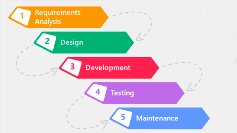

# 2. Procesos del desarrollo de software

El desarrollo de software generalmente se organiza en una seria de procesos o faces, cada uno con objetivos especificos y tareas asociadas. Aunqe el numero y la denominacion de las faces puede varia segun la metodologia utilizada, las siguientes son las faces tipicas en el cilco de vida del desarrollo de software:

1. **Recoleccion y Analisis de Requisitos**
    
    * En esta fase, se identifican y documentan las necesidades y expectativas de los usuarios finales y otras partes interesadas. El objetivo es comprender lo que el sistema debe hacer y las restricciones bajo las cuales debe operar,
    
    * **Actividades comunes**
        
        1. Reunion con stakeholders  <i style="color:#CFDE74">(Partes interesadas)</i>.
        2. Elaboracion de documentos  de requisitos.
        3. Analisis de viabilidad.
        4. Identificacion de casos de uso.
      
2. **Diseño del Sistema**

    * Aqui se convierte los requisitos en una arquitectura y diseño detallado del sistema. Esto incluye definir la estructura del software, sus componentes, interfaces y algoritmos necesarios.
    
    * **Actividades comunes**
        
        1. Diseño de la arquitectura del sistema.
        2. Diseño detallado de modulos y componentes.
        3. Creacion de diagramas <i style="color:#CFDE74">(Por ejemplo: Diagramas de clases, Diagramas de flujos de datos)</i>.
        4. Especificacion de Interfaces entre los componentes del sistema.
       
3. **Implementacion (Codificacion)**

    * Esta fase implica la escritura del codigo fuente del software segun el diseño establecido. Los desarrolladores traducen el diseño detallado en codigo utilizando el lenguaje de programacion seleccionado.
    
    * **Actividades comunes**
    
        1. Programacion de modulos y componentes.
        2. Integracion de componentes.
        3. Desarrollo de interfaces de usuario.
        4. Versionado y control de codigo fuente.
    
4. **Pruebas**

    * En esta fase, el software desarrollado se somete a pruebas para identifica y corregir errores. El objetivo es asegurar que el software funcione como se esperaba y cumpla con los requisitos especificados.
    
    * **Actividades Comunes** 
    
        1. Pruebas unitarias  <i style="color:#CFDE74">(Verificacion Componentes individuales)</i>.
        2. Pruebas de integracion  <i style="color:#CFDE74">(Verificar la integracion entre componentes)</i>.
        3. Pruebas de sistema  <i style="color:#CFDE74">(Verificar el sistema completo)</i>.
        4. Pruebas de aceptacion <i style="color:#CFDE74">(Verificacion con los usarios finales)</i>.
        
5. **Despliege**

    * Una vez que el software ha pasado todas las pruebas, se pone en produccion. Esto incluye instalar el software en los entronos de los usuarios y asegurarse de que funcione correctamente en un entorno de produccion.
    
    * **Actividades Comunes**
    
        1. Instalacion y configuracion del software en el entorno de produccion.
        2. Formacion a usuarios.
        3. Migracion de datos (Si es necesario).
        4. Monitoreo inicial de software en produccion.
        
6. **Mantenimiento**

    * Despues de que el software esta en uso, la fase de mantenimiento se encarga de corregir errores, mejorar el software, y adaptarlo a nuevos requisitos o entornos.
    
    * **Actividades comunes**
        
        1. Correcion de errores dectectados en produccion.
        2. Mejoras y optimizacion del software.
        3. Adaptacion del software a nuevos entornos o requisitos.
        4. Gestion de nuevas versiones y actualizaciones.
       

