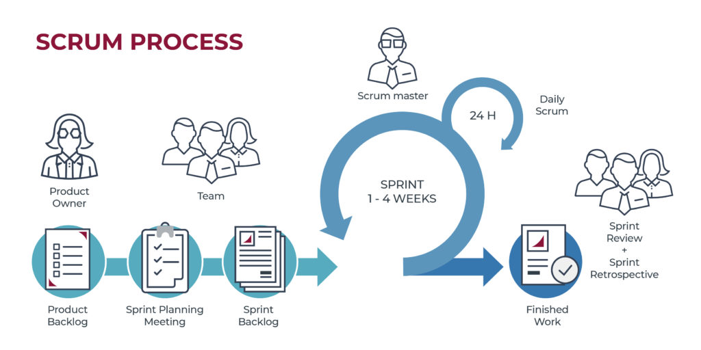
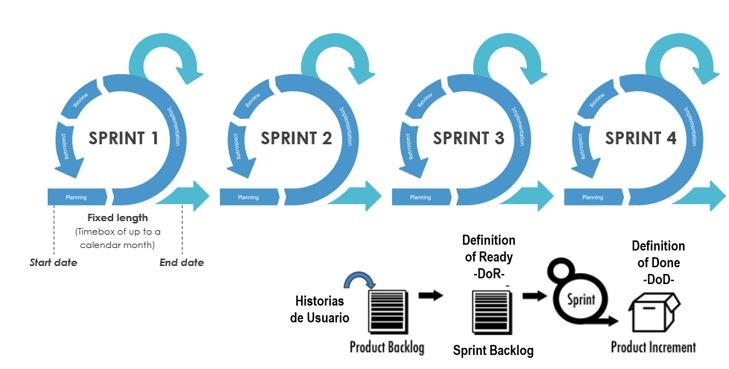

# 4. Metodologia SCRUM

**Scrum** es una de las metodologias agiles mas populares y se centra en la gestion de proyectos complejos mediante la division del trabajo en sprints o iteracciones cortas.

El trabajo se organiza en sprints, que son ciclos de 2 a 4 semanas. Al final de cada sprint, se entrega un incremento funcional del producto.

## Roles en Scrum

1. **Product Owner** Responsable de maximizar el valor del producto y gestionar el backlog del producto.

2. **Scrum Master** Asegura que el equipo siga las practicas de **Scrum** y elimina impedimentos.

3. **Development Team** Un equipo autoorganizado y multifuncional que entrega incrementos del producto al final de cada sprint.

## Artefactos de Scrum

  1. **Product Backlog** Lista priorizanda de todo lo que se necesita en el producto.

  2. **Sprint Backlog** Lista de tareas seleccionadas para completarse en un sprint.

  3. **Incremento** El resultado del sprint, que es una version funcional del producto.
  
## Eventos en Scrum

1. **Sprint** Periodo fijo de tiempo  <i style="color:#CFDE74">(Generalmente 2-4 semanas)</i> donde el desarrolla un incremento.
2. **Sprint Planning** Reunion al inicio del sprint para planificar el trabajo a realiza.

3. **Daily Scrum** Reunion diaria de 15 minutos para sincronizar el trabajo y planificar el proximo dia.

4. **Sprint Review** Reunion al final del sprint. para revisar el trabajo completado.

5.  **Sprint Retrospective** Reunion para reflexionar sobre lo que funciono y lo que no, y mejorar para el proximo sprint.
