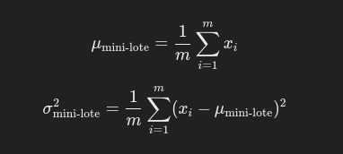
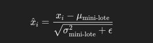

# Batch Normalization

**Batch Normalization** *(Normalizacion por lotes)* es una tecnica utilizada en redes neuronales profundas para mejorar la eficiencia y la estabilidad del entrenamiento. Fue introducida por Sergey loffe y Christian Szegedy en 2015 y se ha convertido en una tencnica estandar en redes profundas. El proposito principal de **Batch Normalization (BN)** es resolver problemas relacionados con la covariancia interna cambiante y acelerar el proceso de entrenamiento al normalizar las activaciones dentro de cada mini-lote de datos de entrada.

## Que es ?

**Batch Normalization** es una tecnica que normaliza las entradas de cada capa, de manera que las activaciones de esa capa tengan una distribucion normal con media cero y varianza unitaria dentro de cada mini-lote. Esto reduce la sensibilidad a lla inicializacion de los pesos, permite el uso de tasa de aprendizaje mas altas y ayuda a mitigar problemas como el **Desvanecimiento o la explosion del gradiente**

### Funcionamiento

*  El proceso de Batch Normalization implica ajustar y escarlar las salidas intermidias de las capas para garantizar que se distribuyen de manera adecuada, lo cual hace que el entremamiento sea mas eficiente y estable.

    1. **Calculo de la media y la varianza pro mini-lote** Para cada mini-lote de datos, se calcula la media y la varianza de las activaciones del mini-lote tengan una distribución normalizada en torno a una media de cero y una varianza de uno.
        
        * 
        
        * Donde *m* es el tamaño del mini-lote y Xi son las activaciones de la capa.
        
    2. **Normalizacion de las activaciones** Despues de calcular la media y la varianza de las activacionse se normalizan restando la media y dividiendo por la raiz cuadrada de la varianza mas un pequeño valor de e (Para evitar la division por cero.)
    
        * 
        
    3. **Aplicacion de parametros de escalado y desplazamiento (gamma y beta)** Aunque las activaciones normalizadas tiene media cero y varianza unitaria, es importate que el modelo puede aprender una representacion no restringida. Para ello, se introducen dos parametros adiccionales **gamma** y **beta** que permite escalar y desplazar las cativaciones normalizadas.

        * 
       
        * Aqui, **gamma** y **beta**  son parametros que se aprenden durante el entrenamiento, permitiendo que el modelo ajuste dinamicamente la escala y el sego de las activaciones si es necesario.
    
### Caracteristicas 

* **Normalizacion dentro de mini-lotes** BN se aplica en cada mini-lote, lo que garantiza que las activaciones dentro de ese mini-lote esten distribuidas de manera uniforme.
 
* **Escalado y desplazamiento aprendibles** Los parametros gamma y beta  permitiendo que el modelo aprenda las trasformaciones adecuadas incluso despues de la normalizacion.

* **Independiente de la arquitectura** se puede aplicar a cualquier tipo de red neuronal, ya se auna red totalmente conectada, una red convolucional o una red recurrente.

* **Aceleracion de entrenamiento** La normalizacion de las activaciones permite que el entrenamiento converja mas rapidamente y reduce la necesidad de ajustar manualmente los hiperparametros.
   
### Ventajas

