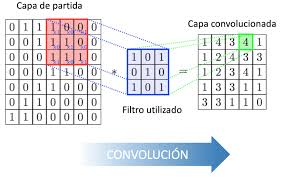

# Redes Convolucionales

Las **redes neuronales convulocionales (CNN)** son un tipo de red neuronal profunda especialmente util para trabajar con datos que tiene una estrucutra espacial, como imagenes. Son ampliamente utilizadas en tareas de vision por computadora, como clasificacion de imagenes, deteccion de objetos y segmentacion. 




## Convolucion

Una **Convolucion** es la operacion fundamental que define a las **redes neuronales convolucionales (CNN)**. En el contexto de  procesamiento de imagenes, se trate de aplicar un **filtro** o **Kernel** (Matriz de pesos) a una imagen para extraer caracteristicas locales, como bordes, texturas o patrones.

### Que es una Convolucion ?
 
La convolucion es un procesos matematico que toma un fracmento de la imagen y lo multiploca por un **Kernel**. La salida es una imagen transformada que destaca ciertas caracteristicas de la imagen original. Este proceso se repite sobre toda la imagen para generar lo que se llama un **mapa de caracteristicas** o **feature map**.

### Funcionamiento

1. **Imagen de entrada** Es una matriz de pixeles (Valores numericos). Si es en escala de grises, tendra un solo canal, pero si es en color (RGB), tendra tres canales (rojo,verde,azul).

2. **Kernel o filtro** Es una pequeña matriz de pesos (por ejemplo , 3x3, 5x5, etc). Cada nuemro en el kernel representa un peso, que se ajusta durante el entrenamiento. Este filtro se desliza por toda la imagen, y en cada posicion multiploca los valores de la imagen por los valores del kernel, y luego suman para producir un solo valor.

3. **Operacion de Convolucion** 

    * Se toma una pequeña porcion de la imagen(del mismo tamaño que el kernel).
    * Se miltiploca elemetno por elemento la matriz del kernel con la posicion de la imagen.
    * Se suman todos los productos obtenidos, lo que genera un nuevo valor en el mapa de caracteristicas.
    * El kernel se desplaza sobre la imagen con un tamaño de paso (Stride) y se repite el proceso.
    
4. **Mapa de caracteristicas** La salida de esta operacion es un nuevo conjunto de datos que contiene las caracteristicas detectadas pro el filtro. Estos valores indican la respuesta de la imagen a las caracteristicas que el kernel esta buscando (Como bordes o esquinas).

## Kernel

* Un **Kernel** (Tambien llamado filtro)  es una pequeña matriz, generalmente de 3x3, 5x5, etc, que contiene los pesos. Es el componenete fundamental en la convolucion, ya que determina como se procesara la imagen.

    * Cada filtro tiene un conjunto de valores numericos que se multiplican por la imagen durante la convolucion.
    * Los valores del kernel se inicializan aleatoriamente y se ajustan durante el entrenamiento mediante retropropagacion, lo que permite que la CNN aprenda a identificar caracteristicas relevantes en los datos.
    * Los filtros en capas profundas suelen aprender a detectar caracterisitcas mas abstractas, como formas complejas, patrones o incluso partes de objetos.
    
### Funcionamiento

* Cada **filtro** esta diseñado para extraer un tipo particular de caracteristicas. Por ejemplo:

    * Un filtro puede detectar **bordes horizontales**.
    * Otro filtro puede detectar **Bordes verticales**.
    * En capas mas profundas, los filtros podrian aprender a detectar formas mas complejas, como **ojos** o **esquinas** de objetos.
    
### Parametros importante en la convolucion

1. **Stride**

    * Es el tamaño del paso con el que el kernel se mueve sobre la imagen. Un stride de 1 significa que el filtro se mueve pixel por pixel, mientras que un stride de 2 significa que se salta un pixel despues de cada operacion.

    * Un mayor stride reduce el tamaño del mapa de caracteristicas.
    
2. **Padding**

    * A veces, los bordes de la imagen no se alinean perfectamente con el kernel. El **Padding** añade poxeles extra (Generalmente ceros) alrededor de los bordes de la imagen para amtener el tamaño de la salida.

    * **Valid** Sin padding, lo que reduce el tamaño de la salida.

    * **Same** Padding suficiente para que la salida tenga el mismo tamaño que la entrada.
    


## Composicion de las CNN

Las CNN se componen de diferentes tipos de capas:

### Capas Convolucionales (Conv2D)

* Realizan convoluciones entre un cobjunto de filtros y la entrada. El objetivo de estas capas es detectar caracteristicas locales, como bordes, texturas y patrones en una imagen.

* Parametros principales:

    * `filtres` Numero de filtros, o kernel, que se aplicaran. Cada filtro detecta diferentes caracteristicas.
    * `kernel_size` Tamaño del filtro, generalmente una tupla como `(3,3)`
    * `strides` Tamaño del paso en el que se aplicara el filtro sobre la imagen.
    * `padding` Si el tamaño de la salida es igual o menor que el de la entrada. Puede ser valid (sin padding) o same (se añade padding).
    
### Capas de Activacion

* Se utilizan funciones no lineales, como la **ReLU** (Rectified Linear Unit), que introduce no linealidad en la red, permitiendo a la CNN aprender relaciones mas complejas.

    * `activacion='relu` Aplica la funcion ReLU.
    
### Capas de Pooling (MaxPooling2D)

* Reduce la dimensionalidad de las caracteristicas extraidas por la convolucion,resumiendo la informacion mas importate y reduciendo el costo computacional.

* Parametros Principales:
    
   * `pool_size` Tamaño del area sobre la que se aplicara las operacion de pooling, tipicamente `(2,2)`
   
### Capas Densas (Dense)

* Conectan completamente todas las neuronas de la capa anterior. Estas capas son similares a las de una red neuronal clasica y son las encargadas de la clasificacion final.

* Parametro Principal:

    * `units` Numero de neuronas en la capa.
    
### Capa de Salida

* En una tarea de clasificacion, esta capa tiene tantas neuronas como clases posibles, y usa la funcion de activacion **softmax** para convertir los valores en probabilidades.

### Funciones de una CNN

* El proceso en una CNN es el siguiente:

    1. La imagen de entreada pasa por una capa convulocional donde se aplican filtros para detectar caracteristicas.
    2. Las capas de pooling reduce las dimensiones.
    3. Despues de varias capas convolucionales, se aplanan las caracteristicas extraidas en un vector.
    4. El vector resultante pasa por capas densas que realizan la clasificacion final.
    
## Inicializacion de Pesos

* En las redes neuronales, los pesos se inicializan aleatoriamente. Algunas de las estrategias comunes son:

    * **Glorot/Xabier Iniitialization** Inicializa los pesos de tal manera que los gradientes fluyan correctamente durante el entrenamiento.
    * **He iniialization** Es util cuando se usan funciones de activacion ReLU.
    * **Zeros** Inicializa los pesos a cero (generalmente no recomendado porque puede hacer que las neuronas aprendan de manera idéntica).
    * **RandomNormal** Inicializa los pesos a partir de una distribución normal.
    

```python
from keras.models import Sequential
from keras.layers import Conv2D, MaxPooling2D, Flatten, Dense
from keras.initializers import he_normal

# Definimos el modelo
model = Sequential()

# Capa convolucional con 32 filtros de tamaño 3x3, activación ReLU, y pesos inicializados con He
model.add(Conv2D(filters=32, kernel_size=(3, 3), activation='relu', input_shape=(64, 64, 3), kernel_initializer=he_normal()))

# Capa de MaxPooling para reducir dimensionalidad
model.add(MaxPooling2D(pool_size=(2, 2)))

# Segunda capa convolucional
model.add(Conv2D(filters=64, kernel_size=(3, 3), activation='relu', kernel_initializer=he_normal()))

# Segunda capa de MaxPooling
model.add(MaxPooling2D(pool_size=(2, 2)))

# Aplanamiento para pasar a la parte completamente conectada
model.add(Flatten())

# Capa completamente conectada (densa) con 128 unidades
model.add(Dense(units=128, activation='relu'))

# Capa de salida con función de activación softmax para clasificación de 10 clases
model.add(Dense(units=10, activation='softmax'))

# Compilación del modelo
model.compile(optimizer='adam', loss='categorical_crossentropy', metrics=['accuracy'])

# Resumen del modelo
model.summary()
```

## Explicacion del Codigo del Modelo

1. **Modelo Secuencial** `Sequential` Crea una pila de capas donde las cpas se añaden de una en una.
2. `Conv2D` Aplica convoluciones sobre la imagen de entreada. Aqui estamos utilizando la inicializacion **He** con la funcion `kernel_initializer=he_normal()`.
3. `MaxPooling2D` Reduce las dimensiones de las caracteristicas mediante pooling.
4. `Flatten` Aplana los datos en un solo venctor que luego se pasa a capas densas.
5. `Dense` Capas completamente conectadas. La ultima capa usa `softmax` para clasificacion de 10 clases.
6. `compile` Se especifica el optimizador, la funcion de perdidad (En este caso `categorical_crossentropy` para clasificacion multi-clase) y las metricas que se van a monirorear durante el entrenamiento.


 