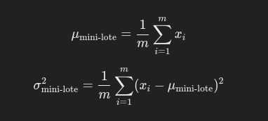

# Batch Normalization

**Batch Normalization** *(Normalizacion por lotes)* es una tecnica utilizada en redes neuronales profundas para mejorar la eficiencia y la estabilidad del entrenamiento. Fue introducida por Sergey loffe y Christian Szegedy en 2015 y se ha convertido en una tencnica estandar en redes profundas. El proposito principal de **Batch Normalization (BN)** es resolver problemas relacionados con la covariancia interna cambiante y acelerar el proceso de entrenamiento al normalizar las activaciones dentro de cada mini-lote de datos de entrada.

## Que es ?

**Batch Normalization** es una tecnica que normaliza las entradas de cada capa, de manera que las activaciones de esa capa tengan una distribucion normal con media cero y varianza unitaria dentro de cada mini-lote. Esto reduce la sensibilidad a lla inicializacion de los pesos, permite el uso de tasa de aprendizaje mas altas y ayuda a mitigar problemas como el **Desvanecimiento o la explosion del gradiente**

### Funcionamiento

*  El proceso de Batch Normalization implica ajustar y escarlar las salidas intermidias de las capas para garantizar que se distribuyen de manera adecuada, lo cual hace que el entremamiento sea mas eficiente y estable.

    1. **Calculo de la media y la varianza pro mini-lote** Para cada mini-lote de datos, se calcula la media y la varianza de las activaciones del mini-lote tengan una distribución normalizada en torno a una media de cero y una varianza de uno.
        
        * 
        
        * Donde *m* es el tamaño del mini-lote y Xi son las activaciones de la capa.
        
    2. **Normalizacion de las activaciones** Despues de calcular la media y la varianza de las activacionse se normalizan restando la media y dividiendo por la raiz cuadrada de la varianza mas un pequeño valor de e (Para evitar la division por cero.)
    
        * 
        
    3. **Aplicacion de parametros de escalado y desplazamiento (gamma y beta)** Aunque las activaciones normalizadas tiene media cero y varianza unitaria, es importate que el modelo puede aprender una representacion no restringida. Para ello, se introducen dos parametros adiccionales **gamma** y **beta** que permite escalar y desplazar las cativaciones normalizadas.

        * 
       
        * Aqui, **gamma** y **beta**  son parametros que se aprenden durante el entrenamiento, permitiendo que el modelo ajuste dinamicamente la escala y el sego de las activaciones si es necesario.
    
### Caracteristicas 

* **Normalizacion dentro de mini-lotes** BN se aplica en cada mini-lote, lo que garantiza que las activaciones dentro de ese mini-lote esten distribuidas de manera uniforme.
 
* **Escalado y desplazamiento aprendibles** Los parametros gamma y beta  permitiendo que el modelo aprenda las trasformaciones adecuadas incluso despues de la normalizacion.

* **Independiente de la arquitectura** se puede aplicar a cualquier tipo de red neuronal, ya se auna red totalmente conectada, una red convolucional o una red recurrente.

* **Aceleracion de entrenamiento** La normalizacion de las activaciones permite que el entrenamiento converja mas rapidamente y reduce la necesidad de ajustar manualmente los hiperparametros.
   
### Ventajas

1. **Aceleracion del proceso de aprendizaje** permite utilizar  **Tasas de aprendizaje mas altas** sin preocuparse de por la inestabilidad, ya que ayuda a estabilizar las activaciones. Esto puede llevar a una convergenecia mas rapida y un entrenamiento mas eficiente.

2. **Reduccion de la dependencia en la inicializacion de pesos** Al normalizar las activaciones en cada capa, Batch Normalizatio hace que el entrenamiento sea menos sensible a como se inicializan los pesos. Esto permite usar inicializaciones menos precisas y aun obtener buenos resultados.

3. **Regularizacion implicita** Aunque Batch Normalization no es una tecnica de regularizacion en si misma, tiene un efecto regularizador que reduce la necesidad de tecnicas adicionales como el **dropout**. Al introducir algo de ruido al depender de las estadisticas de los moni-lotes, Batch Normalization hace que el modelo sea menos propensi al sobreajuste.

4. **Mitigacion de la covariancia interna cambiante** Uno de los principales problemas en redes neuronales profundas es que, a medida que se actualizan los pesos durante el entrenamiento, las distribuciones de las activaciones cambian costantemente, lo que dificulta el aprendizaje. Batch Normalization reduce este problema al estabilizar las distribuciones a lo largo delas capas.

### Desventajas

1. **Dependencia del tamaño del mini-lote** Batch Normalization requiere un tamalo de mini-lote lo suficientemente grande para calcular estadisticas precisas de la media y la varianza. Esto puede ser un problema en situaciones donde los mini-lotes son muy pequeños, como en el entrenamiento distribuido o en redes que deben estrenarse en hardware con memorias limitada.

2. **Coste computacional adicional** Aunque el rendimiento del modelo mejora, Batch Normalization introduce un costo adicional en terminos de calculo de la media, varianza y los parametros adiccionales gamma y beta. Esto puede realientizar el tiempo de entrenamiento por lote.

3. **Menos efectivo en redes recurrentes (RNNs)** Aunque Batch Normalization es efectivo enredes convolucionales y redes densas, en redes recurrentes como LTMs o GRUs ha demostrado ser menos eficiente debido a la dependencia temporar de los datos.

4. **Diferente comportameinto en entrenamiento y evaluacion** Durante el entrenamiento, las estadisticas (Media y Varianza) se calcular en cada mini-lote, pero durante la inferencia, se utilizan estadisticas globales calculadas a partir de todos los mini-lotes (Es decir las medias y varianzas acumuladas durante el entrenamiento). Esto puede hacer que el modelo se comporte de manera diferente durante la inferencia.


### Aplicacion de Batch Normalization

1. **Construir una red neuronal** Al diseñar una red, añades capas de Batch Normalization justo despues de las capa de activacion (aunque tambien se puede aplicar antes de la activacion)

2. **Calculo de la media y varianza** Para cada mini-lote durante el entrenamiento, Batch Normalization calcula la **media** y la  **varianza** de las activaciones de esa capa.

3. **Normalizacion de las activaciones** Las activaciones se normalizan restando la media del mini-lote y dividiendo por la raiz cuadrada de la varianza mas un pequeño valro de e para evistar la division por cero.

4. **Aplicacion de los parametros gamma y beta** Despues de normalizacion, se multiplican las activaciones normalizadas por el parametro **gamma** (Para escalar) y se suma **Beta** (Para desplazar) . Estos parametros se parenden durante el entrenamiento.

5. **Actualizacion de pesos** Los pesos de la red se ajustan de acuerdo a los gradientes retropropagados y las estadisticas de normalizacion en cada iteracion.

6. **Inferencia (Testing)** Duerante la fase de inferencia , no se calculan las estadisticas en cada mini-lote . En su lugar se utilizan las medias y varianzas promedio acumuladas durante el entrenamiento.

### Implementacion

```python
from tensorflow.keras.models import Sequential
from tensorflow.keras.layers import Dense, BatchNormalization, Activation

# Crear un modelo simple
model = Sequential()

# Añadir una capa densa con 512 neuronas
model.add(Dense(512, input_shape=(784,)))

# Añadir Batch Normalization
model.add(BatchNormalization())

# Añadir la función de activación
model.add(Activation('relu'))

# Añadir más capas como desees
model.add(Dense(256))
model.add(BatchNormalization())
model.add(Activation('relu'))

# Capa de salida
model.add(Dense(10, activation='softmax'))

# Compilar el modelo
model.compile(loss='categorical_crossentropy', optimizer='adam', metrics=['accuracy'])

# Entrenar el modelo
model.fit(X_train, y_train, epochs=10, batch_size=128)

```