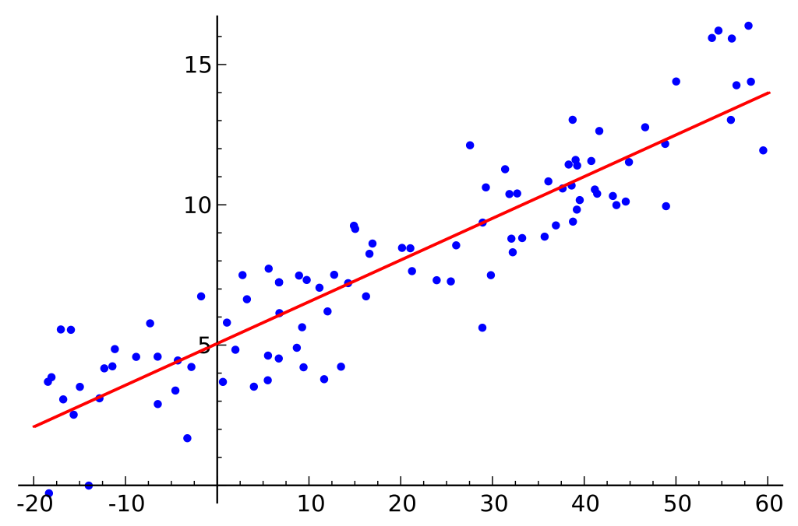
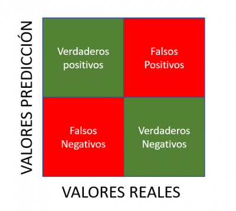

# Introducción

## Machine Learning (ML)

Es una rama de la inteligencia artificial que permite a las computadoras aprender y tomar decisiones a partir de datos sin ser programadas explicitamente para hacerlo. En lugar de seguir reglas especificas, los algoritmos de ML identifican patrones en los datos para hacer predicciones o tomar decisiones.

### Como funciona Machine Learning ?

El proceso general de ML incluye los siguientes pasos:

1. **Recoleccion de datos** Se recogen datos relevantes que representa el problema a resolver.

2. **Preparacion de datos** Se limpian y organizan los datos para ser utilizados por los algoritmos de ML.

3. **Seleccion de un modelo** Se elige un algoritmo que sera el modelo para hacer predicciones.

4. **Entrenamiento del modelo** El modelo se entrena utilizando un conjunto de datos etiquetados (en caso de ser aprendizaje supervisado).

5. **Evaluacion del modelo** Se prueba la precision del modelo utilizando un conjunto de datos de prueba.

6. **Optimizacion** Se ajusta el modelo para mejorar su rendimiento.

7. **Prediccion** Una vez entrenado, el modelo puede hacer predicciones sobre nuevos datos.

#### Aprendizaje Supervisado

Es un tipo de ML donde el modelo se entrena utilizando un cojunto de datos etiquetados, es decir, datos de entrada  con sus correspondientes salidas esperadas.

##### Funcionamiento

1. **Datos etiquetados** Los datos de entrenamiento incluyen tanto características (input) como las etiquetas (output). 

2. **Entrenamiento** El modelo aprende a mapear entradas a salidas basandose en los ejemplos proporcionados.

3. **Validacion** El modelo se evalua utilizando datos de prueba para verificar su capacidad de generalizar a nuevos datos.

4. **Prediccion** Una vez entrenado, el modelo puede predecir las salidas de nuevos datos no etiquetados.

### Regresion Lineal

Es una tecnica de ML utilizada para predecir un valor numerico basado en la relacion lineal entre las variables de entrada (Caracteristicas) y una variable de salida (Objetivo).

#### Funcionamiento

1. **Modelo** El modelo asume una relacion lineal entre la variable independiente (X) y la variable dependiente (Y).

2. **Ecuacion** La ecuacion es generalmente de la forma Y = mX + b , donde m es la pendiente y b es la interseccion con el eje Y.

3. **Entrenamiento** Durante el entrenamiento, el algoritmo ajusta m y b para minimizar la diferencia entre las predicciones y los valores reales (Minimizar el error).

4. **Prediccion** Con los parametros ajustados, el modelo puede predecir el valor de Y para cualquiet nuevo valor de X.

## Metricas 

### Clasificacion

1. **Exactitud (Accuracy)** Es la proporcion de predicciones correctas sobre el total de predicciones. Es util cuando las clases estan balanceadas.

$$
Exactitud =  \frac{Numero \ de \ predicciones \ correctas}{Total \ de \ predicciones}
$$

2. **Precision (Precision)** Es la proporcion de verdaderos positivos (Predicciones correctas de la clase positiva) Sobre todas las predicciones positivas. Es util cuando el costo de un falso positivos es alto

$$
Precision =  \frac{Verdaderos \ Positivos}{Verdaderos \ Positivos +  Falsos \ Positivos}
$$

3. **Recall (Sensibilidad o Tasa de Verdaderos Positivos)** Es la proporcion de verdaderos positivos sobre todas las instancias reales positivas. Es util cuando el costo de un falso negativo es alto.

$$
Recall =  \frac{Verdaderos \ Positivos}{Verdaderos \ Positivos +  Falsos \ Negativos}
$$

Estas metricas se usan para evaluar la eficiencia de un modelo, especialmente en tareas de clasificacion. Cada metrica proporciona una perpectiva diferente sobre el rendimiento del modelo, por lo que es importante considerarlas todas segun el contexto del problema.

### Regresion

1. ***Error Cuadratico Medio (Mean Squared Error) MSE** 

    * **Definicion** Mide el promedio de los cuadrados de los errores, es decir, la diferencia entre los valores predichos y los valores reales
    * **Formula**
    
$$

MSE = \frac{1}{n} \sum_{i=1}^{n} \left ( y_{i} - \hat{y}_{i} \right )^{2}

$$

   * **Interpretacion** Cuanto menor sea el MSE, mejor es el modelo. Los errores grandes se penalizan mas debido al cuadrado de la diferencia.
   

2. **Raiz del Error Cuadratico Medio (Root Mean Squared Error) RMSE**

    * **Definicion** Es la raiz cuadrada del MSE. Proporciona una metrica en las mismas unidades que la variable objetivo, lo que facilita la interpretación.
    * **Formula**
    

$$

RMSE = \sqrt{ \frac{1}{n} \sum_{i=1}^{n} \left ( y_{i} - \hat{y}_{i} \right )^{2}}

$$

   * **Interpretacion** Al igual que el MSE, un RMSE mas bajo indica un mejor rendimiento del modelo.
   

3. **Error Absoluto Medio (Mean Absolute Error) MAE**

    * **Definicion** Mide el promedio de los errores absolutos, es decir, la media de las diferencias absolutas entre los valores predichos y los valores reales.
    * **Formula**
    
$$

MAE =  \frac{1}{n} \sum_{i=1}^{n} \left | y_{i} - \hat{y}_{i} \right |^{2}

$$

   * **Interpretacion** MAE es menos sensible a los valores atipicos (outliers) que el MSE, ya que no se eleva al cuadrado la diferencia.
  

### Regresion Gradiente Descendente

La regresion con el metodo del gradiente descendente es una tecnica utilizada para ajustar los parametros de un modelo, como los coeficientes de un modelo, como los coeficientes en una regresion lineal, para minimizar una funcion de costo, tipicamente el Error Cuadratico Medio (MSE).

#### Conceptos Claves

1. **Funcion de Costo**

    * La funcion de costo mide que tan mal esta funcionando el modelo al calcular la diferencia entre las predicciones del modelo y los valores reales.
    * En la regresion lineal, se suele utilizar el **Error Cuadratico Medio (MSE)** como funcion de costo:
    
$$

J \left ( w \right) = \frac{1}{2m} \sum_{i=1}^{m} \left ( h_{w} \left ( x_{i} \right) - {y}_{i} \right )^{2}

$$

   * donde
        
       * m es el numero de ejemplos en el conjunto de entrenamiento.
       * h es la prediccion del modelo para el ejemplo i
       * y es el valor real correspondiente al ejemplo i
   
2. **Gradiente**
    
    * El gradiente es un vector de derivadas parciales de la funcion de costo con respecto a cada parametro del modelo. Indica la direccion y la magnitud del cambio necesario en los parametros para reducir la funcion de costo.
    
###### Proceso del Gradiente Descendiente 

1. **Inicializacion de Parametros**

    * Los parametros del modelo, w (Ejemplo w_0 y w_1 en la regresion lineal ) se inicializan aleatoriamente o en cero.
    
2. **Calculo del Gradiente**

    * Se calcula el gradiente de la funcion de costo con respecto a cada parametro w_i.
    
$$

\frac{\partial  J\left ( w \right)} {\partial  w_{i}}  = \frac{1}{m} \sum_{i=1}^{m} \left ( h_{w} \left ( x_{i} \right) - {y}_{i} \right ) \ast x_{i}

$$

3. **Actualizacion de Parametros**

    * Los parametros se actualizan en la direccion opuesta al gradiente para minimizar la funcion de costo
    
$$

w_{i} := w_{i}  -  \ \alpha  \ \ast \frac{\partial  J\left ( w \right)} {\partial  w_{i}} 
$$

   * alpha es la tasa de aprendizaje, un valor pequeño que determina el tamaño del paso en cada iteracion.
   * Esta actualizacion se realiza para todos los parametros simultaneamente.
   
4. **Iteración**
    
    * Los pasos 2 y 3 se repiten iterativamente hasta que los parametros convergen a valores que minimizan la funcion de costo (o hasta que se alcanza un numero maximo de iteraciones).
    
