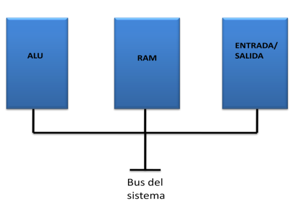

# Administracion de la memoria

##  La maquina de Von Neumman

### Estructura interna de la maquina de Von Neumman

### Maquina de Von Neumann Vs Maquina Harvard

Entre los años de 1945-1950 Von Neumann definio los componentes basicos de un computador:

#### Estructura

* **Unidad de Proceso:** Procesa las instrucciones ejecutando un ciclo de maquina que se repite indefinidamente desde el momento en que se enciende la maquina hasta cuando se apaga. La CPU esta compuesta fundamentalamente por la ALU, el decodificador y los registros.

    * **ALU** Contiene los circuitos para realizar las operaciones aritmeticas y logicas del programa.

    * **Decodificador** Interpreta los codigos de las instrucciones para que sean ejecutados por los circuitos hardware de la maquina.
    *  **Registros** Se clasifican en registros especiales y de proposito general:

        * **PC** Contador de programa.
        * **Estado** Contiene las banderas o indicadores de ciertos estados de la CPU.
        * **Acumulador** Area de trabajo para las operaciones.
        * **Base** Posicion inicial de carge de un proveso en memoria.
        * **Segmento** Apunta al comienzo de un segmento.
        * **Indice** Contiene el indice de los vectores y matrices.
        * **Sp** Apuntador a la pila del sistema.
        * **Generales** Para propositos especiales del programado.
        
* **Memoria RAM** (Random Acces Memory), La memoria ran es conjunto de celdas electronicas que pueden almacenar y recuperar informacion en forma aleatoria en unidades de palabras (1byte) a velocidades medidas en el orden de nanosegundos (ns)

* **Unidad de Control** Fundamentalment es un secuenciador (Unidad electronica que en forma secuencial transforma las instrucciones en impulsos electricos).

* **Puertos de E/S** Interfaz electronica que permiten el intercambio de datos de las unidades de E/S con la cpu, y la memoria RAM.

* **Unidades de E/S** Todods los dispositivos externos que se le pueden conectar a un computador: Discos, Mouse, Teclados, etc.

### Nota 

En la arquitectura Von Neumann los datos y las intrucciones del proceso comparten un mismo BUS; en la arqutectura Harvard los datos e instrucciones viajan por buses separados.

 