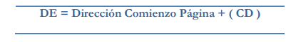
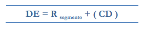

# Direccionamiento a memoria ram

Consiste en una seria de tecnicas para acceder la memoria segun las necesidades del programacion y los recursos de hardware disponibles.

Usos:

* Optimizar la programacion Assambler.
* Adaptarse al tamaño reducido de las instrucciones par aun hardware especifico.
* Direccionar una cantida de memoria mayor que la permitida por los registros.
* Facilitar los mecanismos de proteccion.

* **Nota** La unidad de direccionamiento de la memoria es la **palabra**, una palabra tiene una longitud minima de un byte y maxima de n bytes. Generalmente 1<= n <= 4

Los tipos de direccionamiento a memoria los podemos clasificar en:

* Implicito
* Absoluto
* Inmediato
* Indirecto
* Indexado
* Relativo a pc
* Relativo a base
* Relativo a pagina
* Relativo a segmento.

## Relativo a pagina

En este tipo de direccionamiento se debe entender que la memoria se divide en segmentos logicos de tamaño fijo denominados paginas.

Por ejemplo una memoria de 64K se podria dividir en 256 paginas de 256 bytes.

No de paginas = Tamaño de Memoria /Tamaño de Paginacion

La direccion de comienzo de pagina se puede obtener seleccionado lso byes mas significativos del PC.

## Relativo a segmento

Un segmento es una division logica de la memoria de tamaño variable, el registor del segmento siempre apnta al comienzo de este y la direccion efectiva se calcula sumandole al registro de segmento el CD o desplazamiento dentro del segmento. las direcciones de comienzo del segmento pueden estar alineadas en fronteras diferentes a las de la palabra definida por el sistema operativo, de esta forma un registro de segmento puede direccionar mas memoria de la que pueden segun su tamaño en bits.

* **Ejemplo**

EN el microcomputador PC de IBM la arquitectura de la amquina era de 16 bit,por lo cual su maxima direccion de memoria deberia ser 64K, sin embargo sabemos que puede direcionar 1MB ¿COmo maneja la mamoria el DOS para direcionar una cantidad mayor de memoria que la permitida por sus registros ?

El DOS administra la memoria de una forma totalmente segmentada, ala direccion de su registro de segmento le añade un 0x0 por software, con esta operacion cinvierte la direcion de 16bit  a 20 bits para los coienzos de los segmentos, Los segmentos quedan alineados en frotera de palabra de 16 bytes llamados parrafos, de esta manera la memoria para los segmentos se ve como un conjunto de parrafos 

Numero de parrafos = 2^20 /2^4 = 2^16 = 64k

Como cada segmento puede comenzar en un parrafo entoces se puede direccionar 64K segmentos, dentro de cada segmento se puede desplazar 64K byte. Bajo este esquema la direccion del primer segmento sera el 0x00000 y el ultimo 0xFFFFFF0. En este ultimo segmento, su tamaño valido sera de 16 bytes para que no se produzca desbordamiento de memoria.

