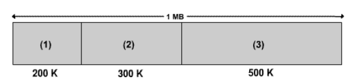
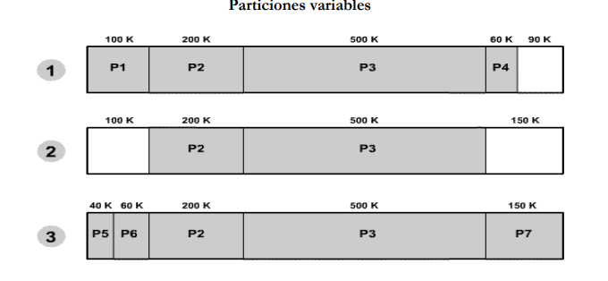
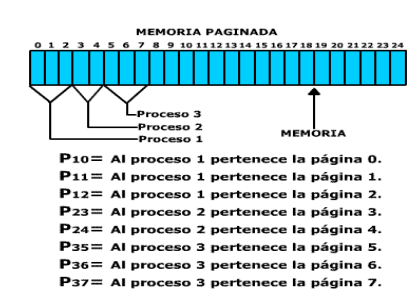
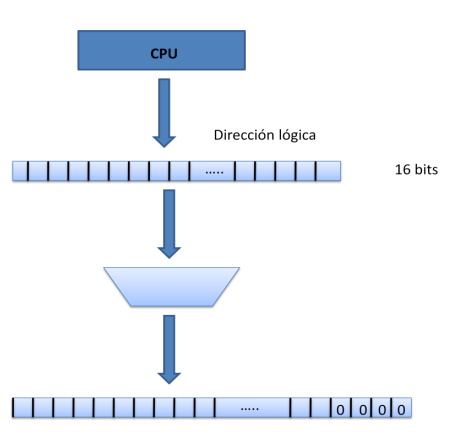

# Metodos de organizacion de la memoria

La introduccion en la computacion del concepto de multiprogramacion origino que la memoria se organizara de distintas formas: particiones fijas, particiones variables, paginas, segmentos y segmentos paginados.

## Particiones fijas

Las particiones se pueden considerar como espacios de memoria de tamaños diferentes. El operador de la maquina al momento de encender el computador define el numero y los tamaños de las diferentes particiones en su sistema. Las particiones no son todas del mismo tamaño pero permanecen costantes hasta que el operador decida cambiarlas. El esquema de memoria con particiones fijas es el siguiente:

1. Particion para trabajos pequeños.
2. Particion para trabajos medianos.
3. Particion para trabajos grandes.

## Particiones variables

Inicialmente la memoria es un solo espacio de direcciones del mismo tamaño de memoria. Al iniciarse el carge y descarge de procesos se genera particiones dinamicamente de acuerdo al tamaño de los procesos.

1. llegan: P1, P2 ,P3, P4 Tamaños 100k,200k,500k,60k
2. Termina: P1 y P4
3. llegan P5,P6,P7 Tamaños 40k,60k,150k

## Paginacion

La memoria se divide en particiones fijas de igual tamaño, tipicamente 1K, 2K, 4K, 8K dependiendo del sistema operacional. Un proceso puede ocupar una o varias paginas y toda la memoria se ve como un conjunto de paginas.

Un proceso puede contener una o vairas pagians reales no necesariamente continuas y varias paginas virtuales continuas.

## Segmentacion

La organizacion de la memoria por segmentos es similar al de las particiones variables. La direccion inicial de los segmentos generamente se encuentra alineada en la frontera de parrafos, es decir, un parrafo es una unidad de memoria que puede constar de 1 a n bytes, tipicamente los parrafos puede ser de 4 , 8,  16, 32, 64 bytes , por ejemplo : el sistema operacional DOS esta organizado por memoria segmentada con parrados de 16 bytes. Esto significa que las direcciones de los segmentos debe ser mutiplos de 16.

Los segmentos son de tamaño variable, el maximo tamaño del segmento esta limitado por los registros del computador y por el tamaño de la RAM.

La direcion inicial de un segmento se almacena en un registro base, esta direccion se exiende anexandole ceros segun el tamaño del parrafo que maneje el sitema operacional, en DOS el tamaño del paraffo es de 2^4 bytes esto significa que el sistema añade cuatro ceros a la direccion dbase formando direcciones de memoria alineadas en fornteras de 16 bytes.

* **Nota**
    
    * Los accesos a memoria quedan alineados en forma de parrafos (16 bytes = 2^4 )
    * Cada parrafo es un grupo de 16 bytes.
    * El acceso minimo a la memora es el parrafo.
    * La ultima direccion generada correspoinde a 11111111111110000 (16 unos y cuatro ceros)
    
