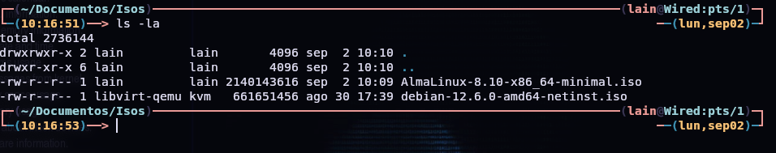

# Maquinas Virtuales

## Instalacion de QEMU

* **Instalacion QEMU/KVM y herramientas relacionadas**

```bash
sudo apt update
sudo apt install qemu-kvm libvirt-daemon-system libvirt-clients bridge-utils virt-manager
```
* **Confirmar que este instalado**

```bash
kvm-ok
```

## Descargar la iso del Sistema operativo 




## Crear la imagen de disco que utilizaremos 

```bash
sudo qemu-img create -f qcow2 /var/lib/libvirt/images/AlmaLinux8.qcow2 20G
```

## Crear la maquina virtual

* Usaremos `virt-install` 

```bash
virt-install --name AlmaLinux8 --memory 2048 --vcpus 2 --disk path=/var/lib/libvirt/images/AlmaLinux8.qcow2,size=20 --os-variant rhel8.10 --network bridge=virbr0,model=virtio --graphics none --console pty,target_type=serial --location /home/lain/Documentos/Isos/AlmaLinux-8.10-x86_64-minimal.iso --extra-args 'console=ttyS0,115200n8 serial'
```


