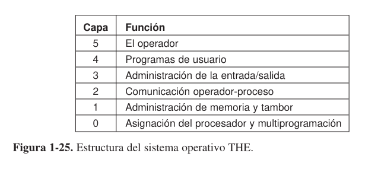

# 2. Estructura de un Sistema Operativo

## Sistemas monoliticos

En este diseño, que hasta ahora se considera como la organizacion mas comun, todo el sitema operativo se ejecuta como un solo programa en modo kernerl. El sistema operativo se escribe como una coleccion de procedimientos,enlazados entre si en un solo programa binario ejecutable extenso. Cuando se utiliza esta tecnica, cada procedimiento en el sistema tiene libertada de llamada a cualquier otro, si este proporciona cierto computo utiil que el primero necesita. Al tener miles de procedimientos que se pueden llamar entre si sin restriccion, con frecuencia se produce un sistema poco manejable y dificil de comprender.

Para construir el programa objeto actual del sistema operativo cuando se utiliza este diseño, primero se compila todos los procedimientos individuales (o los archivos que contiene los procedimientos) y luego se vinculan un conjunto para formar un solo archivo ejecutable, usando el enlazador del sistema. En terminos de ocultamiento de informacion, en esencia no hay nada todos los procediientos son visibles para cualquier otro procedimiento (En contraste a una estructura que contenga modulos o paquetes, en donde la mayor parte de la informacion se oculta dento de modulos y solo los puntos de entrada designados de manera oficial se pueden llamar desde el exterior del modulo).

Sim embargo, hasta en los sitemas monoliticos es posible tener cierta estructura. Para solicitar los servicios (Llamadas del sistema ) que proporciona el sistema operativo, los parametros se colocan en un lugar definido (Por ejemplo, en la pila) y luego se ejecuta una instruccion de tap . Esta instruccion cambia la maquina de modo usuario al modo kernel y transfiere el control al sisteam operativo, lo cual se muestra como el paso 6. Despues el sistema operativo obtiene los parametros y determina cual es la llamada al sistema que se va a llevar a cabo. Despues la indiza en una tabla que contiene en la ranura k un apuntador al procedimiento que lleva a cabo la llamada al sistema k

Esta organizacion sugiere una estructura basica para el sistema operativo:

1. Un programa principal que invoca el procedimiento de servicio solicitado.
2. Un conjunto de procedimientos de servicio que llevan a cabo las llamadas al sistema.
3. Un conjunto de procedimientos utilitarios que ayudan a los procedimentos de servicio

En este modelo, para cada llamada al sistema hay un procedimiento de servicio que se encarga de la llamada y la ejecuta. Los procedimientos utilitarios hacen cosas que necesita varios procedimientos de servicio, como obtener datos de los programas de usuario. Esta division de los procedimientos en tres niveles  se muestra a continuacion:

## Sistema de capas

Una generalizacion del diseño anterior es organizar el sistema operativo como una jerarquia de capas, cada una construida encima de la que tiene abajo. EL primer sistema construido de esta forma fue el sistema **THE**, construido en Technische Hogoescholl Eindhoven en Holanda por E. W. Dijktra (1968) y sus estudiantes. El sistema **THE** era un sistema simple de procesamiento por lotes para una computadora holandesa, la Electronica X8 , que tenia 32K de palabras de 27 bits (Los bits eran costosos en aquel entonces).

El sistema tenia seis capas: 

* **La capa 0** Se encargaba de la asignacion del procesador, de cambiar entre un proceso y otro cuando ocurriean interrupciones o expiraban los temporizadores. Por encima del nivel de 0, el sitema consistia en procesos secuenciales, cada uno de los cuales e podia programar sin necesidad de preocuparse por el hecho de que habia varios procesos en ejecucion en un solo procesador. En otras palabras, el nivel 0 proporcionaba multiprogramacion basica de la CPU.

* **La capa 1** Se encarga de la administracion de la memoria. Asignaba espacio para los procesos en la memoria principal y en un tambor de palabras de 512K que se utilizaba para contener partes de procesos (Paginas), para que los que no habia espacio en la memoria principal. Por encima de la capa 1, los procesos no tenia que preocuparse acerca de si estaban en memoria o en el tambor; el sofware de la capa 1 se encargaba de asegurar que las paginas se llevara a memoria cuando se requerian.

* **La capa 2** Se encarga de la comunicacion entre cada proceso y la consola del operador (Es decir, el usuario). ENcima de esta capa, cada proceso tiene un efecto en su propia consola de operador.

* **La capa 3** Se enecarga de administrar los dispositivos de **E/S**  y de guardar en buferes los flujos de informacion dirigidos para y desde ellos. Encima de la capa , cada proceso podia trabajar con los dispositivos abstratos de **E/S** con excelentes propiedades, en vez de los dispositvos reales con muchas peculiaridades.

* **La capa 4** Era en dodne se encontraba los programas de usuario. No tenian que preocuparse por la administracion de los procesos, la memoria, la consola o  la **E/S**. 

* **La capa 5** Se encuentra el proceso operador del sistema.

Un mator generalizacion del concepto de capas estaba precente en el sistema MULTICS. En vez de capa, MULTICS se describio como una serie de anillos concentricos, en donde los interiores tenian mas privilegios que los exteriores (Que en efecto viene siendo lo mismo). Cuando un procedimiento en un anillo exterior queria llamar a un procedimiento en un anillo interior, tenia que hacer el equivalente de una llamada al sistema; es decir, una instruccion TRAP cuyos parametros se comprobara cuidadosamente que fueran validos antes de permitir que continuara la llamada. Aunque todo el sistema operativo era aprte del espacio de direcciones de cada procesos de usuario en MULTICS, el hardware hizo posible que se designara procedimientos individuales (En realidad , segnemetos de memoria) como protegidos contra, lectura, escritura o ejecucion.

Mientras que en realidad el esquema de capas de **THE**  era solo una ayuda de diseño, debido a que todas las partes del sistema estaban muy presente en tiempo de ejecucion y el hardware se encargaba de implementarlo. La ventja del mecanismo de anillos es que se pueden extender facilmente para estructurar los subsistemas de usuario. Por ejemplo, un profesor podria escribir un programa para evaluar y calificar los programas de los estudiantes, ejecutando este programa en el anillo n, mientras que los programas de los estudiantes se ejecutaban en el anillo n+1 y por ende no podian cambiar sus calificaciones.

## Microkernels

Con el diseño de capas, los diseñadores podian elegir en donde dibujar el limite entre Kernel y usuario. Tradicionalmente todas las capas iban al kernel, pero eso no es necesario. De hecho, puede tener mucho sentido poner lo menos que sea posible en modo kernel, debido a que los errores en el kernel puede paralizar el sistema de inmediato. En contraste, los procesos de usuario se pueden configurar para que tengan menos poder, por lo que un error en ellos tal vez no seria fatal.
Varios investigadores han estudiado el numero de errores por cada 1000 lineas de codigo (Por ejemplo, Basilli y Perricone, 1984; y Ostrand y Weyuker, 2002) La densidad de los errores depende del tamaño modulo, su tiempo de vida y mas, pero una cifra aprozimada para los sistemas industriales formales es de diez errores por cada mil lineas de codigo. Esto signifiva que es probable que un sistema operativo monolitico de cinco millones de lineas de codigo contenga cerca de 50000 errores en el kernel. Desde luego que no todos estos son fatales, ya que algunos errores pueden ser cosas tales como emitir un mensaje de error incorrecto en una situacion que ocurre raras veces. Sin embargo, los sistemas operativos tienen tantos errores que los fabricantes de televisiones, estereos y autos no hacen, a pesar de la gran cantidad de software en estos dispositivos.

Se han implementado y desplegado muchas microkernels. Son en especial comunes en la aplicaciones en tiempo real, industriales, aeronauticas y militares que sin de mision critica y tienen requerimientos de confiabilidad muy altos. Algunos de los microkernels mejor conocidos son Integrity, K42, L4, PikeOS, QNXm Symbian y MINIX3. Ahora veremos en forma breve las generalidades acerca de MINIX 3, que ha llevado la idea de la modularidad hasta el limite, dividiendo la mayor parte del sistema operativo en varios procesos independientes en modo usuario.

El mocrokernel MINIX 3 solo tiene cerca de 3200 lineas de C y 800 lineas de ensamblador para las funciones de muy bajo nivel, como las que se usan para atrapar interrupciones y conmutar proceso. El codigo de C administra y planifica los procesos,  se encarga de la comunicacion entre procesos (al pasar mensajes entre procesos) y ofrece un conjunto de aproximadamente 35 llamadas al kernel para permitir que el resto del sistema operativo realice su trabajo. Estas llamadas realizan funciones tales como asociar los drivers a las interrupciones, desplazar datos entre espacios de direcciones e instalar nuevos mapas de memoria para los procesos recien creados. La estructura de procesos de MINIX 3 se muestras en donde los manejadores de la llamadas al kernel se etiquetan como Sys. El manejador de dispositvo para el reloj tambien esta en el kernel, debido a que el planificador interactua de cerca con el. Todos los demas dispositivos controladores se ejecutan como procesos de usuario separados.

Fuera del kernel, el sistema se estructura como tres capas de procesos, todos se ejecutan en modo usuario. La capa mas inferior contiene los drivers de dispositivos. Como todos se ejecutan en modo usuario, no tienen acceso fisico al espacio de puestos de E/S y no pueden emitir comandos de E/S directamente. En vez de ello, para programar un dispositivo E/S el driver crea una estructura para indicarle que valores debe escribir en cuales puestos de E/S y realiza una llamada al kernel para indicarle que realice la escritura. Esta metodologia permite que el kernel compruebe que el driver este escribiendo (O leyendo) de la E/S que esta autorizado a utilizar. En consecuencia (y a diferencia de un diseño monolitico). Un driver de audio defectuoso no puede escribir acidentalmente en el disco.

Ensima de los drivers hay otra capa en modo usuario que contien los servidores, que realizan la mayor parte del trabajo del sistema operativo. Uno o mas servidores de archivos administran los sistemas de archivos, el administrador de procesos crea, destruye y administra los procesos y asi sucesivamente. Los programas de usuario obtienen servicios del sistema POSIX. Por ejemplo, un proceso que necesite realizar una llamda read envia un mesaje a uno de los servidores de archivos para indicarle que debe leer.

Un servidor interesante es el servidro de reencarnacion, cuyo trabajo es comprobar si otros servidores y drivers esta funcionando en forma correcta. En caso de que se detecte uno defectuoso, se reemplaza automaticamente si intervencio del usuario. De esta forma, el sistema es autocorregible y pude lograr una alta confiabilidad.

El sistema tiene muchas restricciones que limitan el poder de cada proceso. Como dijimos antes, los drivers solo puede utilizar los puertos de E/S autorizados, pero el acceso a las llamadas al kernel tambien esta controlado dependiendo del proceso, al igual que la habilidad de enviar mensajes a otros procesos. Ademas, los procesos pueden otorgar un permiso limitado a otros procesos para hacer que el kernel acceda a sus espacios de direcciones. Como ejemplo, un sistema de archivos puede otorgar permiso al dispositivo controlador de disco para dejar que el kernel coloque un bloque de disco recioen leido en una direccion especifica dentro de espacio de direcciones del sistema de archivos. El resultado de todas esta restricciones es que cada driver y servidor tiene el poder exacto para realizar su trabajo y no mas, con lo cual se limita en forma considerable el daño que puede ocasionar un componete defectuoso.

Una idea que esta en parte relacionada con tener un kernel minimo es colocar el mecanismo para hacer algo en el kernel, pero no la directivoa. Para aclarar mejor este punto, cosidere la planificacion de los procesos. Un algoritmo de planificacion relativamente simple seria asignar una prioridad a cada proceso y despues hacer que el kernel ejecute de mayor prioridad y ejecutarlo. La directivoa, asignar prioridades a lso procesos, puede realizar mediante los procesos en modo usuario. De esta forma, La directiva y el mecanismo se pueden desacoplar y el kernel puede reducir su tamaño.

## Modelo cliente-servidor

Una logera variacion de la idea del microkernel es diferenciar dos clases de procesos: los servidores, cada uno de los cuales proporciona cierto servicio ,y los clientes, que utilizan estos servicios. Este modelo se conoce como **Cliente- Servidor** . A menudo la capa inferior es un microkernel, pero es no es requerido. La escencia es la precensia de procesos cliente y procesos servidor.

La comunicacion entre clientes y servidores se lleva a cabo comunmente mendiante el paso de mensajes. Para obtener un servicion, un proceso cliente construye un mensaje indicando lo que desea y lo envia al serivcio apropiado. Despues el servicio hace el trabajo y envia de vuelta la respuesta. Si el cliente y el servidor se ejecutan en el mismo equipo se pueden hacer ciertas optimizaciones, pero en concepto estamos hablando sobre el paso de mensajes.

Una generalizacion obvia de esta idea es hacer que los clientes y los servidores se ejecuten en distintas computadoreas, conectadas mediante una red de area local o amplia. COmo los cleintes se comunicacn con los servidores mediante el envio de mensajes, no es necesitan saber si los mensajes se manejan en forma local en sus propios equipos o si encian a traves de una red a servidores en un equipo remoto. En cuanto a lo que al cliente concierne, lo mismo ocurre en ambos casos: se envian las peticiones y se regresan las respuestas. Por enden, el modelo cliente- servidor es una abstraccion que se puede utilizar para un solo equipo o para una red de equipos.

Cada vez hay mas sistemas que involucran a los usuarios en sus PCs domesticas como clientes y equipos mas grandes que operan en algun otro lado como servidores. De hecho, la mayor parte de la Web opera de esta forma. Una PC envia una peticion de una pagina Web al servidor y la Pagian Web se envia de vuelta. Estoe s un uso comun del modelo cliente servidor en una red.

## Maquinas Virtuales

Las versiones iniciales del OS/360 eran, en sentido estrict, sistemas de procesamiento por lotes. Sin embargo, muchos usuarios de 360 querian la capacidad de trabajar de manera iteractiva en una terminal, por lo que varios grupos, tanto dendtor como fuera de IBM, decidieron escribir sistemas de tiempo compartido para este sistema. El sistema de tiempo compartido oficial de IBM, conocido como TSS/360, se libero despues de tiempo y cuando por fin llego era tan grande y lento que pocos sitios cambiaron a este sistema. En cieto momento fue abandonado, una vez que su desarrollo habia consumido cerca de 50 millones de dolares. Pero un grupo en el Scientific  Center de IBM, produjo un sistema radicalmete distinto IBM acepto eventualmente como producto. Un desendiente lineal de este sistema, conocido como z/VM, se utiliza ampliamente en la actualizada, en las mainframes de IBM (zSeries) que se utilizan mucho en centro de datos corporativos extensos, por ejemplo, como servidores de comercio electronico que manejan cientos o miles de transacciones por segundo y utilizan bases de datos cuyos tamaños llegan a ser hasta de varios milllones de gigabytes.

### VM/370

Este sistema,que en un principio se llamo CP/CMS y posteriormente cambio su nombre a VM/370 , estaba basado en una astuta observacion, un sistema de tiempo compartido proporciona: multiporgamacion y una maquina extendida con una interfaz mas conveniente que el hardware por si solo. La esencia de VM/370 es separa por completo estas dos funciones.

El corazon del sistema, que se conoce como Monitor de maquina virtual , se ejecuta en el hardware solamente y realiza la mutliprogrmacion, proporcionando no una, sino varias maqunas virtuales a  la siguiente capa hacia arriba. Sim ebargo, a diferencia de otros sistemas operativos esta s maquinas virtuales no son maquinas extendidas, con archivos y otras caracteristicas adecuadas. En vez de ello, son copias exactas del hardware, incluyendo el modo kernel/usuario, la E/S, las interrupciones y todo lo demas que tiene la maquina real.

Como cada maquina virtual es identica al verdarero hardware, cada una pued ejecutar cualquier sistema operativo que se ejecute directamente solo en el hardware. Distintas maquinas virtuales pueden (y confrecuencia lo hacen) ejecutar distintos sistemas operativos. EN el sistema VM/370  original , algunas ejecutaban 0S/360 o uno de los otros sistemas operativos extenos de procesameinto por lotes o de procesamiento de transacciones, mientras que otros ejecutaban un sisteam interactivo de un solo usuario llamado CMS (Conversational Monitor System) Sistema monitor conversacional, par alos usuarios interactivos de tiempo compartido. Este ultimo fue popular entre los programadores.

Cuando un programa de CMS ejecutaba una llamda al sistema, esta quedaba atrapada para el sistema operativo en supropua maquina virtual, no para VM/370, de igual forma que si se ejecutara en una maquina real, en vez de una virtual. Despues , CMS emitia las instricciones normales de Estas instrucciones de E/S eran atrapadas por la VM/370 que a su vez las ejecutaba como parte de su simulacion  del hardware real. AL separar por completo las funciones de multiprogramacion y porporcionar una maquina extendida, cada una de las piezas podian ser mas simples, mas flexibles y mucho mas faciles de mantener.

En su encarnacion moderna, z/VM se utiliza por lo general para ejecutar varios sistemas operativos completos, en vez de sistemas simplificados de un solo usuario CMS. Pro ejemplo, la serie zSeries es capas de ejecutar una o mas maquinas virtuales de Linux  junto con los sitemas operativos tradicioneas de IBM.

### Redescubrimiento de las Maquinas Virtuales

Mientras que IBM ha tenido un poco de maquina virtual despinible durante cuatro decadas ,y unas cuantas compañias mas como Sun Microsystems y Hewlett-Packard ha agregado recientemente el soporte de maquinas virtuales a sus servidores empresariales de alto rendimiento, la idea de la virtualizacion se habia ignorado por mucho tiempo en el mundo de la PC, hasta que hace poco.
Pero en los ultimos años, se ha combunado nuevas necesidades, nuevos software y nuevas tecnologias para convertirla en un tem de moda.

Primero hablaremos de las necesidades. Muchas compañias ha ejecutado tradicionalmetne sus servidores de correo, servidores web , servidores FTP y otros servidores en computadoras separadas, algunas veces con distintos sistemas operativos. COnsideran la virtualizacion como una forma de ejecutarlos todos en la misma maquina, sin que una falla de un servidor haga que falle el resto.

La virtualizacion tambien es popular en el mundo del hospedaje Web. Sin ella, los clientes  de hospedaje Web se ven oblijgados a elegir entre el hospedaje compartido (que les ofrece solo  una cuenta de inicio de sesion en un servidor Web, pero ningun control sobre el software del servidor) y hospedaje dedicado (que les ofrece su propua maquina, lo cual es muy flexible pero no es costeable para los sitios Web de pequenos a medianos). Cuando una compañia de hospedaje Web ofrece la renta de maquinas virtuales, una sola maquina fisica puede ejecutar muchas maquinas virtuales, Cada una de las cuales parece ser una maquina virtual competa. Los clientes que rentan una maquina virtual pueden ejecutar culesquier sistema operativo y software que deseen, pero a una fraccion del costo de un servidor dedicado (debido a que la misma maquina fisica soporta muchas maquinas virtuales al mismo tiempo).

Otro uso de la virtualizacion es para los usuarios finales que desean poder ejecutar dos o mas sistemas operativos al mismo tiempo, por decir Windows y Linux , debido a que algunos de sus paquetes de aplicaciones favoritos se ejecutan en el primero y algundo otros en el segundo. El termino "Monitor de maquinas virtuales" ha cambiado su nombre por el de **Hipervisor** de tipo 1 en años resientes.

Ahora pasaremos al Software. Aunque nadie disputa lo atractivo de las maquinas virtuales, el problema esta en su implementacion. Para poder ejecutar software de maquina virtual en una computadora, su CPU debe ser vitualizable. En sintesis, he aqui el problema. Cuando un sistema operativo que opera en una maquina virtual (en modo usuario) ejecuta una instruccion privilegiada, tal como para modificar el PSW o realizar una operacion de E/S , es esencial que el hardware a atrape para el monitor de la maquina virtual, de manera que la instrucion se puede enmular en el software. EN algunas CPUs (Como el Pentium, sus predecesores y sus clones) los intentos de ejecutar instrucciones privilegiadas en modo usuario simplemente se ignoran. Esta propiedad hacia que fuera imposible tener maquinas virtuales en este hardware, lo cual explica la falta de interes en el mindo de la PC. Desde luego que habia interpretes para el pentium que se ejecutaban el el Pentium, pero con una perdida de rendimiento de por lo general 5x a 10x no eran utiles para un trabajo serio.

Esto situacion cambio como resultado de varios proyectos de investigacion academicos en la decada de 1990, como Discos en Stanford, que ocasionaron el surgimiento de produtos comerciales como VMware Worksataion y que reviviera el interes de las maquinas virtuales. VMware Workstations es un hipervisor de tipo 2. En  contraste con lso hipervisores de tipo 1, que se ejecutavan en el hardware directo, los hipervisores de tipo 2 se ejecutan como programas de aplicacion ensima de Windows o Linux o algun otro sistema operativo, conocido como **Sistema operativo anfrition**. Una vez que se inicia un hipervisor del tipo 2, lee el CD-ROM de la istalacion para el  **Sistema operativo huesped** elejido y lo istala en un disco virtual, que esta tan solo un gran archivo en el sistema de archivos del sitema operativo anfrition.

Cuando se arranca el sistema operativo huesped, realiza lo mismo que en el hardware real; por lo general inica algunos procesos en segundo plano y despues una GUI. Algunos hipervisores traducen los programas binarios del sistema operativo huesped bloque por bloque, reemplazando ciertas instrucciones de control con llamas al hipervisor. Despues, los bloques traduccidos se ejecutan y se colocan en cache para su uso posterior.

Un enfoque distinto en cuanto al manejo de las instrucciones de control es el de modificar el sistema operativo para eliminarlas. Este enfoque no es una verdara virtualizacion, sino **Paravirtualizacion**.

