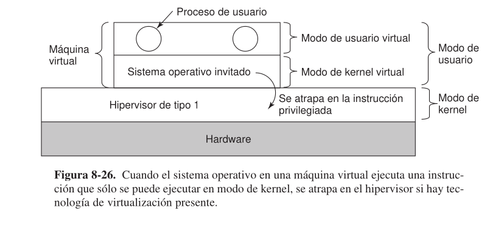
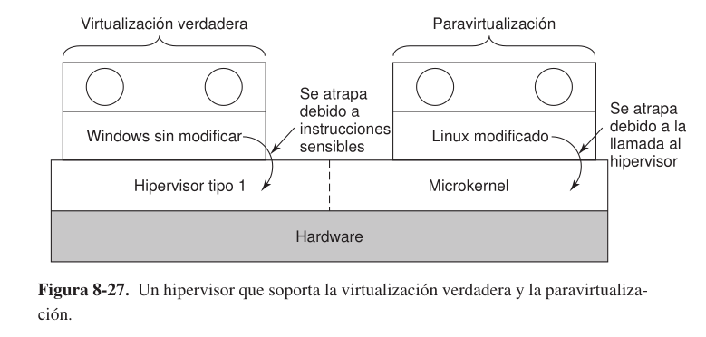

# 3. Virtualizacion

En cietas situaciones, una empresa tiene una multicomputadora pero en realidad no la quiere. Un ejemplo comun es cuando una empresa tiene un servidor de correo electronico, un servidor Web, un Servidro FTP, algunos servidores de comercio electronico, y otros servidores mas. Todos esto servidores e ejecutan en distintas computadoreas del mismo bastidor de equipos , y todos estan conectados por una red de alta velocidad; en toras palabras, es una multicomputadora. EN algunos casos, todos estos servidores se ejecutan en maquinas separadas debido a que una sola maquina no puede manejar la carga, pero en muchos otros casos la razon principal para no ejecutar todos estos servicioes como procesos en la misma maquina es la confiabilidad: La administracion simplemente no confia en que el sistema operativo se ejecute las 24 horas del dia, los 365 dias del año sin fallas. Al colocar cada servicio enuna computadora separada, si falla uno de los servidres por lo menos los demas no se veran afectados. Aunque de esta forma se logra la tolerancia a fallas, esta solucion es costosa y dificil de administrar debido a que hat muchas maquinas involucradas.

¿Que se debe hacer?  Se ha propuesto como solucionla tecnologia de maquinas virtuales, que a menudo se conoce como **Virtualizacion** y tiene mas de 40 años. Esta tecnologia permite que una sola computadora contega varias maquinas virtuales, cada una de las cuales puede llegar a ejecutar un sistema operativo distinto. La ventaja de este metodo es que una falla en  una maquina virtual no ocasiona que las demas fallen de manera automatica. En un sistema virtualizado, se puede ejecutar distintos servidores en diferentes maquinas virtuales, con lo cual se mantiene el modelo parcial de fallas que tiene una computadora, pero a un costo mucho menor y con una administracion mas sencilla.

Claro que consolidar los servidores de esta forma es como poner todos los huevos en una canasta. Si falla el servidor que ejecuta todas las maquinas virtuales, el resultado es aun mas catastrofico que cuando falla un solo servidor dedicado. Sim embargo, la razon por la que la virtualizacion puede funcionar es que la mayotia de fallas en los servidores no se deben a un hardware defectuoso, sino al software presuntioso, poco confiable y lleno de errores, en especial los sistemas operativos. COn la tecnologia de maquinas virtuales., el unico software que se ejecuta en modo del kernel es el hipervisor, el cual tiene 100 veces menos lineas de codigo que un sistema operativo completo, y por ende tiene 100 veces menos errores.

La ejecucion de software en las maquinas virtuales tiene otras ventajas ademas de un solido aislamiento. Una de ellas es que al tener menos maquinas fisicas hat un ahorro en hardware y electricidad, y se ocupa menos espacio en la oficina. Para una compañia como Amazon, Yahoom Microsoft o Google, que puede tener cientos de miles de servidores que realizan una enorme variedad de tareas distintas, la reduccion de las demandas fisicas en sus centros de datos representa un enorme ahorro en los costos. Por lo general, en las empresas grandes los departamentos individuales o grupos puensan en una idea interesante y despues van y compran un servidro para implementarla. SI la idea tiene exito y se requieren cientos  o miles de servidores, se expande el chentro de datos corporativo. A menodp es dificil mover el software a las distintas maquinas existentes, debido a que cada aplicacion necesita con frecunecia una version distinta del sistema operativo, sus propias bibliotecas, archivos de configuracion y demas. Con las maquinas virtuales, cada aplicacion puede tener su propio entorno.

Otra ventaja de las maquinas virtuales es que es mucho mas facil usar putos de comprobacion y migrar datos entre una maquina virtual y otro (Por ejemplo, Para balancear la carga entre varios servidores) que migrar procesos que se ejecutan en un sistema operativo normal. EN este ultimo caos, se mantiene una cantidad considerable de informacion critica de estado sobre cada proceso en las tablas del sistema operativo, inclutendo la informacion relacionada con la apetura de archivos, las alarmans, los manejadores de señales y demas. Al migrar una maquina virtual, todo lo que hay que mover es la imagen de memoria, ta que todas las tablas del sistema operativo se mueven tambien.

Otro uso para las maquinas virtualizacion es para ejecutar aplicaciones heredadas en los sistemas operativos (O en versiondes de los sistemas operativos) que ya no tiene soporte o que no funcionan en el hardware actual. Estas aplicaciones heredades se pueden ejecutar al mismo tiempo y en el mismo hardware que las aplicaciones actuales. De hecho, la habilidad de ejecutar al mismo tiempo aplicaciones que utilizan distintos sistemas operativos es un gran argumento a favor de las maquinas virtuales.

El desarrolo de software es otro uso aun mas importante de las maquinas virtuales. Un programador que quiera asegurarse que su software funciona en Windows 98 , Windows 2000 , Windows XP , Windows Vista, Varias versiones de Linux, FREBSD y Mac OS X ya no tiene que conseguir una docena de computadoreas e instalr distintos sistemas ioerativos en todas ellas. Lo unico que tiene que hacer es crear una docena de maquinas virtuales en una sola computadora e instalar distintos sistemas operativos encada maquina virtual. Desde luego que el programador podria haver particionado el disco duro para instalar un sistema operativo distinto en cada particion, pero este metodo es mas dificultoso. En primero lugar, las PCs estandar solo soportan cuatro particioens primarias de disco, sin importar que tan grande sea. En segundo lugar, aunque se podria instalar un progrma de multiarranque en el bloque de arranque, seria necesario reiniciar la computadora para trabajar en otro sistema operativo. Con las maquinas virtuales todos los sistemas operativos se puede ejecutar al mismo tiempo,ya que en erealidad solo son procesos glorificados.

## Requerimientos para la Virtualizacion

Hay dos metodos para la virtualizacion el primero es el denominado hipervisor de tipo 1 (O monitor de maquina virtual). En realida es el sistema operativo, ya que es el unico programa que se ejecuta en modo kernel. Su trabajo es soportar varia copias del hardware actual, conocidas como maquinas virtuales, de una manera similar a los procesos que soporta un sistema operativo normal. Por el contrario, un hipervisor del tipo 2 es algo completamente distino. Es solo un program de usuario que se ejecuta En un sistema operativo (Windows o Linux) e interpreta el conjunto de isntrucciones de la maquina, el cual tambien crea una maquina virtual. El sistema operativo que se ejecuta encima del hipervisor en ambos casos se denomina sistema operativo invitado. EN el caso de un hipervisor del tipo 2, el sistema operativo se ejecuta en el hardware se denomina sistema operativo anfrition.

Es importante tenr en cuenta que en ambos casos las maquinas virtuales deben actuar justo de igual forma que el hardware real. Especificamente, debe ser posible iniciarlas como maquinas reales e instalar cualquier sistema operativo en ellas, justo como lo que se puede hacer con el hardware real. La tarea del hipervisor es brindar esta ilusion con eficiencia (Sin ser un interprete compelto). La raxon de que jaya dos tipos de hipervisores se debe a ciertos defectos en la arquitectura del Inter 386 que se acarrearon servilmente a las nuevas CPUs durante 20 años, para mantener la compatibilidad inversa. En sintesis, cada CPU con modo kernel y modo de usuario tiene un conjunto de instrucciones que solo se puede ejecutar en modo de kernel, como las intrucciones que realizan operaciones de E/S, las que modifican opciones de la MMU, etc.

Popek y GOldberg desarrollaron un trabajo clasico sobre virtualizacion, en el cual a esta instrucciones les llamaron **Instrucciones sencibles**. Tambien hay un conjunto de instrucciones que porducen una trapa (interrupcion) si se ejecutan en modo usuario. A estas instrucciones le llamaron **Instrucciones Privilegiadas**. En su articulo declararon por pirmera vez que una maquina se puede virtualizar solo si las instrucciones sencibles son un subconjunto de las instrucciones privilegiadas. 

En realidad la situacion es un poco peor de lo que se muestra. Ademas de los problemas con las instrucciones que no se puede atrapar en modo de usuario, hay instrucciones que puede leer el estado sensible en modo de usuario sin producir una interrupcion. Por ejemplim en el Pentium un programa puede determinar si se esta ejecutando en modo de usuario o en modo de kernel y¿con solo leer su selector del segmento de codigo. Un sistema operativo que hiciera esto y descubrieraque se encuentra en modo de usuaio podria tomar una decision incorrecta con base en esta informacion.

Este problema se resolvio cuando Intel y AMD introdujeron la virtualizacion en sus CPUs, empezando en el 2005. En las CPUs de Intel Core 2 se conoce cmom VT (Tecnologia de Virtualizacion) en las CPUs de AMD Pacific se conoce como SVM (Maquina Virtual Segura). A continuacion utilizaremos el termino VT en un sentido Generico. Ambas tecnologias se inspirarion en el trabajo de la IBM VM/370, pero tiene unas cuantas diferencias. La idea basica es crear contenedores en los que se pueden ejecutar maquinas virtuales. Cuando se inicia un sistema operativo invitado en un contenedor, se sigue ejecutando ahi hasta que se produce una excepcion y se atrapa en el hipervisor por ejemplo, mediante la ejecucion de una instruccion de E/S. El conjunto de operaciones que se atrapan se controla mediante un mapa de bits de hardware por el hipervisor. Con estas extensiones, es posible utilizar el clasivo metodo de atrapar y emular de una maquina virtual.

## Hipervisores de TIpo 1

La capacidad de virtualizacion es una cuestion importante, por lo que la examinaremos con mas detalle. En la figura 8-26 podemos ver un hipervisores de tipo 1, que soporta la maquina virtual. Al igual que todos los hipervisores de tipo 1, se ejecutan en modo kernel. La maquina virtual se ejecuta como un proceso de usuario en modo de usuario y, como tal, no puede ejecutar instrucciones sensibles. La maquina virtual ejecuta un sistema operativo invitado que piensa que se encuentra en modo kernel, aunque desde luego se encuentra en modo usuario. A este le llamaremos **Modo de kernel virtual**. La maquina virtual tambien ejecuta procesos de usuario, los cuales creen que se encuentran en modo usuario (y en realidad lo estan).

Que ocurre cuando el sistema operativo (Al cual cree que se encuentra en modo kernel ) ejecuta una instruccion sensible (Una que solo se permite en modo kernel) ? En las CPUs sin VT, la instruccion falla y por lo general tambien lo hace el sistema operativo. Esto hace que la verdadera virtualizacion sea imposible. Sin duda podriamos argumentar que todas las instrucciones sensibles siempre se deben atrapar al ejecutarse en modo de usuario, pero esa no es la forma en que trabaja el 386 y sus sucesores que no utilizaban la tecnologia VT.

En las CPUs con VT, cuando el sistema operativo invitado ejecuta una instruccion sensible se produce  maquina virtual. En el primer cauna interrupcion en el kernel, como se muestra en la figura. Asi el hipervisor  puede inspeccionar la instruccion para ver si el sistema operativo anfitrion la emitio en la maquina virtual, o si fue un programa de usuario en la maquina virtual. En el primer caso, hace los preparaciones para que se ejecute la instruccion: en el segundo caso, emula lo que haria el hardware real al confrontarlo con una instruccion sensible que se ejecuta en modo de usuario. Si la maquina virtual no tiene VT, por lo general la instruccion se ignora;si tiene VT, se atrapa en el sistema operativo invitado que se ejecuta en la maquina virtual.

## Hipervisores de TIpo 2

El proceso de crear un sistema de maquina virtual es bastante simple cuando hay VT disponible, pero ¿Que hacian las personas antes de eso? Sin duda, no se podria ejecutar un sistema operativo completo en una maquina virtual debido a que solo se ignorarian (algunas de) las instrucciones sensibles, y el sistema fallaria. En vez de ello, lo que occurio fu la invencion de lo que ahora se conoce como **hipervisores de tipo 2**. EL primero de estos hipervisores fue **VMware** el cual se ejecuta como un programa de usuario ordinario encima de un sistema operativo anfitrion como Windows o Linux. Cuando se inicia por primera vez, actua como una computadora que se acaba de iniciar y espera encontrar en la unidad de CD-ROM un disco que contenga un sistema operativo.

Despues instala el sistema operativo en su **Disco Virtual** (Que en realidad solo es un archivo de Windows o Linux), para lo cual ejecuta el programa de instalacion que se encuentra en el CD-ROM. Una vez que se instala el sistema operativo invitado en el disoc virtual, se puede iniciar al ejecutarlo.

Ahora veamos como funciona VMware con un poco mas de detalle. Al ejecutar un programa binario del Pentium, que puede obtener del CD-ROM de instalacion o del disco virtual, primero explora el codigo para buscar **Bloques basicos**; es decir, ejecuciones de instrucciones seguidas que terminan en un salto, una llamada, una interrupcion o alguna instruccion que modifica el flujo de control. Por definicion, ningun bloque basico contiene una instruccion que modifique el contador sensibles (En el sentido de Popek y Goldberg). De ser asi, cada una de esta instrucciones se sustituyen con una llamada a un procedimiento de VMware que la maneja. La Instruccion final tambien se sustituye con una llamada a VMware.

Una vez que se realicen estos pasos, el bloque basico se coloca en la cache de VMware y despues se ejecuta. Un bloque basico que no contenga instrucciones sensibles se ejecutara con las misma rapidez bajo VMware que en la maquina basica (Ya que se esta ejecutando en esa maquina). Las instrucciones sensitivas se atrapan y emulan de esta manera. A esta tecnica se le conoce como **Traduccion binaria**.

Una vez que el bloque basico haya completado su ejecucion, el control se regresa a VMware, que localiza a su sucesor. Si ya se ha traduccido el sucesor, se puede ejecutar de inmediato. Si no, primero se traduce, se coloca en la cache y despues se ejecuta. En un momento dado, la mayor parte del programa estara en la cache y se ejecutara casi a la velocidad completa. Se utilizan varias optimizaciones; por ejemplo, si un bloque basico termina al saltar (o llamar) a otro, se puede sustituir la instruccion final mediante un salto o llamada directamente al bloque basico traducido, con lo cual se elimina toda la sobrecarga asociada con la busqueda del bloque sucesor. Ademas, no hay necesidad de sustituir las instrucciones sencibles en los programas de usuario; el hardware las ignorara de todas formas.

Ahora debe estar claro porque funcionan los hipervisores de tipo 2, incluso en hardware que no se puede virtualizar; todas las instrucciones sensibles se sustituyen mediante llamadas a procedimientos que emulan esta instrucciones. El verdadero hardware nunca ejecuta las instrucciones sensibles que emite el sistema operativo invitado. Se convierte en llamadas al hipervisor, quien a su vez las emula.

Tal vez podriamos esperar que las CPUs con VT tuvieran un rendimiento mucho mayor que las tecnicas de software que se utilizan en los hipervisores de tipo 2, pero las mediciones muestra otra cosa. Resulta ser que el metodo de atrapar y emular que utiliza el hardware con VT genera muchas interrupciones, y estas son muy costosas en el hardware moderno, debido a que arruina las caches de las CPUs, los TLBs, y las tablas de prediccion de bifurcacion internas de la CPU. Por el contrario, cuando las instrucciones sensibles se sustituyen mediante llamadas a procedimientos de VMware dentro del proceso que esta en ejecucion, no se produce sobrevarga debido a este cambio de contexto. Como muestra Adams y Agesen, alguans veces el software vence al hardware, dependiendo de la carga de trabajo. Por esta razon, algunos hipervisores de tipo 1 realizan la traduccion binaria por cuestiones de rendimiento, aun cuando el software se ejecute de manera correcta sin ella.

## Paravirtualizacion

Los hipervisores de tipo 1 y de tipo 2 funcionan con sistemas operativos invitados que no estan modificados, pero tiene que hacer un gran esfuerzo para obtener un rendimiento razonable. Un metodo distinto que se esta haciendo popular es modificar el codigo fuente del sistema operativo invitado, de manera que en vez de ejecutar instrucciones sensibles, realize **llamadas al hipervisor**. En efecto, el sistema operativo invitado actua como un programa de usuario que realiza llamadas al sistema operativo (El hipervisor). Cuando se utiliza este metodo, el hipervisor debe definir una interfaz que consiste en un conjunto de llamadas a procedimientos que los sistemas operativos invitados puedan utilizar. Este conjunto de llamadas forma en efecto un **API** (Interfaz de programacion de aplicaciones), aun cuando es una interfaz para que la utilicen los sistemas operativos invitados, no los programas de aplicacion.

Si vamos un paso mas alla, al eliminar todas las instrucciones sensibles del sistema operativo para que solo haga llamadas al hipervisor para obtener servicios de sistema como la E/S, hemos convertido al hipervisor en un microkernel. Se dice que un sistema operativo invitado para el que se han eliminado de manera intencional (algunas) instrucciones sensibles esta **Paravirtualizado**. La emulacion de instrucciones peculiares de hardware es una tarea desagradable y que consume mucho tienpo. Requiere una llamada al hipervisor, para despues emular la semantica exacta de una instruccion complicada. Es mucho mejor tan solo hacer que el sistema operativo invitado llama al hipervisor (o microkernel) para realizar las operaciones de E/S, y asi en lo sucesivo. La principal razon por la que los primeros hipervisores solo emulaban la maquina completa era por la falta de disponibilidad de codigo fuente para los sistemas operativos invitado (Por ejemplo: Windows), o debido a la gran cantidad de variantes (Como Linux). Tal vez en el futuro se estadarizara la API del hipervisor/microkernel y los proximos sistemas operativos se diseñaran para llamar a esa API , en vez de utilizar instrucciones sensibles. Esto facilitara el soporte y uso de la tecnologia de las maquinas virtuales.

