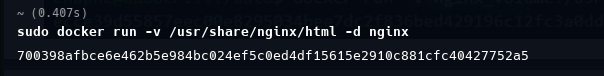

# 1.0.0 Docker

* Acciones basica en Docker

    ## Descargar imagenes (pull)
    
    * **pull** Descargar una imagen desde un repositorio (por defecto Dockerhub) y la instala en un ambiente local
    
        ```bash
        docker pull image # Ejemplo: docker pull redis
        ```
        
    

    ## Listar imagenes locales (images)
    
    * **images** Listar las imagenes que se encuentran en el ambiente local 
    
        ```bash
        docker images
        ```
        
    

    * Se presenta la informacion de la imagen **(repository)**, la version o tag, el id de la imagen, la version o tag, el id de la imagen, la fecha de creacion y el tamaño
    
    ## Imagenes con diferentes Tag: (pull) 
    
    * Es posible instalar la misma imagen con dos versiones **(Tags)**, diferentes, por ejemplo para redis podemos instalar la ultima version **(lastest)** y la version 4.0 
    
        ```bash
        docker pull redis 
        docker pull redis:4.0
        ```
        
    


    ## Ejercicio
    
    * Descargue las imagenes de algunos servicios software populares en diferentes versiones y verifique que esten en el host docker.
        - MySQL version 8.0 y 5.7
        - Postgres version 14 y 13
        - Mongo version 4.4
        - Redis version 7.0 y 6.2
        - Nginx version 1.21
            
            ```bash
            sudo docker pull mysql:8.0 
            sudo docker pull mysql:5.7 
            sudo docker pull postgres:14
            sudo docker pull postgres:13
            sudo docker pull mongo:4.4 
            sudo docker pull redis:7.0
            sudo docker pull redis:6.2
            sudo docker pull nginx:1.21
            ```
    
               
        

        ### Ejecutar  un contenedor (run)     
 
         * **run** crea un nuevo contenedor basado en una imagen local. Si la imagen no esta disponible la descarga (pull)
    
            ```bash     
            docker run redis
            ```       

        

        * Para ejecutar en modo *detached* se usa el parametro `-d` 
    
            ```bash    
            docker run -d redis
            ```
            
        
        

        ### Listar contenedores (ps)
        
        * `ps` lista los contenedores que estan en ejecucion
    
            ```bash    
            docker ps
            ```
        
        
        * Podemos ejecutar dos contenedores de la misma imagen provenientes de dos versiones diferentes el redis v4.0 
        
            ```bash
            sudo docker run -d redis:4.0 
            sudo docker ps
            ```  
            
        
  

    ## Ejercicio
    
    * Ejecute los siguientes contenedores y verifique que se ejecutan correctamente
    
        - 1 instancia Mongo version 4.4
        - 2 instancias de Redis version 7.0 
        - 1 instancia de Redis version 6.2
        - 1 instancia nginx version 1.21
        
    * Repita la operacion en modo detached y nombrando los contenedores
            
        ```bash
        sudo docker run -d --name mongo_4.4  mongo:4.4
        sudo docker run -d --name redis1_7.0 redis:7.0
        sudo docker run -d --name redis2_7.0 redis:7.0
        sudo docker run -d --name redis_6.2 redis:6.2
        sudo docker run -d --name nginx_1.21 nginx:1.21
        ```


        
        

        ### Parar  un contenedor (stop)
        
        * `stop` detiene un contendor que esta en ejecucion
        
            ```bash
            sudo docker stop container_id # o nombre
            ```
        

        ### Arrancar un contenedor (start)
        
        * `start` arranca un contenedor que esta detenido
        
            ```bash
            sudo docker start container_id # o nombre
            ```
            
        
        
        
    ## Depuracion de un contenedor
    
    * **Visualizar logs del servidor**
        * `logs` muestran los logs de un contenedor que esta en ejecucion en background
        
            ```bash
            sudo docker logs container_id
            ```

        
        

    * **Ejecutar un comando en un contenedor**
        * `exec` ejecuta un comando en un contenedor que se ejecuta en background
        
            ```bash
            sudo docker exec container_id echo "hola"
            ```

                    

        * Generalmente se usa para ejecutar un shell bash (o sh) en el contenedor
        
            ```bash
            sudo docker exec -it container_id bash
            ```

        
        
    * **Inspeccionar la informacion del contenedor**
    
    * `inspect` presenta metadatos del contendor
    
        ```bash
        sudo docker inspect container_id 
        ```
        


    ## Redes en Docker
    
    *  **Mapeo de puertos**
        * El mapeo de puertos se hace con la opcion `-p` del comando run, especificando el puerto host y luego el puerto del contenedor
        
        ```bash
        sudo docker run -d -p 9000:80 nginx  
        sudo docker run -d -p 6379:6379 redis
        ```


        
        
     * Los contenedores en la misma red son *visibles* usando el nombre de host **nombre del contenedor** o la IP
     
        ### Listar redes en docker
        
        * `network ls` lista las redes existentes en el runtime de docker
        
            ```bash
            sudo docker network ls     
            ```
 
        
        
        * Driver Bridge => red interna de contenedores
        * Driver null => sin red
        * Driver host => conectado directo al host **no recomendada**
        
        ### Crear redes en docker
        
        * `network create` Crea una nueva red en el runtime de docker
        
            ```bash
            sudo docker network create net_name
            ```
                
        
        
        ### Conectar un contenedor a una red
        
        * Para conectar un contenedor a una red usamos
        
            ```bash
            sudo docker network connect red contendor_id
            ```

        
        
        * Desde la ejecucion con la opcion `--network`        
        
            ```bash
            sudo docker run -d --network test_red redis
            ```
            
        


    ## Configuracion de contenedores
    
    * La configuracion de los contenedores se hace a traves de variables de ambiente
    * Cuando se ejecuta el contenedor se le indican las variables y sus valores con la opcion `-e` al ejecutar
    
        ```bash
        sudo docker run -e MYSQL_ROOT_PASSWORD=miclave -d mysql:8
        ```
        
           

    ## Ejercicio
    
    * Conectar en una misma red un contenedor para mongo y otro para mongo-express y configurar el segundo para acceder al primero
    * Connectar mysql con phpmyadmin (nombrar en contendor mysql db)
     

        ```bash
        sudo docker run --name db -e MYSQL_ROOT_PASSWORD=mypass -d mysql
        sudo docker run  -p 80:80 --link db:mysql phpmyadmin/phpmyadmin
        ```

        
        

        
        

    ## Volumenes Docker
    
    * Cada contenedor tiene su propio sistema de archivos (virtual) que es efimero, cuando se elimina el contenedor se pierde los datos.
    
        ### Volumnes: Nocion de Volumen
        
        * Un volumen monta un directorio del host en el directorio del contenedor, de esta forma los datos quedan almacenados en el hots
        
        ### Volumenes: Tipos
        
        * **Host** Se indica el directorio del host y el directorio del contenedor donde se va montar el volumen
        * **Anonimo** Solo se le indica el directorio del contenedor donde se va a montar y Docker genera el directorio en el host (en `/var/lib/Docker/volumes`)
        * **Nombrado** Se indica el `nombre` del volumne y el directorio del contenedor donde se va a montar y Docker genera el directorio con el nombre indicado en el host (en  `/var/lib/Docker/volumes`)
        
        ### Volumenes: Especificacion
        
        * Para especificar un volumen usamos la opcion `-v` en la ejecucion
        
        * **Volumen tipo host**
        
            ```bash
            sudo docker run -v /test/volumes/nginx:/usr/share/nginx/html -d nginx    
            ```
        
        
        
        * **Volumen tipo Anonimo**
        
            ```bash
            sudo docker run  -v /usr/share/nginx/html -d nginx
            ```

        
        
        * **Volumen tipo Nombrado**
        
        ```bash
        sudo docker run -v nginx_volume:/usr/share/nginx/html -d nginx
        ```


        
        

        ### Listar volumenes
        
        * Para listar los volumenes usamos `docker volume ls`
        
         
         

        * Los volumenes son almacenados por defecto en `/var/lib/docker/volumes`
        


