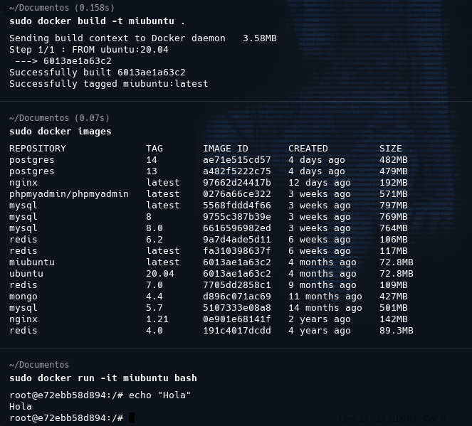
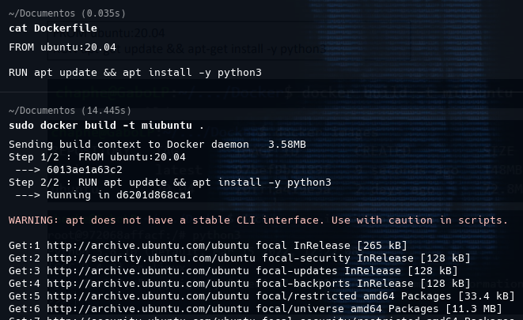
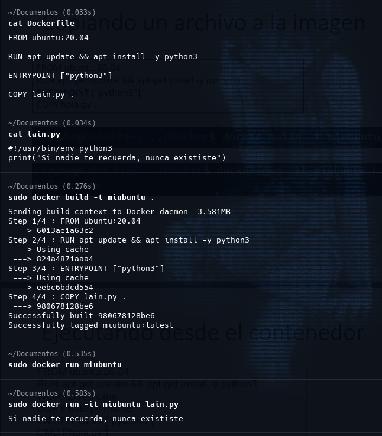
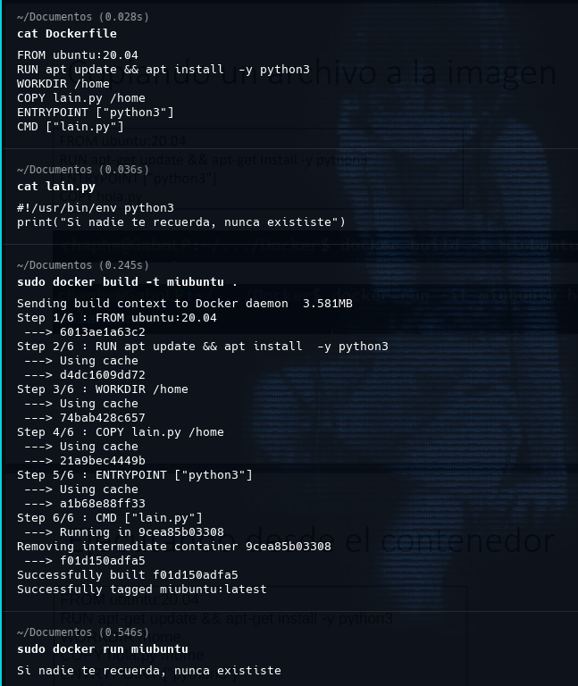

# 1.1.0 Docker Images

* Caracteristicas de una imagen Docker
    
    * Funciona como un sistema de capas
    * Se debe buscar la imagen base a la que agregar una capa
    * La imagen se especifica en un Dockerfile
    * La imagen es almacenada localmente
    * Se debe tener una cuenta en Docker para subirla al repositorio
    
    ## Una imagen simple
    
    ```dockerfile
    FROM ubuntu:20.04
    ```
    
    
    

    ## Ejecutando un comando
    
    ```dockerfile
    FROM ubuntu:20.04
    RUN apt update && apt install  -y python3
    ```
    
    
    
    ## Copiando un archivo a la imagen
        
    ```dockerfile
    FROM ubuntu:20.04
    RUN apt install && apt install -y python3
    ENTRYPOINT["python3"]
    COPY hola.py
    ```
    ```python
    print("Si nadie te recuerda, nunca exististe.")
    ```    
    
    


    ## Ejecutando desde el contenedor
        
    ```dockerfile
    FROM ubuntu:20.04
    RUN apt update && apt install  -y python3      
    WORKDIR /home
    COPY lain.py /home
    ENTRYPOINT ["python3"]
    CMD ["lain.py"]
    ```
    
    
    
    ## Acciones para construir imagenes
    
    * **FROM** indica la imagen base
    * **COPY** copia un archivo del *host* al contenedor
    * **ENTRYPOINT** el comando que se ejecuta por defecto al arrancar el contenedor
    * **WORKDIR** define el directorio de trabajo por defecto
    * **CMD** define el argumento pasado por defecto
    * **RUN** ejecuta uno comado durante la creacion de la imagen
    * **ENV** permite declarar una variable de entorno en el contenedor
    * **EXPOSE** abre un puerto del contenedor
    
