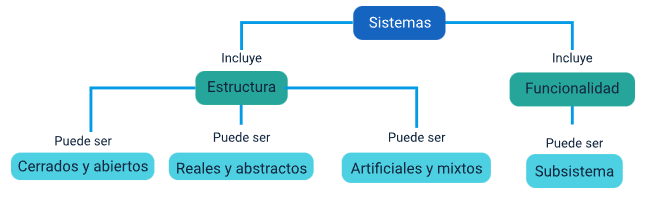
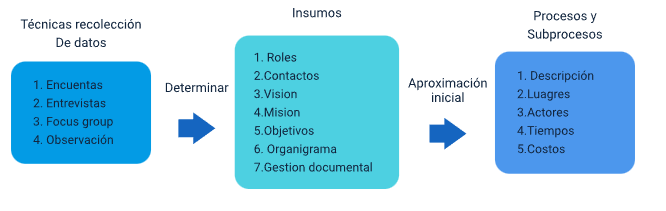

# Caracterizacion de Procesos

## Teoria general de sistemas

* Es un campo de la ciencia que pretende examinar las propiedades que define a los sistemas; es decir, categorias formadas por partes interrelacionadas que llevan al cumplimiento de una accion u objetivo.

* Desde el punto de vista historico las primera contribuciones a este campo y su definicion viene de la teoria general de sistemas de Ludwinf vom Bertalanffy. Este modelo ha perdurado como herramienta para la aplicacion del metodo cientifico y siguie siendo utilizado como apoyo fundamental en le analisis de sistemas organizacionales incluso para grupos humanos entre otros usos.

>  Propone la teoria general de sistemas como un instrumento amplio que se aplica y es comun su uso para la resolucion de problemas hoy en dia y en todos las areas del saber.

* Esta teoria se contituyo como un nuevo aporte dentro del conjunto de paradigmas cientificos para el aborde de problemas que se basan en la correspondecia entre los elementos que conforman los sistemas. Antes de esta propuesta se pensaba que los sistemas desde el punto de vista de su conformacion global se asemejaban a la sumatoria de sus elementos integrantes y que podian ser entendidos disgregandolos para realizar un estudio individual de cada componente; el pensamiento de Bertalanffy presenta objeciones a tales creencias.

## Enfoque de sistemas

* Un punto basico unod a los respectivos analisis (simulacion, teoria de comportamientos, teoria de colas , teoria de juegos) ques e puede aplicar para la resolucion de problemas usando el metodo cientifico es el enfoque de sistemas:

> Se trata de comprender el funcionamiento de una organizacion u objeto de estudio desde una perspectiva holistica e integradora, en donde lo importante son las relaciones entre los componentes. Se llama holismo al punto de vista que se interesa mas por el todo que por la suma de las partes. El enfoque sistemico no concibe la posibilidad de explicar un elemento si no es precisamente en su relacion con el todo. Metodologiacamente, por tanto, el enfoque sistemico es lo opuesto al individualismo metodologico, aunque esto no implique necesariamente que este en contradiccion.

## Definicion de los sistemas 

* Para Ludwinf Von Bertalanffy:

    * Sistema es un conjunto organizado de elementos que interactuan entre si con estructura logica o que son interdependientes, formando un todo complejo, identificable y distintivo. Por los elementos de un sistema se entiene no solo su conformacion fisica sino las funciones que estos desempeñan. Algun conjunto de elementos de un sistema puede ser considera un subsistema si mantiene una relacion entre si que los hace tambien un conjunto identificable y distinto.
    
* Tales sistemas se caracterizan por su capacidad de recepcion de elementos los cuales son denominados como entradas, a su vez se pueden tipificar como tipos de energia, informacion a manera de mesajes, datos y señales tambien recursos fisicos. Estas entradas se someten a un conjunto de actividades que alimentan una serie de acciones que las transforman y como consecuencia se genra unos resultaos o salidas; una situacion muy interesante se presenta cuando una salida o parte de ella se convierte nevamente en entrada cuando esto sucede se dice que existe retroalimentacion. La retroalimentacion ayuda a elevar el grado de perfeccionamiento en las respuestas y en el propio comportamiento del sistema logrando de manera inmediata altos niveles de control, principio basico de la automatizacion de estos.

* Asi mismo, cuando de un subsistema se conoce solo las entradas y las salidas pero no las actividades internas se dice que es una caja negra en ese caso se aconseja utilizar la observacion y guiarse por el sentido comun para proponer las actividades desde cero que resulven el mismo problema.

    ### Clasificacion de  sistemas

    * Bertalanfly  y otros autores posteriores han definido distintas formas de clasificar a los sistemas en funcion de su conformacion esturcutar y sus funcionalidades. Estas son las clasificacione mas importantes

    

    * A continuacion, se presenta algunos tipos de sistemas:

        1. **Sistema, supersistema y subsistemas**
    
            * Los sisteams que se pueden agrupar teniendo en cuenta su grado de complejidad, se componen a su vez de distintos niveles de jerarquia en que pueden dividirse y que interactuan entre ellos intercambiando algun tipo de informacion, de modo que estos al final noson autonimos uno de otros.
        
            * Si se entiene por sistema a un conjunto de partes, podemos hablar de subsisteamas para referirse a tales elementos; un ejemplo de elleo es la conformacion de una familia como un sistema y cada miembro en ella es un subsistema. El supersistema es el contexto externo que rode al sistema y en el que este se encuentra inmerso; en los grupos o comunidades de humanos idenficablecon la sociedad.
        

    ### Sistema de Informacion

    * Es un conjunto de componentes interrelacionados que recolectan (o recuperan), procesan, almacenan y distribuyen información para apoyar los procesos de toma de decisiones y de control en una organización.

        1. **Dato**
        
            * Un dato no es otra cosa que una  represetacion simbolica de alguna situacion o suceso, sin ningun setido semantico, describiendo un hecho concreto. O lo que es lo mismo, sin trasmitir mensaje ninguno.
        
        2. **Información**
    
            * La informacion se define como un conjunto de datos los cuales son adecuadamente procesados, para que de esta manera, pueden proveer un mensaje que contribuya a la toma de decisiones a la hora de resolver un problema o afrontar una situacion culquiera en la que se requiera de la toma de decisiones de cualquier tipo.
        

## Analisis de los procesos a nivel de negocio

*  Con base en los conceptos de la teoria genral de sistemas y partiendo de la vision del todo se debe comprender el funcionamiento real a partir de desestructurar ese todo en procesos, subproceso y realciones y actores que interviene con el objetivo de identificar, comprender , evaluar y resolver problemas que ayudan a las instituciones a mejorar dichos procesos, reformar las opciones de negocio y brindar a sus consumidores a experimentar una mejor calidad de productos o servicios. Por esto, es necesario que realicen de manera cosntate, frecuente repetitiva un analisis de sus procesos de negocio la TGS donde visualices y comprendan coada uno de los pormenores que trasforman el negocio con el objetivo de mejrar sus operaciones y el servicio al cliente. A continuacion, una breve informacion al respecto:

* Una de las tecnicas que permite conseguir estos objetivos es el analisis de procesos de negocio que significa llegar al conocimiento detallado de cada labor y que se hace abordando la operacion central de valor hasta las que pueden considerarse como labores rama o perifericas no menos importantes. Ese es el nombre ques e le da a la accion que realiza las organizaciones para revisar, documetnar y entender sus procesos

* Tiene como objetivo el desglose de cada uno de lso componetes en cada proceso como:

    * Entradas
    * Salidas
    * Procedimientos
    * Aplicaciones
    * Datos
    

    ### Diagrama de Procesos
    
    * Para realizar una excelente identificacion de procesos se recomienda realizar las siguientes actividades en dos escenarios:
    * **Antes** Se debe obtener acceso de informacion sobre la organizacion, para antes de llegar a esta, se investigue sobre el contexto de negocio en el que se mueve la empresa. Por ejemplo: determinar si se esta hablando de un banco o una empresa de energia o una empresa que presta servicios y en ese caso que tipo de servicios presta o por el contrario si es una empresa que fabrica productos, que productos fabrica es decir que hace, COnocer de ella tambien sus sedes (instalaciones fisicas).
    * Cuando exista cercania, acceso o contato con la entidad, plantear entocnes la recolecion de informacion aplicando las tecnicas que existen para ello como lo es:
        * Metodo de la observacion
        * La elaboracion de fromatos de encuesta
        * El enforque de trabajo
        * Las entrevistas
        
    * Como resultado de esta tecnicas se deven establecer claramente y como minimo los siguientes items: roles de los intervinientes, informacion de contatos con responsabilidades, mision, vision, objetivos estategicos, estructura organizaciones un organigrama de la etidad su distribucion de dependencias u oficinas en donde se puede ubicar de manera agil a los responsables que seguramente se convertira en futuros miembros de los equipos de trabajo donde se presentara interaccion (SInergia Laboral).
    
    
    

    ### Determinar el equipo de trabajo
    
    * Con base en la informacion recolectada y a la obtencion de los requerimientos que permitieron identificar los procesos que necesitan mejorarse, se procede a formar el equipo de trabajo que los identifiara, analizara y documetara. Lo ideal es que los responsables que conocen a detalle los procesos conformen el equipo.
    * **Integrantes**
        * El lider del proyecto o el proceso elegido.
        * Un alto miembro de la organizacion que conoce los objetivos estrategicos.
        * Los empleados vinculados al proceso
        * Los trabajadores de otroas areas que cuentan con la actual experiencia y que desean conocer las mejora que se llevara a cabo.
        

    ### Generar los diagramas de los procesos de negocio
    
    * Se trata de representar en una secuencia logica los elementos expresados en la TGS, nombre del proceso el cual debe ser un verbo (fabricar, validar, informar) que permite modelar en un dibujo el proceos de manera rapida, dinamica y sencilla acerca de como fluyen las entradas en cada elemento y hacia donde se debe dirigir sus salidas. En el diagrama es fundamental definir las competencias de cada uno de los integrantes del equipo en cada tarea.
    
        #### Diagrama de procesos
        
        * Teniendo en cuenta la teoria general de sistemas antes relacionada a un diagrama de procesos, es la forma en la cual se aplica el enfoque sistemico para represetar de manera grafica los componentes de las principales actividades que pueden inferirse a su vez como subsistemas que conforman el todo interoperacion con orden logico guiados por sus interrelaciones. Muestra el flujo secuencial de interaccion de las catividades de un proceso a traves de simbolos graficos para proporcionar una mejor visualizacion del funcionamiento del mismo, ayudando a su entendimiento y haciendo su descripcion mas didactiva, visuale intuiditca
         
        * **Elementos de un diagrama de procesos**
        
            * A la hora de construir o representar y dibujar un diagrama de procesos, existe un lenguaje de escritura que se conforma por una seria de simbolos comunmente aceptados que han sido establecidos por el estandar ANSI.
            * Estos diagramas esta compuestos por elementos graficos como lo son terminadores, simbolos de procesos, de subprocesos y de decisiones, lineas con flechas y conectores. Los principales elementes esta representados de la siguiente forma:
                * **Proceso o actividad** Se represtan con un rectangulo, se refiere a una accion en un proceso de negocios.
                * **Subproceso** Est se representa con un rectangulo y lineas dobles a cada lado.
                * **Nodo de desicion** se usa un diamante para el con si y no en cada lado.
                * **Conectores** Representado por circulos o cuadrados conectores que deven acompañar con la utilizaciond e etiquetas 
                * **Lineas de flecha**   Utilizadas graficamente para mantener el hilo conductor del flujo de trabajos la coherencia y la claridad en un diagrama de procesos. Se puede dibujar hacia todas las direcciones, normalmente representa el camino por el que fluira el diagrama.
                * **Conector para elementos fuera de pagina** Permite establecer relaciones para elementos que no estan en la misma pagina.  trapecio
                * **Entrada manual** permite represtar una accion la cual requiere intervencion humana.
                * **alamacenamiento** represta el sitio en donde normamente se aloja la informacion
                * **multiples documentos**
                * **terminadores**
                
    ¨

