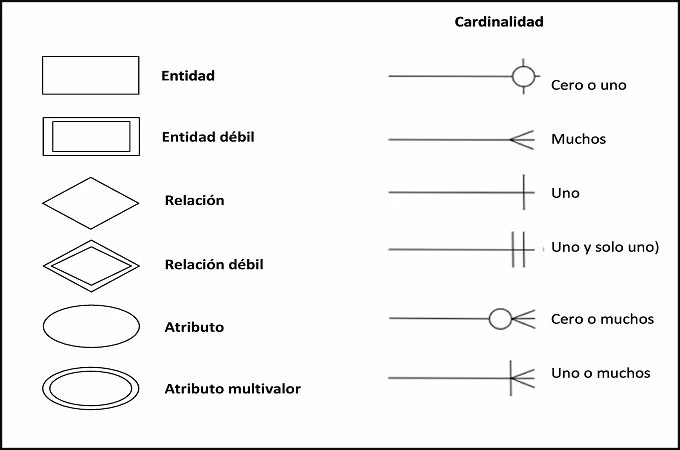

# Esquema Entidad-Relación (E-R)

* Es un modelo conceptual que describe como los datos esta interconectados en un sistema. Fue propiuesto por Peter Chen en 1976 y es especialmente util en la fase inicial del diseño de bases de datos, ya que ofrece una vision clara y comprensible del sistema.

    ## Caracteristicas
    
    * **Visual y conceptual** Representa los datos y sus relaciones graficamente.
    * **Generalizable** Puede adaptarse a sistemas grandes o pequeños.
    * **Facil de entender** Es independiente de la implementacion tecnica.
    * **Precursor del diseño relacional** Sirve como base para crear un esquema relacional.
    
    ## Estructura
    
    * El esquema `E-R` se compone de los siguientes elementos:
        
        ### Entidades
        
        * Son los objetois o conceptos principales del sistema que tiene exitencia independiente y que queremos representar en la base de datos.
        
        * **Tipos de entidades**
            * **Entidad fuerte** Puede identificarse por si sola.
            * **Entidad debil** Depende de una entidad fuerte para identificarse.
            
        * **Ejemplo** En un sistema de ventas.
            * **Entidad fuerte** Cliente, Producto.
            * **Entidad debil** Detalle_pedido (depende de Pedido).
            
        ### Atributos
        
        * Son las propiedades o caracteristicas que describen a una entidad o relacion.
        
        * **Tipos de atributos**
            * **simples** Contiene valores atomicos (nombre, precio, cedula).
            * **Compuesto** Se dividen en subcomponentes (direccion = calle, ciudad).
            * **Derivados** Se calculan a partir de otros datos (edad derivada de la fecha de nacimiento).
            * **Multivaluados** Puede tener mas de un valor (numeros telefonicos).
           
        * **Ejemplo**
            * Entidad **Cliente** tiene los atributos `nombre`, `correo`, `direccion`.
            
        ### Relaciones
        
        * Describen como interactuan o esta conectadas las entidades.
        
        * **Tipos de relaciones**
                * **Uno a uno (1:1)** Un cliente tiene un unico perfil.
                * **Uno a muchos (1:N)** Un cliente puede realizar muchos pedidos.
                * **Muchos a muchos (M:N)** Un producto puede pertenecer a muchos pedidos y viceversa.
                
        * **Ejemplo**
            * Relacion **Realiza** entre Cliente y Pedido.
            
        ### Cardinalidad
        
        * Define cuantas instancias de una entidad puede asociarse con otra entidad en una relacion.
        
        * **Tipos**
            * **1:1** Uno a uno.
            * **1:N** Uno a muchos.
            * **M:N** Muchos a muchos.
            

        ### Claves
        
        * **Clave primaria (Primary Key)** Identifica de forma unica cada instancia de una entidad.
            * `cliente_id` Para identificar a un cliente.
            
        * **Clave foranea (Foreign Key)** Conecta entidades relacionadas.
        
        
    ## Elementos
    
    
    
    ## Ejemplo
    
    * Supongamos que estamos diseñando un sistema para guestionar pedidos de una tienda.
    
        ### Paso 1: Identificar entidades
        
        1. **Cliente** Persona que realiza pedidos.
        2. **Pedido** Solicitud de compra hecha por un cliente.
        3. **Producto** Articulo que se vende.
        
        ### Paso 2: Identificar atributos
        
        1. **Cliente** `cliente_id` (PK), `nombre`, `correo` , `telefono`.
        2. **Pedido** `pedido_id` (PK), `fecha`, `cliente_id` (FK).
        3. **Producto** `producto_id` (PK), `nombre`, `precio`.
        
        ### Paso 3: Definir relaciones
        
        1. Relacion **Realiza**
            * Conecta Cliente con Pedido.
            * **Cardinalidad** Un cliente puede realizsar muchos pedidos (1:N).
           
        2. Relacion **Contiene** 
            * Conecta Pedido con Producto.
            * **Cardinalidad** Un pedido puede conectar muchos productos, y un producto puede estar en muchos pedidos (M:N).
            
        ### Paso 4: Representacion grafica
        
        1. Dibujar rectanugos pra las entidades.
        2. Dibujar rombos para las relaciones.
        3. Conectar entidades y relaciones con lineas.
        4. Agregar atributos a cada entidad (ovalados).
        5. Especificar claves primarias y foraneas.
        
