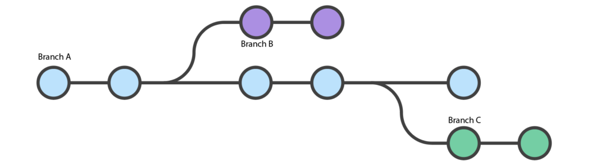

# 1. Git

**Git** es un sistema de control de versiones distribuido que permite a varios desarrolladores trabajar en un proyecto de software de manera simultanea sin interferir entre si. Fue creado por Linux Torvalds en 2005, y es ampliamente utilizado en el desarrollo de software para gestionar el codigo fuente de proyectos de cualquier tamaño.

## Funcionamiento

**Git**  rastrae los cambios en archivos y carpetas dentro de un repositorio, permitiendo que los usuarios guarden versiones especificas del proyecto en diferentes momentos. Esto se hace mediante una serie de comandos que gestionan los cambios, combinan trabajos de diferentes desarrolladores y permiten volver a versiones anteriores si es necesario.

### Conceptos

* **Branch** En Git es una bifurcacion o lina de desarrollo dentro de un proyecto. Te permite trabajar en una copia del codigo de manera independiente de la rama principal  <i style="color:#CFDE74">(main o master)</i>. Al usar ramas, puedes desarrollar nuevas caracteristicas, solucionar errores o experimentar sin afectar el codigo en la rama principal. Cada `brach` tiene su propio historial de commits, lo que te permite trabajar de forma paralela y combinar los cambios mas adelante.

* **Merge** Es un proceso de combinar cambios de una rama en otra. Generalmente, fusionas una rama secundario  <i style="color:#CFDE74">(Como una feature o hotfix)</i> en la rama principal  <i style="color:#CFDE74">(main o develop)</i>. Durante un `merge`, Git intenta integrar automaticamente los cambios realizados en ambas ramas. Si los cambios no entran en conflicto, Git completa la fusion automaticamente. Si hay conflictos, **Git** te pedira que resuelvas eso conflictos manualmente.

* **.gitignore** Es un archivo de texto especial que se coloca en el directorio raiz del proyecto o en subdirectorios y especifica que archivos o directorios deben ser ignorados por Git. Esto significa que los archivos listados en `.gitignore` no seran rastreados ni incluidos enlos commits. Es util para excluir archivos que no deberia ser parte de un repositorio, como archivos temporares, binarios generados o configuraciones locales.
* **Tag** es una referencia que apunta a un punto específico en la historia del repositorio. Los tags son generalmente utilizados para marcar versiones específicas del proyecto, como lanzamientos de versiones <i style="color:#CFDE74">(por ejemplo, v1.0.0, v2.1.3, etc.)</i>. A diferencia de las ramas, los tags no cambian; son fijos y permanentes, lo que significa que siempre apuntan al mismo commit

### Rama 

Una rama en **Git** es una line de desarrollo independiente dentro de un proyecto. Imagina una rama como una bifurcacion del camino principal del desarrollo, donde puedes trabajar en cambios, nuevas caracteristicas o correciones sin afectar la version estable o principal del proyecto. Cada rama tiene su propio historial de commits, lo que te permite desarrollar de manera paralela a otras ramas.

#### Funcionamiento

Las ramas permiten a los desarrolladores trabajar en diferentes partes de un proyecto de forma aislada. Por ejemplo, su estas desarrollando una nueva caracteristica, puedes crear una rama especifica para esa tarea. Esto significa que puedes hacer todos los cambios que necesites en esa rama sin afectar al codigo en una rama principal <i style="color:#CFDE74"> (Como main o master)</i>. Cuando la nueva caracteristica esta lista y ha sido probada, puede fusionarla de nuevo en la rama principal.

##### Tipos de ramas en Git

1. **Master/Main** Es la rama principal que contiene la version estable y liberada del proyecto.

2. **Develop** Rama donde se integran todas las caracteristicas antes de ser fusionadas con la rama principal.

3. **Feature** Ramas temporales que se utilizan para desarrollar nuevas caracteristicas. Se basan en `develop`.

4. **Hotfix** Ramas creadas para solucionar problemas en la rama `master` sin interrumpir el desarrollo en `develop`.

5. **Release** Ramas utilizadas para preparar una nueva version de produccion. Se basan en `develop` y se fusionan en `master`.

###### Comandos relacionados con ramas

1. `git branch <nombre>`: Crea una nueva rama con el nombre especificado.
2. `git checkout <nombre>`: Cambia a la rama especificada.
3. `git checkout - b <nombre>`: Crea una nueva rama y cambia a ella en un solo comando.
4. `git merge <rama>`: Fusiona la rama especificada en la rama actual .
5. `git branch`: Lista todas la ramas en el repositorio la rama actual estara marcada con un `*`.
6. `git push origin <nombre>`: Sube la rama actual al repositorio.
7. `git branch -d <nombre>`: Elimina una rama especificada si ya no la necesita.
8. `git push origin <nombre>`: Sube la rama actual al repositorio remoto.
9. `git pull origin <nombre>`: Trae los cambios de una rama especifica del repositorio remoto y los fusiona con la rama actual.

### Estados en Git

1. **Working Directory (Directorio de trabajo)** Aqui es donde haces cambios en los archivos. Estos cambios no estan bajo control de versiones hasta que los añades al staging area.

2. **Staging Area (Area de preparacion)** Aqui es donde los cambios se guardan temporalmente antes de ser confirmados  <i style="color:#CFDE74">(commited)</i>. Puedes añdir varios cambios aqui antes de realizar un commit.

3. **Repositorio** Es donde se almacenan los commits. Una vez que confirmas <i 
style="color:#CFDE74">(committeas)</i> los cambios, pasan del area de preparacion al repositorio.

### Comandos basicos de Git

1. `git init`: Inicializa un nuevo repositorio Git en tu directorio actual.

2. `git clone <url>`: Clona un repositorio existente desde una URL.

3. `git status`: Muestra el estado actual del repositorio, incluyendo archivos modificados, sin seguimiento, y los que estan en el area de preparacion.

4. `git add <archivo>`: Añade un archivo o cambios de archivos al area de preparacion (Staging area).

5. `git commit -m "mensaje"`: Confirma los cambios en la area de preparacion al repositorio con un mesaje descriptivo.

6. `git push`: Envia los commits locales al repositorio remoto.

7. `git pull` :  Trae y fusiona los combios del repositorio remoto al local.

8.  `git branch `: Lista las ramas locales. Puedes crear una nueva rama con `git branch <nombre>` o cambiar a una rama existente con `git checkout <nombre>`.

9. `git merge <rama>`: Fusiona la rama especifica en la rama actual.

10. `git log`: Muestra el historial de commits en el repositorio.

11. `git checkout <nombre>`: Cambia a otra rama o restaura archivos del historial.

