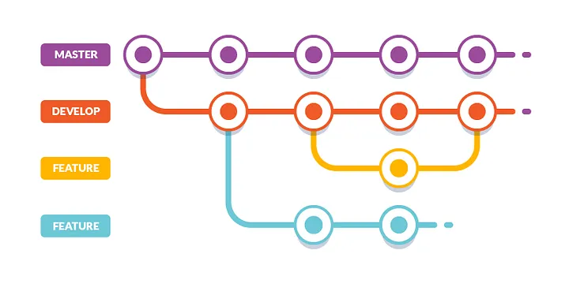

# 2. Git Flow



**Git Flow** es un flujo de trabajo y una convencion para gestionar ramas en **Git**. Fue propuesto por Vincent Driessen y se ha convertido en una practica comun para proyectos de desarrollo de software. Git Flow define un modelo de ramificaciones robusto y estructurado que facilira la colaboracion, el desarrollo de nuevas caracteristicas, la correccion de errores y el lanzamiento de versiones.

## Funcionamiento

**Git Flow** se basa en dos ramas principales y varia ramas auxiliares. Cada tipo de rama tiene un proposito especifico, lo que ayuda a mantener el desarrollo organizado y ordenado. El flujo de trabajo de <span style="color:#ffbd80">Git Flow</span> sigue un cliclo claro que incluya desarrollo de caracteristicas, preparacion de versiones, correcion de errores y lanzamientos.

### Composicion de Git Flow

1. **Ramas Principales**

    * **Master** Esta rama contien la version estable y en produccion del proyecto. Cada <span style="color:#a9fe91">commit</span> en `master` es una nueva version del producto.
    
    * **Develop** Esta es la rama de integracion donde se combinan todas las caracteristicas desarrolladas. Es la rama base para el desarrollo de nuevas funcionalidades.
    
2. **Ramas Auxiliares**

    * **Feature** Ramas derivadas de `develop` para desarrollar nuevas caracteristicas. Cada nueva caracteristica tiene su propia rama `feature`.
    
    * **Release** Ramas creadas desde `develop` para preparar una nueva verion de produccion. Aqui se hacen los utilos ajustes y pruebas antes de fusionarlas con `master`.
   
     * **hotfix** Ramas derivadas de `master` para solucionar problemas criticos en produccion. Una vez solucionado el problema, se fusionan en `master` y `develop`.
   
#### Ciclo de vida típico de Git Flow

1. **Crear una nueva rama de característica (Feature Branch)**

    * Basado en develop, se crea una rama feature para desarrollar una nueva característica.

        ```bash
        git checkout develop
        git checkout -b feature/nueva_funcionalidad
        ```

   * Aquí, `nueva_funcionalidad` es el nombre de la nueva característica.

2. **Desarrollar la característica**

    * Haces <span style="color:#a9fe91">commits</span> en la rama `feature/nueva_funcionalidad` hasta que la nueva funcionalidad esté completa.

3. **Fusionar la característica en develop**

    * Una vez completada, la rama feature se fusiona en develop.

        ```bash
        git checkout develop
        git merge feature/nueva_funcionalidad
        git branch -d feature/nueva_funcionalidad
        ```
   * Después de la fusión, puedes eliminar la rama `feature`.


4. **Crear una rama de versión (Release Branch)**

    * Cuando varias características están listas, se crea una rama release desde develop para preparar la versión.

        ```bash
        git checkout develop
        git checkout -b release/1.0.0
        ```
    * Aquí, `1.0.0` es el número de versión.
    
5. **Preparar la versión**

    * En la rama `release`, se hacen ajustes finales, como correcciones de errores menores, y se actualizan los números de versión.

6. **Fusionar la rama release en master y develop**

    * Una vez que la versión está lista, se fusiona la rama `release` en `master` y `develop`.
    
        ```bash
        git checkout master
        git merge release/1.0.0
        git tag -a 1.0.0 -m "Release 1.0.0"

        git checkout develop
        git merge release/1.0.0
        git branch -d release/1.0.0
        ```
    * Se crea un tag en master para marcar la versión.

7. **Gestionar correcciones urgentes (Hotfix Branch)**

    * Si surge un problema crítico en producción, se crea una rama `hotfix` desde `master`.

        ```bash
        git checkout master
        git checkout -b hotfix/1.0.1
        ```
   * Aquí, 1.0.1 es el número de versión para la corrección.

8. **Aplicar la corrección**

    * Se hacen los commits necesarios en la rama hotfix.

9. **Fusionar la rama hotfix en master y develop**

    * Una vez solucionado el problema, la rama `hotfix` se fusiona en `master` y `develop`.

        ```bash
        git checkout master
        git merge hotfix/1.0.1
        git tag -a 1.0.1 -m "Hotfix 1.0.1"

        git checkout develop
        git merge hotfix/1.0.1
        git branch -d hotfix/1.0.1
        ```
##### Comandos específicos de Git Flow

Git Flow puede gestionarse manualmente, pero también hay una extensión que automatiza muchas de estas tareas. Si instalas la extensión de Git Flow, puedes usar comandos más simples:

* **Instalacion**

```bash
sudo apt install git-flow
```

1. **Inicializar Git Flow**

    ```bash
    git flow init
    ```
    * Esto configura tu repositorio para usar Git Flow y te permite personalizar los nombres de las ramas si lo deseas.

2. **Iniciar una nueva característica**

    ```bash
    git flow feature start nueva_funcionalidad
    ```
    * Inicia una nueva rama feature desde develop.

3. **Finalizar una característica**


    ```bash
    git flow feature finish nueva_funcionalidad
    ```

* Fusiona la característica en `develop` y elimina la rama `feature`.

4. **Iniciar una nueva versión**

    ```bash
    git flow release start 1.0.0
    ```
   * Crea una nueva rama release desde develop.

5. **Finalizar una versión**

    ```bash
    git flow release finish 1.0.0
    ```
    * Fusiona la rama release en `master` y `develop`, crea un <span style="color:#84E4DD">tag</span>, y elimina la rama `release`.

6. **Iniciar una corrección urgente (Hotfix)**

    ```bash
    git flow hotfix start 1.0.1
    ```
* Crea una nueva rama hotfix desde master.

7. **Finalizar una corrección urgente**

    ```bash
    git flow hotfix finish 1.0.1
    ```
   * Fusiona la corrección en `master` y `develop`, crea un <span style="color:#84E4DD">tag</span>, y elimina la rama `hotfix`.