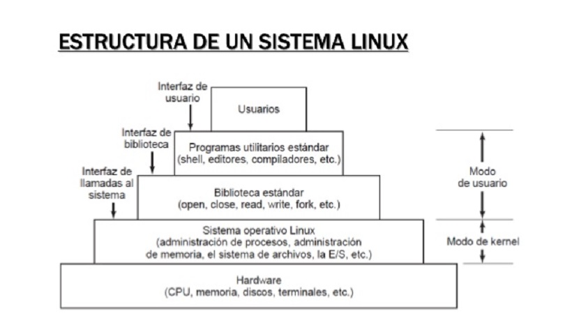

#1. Componentes

GNU/Linux es un sistema operativos compuestos por varios componentes que trabaja juntos para proporcionar un entorno operativos completo y funcional. Los componetes principlaes de GNU/Linux son:

1. **Nucleo (Kernel)** 
    
    * **Linux** El nucleo es la parte central de sistema operativo que gestiona el hardware y los recurso del sistema. Proporciona interfaces para interactuar con el hardware, administrar la memoria, controla los dispositivos de entrada/salidad y genstiona los procesos y las comunicaciones entre ellos.
    
2. **Sistema GNU**

    * **Herramientos y utilidades del sisteam GNU** El proyecto GNU, iniciado por Richar Stallman en 1983, proporciona una coleccion de herramientas y utilidades esenciales para el funcionamiento del sisteam. Estas incluyen:
        
        * **Compiladores** (como GCC , el Compilador de GNU).
        * **Bibliotecas** (Como la GNU C Library. glibc).
        * **Shell** (Como bash)
        * **Utilidades de manipulacion de archivos** como: `cp`,`mv`,`ls`,`grep`.etc.
        * **Editores de texto** como Emacs o nano.
        * **Otros Programas y Scripts Esenciales**
        
3. **Sistema de Archivos** 
    
    * **Estructura de directoriso** El sistema de archivos de Linux sigue una estructura jeraquica con un directorio raiz ( / ) del cual se derivan todos los demas directorios. Este sisteam organiza yalmacena los archivos de manera eficiente.
   
4. **Shell**

    * **Interfaz de Linea de Comandos** La shell es una interfaz que permite a los usuarios interactuar con el sistema operativos a travez de comando de texto. Bash (Bourne Again Shell) Es una de las shells mas comunes en GNU/Linux, pero existen otras como Zsh,Fish y Dash.
    
5. **Entorno de escritorio** (Opcional)

    * **Interfaz Grafica de Usuario (GUI)** Para los usaurios que prefieran una interfaz grafica, hay varios entornos de escritorio disponibles, como GNOME, KDE Plasma , Xfce , LXDE y muchos mas, Estoes entornos proporcionan una experiencia visualmente amigable y herramientas graficas para interacutiar con el sistema.
  
6. **Servidor de Graficos**

    * **X Window System** X11 es el sitema de ventanas estandar para la mayoria de las distribuciones de Linux, Tambien existen otros servidores graficos mas modernos como Wayland, que esta siendo adoptados progresivamente.
  
7. **Gestor de Paquetes**

    * **Software de Adminsitracion** Los gestores de paquetes facilitan la instalacion, actualizacion y eliminacion de Software en el sistema . Ejemplos de gestores de paquetes son APT (Para distribucionde basadas en Debian), YUM y DNF (Para distribuciones basadas en Red Hat), y Pacman (Para Arch Linux).
    
8. **Aplicaciones Adicionales**

    * **Software de Usuario Final** GNU/Linux ofrece una amplia gama de aplicaciones adicionales que puede instalarse segun las necesidades del usuario. Esto incluye navegadores web, suites de ofimatica,reprodutores multimedia, etc,
   
9. **Seguridad**
    
    * **Modulos de Seguridad** El sistema operativo incluye diversas herramientas y configuraciones para mantener la seguridad. Esto incluye firewalls (como iptables), SELinux (Security-Enhanced Linux), AppArmor, y diversas herramientas de cifrado y aunteticacion.
    
10. **Servicios y Demonios**

    * **Servicios del sistema** GNU/Linux ejecuta diverso servicios en segundo plano (demonios) que proporciona funcionalidades esenciales, como servidores web, servidores de base de datos , etc
    