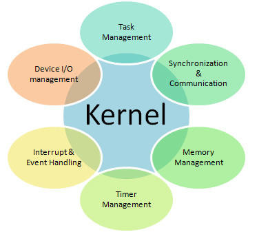

# 2. Kernel

El nucleo (o Kernel) es la parte central y mas importante de un sistema operativo.
Es el componente que se comunica directamente con el hardware de la computadora y gestiona los recursos del sistema, como la CPU, la memoria y los dispositivos de entrada/salida. El nucleo actua como un intermediario entre aplicaciones de software y el hardware, proporcionando las interfaces necesarios para que los programas puedan funcionar correctamente sin tener que lidiar directamente con los detalles del hardware.

## Funciones de Kernel

1. **Gestion de Procesos**

    * Creacion, planificacion y terminacion de procesos.
    * Asignacion de tiempo de CPU a diferentes procesos.
    
2. **Gestiona de la Memoria**

    * Asignacion y liberacion de memoria.
    * Gestion de la memoria virtual.
    * Control de acceso a la memoria.
    
3. **Gestion de Dispositivos**
    
    * Control de dispositivos de hardware como discos, impresoras y redes.
    * Interaccion con los controladores de dispositivos.
    
4. **Sistema de Archivos**

    * Gestion y organizacion de archivos en dispositivos de almacenamiento.
    * Proporciona una interfaz para leer y escribir datos en el sistema de archivos.
    
5. **Seguridad y Control de Acceso**

    * Implemetnacion de mecanismos de seguridad y permisos.
    * Control de acceso a recursos del sistema.
    
6. **Comunicacion entre Procesos**
    
    * Provision de mecanismos para que los procesos se comuniquen entre si y sincronicen sus acciones.
    

## Tipos de Kernel

1. **Kernel Monolitico**
    
    * Todos los servicios del sistema operativo (gestion de memoria, gestion de procesos, controladores de dispositivos, etc.) se ejecutan en modo kernel.
    
    * Ejemplos:
        * Linux
        * BSD
        * AIX
    
    * **Ventajas** 
        * Alta eficiencia y rendimiento.
        * Menos sobrecarga de contexto entre los modulos del nucleo.
       
    * **Desventajas**
        * Tamaño grande.
        * Dificil de mantener y depurar.
        
2. **MicroKernel**

    * Solo las funciones mas basicas se ejecutan en modo kernel (gestion de memoria, planificacion de procesos, etc.).
    * Otros servicios (Controladores de dispositivos, sistema de archivos, etc).
    * Ejemplos:
        * Minix.
        * QNX
        * Mach
       
    * **Ventajas**
        * Menos codigo en modo kernel, lo que reduce la posibilidad de errores.
        * Mejor modularidad y flexibilidad.    
    
    * **Desventajas**
        * Mayor sobrecarga debido a la comunicacion entre el espacio de usuario y el espacio del kernel.
        * Potencialmente menor rendimiento.
        
3. **Kernel Hibrido**
    * Combina elementos de los kernels monoliticos y microkernels.
    * Intenta aprovechar las ventajas de ambos modelos.
    * Ejemplos:
        * Windos NT.
        * XNU (Utilizando en macOS e IOS). 
        
     * **Ventajas**
        * Mayor flexibilidad y modularidad que los kernels monoliticos,
        * Mejor rendimiento que los microkernels puros.
        
    * **Desventajas**
        * Complejidad en la implementacion y el diseño.
        * Potencialmente puede heredar las desventajas de ambos modelos.
        
4. **ExoKernel**
    
    * El nucleo es extremadamente minimalista y delega la mayor parte de las funciones a las aplicaciones de usuario.
    * Permite a las aplicaciones manejar recursos de hardware directamente.
    * Ejemplos:
        * Exokernel (de MIT)
        
    * **Ventajas**
        * Maximo rendimiento y eficiencia.
        * Alta flexibilidad para aplicaciones especializadas.
        
    * **Desventajas**
        * Complejidad en la escritura de aplicaciones
        * Menos control y seguridad del sistema operativo.
        
## Funcionamiento

El Kernel se ejecuta en modo priviliegiado de la CPU conocido como modo kernel, que tiene acceso completo a todos los recursos del sistema

1. **Inicializacion**
    
    * Al arrancar la computadora, el Kernel se carga en la memoria y se inicia.
    * Realiza la inicializacion del hardware y de los subsistemas del sistema operativo.
    
2. **Gestion de Recursos**

    * El kernel asigna recursos del sisteam a las aplicaciones y gestiona su uso.
    * Proporciona servicios y llamadas al sistema para que las aplicaciones solicitan recursos.
    
3. **Interrupciones y Exepciones**

    * Maneja interrupciones de hardware (como señales de dispositivos) y excepciones (errores del procesador).
    * Actua rapidamente para atender estos eventos y matener el sistema funcionando sin problemas.
    
4. **Conmutacion de Contexto**
    
    * Cambia entre diferentes proceso para que cada uno pueda ejecutarse en su turno.
    * Asegura que todos los procesos reciban tiempo de CPU segun sea necesario.
    
5. **Interfaz de Sistema**
    
    * Proporciona llamadas al sistema que las aplicaciones pueden usar para interactuar con el hardware y otros recursos.
    * Actua como una capa de abstraccion entre el hardware y el software de nivel superior.
    

# Kernel Linux

El Kernel de Linux es el nucleo del sistema operativo Linux, desarrollado por Linus Torvalds en 1991 y mantenido por una comunidad de desarroladores a nivel mundial. Es un kernel monolitico, lo que significa que todas las funciones basicas del sistema, como la gestion de procesos, la gestion de memoria, el manejo de dispositvos y las operaciones del sistema de archivos, estan integradas en una sola imagen de kernel que se ejecuta en el espacio del kernel.

## Caracteristicas del Kernel de Linux

1. **Monolitico**

    * El kernel de Linux incluye todo el codigo necesario para la gestion del sistema, ejecutandose en un unico espacio de memoria.
    * Aunque es monolitico, es modularm permitiendo cargar y descargar modulos del kernel en tiempo de ejecucion.
    
2. **Modularidad**

    * Los modulos del kernel son partes del kernel que puede ser cargadas y descargadas dinamicamente.
    
    * Permitiendo las funcionalidades del kernel sin necesidad de reiniciar el sistema.
    
    * Los modulos pueden incluir controladores de dispositivos, sistemas de archivos , protocolos de red, etc.
    
    * Comandos Utilies:
    
           * `lsmod` Listar los modulos cargados.
           * `modprobe` Cargar un modulo.
           * `rmmod` Descargar un modulo.
           
3. **Soporte Extensivo de Hardware**
    
    * Compatible con un amplia variedad de hardware, desde servidores y computadores de escritorio hasta dispositivos embebidos.
    * Actualizaciones constantes para añadir soporte para nuevos dispositivos y tecnologias.
    
4. **Gestion de Procesos**

    * Planificacion de procesos multitarea, multiproceso y multihilo.
    * Soporte para la creacion, terminacion y sincronizacion de procesos.
    * Mecanismos de comunicacion entre procesos (IPC), como pipes, colas de mensajes y memoria compartida.
    
5. **Gestion de Memoria**

    * Manejo de memoria virtual, paginacion y segmentacion.
    * Soporte para memoria compartida y memoria intercambiable (swap).
    * Sistemas de administracion de memoria para prevenir fugas y optimizar el uso de la memoria.
    
6. **Sistemas de Archivos**

    * Soporte para multiples sistemas de archivos.
    * Capacidad de montar y desmontar sistemas de archivos en tiempo de ejecucion 
    * Funcionalidades avanzadas como journalingm snapshots y RAID.
    
7. **Redes**

    * Soporte par aun amplia gama de protocolos de red y hardware de red.
    * Capacidades avanzadas de red como firewalls, NAT, VPN, y balanceo de carga.
    * Herramientas y servicios de red como `ip` , `netstat` , `ifconfig` y `iptables`.
    
8. **Seguridad**
    
    * Mecanismos de control de acceso y permisos.
    * Modulos de seguridad como SELinux y AppArmor.
    * Soporte para autenticacion y cifrado de datos,
    
9. **Portabilidad**

    * Diseño para ser altamente portatil y ha sido portado a numerosas arquitecturas de hardware, incluyendo x86m ARM, MIPS, PowerPC, entre otros.
    
## Funcionamiento del Kernel de Linux

1. **Inicializacion**

    * Durante el arranque del sistema, el bootloader (como GRUB) carga el kernel en la memoria ram.
    
    * El kernel incializa los subsistemas basico, como la gestion de memoria y los controladores de dispositivos.
   
     * Monta el sistema de archivos raiz y tranfiere el control al proceso de inicializacion del sistema (`init` o `systemd`).
   
2. **Gestion de Procesos**

    * El kernel gestiona la creacion, ejecucion y terminacion de procesos.
    * Utiliza algoritmos de planificacion para asignar tiempo de CPU a los procesos.
    * Proporciona mecanismos de comunicacion y sincronizacion entre procesos.
    
3. **Gestion de Memoria**

    * El kernel administra la memoria fisica y virtual del sistema.
    * Asigna y libera memoria para procesos y subsistemas.
    * Implementa tecnicas de paginacion y swapping para optimizar el uso de la memoria.
    
4. **Manejo de Dispostivos**

    * El kernel maneja todas las operaciones relacionadas con el sistema de archivos, como la lectura y escritura de datos.
    
    * Soporta multiples tipos de sistemas de archivos y permite montar/desmontar sistemas de archivos en tiempo de ejecucion. 
    
5. **Distema de Archivos**

    * El kernel maneja todas las operaciones relacionadas con el sistema de archivos, como la lectura y escritura de datos.
    * Soporta multiples tipos de sistemas de archivos y permite montar/desmontar sistemas de archivos en tiempo de ejecucion.
    
6. **Seguridad y Control de Acceso**

    * El kernel implementa politicas de seguridad y control de acceso para proteger los recursos del sistema.
    * Administra los permisos de archivo y las lista de control de acceso (ACL).
    * Soporta modulos de seguridad adicionales para fortalecer la seguridad del sistema.
    
7. **Redes**

    * El kernel maneja todas las operaciones de red, incluyendo la configuracion de intefaces de red y gestion de conexiones.
    * Implementa protocolos de red y proporciona servicios de red basicos.
    
# Desarrollo y Actualizaciones del Kernel de Linux

* **Codigo Abierto** 
    
    * El kernel de Linux es de codigo abierto y se desarrolla de manera colaborativa por una comunidad global de desarrolladores.
    * El codigo fuente esta disponible en GitHub y sse genstiona mediante el sistema de control de versiones Git.
    
* **Contribuciones y Mantenimiento**

    * Cualquiera puede contribuir el desarrollo del kernel, y las contribuciones son revisadas y aceptadas por los mantenedores del kernel,
    * Linus Torvalds y otros matenedores senior supervisan el desarrollo y la integracion de cambios en el kernel principal.
    
* **Liberacion**

    * El kernel de Linux tiene un cliclo de liberacion regular, con nuevas versiones lanzadas cada pocos meses.
    * Las versiones LTS (Long-Term Support) reciben soporte y actualizaciones durante varios años, proporcionando estabilidad y seguridad a largo plazo.
    
