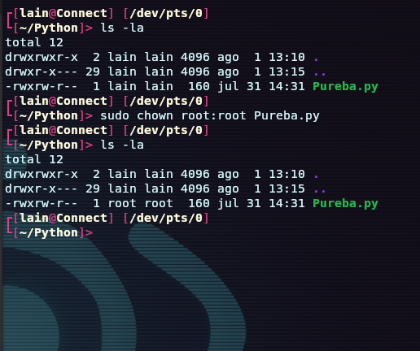

# 3. Sistema de Archivos

Un sistema de archivos (filesystem) es una estructura y metod que utiliza un sistema operativo para organizar, almacenar, recuperar y gestionar los datos en un dispositivo de almacenamiento, como un disco duro, una unidad SSD. una memoria USB, etc. Es esencial para el funcionamiento de cualquier sistema operativo ya que permite a los usuarios y aplicaciones acceder y gestionar archivos de manera eficiente y coherente.

  
## Componetes del Sistema de Archivos

1. **Bloque de Datos**
    
    * Los datos se almacenan en bloques de tamaño fijo. Estos bloques son unidades minimas de almacenamiento en el disco.
    
2. **Inodos**

    * Un inodo (Index nodo) es una estructura de datos que almacena informacion sobre un  archivo o un directorio, como su tamaño, permisos, propietario, marcas de tiempo y la ubicacion de los bloques de datos en el disco.
    
3. **Directorio**
    
    * Los directorios son estructuras que contiene referencias a otros archivos y directorios. En la mayoria de los sistemas de archivos, un directorio es simplemete un lista de nombres de archivos y sus respectivos inodos.
    
4. **Superbloque**

    * El superbloque contien informacion sobre el sistema de archivos en su totalidad, como el tamaño del sistema de archivos, el numero de inodos y bloques, y las ubicaciones de la estructura clave.
    
5. **Journaling** (en sisteams de archivos con diario)
    
    * Un sistema de journaling registra las operaciones pendientes en un diario antes de aplicarlas al sistema de archivos. Esto ayuda a recuperar el sistema en caso de fallos inesperados.
    
## Tipos de Sistema de Archivos

1. **FAT (File Allocation Table)**

    * Utilizando en sistemas antiguos y dispositivos de almacenamiento extraible.
    * Ejemplos FAT16,FAT32,exFAT.
    
2. **NTFS (New Technology File System)**
    
    * Sistema de archivos utilizado por Windows.
    * Soporta caracteristicas avanzadas como permisos, cifrado , y journaling.
    
3. **Ext (Extended File System)**
    
    * Sistema de archivos estandar en Linux
    * Ejemplos: Ext2, Ext3, Ext4 (Con journaling).
    
4. **XFS**

    * Sistema de archivos de alto rendimiento utilizado en Linux.
    * Soporta grandes volumenes y archivos, y tiene capacidades avanzadas de journaling.
    
6. **APFS (Apple File System)**}

    * Sistema de archivos moderno utilizando por Apple en macOS y iOS.
    * Optimizado para SSDs y tiene caracteristicas avanzadas como snapshost y cifrado.
    
7. **Btrfs (B-tree File System)**

    * Sistema de archivos avanzado en Linux con caracteristicas como snapshots, RAID y compresion.
    

## Funcionamiento

1. **Creacion**
    
    * Al formatear un dispositivo de almacenamiento, se crea un sistema de archivos en el dispositivo.
    * El proceso de formateo configura las estructuras necesarios, como el superbloque, inodos y bloques de datos,
    
2. **Gestion de Archivos y Directorios**

    * Los archivos se crean, eliminan y modificacn a traved de la operaciones del sistema de archivos.
    * Los directorios actuan como contenedores para organizar los archivos.
    
3. **Almacenamiento y Recuperacion de Datos**

    * Cuando se escribe un archivo, el sistema de archivos asigna bloques de datso en el disco y actualiza los inodos y las estructuras del directorio.
    * Para leer un archivo, el sistema de archivos localiza los inodos y recupera los bloques de datos correspondientes.
    
4. **Permisos y Seguridad**
    
    * Los sistemas de archivos gestionan los permisos de acceso a archivos y directorios, permitiendo o denegando el acceso segun la configuracon establecida.
    
5. **Integridad y Desmontaje**

    * Para acceder a un sistema de archivos, se debe montar en un punto de montaje. Este proceso hace que el sistema de archivos sea accesible desde un directorio especifico en el sistema operativo.
    * Desmontar el sistema de archivos asegura que todos los datos pendientes se escriban en el disco y que el sisteam de archivos se cierre de manera segura.
   
# Sistema de Archivos en Linux


El sistema de archivos en Linus es una estructura jerarquica que organiza y almacena archivos y directorios en dispositivos de almacenamiento, La estructura comenza en el directorio raiz ( / ) y se extiende hacia abajo en una serie de subdirectorios.

## Componentes del Sistema de Archivos en Linux

1. **Directorio Raiz ( / )**

    * Es el punto de partida de la estructura del sistema de archivos .
    * Todos los demas archivos y directoros se encuentran dentro de este directorio.

2. **Directorios Estandar**    

    * `/bin` Contiene binarios esenciales de sistema que esta disponibles para todos los usuarios. Estos son comandos basicos     necesarios para la operacion del sistema.

    * `/boot` Contiene los archivos necesarios para el arraque del sistema, como el cargador de arranque y el kernel de Linux.

    * `/dev` Contien archivos de dispositivos. En Linux, los dispositivos se representa como archivos y este directorio referencia a todos los dispositivos del sistema.

    * `/etc` Contiene archivos de configurarion del sistema y scripts de inicio. Es un directorio crucial para la configuracion de los servicios del sistema.

    * `/home` Contiene los directorios personales de los usuarios. Cada usuario tiene un subdirectiro dentro de `/home`, donde puede almacenar sus archivos y configuraciones personales.

    * `/lib` Contien bibliotecas esenciales compartidas por los binaris en `/bin` y `/sbin`.

    * `/media` Punto de montaje para dispositivos extraibles, como CD-ROMs y USBs.

    * `/mnt`Punto de motaje temporal para sistemas de archivos motandos manualmente.

    * `/opt` Utilizado par ainstalar software opcional que no viene incluido en el sistema operativos. Muchas aplicaciones de terceros se instala aqui,

    * `/proc` Un sistema de archivos virtual que contiene informacion sobre los proceso del sistema y otra infromacion del sistema.

    * `/root` Directorio personal del usuario root (superusuario).

    * `/run` Contien datos de tiempo de ejecucion que peude ser utilizados por procesos del sistema desde que se arranca el sistema.

    * `/sbin` Contiene binarios esenciales para la administracion del sistema y el mantenimiento del mismo. Estos comandos generalmente son ejecutados por el superusuario,

    * `/srv` Contiene datos para servicios proporcionados por el sistema, como servidores web y FTP.

    * `tmp` Contien archibos temporales que peuden ser creados por cualquier usuario o aplicacion. El contenido de este directorio se borra generalmente en cada reinicio del sistema.

    * `/usr` Contiene aplicaciones y archivos del usuario. Este es uno de los directorios mas grande y contien subdirectorios como `/usr/bin` (binarios de usuario), `/usr/lib` (biblioteca de usuario) y  `/usr/share` (archvos compartidos).

    * `/var` Contei archivos variable, como registros del sistema (logs), archivos de correo, datos de base de datos, etc


## Sistemas de Archivos Comunes en Linux

1. **Ext (Extended File System)**

    * **Ext2** Sistema de archivos sin journaling, adecuado para dispositivos de almacenamiento menores.
    * **Ext3** Similar a Ext2, pero con journaling, lo que mejora la recuperacion tras fallos.
    * **Ext4** Version mejorada de Ext3 con soporte para volumenes mas grande y caracteriticas adicionales como retraso en la asignacion.
    
2. **XFS**

    * Sistema de archivos de alto rendimiento adecuado para grandes volumenes y archivos. Ofrece caracteristicas avanzadas de journaling,
    
3. **Btrfs (B-tree File System)**

    * Sistema de archivos moderno con carancteristicas como snapshots, compresion y RAID integrado.
    
4. **F2FS (Flash-Friendly File System)**

    * Diseñado especificamente para dispositivos de almacenamiento vasados en flash, como SSDs.
    
## Montaje de Sistemas de Archivos

En linux, los sistemas de archivos deben ser montados en un punto de montaje para ser accesibles. Este proceso asocia un sistema de archivos con un directorio especifico en la jerarquia.

* **Comando:** `mount`

    * Utilizado para montar sistemas de archivos manualmente.
    
```bash

sudo mount /dev/sdX1 /mnt

```

* `etc/fstab`

    * Archivo de configuracion que especifica los sistemas de archivos que deben montarse automaticamente al inicio del sistema.
    
```bash

/dev/sdX1 /mnt ext4 defaults 0 2

```

* **Comando:** `umount`

    * Utilizado para desmontar sistemas de archivos
    

```bash

sudo umount /mnt


```

## Permisos y Seguridad 

Linux utiliza un modelo de permisos basado en usuarios y grupos para controlar el acceso a los archivos y directorios. Cada archivo tiene permisos para el propietario, el grupo y otros (Usuarios no pertenecientes al grupo)

* **Permisos**

    * Lectura `r` , Escritura `w` , Ejecucion `x`.
    * Representados en forma simbolica (`rwxr-xr-x`) o numerica (`755`).
    
* **Comandos de Permisos**

    * `chmod` cambia los permisos de un archivo o directorio.
    * Con el simbolo `+` agregamos permisos y con el  `-` quitamos.
    * Le podemos expesifica al grupo en que afectan los permisos ejemplo `u` (user). 
    
```bash

sudo chmod  u+x Pureba.py

```


* `chown` Cambia el propietario de un archivo o directorio.

```bash

sudo chown root:root Pureba.py
```




* `chgrp` Cambia el grupo propietario de un archivo o directorio.

```bash

sudo chgrp lain Pureba.py
```


* **Integridad y Recuperacion**

1. **Journaling**

    * Muchos sistemas de archivos en Linux, como Ext3, Ext4 y XFS, utilizan journaling para mejorar la integridad del sistema. Esto implica registrar las operaciones pendientes antes de aplicarlas, lo que permite la recuperacion en caso de fallos.
    
2. **Herramientas de Recuperacion**

    * **fsck (File System Check)** Herramienta utilizada para verificar y reparar sistemas de archivos.
    
```bash

sudo fsck /dev/sdX1

```


