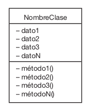
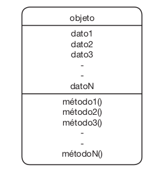
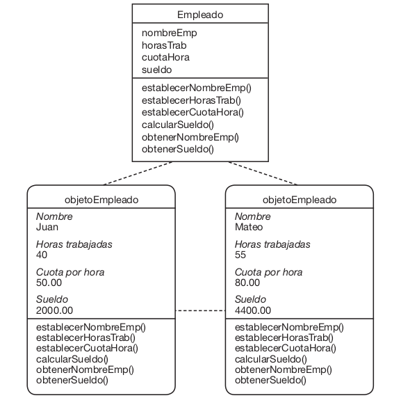

# Clase y Componetes


## <span style="color:#2168b0">Clases</span> 

* Una clase es un **molde** o **plantilla** que define las caracteristicas y comportameintos comunes de un conjunto de objetos. En programacion orientada a objetos  <i><span style="color:#2168b0">(POO)</span></i>, una clase actua como un modelo para crear instancias  <i><span style="color:#2168b0">(Objetos)</span></i>. Esencialmete. encapsulan datos  <i><span style="color:#2168b0">(Atributos)</span></i> y funcionalidades  <i><span style="color:#2168b0">(Metodos)</span></i> relacionados

* **¿Que contiene?**

    1. **Atributos** Las propiedades o datos que describen las caracteristicas del objeto.
    2. **Metodos** Las acciones o comportamiento que un objeto puede realizar.
 
* **Ejemplo** Si Animal es una clase, sus atrivutos pueden ser `color` y `especie`, y sus metodos podrian ser `comer()` y `dormir()`.



## <span style="color:#2168b0">Atributos</span>

* Un atributo es una **Variable dentro de una clase** que define una propiedad o caracteristica del objeto. Especificamente, los atributos contiene la informacion que describe el estado del objeto.

* **Ejemplo** En un objeto de la clase Coche, los atributos pueden ser `marca`, `modelo`,`velocidad`.


## <span style="color:#2168b0">Metodos</span>
 
* Un metodo es una **funcion dentro de una clase** que define un comportamiento del objeto. Es decir, los métodos representa las acciones que un objeto puede realizar o responder.

* **Ejemplo** Para un objeto de la clase **Coche**, un metod puede ser `acelerar()` o `detener()`.

    ### Setters y Getters
 
    * Los **setters** y **getters** son métodos de acceso que se utilizan en la programacion orientada a objetos <i><span style="color:#2168b0">(Poo)</span></i>  para **establecer**  <i><span style="color:#2168b0">(set)</span></i> y **obtener** <i><span style="color:#2168b0">(get)</span></i>  el valor de los atributos de una clase. Estos metodos encapsulan el acceso a los datos, promoviendo el principio de **ocultacion de la información**  <i><span style="color:#2168b0">(Encapsulacion)</span></i>. 

        #### <span style="color:#cc0404">Setters</span>
    
        * Un **setter** es un metodo que se utiliza para **asignar un valor** a un atributo.

        * Pemite modificar el valor de un atributo de manera controlada.
    
        * **Caracteristicas**
        
            * Toma un argumento (el nuevo valor).
            * Opcionalmente, valida o transforman el valor antes de asignarlo.
       
        #### <span style="color:#cc0404">Getters</span>

        *  Un **getter** es un metodo que se utiliza para **obtener el valor** de un atributo.

        * Permite acceder al valor de un atributo de manera segura.
    
        * **Caracteristicas**
    
            * Devuelve el valor del atributo.
            * Puede realizar calculos o transformaciones antes de devolverlo.
            
    ### <span style="color:#f39921">Constructor</span>
    
    * Un **Constructor** es un **metodo especial** en una clase que se utiliza para **inicializar un objeto** cunado se crea una instancia de la clase. Su propocito principal es asignar valores iniciales a los atributos del objeto y preparar el objeto para su uso. Es la primera pieza de codigo que se ejecuta al crear un objeto.
    
        #### <span style="color:#cc0404">Caracteristicas</span>
         
        1. **Automático** Se ejecuta automaticamente en el momento en que se intancia un objeto.
     
        2. **No tiene valor de retorno** En la mayoria de lenguajes, como java, no devuelve valores  (ni siquiera `void`). En Python , tampoco devuleve valores explicitamente, aunque siempre retorna el objeto creado.
        3. **Nombre Especifico**
            * En **Java**, el constructor tiene el mismo nombre que la clase.
            * En **Python**, se define con el metodo especial `__init__`.
         4. **Sobrecarga (Opcional)** Algunos lenguajes, como Java, permiten tener varios constructores con diferentes numeros o tipos de parametros **sobrecarga de constructores**.
         
         #### <span style="color:#cc0404">Tipos de Constructores</span>
            
        1. **Constructores predeterminado (default)**
               
            * Es un constructor sin parametros.
            * Se utiliza para crear un objeto con valores iniciales genericos o nulos.
            * Algunos lenguajes, como Java, proporciona un constructor predeterminado si no defines ninguno explicitamente.
          
        2. **Constructor parametrizado**
        
            * Es un constructor que recibe uno o mas parametros.
            * Permite asignar valores personalizados a los atributos durante la creacion del objeto.
                  

## <span style="color:#2168b0">Objetos</span>

* Un **objeto** es una **entidad individual** creada a partir de una clase en la programacion orientada a objetos (Poo). Representa una **instancia especifica** de una clase y esta compuesta por:

    1. **Atributos** Los datos o propiedades que describen el estado del objeto.
   
    2. **Metodos** Las funciones o acciones que el objeto puede realizar.
    



## <span style="color:#2168b0">Relación entre: Clase y Objeto</span>

* **Clase** Es un molde o plantilla que define las características <i><span style="color:#2168b0">(atributos)</span></i>  y comportamientos  <i><span style="color:#2168b0">(métodos)</span></i> comunes a un conjunto de objetos.

* **Objeto** Es una instancia concreta de la clase, con atributos que contienen valores específicos.


 
    
## <span style="color:#2168b0">Relacion entre: Clase, Atributo y Metodo</span>

* Una **clase** es el contenedor o definicion principal.
* Los **Atributos** define las caracteristicas o datos del objeto creado a partir de esa clase.
* Los **metodos** permiten interactuar con los datos y realizar operaciones o acciones sobre ellos.


## <span style="color:#2168b0">Ejemplo:</span> <span style="color:#cc0404">Java</span>

```java
// Clase Persona con getters y setters
public class Persona {
    // Atributos privados
    private String nombre;
    private int edad;

    // Constructor
    public Persona(String nombre, int edad) {
        this.nombre = nombre;
        this.edad = edad;
    }

    // Getter para 'nombre'
    public String getNombre() {
        return nombre;
    }

    // Setter para 'nombre'
    public void setNombre(String nombre) {
        this.nombre = nombre;
    }

    // Getter para 'edad'
    public int getEdad() {
        return edad;
    }

    // Setter para 'edad'
    public void setEdad(int edad) {
        if (edad >= 0) { // Validación
            this.edad = edad;
        } else {
            System.out.println("La edad no puede ser negativa.");
        }
    }
}

// Clase principal para probar
public class Main {
    public static void main(String[] args) {
        Persona persona = new Persona("Juan", 25);

        // Usar getters
        System.out.println("Nombre: " + persona.getNombre());
        System.out.println("Edad: " + persona.getEdad());

        // Usar setters
        persona.setNombre("Carlos");
        persona.setEdad(30);
        persona.setEdad(-5); // Intento de asignar una edad inválida

        System.out.println("Nuevo nombre: " + persona.getNombre());
        System.out.println("Nueva edad: " + persona.getEdad());
    }
}
```

## <span style="color:#2168b0">Ejemplo:</span> <span style="color:#2caa33">Python</span>


```python
# Clase Persona con getters y setters
class Persona:
    def __init__(self, nombre, edad):
        self._nombre = nombre  # Atributo privado (convención)
        self._edad = edad

    # Getter para 'nombre'
    @property
    def nombre(self):
        return self._nombre

    # Setter para 'nombre'
    @nombre.setter
    def nombre(self, nuevo_nombre):
        self._nombre = nuevo_nombre

    # Getter para 'edad'
    @property
    def edad(self):
        return self._edad

    # Setter para 'edad'
    @edad.setter
    def edad(self, nueva_edad):
        if nueva_edad >= 0:  # Validación
            self._edad = nueva_edad
        else:
            print("La edad no puede ser negativa.")

# Uso de la clase
if __name__ == "__main__":
    persona = Persona("Juan", 25)

    # Usar getters
    print(f"Nombre: {persona.nombre}")
    print(f"Edad: {persona.edad}")

    # Usar setters
    persona.nombre = "Carlos"
    persona.edad = 30
    persona.edad = -5  # Intento de asignar una edad inválida

    print(f"Nuevo nombre: {persona.nombre}")
    print(f"Nueva edad: {persona.edad}")
```