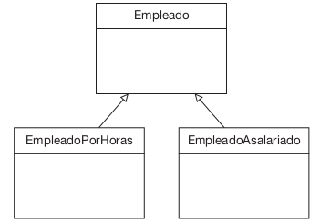

# Herencia

* La **herencia** es uno de los principios fundamentales de la **Programacion Orientada a Objetos**. Es un mecanismo que permite a una clase (llamada **clase hija**, **subclase** o **clase derivada**) adquirir las propiedades y comportamientos (atributos y métodos) de otra clase (llamada **clase padre**, **superclase**, o **clase base**).

* Con la herencia, se puede reutilizar y extender las caracteristicas de una clase existente en nuevas clases, promoviendo el **reuso de código** y la creación de jerarquías de clases.

    


    ## <span style="color:#2168b0">Caracteristicas de la Herencia</span>
    
    1. **Reutilizacion de codigo**
        
        * Una subclase puede heredar atributos y métodos de una superclase evitando la necesidad de duplicar código.
        
    2. **Jerarquía de clases** 
    
        * Se puede crear una estructura jerárquica donde las clases mas generales se encuentran en la parte superior y las más especificas derivan de ellas.
        
    3. **Especializacíon**
    
        * Las subclases puede agregar nuevos atributos y metodos o sobreescribir los heredados para especializar el comportamiento.
        
    4. **Polimorfismo**
    
        * A través de la herencia, las subclases puede ser tratadas como objetos de la superclase, permitiendo un diseño más flexible.
        
    5. **Acceso controlado**
    
        * Atributos y métodos heredados pueden ser accesibles dependiendo de su modificador de acceso ( `public`, `protected`,  `private`)
        
    6. **Relacion**
    
        * La herencia modela una relacion lógica entre clases. Por ejemplo, un **Perro** es un **Animal**.
        
    ## <span style="color:#2168b0">Uso</span>
    
    1. **Reutilizacion de codigo**
    
        * Permite crear nuevas clases basadas en clases existentes, reduccioendo la redundancia y facilitando el mantenimiento
        
    2. **Facilitar Extensibilidad**
    
        * Nuevas funcionalidades pueden ser añadidas a una subclase sin modificar la clase padre.
        
    3. **Organizacion**
    
        * Promueve la creación de jerarquías claras y lógicas que represetan las realciones entre entidades.
        
    4. **Polimorfismo**
    
        * Facilita la creación de programas flexibles y escalabes mediante la generalizacion de tipos.
        
    5. **Consistencia**
    
        * Garantiza que las subclases hereden el comportamiento esperado de la superclase, promoviendo la coherencia.
        

    ## <span style="color:#2168b0">Funcionamiento</span>
    
    1. Una **subclase** hereda de una **superclase** utilizando pablaras clave especificas:
    
        * En **Java** se usa `extends`.
        * En **Python** se coloca la clase padre entre paréntesis al definir la subclase.
        
    2. La subclase adquiere todos los atributos y métodos de la superclase, pero puede:
    
        * **Sobrescribir (override)** Redefinir un método de la superclase para adaptarlo a sus necesidades.
        * **Ampliar** Añadir nuevos atributos y métodos
        
    3. Una subclase puede acceder a los metodos y atributos de la super clase mediante el uso de la palabra clave `super`.
    
    ## <span style="color:#cc0404">Java</span>

    ```java
    // Clase padre
    class Animal {
        protected String nombre;

        public Animal(String nombre) {
            this.nombre = nombre;
        }

        public void comer() {
            System.out.println(nombre + " está comiendo.");
        }
    }

    // Clase hija
    class Perro extends Animal {
        private String raza;

        public Perro(String nombre, String raza) {
            super(nombre); // Llamar al constructor de la superclase
            this.raza = raza;
        }

        public void ladrar() {
            System.out.println(nombre + " está ladrando.");
        }

        @Override
        public void comer() {
            System.out.println(nombre + " está comiendo croquetas.");
        }
    }

    // Clase principal
    public class Main {
        public static void main(String[] args) {
            // Crear un objeto de la clase Perro
            Perro miPerro = new Perro("Rex", "Pastor Alemán");
            
            // Llamar a métodos heredados y propios
            miPerro.comer();  // Sobrescrito
            miPerro.ladrar(); // Propio de Perro
        }
    }
    ```
    
    ## <span style="color:#2caa33">Python</span>
    

    ```python
    # Clase padre
    class Animal:
        def __init__(self, nombre):
            self.nombre = nombre

        def comer(self):
            print(f"{self.nombre} está comiendo.")

    # Clase hija
    class Perro(Animal):
        def __init__(self, nombre, raza):
            super().__init__(nombre)  # Llamar al constructor de la clase padre
            self.raza = raza

        def ladrar(self):
            print(f"{self.nombre} está ladrando.")

        def comer(self):
            print(f"{self.nombre} está comiendo croquetas.")  # Sobrescribir método

    # Crear un objeto de la clase Perro
    mi_perro = Perro("Rex", "Pastor Alemán")

    # Llamar a métodos heredados y propios
    mi_perro.comer()  # Sobrescrito
    mi_perro.ladrar() # Propio de Perro
    ```


