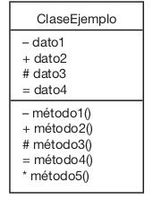

# Encapsulamiento

* El **Encapsulamiento** es uno de los **pilares fundamentales de la programacion orientada a objetos**. Consiste en **restringir el acceso directo** a los atributos y metodos de una clase, permitiendo que sean manipulados unicamente a traves de **metodos controlados** *(como `getters` y `setters`)*. Esto asegura que los datos esten protegidos contra cambios inesperados o no deseados desde el exterior de la clase.

## Caracteristicas

1. **Ocultacion de datos**

    * Los atributos de una clase se declaran como **privados** para evitar que sean accesibles o modificados directamente desde fuera de la clase.
   
2. **Control de Acceso**

    * El acceso a los atributos y metodos estan regulado mediante **Modificadores de acceso**
        
        * **Privado** Solo accesible dentro de la misma clase.
        * **Protegido** Accesible dentro de la clase y sus subclases.
        * **Publico** Acessible desde cualquier lugar.
        
3. **Uso de getters y setters**
        
      * Se utilizan metodos publicos para **leer** y **modificar** los atributos privados, permitiendo agregar validaciones o restricciones.
        
4. **Seguridad**
    
     * Evita que los atributos sean alterados directamente, lo que ayuda a prevenir errores o inconsistencias en el estado del objeto.
      
5. **Mantenimiento y flexibilidad**
    
      * Si los atributos cambian en el futuro, solo es necesario modificar los metodos de acceso sin afectar al resto del codigo que utiliza la clase.
      

## Modificadores de acceso Visibilidad

* Con los simbolos `- + # = *` se idnica la visibilidad que tendra cada atributo o metodo. A estos se les conoce como modificadores de acceso:
    * Privado (-)
    * Protegido (#)
    * Publico (+)
    * Estatico (=)
    * Abstracto (*)
  
* **Visibilidad de los atributos**

    1. **- Privado (Private)**
        
        * Los atributos que se declaran como privados solo pueden ser vistos y utilizados por metodos de la misma clase. Por defecto (default), los datos son privados. 
       
    2. **# Protegido (Protected)**
   
        * Los atributos que se declaran como protegidos pueden ser vistos y utilizados por metodos de la misma clase y por metodos de subclases derivada de la calse donde estan declarados.
       
    3. **+ Publico (Public)**
   
        * Los atributos que se declaran como publicos pueden ser vistos y utilizado tanto por metodos de la misma clase como por metodos de otras clases.
        
    4. **= Estatico (Static)**
    
        * Los atributos que se declaran como estaticos son unicos para toda la clase, es decir, no pertenecen a ninguna instancia (objeto) de la clase, pero pueden ser vistos y utilizados por todas las instancias de la clase.
        

* **Visibilidad de los metodos** 
      
    1. **- Privado (Private)**
        
        * Los metodos que se declaran como privados solo puede ser visto y utilizados por metodos de la misma clase.
       
    2. **# Protegido (Protected)**
   
        * Los metodos que se declaran como protegidos pueden ser vistos y utilizados por metodos de la misma clase y por metodos de subclases derivadas de la clase donde estan declarados.
       
    3. **+ Publico (Public)**
   
        * Los metodos que se declaran como publicos pueden ser vistos y utilizados tanto por metodos de la misma clase como por metodos de otras clases. Por (default), los metodos son publicos.
        
    4. **= Estatico (Static)**
    
        * Los metodos que se declaran como estaticos son unicos para toda la clase, es decir, no perteneces a ninguna instancia (objeto) de la clase, pero puede ser vistos y utilizados por metodos de todas las instancias de la clase.
       
    5. **\* Abstracto (Abstract)**
   
        * Los metodos que se declaran como abstractos no tiene implementacion, por tanto, deben ser implementados en subclases.
        

> Por defecto, los atributos son privados, es decir si no se les define su visibilidad mediante alguno de los modificadores de acceso

> Por defecto los metodos son publicos es decir si no se les define visibilidad mediante alguno de los modificadores de acceso.
  

## ¿Para que sirve el Encapsulamiento?

1. **Proteccion de datos**

    * Evita que los atributos sean modificados de manera incontrolada desde fuera de la clase, protegiendo la integridad del objeto.
    
2. **Modularidad**

    * Permite organizar el codigo en componentes mas manejables y faciles de entender.
   
3. **Abstraccion**

    * Esconde los detaller internos de implementacion, exponienndo unicamente lo necesario para interactura con la clase.
    
4. **Mantenimiento**

    * Si la implementacion interna de la clase cambia, el resto del programa que utiliza la calse no se ve afectado.
    
5. **Validacion**

    * Asegura que los valores asignados a los atributos sean validos, ya que los setters pueden incluir logica de validacion,
    
