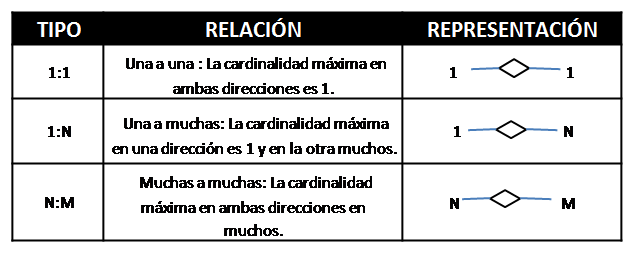
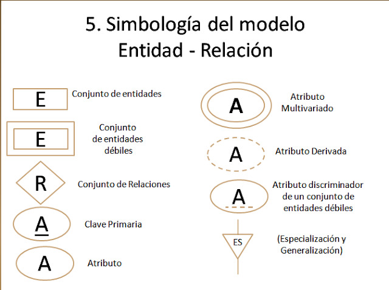

# Entidad-Relacion

El modelo entidad relacion (ER) es un metodo conceptual para modelar y representar la estrucutra de datos de un sistama de informacion. Este modelo se utiliza principalmente en la fase de diseño de bases de datos, doden se define como los datos se relacionan entre si en un sistema.

## Composicion del Modelo Entidad-Relacion ER

1. **Entidades** Representa objetos o conceptos del mundo real que tiene existencia independiente. Ejemplo : (Cliente, Producto, Factura).

2. **Atributos** Son propiedades o caracteristicas de las entidades. Ejemplis Nombre, Fecha de nacimiento , Precio.

3. **Relaciones** Definen como las entidades estan relacionas entre si. Ejemplo: Un Cliente realiza un Pedido.

4. **Claves Primarias** Atributos que identifican de manera unica a una entidad. Ejemplo: ID_Cliente.

5. **Cardinalidad** Define el numero de instancias de una entidad que puede estar asociada con una instancia de otra entidad. Ejemplos: Uno a Uno (1:1) , Uno a Muchos (1:N), Muchos a Muchos (M:N),

### Para que sirve ?

El modelo ER se utiliza para:

* Visualizar la estructura de una base de datos antes de su implementacion.
* Organizar y estandarizar la informacion que se debe almacenar.
* Facilitar la comunicacion entre los desarrolladores y los usuarios finales durante el proceso de diseño de base de datos.

### Como se Implementa

* El proceso del modelo ER implica:

    1. Identificacion de las entidades y sus atributos.
    2. Determinacion de las relaciones entre las entidades.
    3. Definicion de las claves primarias para las entidades.
    4. Especificacion de las cardinalidades de las relaciones.
    5. Conversion del modelo ER en un esquema de base de datos utilizando un sistema de gestion de base de datos (DBMS), como MySQL, PostgreSQL, etc.
    

### Tipos de Entidades

En el modelo Entidad-Relacion ER las entidades se clasifican como Entidades fuertes y Entidades debiles dependiendo de su independecio y como se relacionan con otras entidades.

#### Entidade Fuerte

Una Entidad Fuerte (Tambien llamada entidad regular o independiente) es una entidad que tiene existencia propia, es decir, no depende de ninguna otra entidad para ser identificada de manera unica.

##### Caracteristicas

 * **Clave primaria propia** Tiene una clave primaria que la identifica de forma unica.

 * **Independecia** Puede existir por si sola sin necesitar la existencia de otra entidad.

 * **Ejemplo** Una entidad  `Cliente` es una entidad fuerte porque tiene un `ID_Client` que la identifica de forma unica y no depende de otra entidad para existir.
 
#### Entidad Debil

Una **Entidad Debil** es una entidad que no tiene suficiente infromacion para ser identificada de manera unica sin depender de otra entidad. Depende de una **entidad fuerte** para su existencia.

##### Caracteristicas

* **Clave Parcial** No tiene una clave primaria completa, en lugar de eso , tiene una **clave parcial** que junto con la clave primaria de la entidad fuerte, forma su clave primaria.

* **Dependencia** Depende de una entidad fuerte para su identificacion. La relacion entre una entidad debil y su identidad fuerte se denomina **Relacion Identificadora**.

* **Rectangulo Doble** En los diagramas ER, ser representa con un rectangulo de doble borde para distingirla de una entidad fuerte.

* **Ejemplo** Una entidad `Pedido` puede ser una entidad debil si su identificacion depende del `ID_Cliente` (de la entidad `Cliente`). Por ejemplo `Pedido` puede tener un atributo `Numero de pedido` como clave parcial,  y necesita combinarlo con `ID_cliente` para ser identificada de manera unica (`ID_Cliente`, `Numero de pedido`).

#### Diferencias Clave

* **Existencia Independiente** Las entidades fuertes pueden existir por si solas, mientras que las entidades debiles depende de una entidad fuerte.

* **Identificacion** Las entidades fuertes se identifican con su propia clave primaria, mientras que las entidades debiles se identifican con una clave primaria compuesta que incluye la clave primaria de la entidad fuerte.

## Modelo Entidad-Relacion Extendido (ERR)

El modelo **Entidad-Relacion Extendido (ERR)** es una extension del modelo ER tradiccional que agrega mas capacidades para modelar datos complejos.

### Composicion del modelo Entidad-Relacion Extendido (ERR)

1. **Generalizacion** Proceso de abstraer caracteristicas comunes de varias entidades para crear una entidad mas general. Ejemplo: `Empleo` y `Cliente` Puede generalizarse a `Persona`.

2. **Especializacion** Lo opuesto a la generalizacion se descompone una entidad en sub-enitdades mas especificas. Ejemplo: `Persona` se especializa en `Empleo` y `Cliente`.

3. **Jerarquias y Herencia** Relacion padre-hijo donde las entidades hijas heredan los atributos del padre.

4. **Conjunto de Entidades y Subclases** Se puede definir subconjuntos de una entidad.

5. **Atributos compuestos y multivaluados** Atributos que pueden dividirse en subcomponentes (Compuestos) o tener multiples valores (Multivaluados).

#### Como se implementa ?

El modelo ERR se implementa de manera similar al modelo ER, con  las siguientes diferencias:

1. **Identificacion de generalizaciones/Especializaciones** y otras caracteristicas avanzadas.
2. **Incorporaciond de jerarquias y herencia** en el diseño de base de datos.
3. **Modelo mas detallado y preciso** Que permite una implementacion mas rica y con mator capacidad de representar la realidad compleja del sistema.

### Simbolos:

En el modelo Entidad-Relacion (ER) y en el modelo Entidad-Relacion Extendido (ERR) se utilizan varios simbolos graficos en los diagramas para representar diferentes componentes del modelo.

#### Simbolos en el Modelo Entidad-Relacion ER

1. **Entidades**

    * **Rectangulos** Las entidades se representa con rectangulos. EL nombre de la entidad se coloca dentro del rectangulo.
    
2. **Atributos**

    * **Ovalos** Los atributos se representa con ovalos. Los ovalos estan conectados a la entidad (Rectangulo) a la que pertenece mediante una linea.
    * **Atributo Clave Primaria** Se subraya el nombre del atributo en el ovalo.
    
3. **Relaciones**

    * **Rombos** Las relaciones entre entidades se representan como rombos. El nombre de la relacion se coloca dentro del rombo, y el rombo se conecta a las entidades involucradas mediante lineas.
    
4. **Cardinalidad**

    * **Lineas y notaciones** Se usan numeros o notaciones en las lineas que conectan el rombo de la relacion con las entidades para indicar la cardinalidad.
    

#### Simbolos en el Modelo Entidad-Relacion Extendido ERR

1. **Generalizacion / Especializacion**
    
    * **Triangulos** Los triangulos se utilizan para representar jerarquias en la generalizacion y especializacion. El triangulo conecta una entidad padre con sus subentidades.
    
2. **Entidades Debiles**

    * **Rectangulo Doble** Las entidades debiles (que depende de otra entidade para su existencia) se representa con un rectangulo de doble borde.
    
3. **Relaciones Debiles**

    * **Rombo doble** Las relaciones de entidades debiles se representan con rombos de doble borde.
    
4. **Atributos Multivaluados**

    * **Ovalo Doble** Los atrobutos que pueden tener multiples valores se representa con un ovalo de doble borde.
    
5. **Atributos Compuestos**

    * **Ovalo con subdivision** Los atributos compuestos se representa mediante un ovalo que se subdivide en otros ovalos, cada uno de los cuales representa un subatributo.
    
