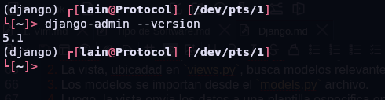
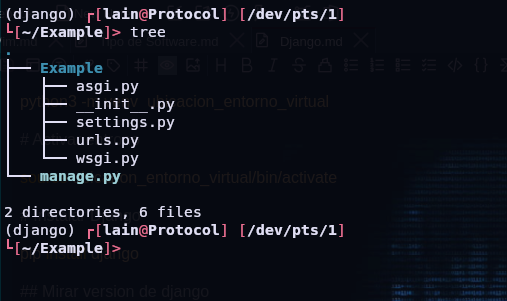
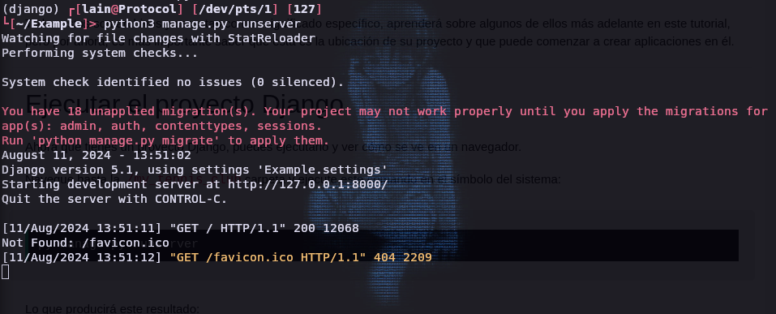
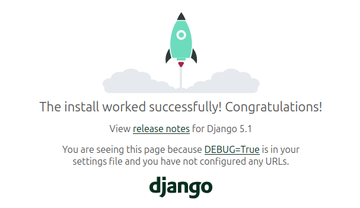
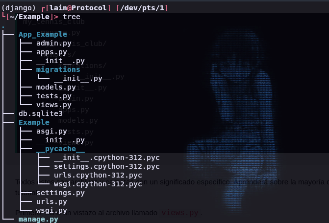

# 1. Django

## Que es ?

Django es un framework de Python que facilita la creacionde sitios web utilizando Python.

Django se encarga de las cosas dificiles para que usted puede concentrarse en crear sus aplicaciones web.

Django enfatiza la reutilizacion de componentes, tambien conocidad como DRY (Don't Repeat Yourself) y viene con caracteristicas listas para usar como sistemas de inicio de sesion, conexion a base de datos y operaciones CRUD (Crear Leer Actualiar Eliminar).

### Como Funciona

Django sigue el patron de diseño MVT (Modelo Vista Plantilla).

* **Modelo** Los datos que desea presentar, generalmente datos de una base de datos.
* **Ver** un controlador de solicitudes que devuelve la plantilla y el contenido relevantes, segun la solicitud del usuario.
* **Plantilla** Un archivo de texto (Como un archivo HTML) que contiene el diseño de la pagina web, con logica sobre como mostrar los datos.

#### Modelo

El modelo proporciona datos de la base de datos.

En Django, los datos se entregan como un Mapeo Relacional de Objetos (ORM), que es una tecnica diseñada para facilitar el trabajo con bases de datos.

La forma mas comun de extraer datos de una base de datos es `SQL`. Un problema con `SQL` es que es necesario tener conocimiento bastante bueno de la estructura de la base de datos para poder trabajar con ella.

Django, con ORM, facilita la comunicacion con la base de datos, sin tener que escribir sentencias `SQL` complejas.

Los modelos normalmente se encuentra en un archivo llamado `models.py`.

#### Vista 

Una vista es una funcion o metodo que toma solicitudes http como argumentos , importa los modelos relevantes, descubre que datos enviar a la plantilla y devuelve el resultado final.

La vistas normalmente se encuentra en un archivo llamado `views.py`.

Una plantilla es un archivo donde se describe como debe representarse el resultado.

Las plantillas suelen ser archivos .html con codigo HTML que describe el diseño de una pagina web, pero tambien pueden estar en otros formatos de archivo para presentar otros resultados, pero nos concentraremos en los archivos .html

Django usa HTML estandar para describir el diseño, pero usa etiquetas Django para agregar logica:

```django

<h1> My Homepage</h1>
<p>My name is  {{ fristname }}.</p>

```


#### URL

Django tambien proporciona una forma de navegar por las diferentes paginas de un sitio web.

Cuando un usuario solicita una URL, Django decide a que vista la enviara.

Esto se hace en un archivo llamado `urls.py`


### Entonces ¿Que Esta Pasando?

Cuando haya instalado Django y creado su primera aplicacion web Django, y el navegador solicite la URL, esto es basicamente lo que sucede:

1. Django recibe la URL, verifica el `urls.py` archivo y llama a la vista coincide con la URL.
2. La vista, ubicadad en `views.py`, busca modelos relevantes.
3. Los modelos se importan desde el `models.py` archivo.
4. Luego, la vista envia los datos a una plantilla especifica en la `template` carpeta.
5. La plantilla contien etiquetas HTMl y Django, y con los datos devuelve el contenido HTML terminado al navegador.

# Instalar

Normalmente se utilizan entornos virtuales para la instalacion debido a la necesidad de tener diferentes versiondes de un mismo paquete para ello primero seria crear un entorno virutal

```bash

# Intalar la utilidad para crear entronos virtuales

sudo apt install python3-venv

# Crear el entorno virtual

python3 -m venv  ubicacion_entorno_virtual

# Activar entrono

source ubicarion_entorno_virtual/bin/activate

# Instalar Django

pip install django

## Mirar version de django

django-admin --version

```



### My first Proyect

Para crear proyectos en dijango se utiliza la siguiente comando `startproject`.

```bash

django-admin startproject Example
```
Django creara una directorio con el nombre `Example` con este contenido:





Todos estos son archivos y carpetas con un significado especifico, es importante saber que esta es la ubicacion de su proyecto y que puede comenzar a crear aplicaciones en el.

#### Ejecutar el proyecto Django

Ahora que tienes un proyecto Django, puede ejecutarlo y ver como se ve en un navegador.

Navegue hasta `/Example` carpeta y ejecute este comando.

```bash

python3 manage.py runserver

```



Al colocar en cualquier navegador la direccion ip `127.0.0.1:8000` podra acceder al servidor local.



#### Que es una Aplicacion

Una aplicacion es una aplicacion web que tiene un significado especifico en su proyecto, como una pagina de inicio, un formulario de contacto o una base de datos de miembros.

En este tutorial crearemos una aplicacion que nos permita lista y registrar miembros en una base de datos.

Pero primero, vamos a crear una aplicacion Django simple que muestre !Hello world¡

#### Crear Aplicacion 

Para crear un aplicacion hay que ubicarse en la carpeta del proyecto y ejecutar el siguiente comando

```bash

python3 manage.py startapp <nombre>

```

Django creara una carpeta llamada `<nombre>` en el directorio del proyecto, con este contenido




Todos estos son ficheros y directorios con un significado especifico.

Primero veremos el fichero llamado `views.py`

Aqui es donde recopilamos la información que necesitamos para enviar una respuesta adecuada.

