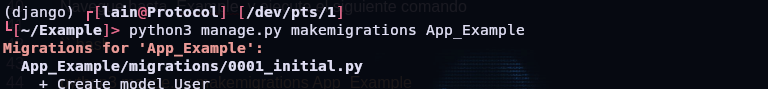
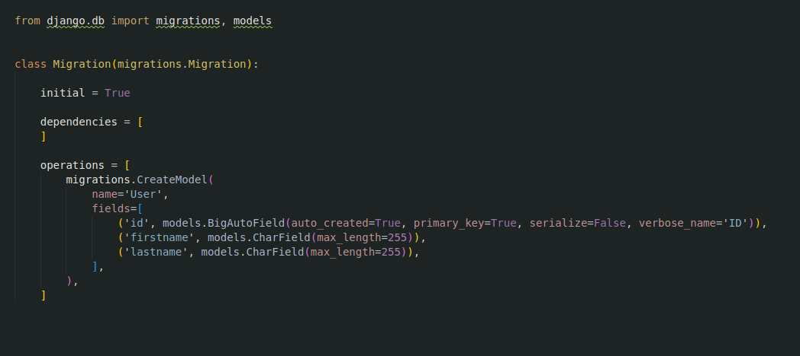
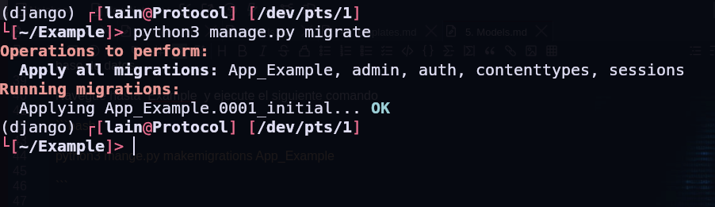
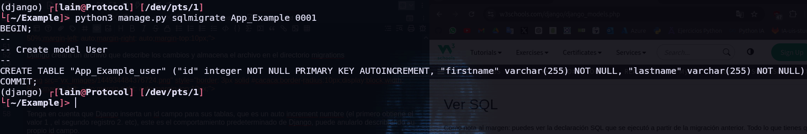
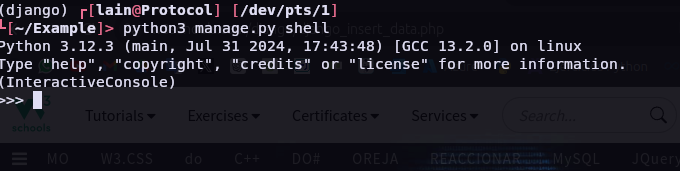
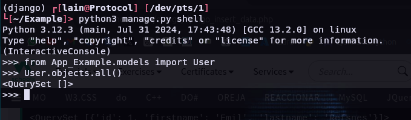
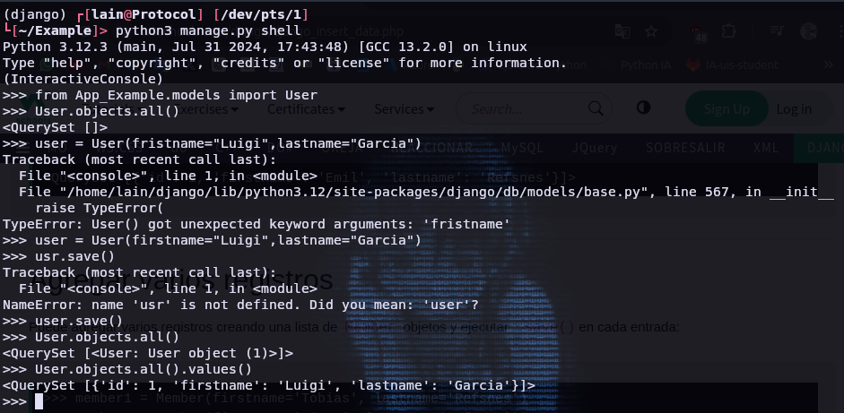
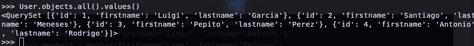
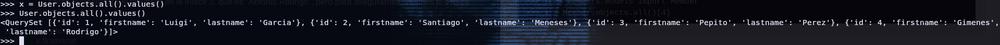
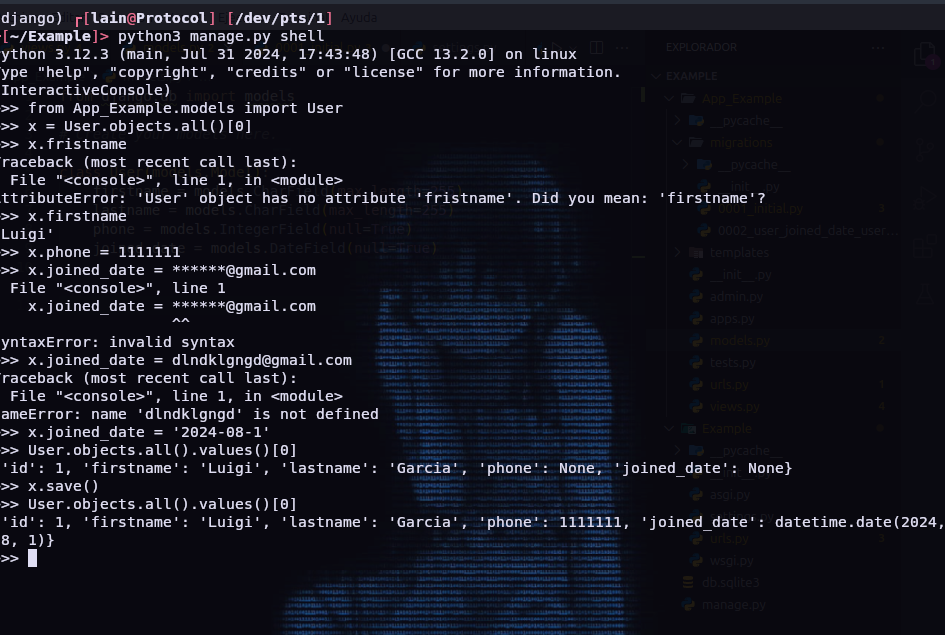

# 5. Models

Django nos permite trabajar con datos, sin tener que cambiar o cargar archivos en el proceso.

En Django, los datos se crean en objetos, llamados modelos y en realidad son tablas en una base de datos.

## Crear Tabla (Models)

Para crear un modelo. navegue hasta el models.py en el directorio de la app App_Example.

Abrirlo y agregar un nueva Tabla utilizando el metodo  class y describe los campos de la tabla que contiene.

```python

from django.db import models

class User(models.Model):
    fristname = models.CharField(max_length=255),
    lastname = models.CharField(max_lengh=255),

```

El primer campo, firstname es un campo de texto y contendra el nombre de los usuarios.
El segundo campo, lastname, tambien es un campo de texto, con el apellido del miembro.

Tanto firstname y lastname estan configurados para tener un maximo de 255 caracteres.

### Base de Datos SQLite

Cuando creamos el protecto Django, obtuvimos una base de datos SQLite vacia.

Se creo en el directorio raiz (Example)  y tiene el nombre de archivo db.sqlite3.

De forma predeterminada, todos los modelos creados en el proyecto Django se crearan como tablas en esta base de datos.

### Emigrar

Ahora que hemos descrito un modelo en el `models.py` archivo, debemos ejecutar un comando para crear la tabla en la base de datos.

Navegue hasta  Example  y ejecute el siguiente comando

```bash

python3 mange.py makemigrations App_Example

```

Lo que dara como resultado  esto:



Django creara un archivo que describe los cambios y almacena el archivo en el directorio migrations 





Tenga en cuenta que Django inserta un id campo para sus tablas, que es un auto increment numbre (el primero obtiene el valor 1 , el segundo registro 2. etc), este es el comportamiento predeterminado de Django, puede anularlo describiendo su propio id campo.

La tabla aun no esta creadam tendras que ejecutar un comando mas, luego Django creara y ejecutara una declaracion SQL, basada en el contenido del nuevo fichero en el directorio migrations

```bash

python3 manage.py migrate

```

Lo que dara como resultado:




### Ver SQL

Como nota al margen; puedes ver la declaracion SQL que se ejecuto a partir de la migracion anterior. Todo lo que tienes que hacer es ejecutar este comando con el numero de la migracion:

```bash

python3 manage.py sqlmigrate App_Example 0001

```

Lo que dara como resultado:




## Insercion de datos en Django

### Agregar Registro

Para agregar Registros a un Tabla definida por un Modelo se usa el interprete de Python (Shell de Python) para agregarle algunos Usuarios.

Para abrir un shell en Python, escriba este comando.

```python 

python3 manage.py shell

```

Ahora estamos en el shell, el resultado deberia ser algo como esto:



En la parte inferior, despues de los tres `>>>` escriba lo siguiente

```python
from App_Example.models import User
```
Presione [Enter] y escriba esto para ver la tabla User vacia

```python
User.objects.all()
```

Esto deberia proporcionarle un objeto `QuerySet` vacio, como este:



Un QuerySet  es una coleccion de datos de una base de datos. Lea mas sobre QuerySets en el capitulo QuerySet.

Agregue un registro a una tabla, ejecutando estas dos lineas

```python
user = User(firstname = 'Emil', lastname='Refsnes')
user.save()
```
Ejecute este comando para ver si la tabla User tiene un Usuario:

```python
User.objects.all().values()
```

El resultado se debe ver asi:



### Agregar varios registros

Puede agregar varios registros creando una lista de Usuarios y ejecutado `.save()` para cada uno 

```python
user1 = User(firstname="Santiago", lastname="Meneses")
user2 = User(firstname="Pepito", lastname="Perez")
user3 = User(firstname="Antonio",lastname="Rodrigo" )
users = [user1,user2,user3]
for i in users:
    i.save()
```

Puede ver todos los Usuario de la Tabla User:




### Actualizar registros 

Para actualizar registros que ya estan en la base de datos, primero tenemos que obtener el registro que queremos actualizar:

```python
from App_Example.models import User
x = User.objects.all()[3]
```

`x` ahora representara al miembro en le indice 3, que es "Antonio Rodrigo", pero para asegurarnos, veamos si eso es correcto:

```python
x.firstname
```

Esto deberia darte este resultado:

```python
x.firstname = "Gimenes"
x,save()
```
Ejecute este comando para ver si la tabla de miembros se actualizo:

```python
User.objects.all().values()
```

Debería verse así:





### Eliminar Registro

Para eliminar un registro de un tabla, comience por obtener el registro que desea eliminar:

```python
from App_Example.models import User
x = User.objects.all()[1]
```

`x` ahora representara al miembro con el indice <span style="color:#a9fe91">1</span>, que es "santiago" pero para aseguraranos, veamos si eso es correcto.

```python
x,firstname
```

Ahora podemos eliminar el registro:

```python
x.delete()
```


El resultado sera:

```python

(1, {'App_Example.User': 1})
```
Lo que nos indica cuantos elementos fueron eliminados y de que modelo.

Si observamos el modelo de User, podemos ver que "Santiago" se ha eliminado del modelo:


### Agregar campos en el modelo

Para agregar un campo a una tabla despues de crearla, abre el `models.py` archivo y realice los cambios:

```python
from django.db import models

class User(nodels.Model):
    firstname = models.CharField(max_length=255)
    lastname = models CharField(max_length=255)
    phone = models.IntegerField(null=True)
    joined_date = models.DataField(null=True)
```

Como puede ver, queremos agregar phone y joined_date a nuestro modelo de Users.
Este es un cambio en la estructura del modelo y por lo tanto tenemos que hacer una migracion para indicarle a Django que debe actualizar la base de datos

```bash
python3 manage.py makemigrations App_Example
```
Lo que dará como resultado:


Ejecute el comando para migrar

```bash
python manage.py migrate
```

### Insertar Datos

Para insertar datos en los nuevos campos se usa el enfoque de shell ya usado por lo cual 




