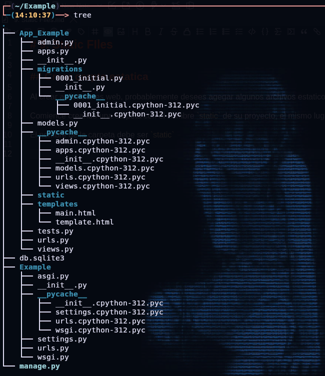

# 9. Static FIles


## Crear carpte estatica

Al crear aplicaciones web, probablemente desees agegar algunos archivos estaticos como imagenes o archivos CSS.

Comience creando una carpeta con el nombre `static` de su proyecto, el mismo lugar donde creo la `templates` carpeta:

El nombre de la carpeta debe ser `static`



Agrege un archivo CSS en la carpeta, el nombre lo eliges tu, en este ejemplo `static` lo llamaremos `myfrist.css`


## Modificar la Plantilla

Ahora tiene un archivo CSS, con algunos estilos CSS. El siguiente paso sera incluir este archivo en una plantilla HTML

Abra el archivo HTML y agrege lo siguiente:

```django


<link rel="stylesheet" href="">

```

