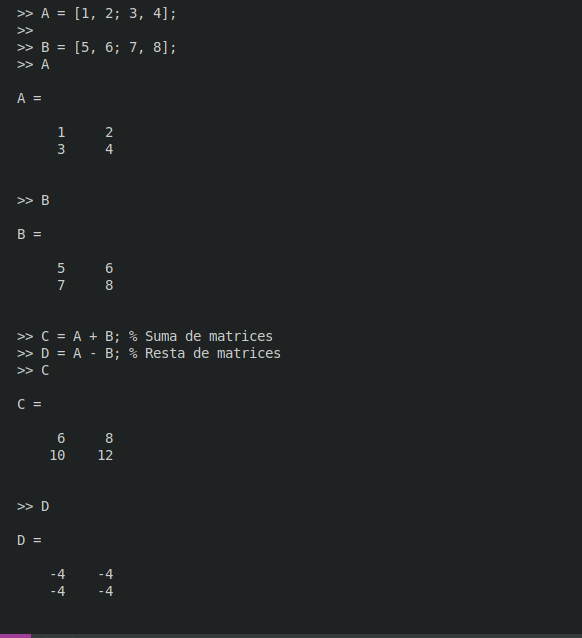
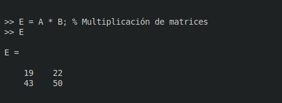
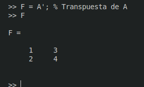
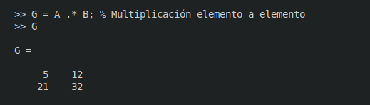
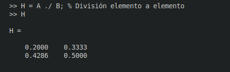
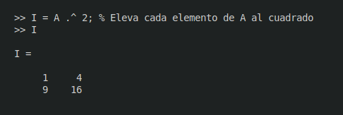

# 2. Matrices y Vectores

## Declaracion de Vectores y Matrices

1. **Vectores Fila y Columna**

    * **Crear un Vector Fila** Para crear un vector fila se debe separar los elementos ya sea por espacios o por comas (`,`).
    
```matlab

vector_espacio = [ 10 20 30 40]

vector_comas = [1,2,3,4,5]

```

   * **Crear un Vector columna** Los elementos se separan por punto y coma (`;`).
   
```matlab

Vector_columna = [1;2;3;4;5]

```

2. **Matrices**

    * **Crear una Matriz** Para crear una matriz se combinan los metodos para crear vectores filas y vectores columnas.
    
```matlab

A = [1,2,3; 4,5,6]   % Matriz dos por 2x3 donde mxn   m son rows y n colums

```

## Operaciones Matriciales y Elemento a Elemento

### Operaciones Matriciales

* Estas operaciones siguen las reglas del algebra lineal.

    * **Suma y Resta**
    
```matlab

A = [1, 2; 3, 4];

B = [5, 6; 7, 8];

C = A + B; % Suma de matrices

D = A - B; % Resta de matrices


```




   * **Multiplicacion**
   
```matlab

E = A * B; % Multiplicación de matrices


```




   * **Transposición** Se invieren FIlas por Columnas

```matlab

F = A'; % Transpuesta de A

```



### Operaciones Elemento a Elemento

* Estas operaciones se realiza entre  elementos correspondientes de los arreglos.

    * **Multiplicacion Elemento a Elemento**
    
```matlab

G = A .* B; % Multiplicación elemento a elemento


```



   * **División Elemento a Elemento**


```matlab

H = A ./ B; % División elemento a elemento

```



   * **Exponenciación Elemento a Elemento**

```matlab

I = A .^ 2; % Eleva cada elemento de A al cuadrado


```



## Slicing en Matrices y Vectores

El "slicing" es la operacion de extraer subarreglos de un arreglo mas grande.

* **Slicing en un Vector**


```matlab

v = [1, 2, 3, 4, 5];
sub_v = v(2:4); % Extrae los elementos 2, 3 y 4


```

* **Slicing en una matriz**


```matlab

matriz = [1, 2, 3; 4, 5, 6; 7, 8, 9];
sub_matriz = matriz(1:2, 2:3); % Extrae un subarreglo de las filas 1 y 2, columnas 2 y 3


```

## Tipos de Elementos y Almacenamiento Mixto

* **Almacenamiento de un solo tipo de elemento**


```matlab

A = [1, 2, 3; 4, 5, 6]; % Solo números


```

* **Almacenamiento mixto usando celdas** Para almacenar diferentes tipos de datos, se utilizan celdas.

```matlab

celda = {1, 'texto', true; 4.5, [1, 2, 3], @sin};


```

## Manipulación de Elementos

* **Eliminación de Elementos** Para eliminar elementos, se pueden asignar valores vacíos `[ ]`.

    * **Eliminar un elemento de un vector**
    
```matlab

v = [1, 2, 3, 4, 5];
v(3) = []; % Elimina el tercer elemento

```

   * **Eliminar una fila o columna de una matriz**

```matlab

matriz = [1, 2, 3; 4, 5, 6; 7, 8, 9];

matriz(2, :) = [ ]; % Elimina la segunda fila

matriz(:, 3) = [ ]; % Elimina la tercera columna

```


## Cambio de Elementos

* Puedes cambiar el valor de elementos específicos directamente.

    * **Cambiar un elemento en un vector**


```matlab

v = [1, 2, 3, 4, 5];

v(2) = 10; % Cambia el segundo elemento a 10

```

   * **Cambiar un elemento en una matriz**

```matlab

matriz = [1, 2, 3; 4, 5, 6; 7, 8, 9];

matriz(3, 1) = 10; % Cambia el elemento en la tercera fila, primera columna a 10

```

### Agregar Elementos

Para agregar elementos, puedes redimensionar el arreglo.

* **Agregar un elemento a un vector**

```matlab

v = [1, 2, 3];

v(end+1) = 4; % Agrega 4 al final del vector

```

* **Agregar una fila o columna a una matriz**

```matlab


matriz = [1, 2, 3; 4, 5, 6];

matriz(3, :) = [7, 8, 9]; % Agrega una nueva fila

matriz(:, 4) = [10; 11; 12]; % Agrega una nueva columna
```

