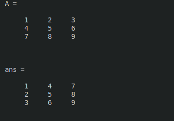
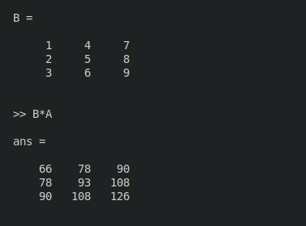
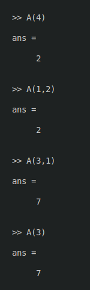
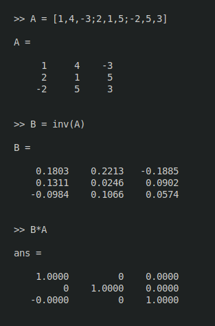

# note

# Operaciones con Matrices y Vectores

Ya se ha comentado que MATLAB es fundamentalmente un programa para calculo matricial.
Incialmente se utilizara MATLAB como programa interactivo, en el que se iran definiendo las matrices, los vectores y las expreciones que los combina y obteniendo los resultados sobre la marcha. Si estos resultados son asignados a otras variables podran ser utilizados posteriormente en otras expresiones. En este sentido MATLAB seria como una potente calculadora matircial 

## Defincion de Matrices desde Teclado

Como en casi todo los lenguajes de programacion, en MATLAB las matrices y los vectores son variables que tiene nombres. Ya se vera luego con mas detalle las reglas que deben cumplir estos nombres. Por el momento se sugiere que se utilizen letras mayusculas para matrices y minusculas para vectores y escalares.

Para definir una  matriz no hace falta establecer de antemano su tamaño (de hecho, se puede definir un tamaño y cambiarlo posteriormente). MATLAB determian el numero de filas y de columanas en funcion del numero de elementos que se proporciona (o se utilizan). Laa matrices se define por filas; los elementos de una misma fila esta separadas por blancos o comas, mientras que las filas estan separadas por pulsaciones intro o por carecteres punto y como (;), Por ejemplo, el siguiente comando define una matriz A de dimensiones (3x3):

```matlab

A = [1,2,3;4,5,6;7,8,9]

```

A partir de este momento la Matriz A esta disponible para hcer cualquier tipo de operacion con ella (ademas de valores numericos, en la defincion de una matriz o vector se pueden utilizar expresiones y funciones matematicas), Por ejemplo, una sencilla operacion con A es hallar su Matriz transpuesta. En MATLAB el apostrofo (') es el simbolo de Transpocicion matricial. Para calcular A' (traspuesta A) basta teclear lo siguiente (se añade a continuacion la respuesta del programa).

```matlab

A'

```

 
 

Como el resultado de la operacion no ha sido asignado a ninguna matriz, MATLAB utiliza un nombre de variable por defecto (ans, de answer), que contiene el resultado de la ultima operacion. La variable ans ser utilizada como operador en la siguietne expresion que se introduzca. Tambien podria haberse asignado el resultado a otra matriz llamada B,

```matlab

B = A'

```

Ahora ya estan definidas la matrices A y B y se posible seguir operando con ellas. Por ejemplo, se puede hacer el producto B*A (debera resultar una matriz simetrica)



En MATLAB se accede a los elementos de un vector poniendo el indice entre parentesis (por ejemplo x(3) o x(i)). Los elementos de las matrices se acceden poniendo los dos indices entre parentesis. Separados por una coma (Por ejemplo A(1,2) o A(i,j)). Las matrices Se alamacenda por columnas (aunque se introduzcan por filas, como se ha dicho antes). Y teniendo esto pude accederse a cualquier elemento de una matriz con un solo subindice. Por ejemplo, si A es una matriz (3x3) Se obtiene el mismo valor escribiendo A(1,2) que escribiendo A(4).



Invertir una matriz es casi tan facil como trasponerla. A continuacion se va a definir una nueva matriz A no singular en la forma:

```matlab

A [1,4,-3;2,1,5;-2,5,3]

```

Ahora se va acalcular la inversa de A y el resultado se asignara a B. Para ello basta har uso de la funcion inv() (La precision o numero de cifras con que se muestra el resultado se puede cambiar con el menu File/Preferences/General);

Para comprobar que este resultado es correcto basta pre-multiplicar A por B.




De forma analoga a las matrices,es posible definir un vertor fila x en la forma siguiente (si los tres numeros estan separados por blancos o comas, el resultado sera un vector fila ):

```matlab

x = [10 20 30] % Vector FIla

```

MATLAB considera comentarios todo lo que va desde el caractr tanto por ciento (%) hasta el final de la linea.

Por el contrario, si los numeros estan separados por intros o puntos y coma (;) se obtendra vertor columna:

```matlab

y = [11;12;13] % vector columna

```

Matlab  tiene en cuenta la diferencia entre vectores fila y vectores columna. Por ejemplo, si se intenta sumar los vectores x e y se obtendra error de dimensionalidad

Esta dificulta desaparece si se suma x con el vector traspuesto de y

```matlab

x+y'

```

Aunque ya se ha visto en los ejemplios anteriores el estilo sencillo e intuitivo con el que MATLAB opera con matrices y vectores, a continuacion se va a estudiar este tema con un poco mas de detenimiento

### Operaciones con Matrices

Matlab puede operar con matrices por medio de operadores y por medio de funciones . Se han visto ya los operadores suma  (+), producto (*) y traspuesta ('), asi como funciona inv(). Los operadores matriciales de MATLAB son los siguientes:

|   Operador    |                           Operacion                            |
| ----------------- | ---------------------------------------------------------- |
| +                   | Adicion o suma                                              |
| -                    | Sustraccion o resta                                        |
| *                   | Multiplicacion                                                 |
| ' Traspuesta |                                                                        |
| ^                   | Potencia                                                         |
| \                    | Division-Izquierda                                          |
| /                    | Division-Derecha                                           |
| .*                  | Producto elemento a elemento                      |
| ./ y .\             | division elemento a elemento.                       |
| .^                  | Elevar a una potencia elemento a elemento |

Estos operadores se aplican tambien a las variables o valores escalares, aunque con algunas diferencias. Todos estos operadores son coherentes con las correspondietes operaciones matriciales, no se puede por ejemplo sumar matrices que no sean del mismo tamañño. Si los operadores no se usan de modo correcto se obtiene un mensaje de error.

Los operadores anteriores se puede aplicar tambien de modo mixto, es decir con un operando escalar y otro matricial . EN este caso la operacion con el escalar se aplica a cada un de los elementos de la matriz. Considere el siguiente ejemplo:

```matlab

A*2

A-4

```

LOs operadores de division requieren una ciera expiicacion adicional. Considere el siguiente sistema de ecuaciones lineales.

$$

Ax = b

$$


En donde x y b son vectores columna,  y A una matriz cuadrada invertible. La resolucion de este sistema de ecuaciones se puede escribir en las 2 formas siguienes ( Atencion a la segunda forma basada en la barra invertida (\), que puede resultar un poco extraña).

$$

x = inv(A)* b

$$
$$

x = A \backslash  b

$$

Asi pues el operador division-izquierda por una matriz  (barra invertidad \) equivale a premultiplicar por la inversa de esa matriz. EN realidad este operador division-izquierda es aplicable aunque la matriz no tenga inversa e incluso no sea cuadrada, en cuyo caso la solucion que se obtiene (por lo general) es la que proporciona el metodo de los minimos cuadrados. Cuando la matriz es triagular o simetrica aprovecha esta circustancia para reducir el numero de operaciones aritmeticas. EN algunos casos se obtien una solucion con mas de r elementos distintos de cero, siendo r elementos distintos de cero, siendo r el rango de la matriz. Esto puede esta basado en que la matriz se reduce a forma de escalon y se resuelve el sisteam dando valor cero a las variables independientes. Por ejemplo, considerese el siguiente ejemplo de matriz (1x2) que conduce a un sitema de infinitas soluciones

que es la solucin obtenida dando valor cero a la variable independiente x(1). Por otra parte en el caso de un sitema de ecuaciones redundante  (o sobre-deteminado) el resultado de MATLAB es el punto mas cercano en el sentido de minia norma de error a las ecuaciones dadas (aunque no cumpla exactamente ninguna de ellas) Vease el siguiente ejemplo de tres ecuaciones formadas por una recta no pasa por el origen y los dos ejes coordenados