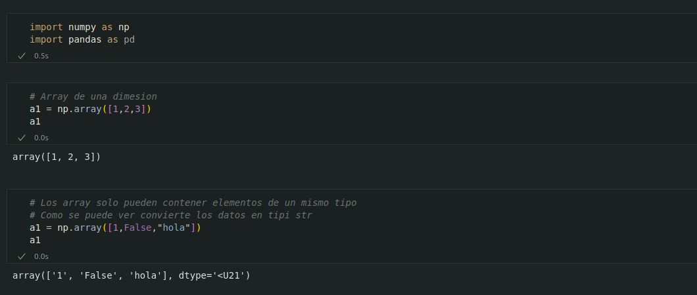
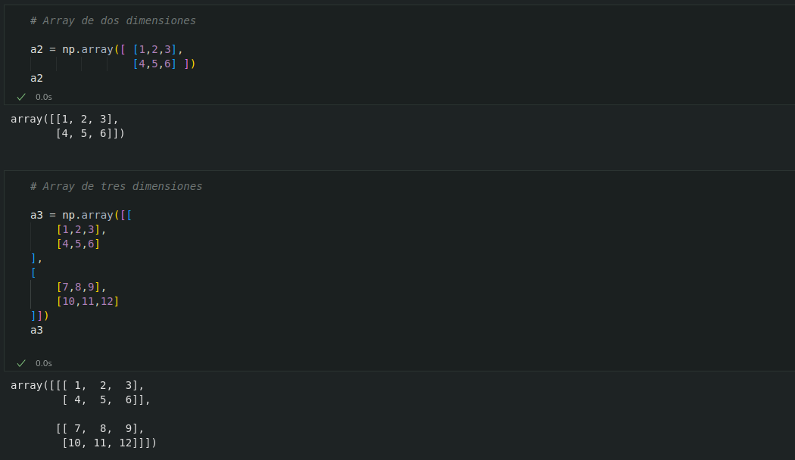
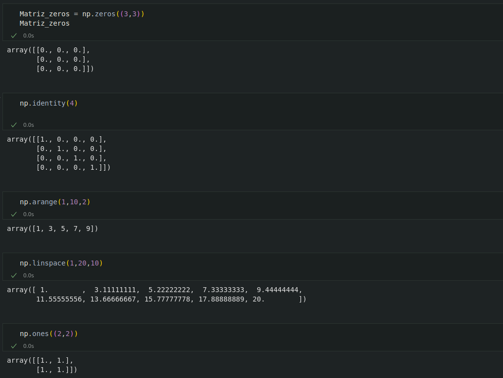
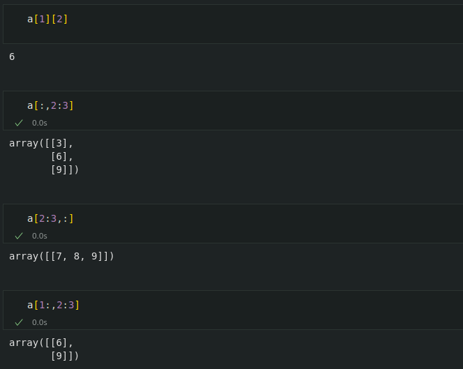
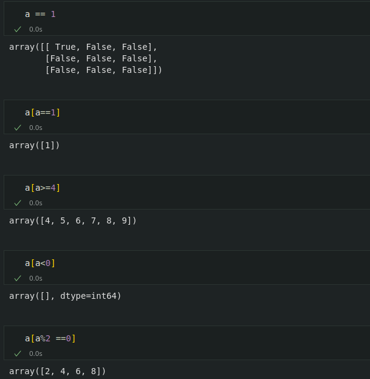
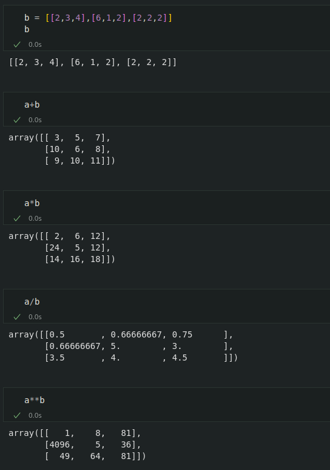
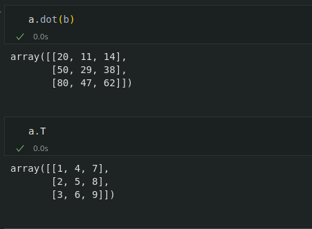

# 6. Numpy

`NumPy` es una libreria de Python especialeizada en el calculo numerico y el analisis de datos, especialmente para un gran volumen de datos.

Incorpora una nueva clase de objetos llamados **arrays** que permite representar colecciones de datos de un mismo tipo en varias dimensiones, y funciones muy eficientes para su manipulacion

## La clase de objetos Array

Un array es una estrictura de datos de un mismo tipo organizada en forma de tabla o cuadricula de distintas dimensiones.

Las dimensiones de un array tambien se conocen como **ejes**.

## Creacion de Arrays

Para crear un array se utiliza la siguiente funcion de NumPy

* `np`.`array`(lista): Crea una array a partir de la lista o tupla lista y devuelve una referencia a el. El numero de dimensiones del array dependera de las listas o tuplas anidadas en lista:

    * Para una lista de valores se cre un array deuna dimension, tambien conocido como **Vector**.
    * Para una lista de lista de valores se cre un array de dos dimesiones, tambien conocido como **Matriz**.
    * Para una lista de listas de valores se crea un array de tres dimensones, tambien conocido como **Cubo**.

Los elementos de la lista o tupla deben ser del mismo tipo 

* Otras funciones utiles que permiten generar arrays son:

    * `np`.`empy`(dimensiones): Crea y devuelve una referencia a un array vacio con las dimensiones especificadas en la tupla dimensiones.

    * `np`.`zeros`(dimensiones): Crear y devuelve una referencia a un array con las dimensiones especificadas en la tupla dimensiones cuyos elementos son todos ceros.

    * `np`.`ones`(dimensiones): Crea y devuelve una referencia a un array con las dimensiones especificadas en la tupla dimensiones cuyos elementos son todos unos.

    * `np`.`full`(dimensiones,valor): Crea y devuelve una referencia a un array con las dimensiones especificadas en la tupla dimensiones cuyos elementos son todos valor.

    * `np`.`indentity`(n): Crea y devuleve una referencia a la matriz identidad de dimension n.

    * `np`.`arange`(inicio,fin,salto): Crea y devuelve una referencia a un array de una dimension cuyos elementos son la secuencia desde inicio hasta fin tomando valores cada salto.

    * `np`.`linspace`(inicio,fin,n): Crea y devuelve una referencia a un array de una dimension cuyos elementos son la secuencia de n valores equidistantes desde inicio hasta fin.

    * `np`.`random`.`random`(dimensiones): Crea y devuelve una referencia a un array con las dimensiones especificadas en la tupla dimensiones cuyos elementos son aleatorios.

## Atributos de un Array

* Existen varios atributos y funciones que describen las caracteristicas de un array

    * a.`nd1` : Devuelve el numero de dimensiones del array a.

    * a.`shape` : Devuelve una tupla con las dimensiones del array a.

    * a.`size` : Devuelve el numero de elementos del array a.

    * a.`dtype`: Devuelve el tipo de datos de los elementos del array a.
    
## Acceso a los elementos de un Array

Para Acceder a los elementos contenidos en un array se usan indices al igual que para acceder a los elementos de una lista, pero indicando los indices de cada dimension separados por comas.
 
Al igual que para listas, los indices de cada dimension comienzan en 0.
 
Tambien es posible obtener subarrays con el operador <code>:</code> indicando el indice inicial y el siguente al final para cada dimension, de nuevo separados por comas.

## FIltrado de elementos de un Array

* Una caracteristica muy util de los arrays es que es muy facil obtener otro array con los elementos que cumplen una condiccion.

    * `a`[condicion] Devuelve una lista con los elementos del array a que cumplen la condicion condicion.

## Operaciones matematicas con Arrays

Existen dos formas de realizar operaciones matematicas con arrays a nivel de elemento y a nivel de array.
 
Las operaciones a nivel de elemento operan los elementos que ocupan la misma posicion en dos arrays. Se necesitan, por tanto, dos arrays con las mismas dimensiones y el resultado es un array de la misma dimension.
 
Los operadores matematicos <code>+,-,*,/,%,**</code> se utilizan para realizar suma,resta,producto,cociente,resto y potencia a nivel de elemento.

## Operaciones matematicas a nivel de Array

* Para realizar el producto matricial se utiliza el metodo.

    * a.`dot`(b) Devuelve el array resultado del producto matricial de los arrays a y b siempre y cuando sus dimensiones sean compatibles.

* Y  para trasponer una matriz se utiliza el metodo.

    * a.`T` Devuelve el array resultado de trasponer el array a.
    

