# 7. Pandas

Pandas es una librería de Python especializada en el manejo y analisis de estructuras de datos

Las principales características de esta libreria son:

* Define nuevas estructuras de datos basadas en los arrays de la librería NumPy pero con nuevas funcionalidades.
* Permite leer y escribir fácilmente ficheros en formato CSV, Excel y base de datos SQL.
* Permite acceder a los datos mediante indices o nombres para filas y columnas.
* Ofrece métodos para reordenar,dividir y combinar conjuntos de datos.
* Permite trabajar con series temporales.
* Realiza todas esta operaciones de manera muy eficiente.

## Tipos de datos en Pandas

Pandas dispone de tres estructuras de datos diferentes:

* **Series** Estructura de una dimensión.
* **DataFrame** Estructura de dos dimensiones (Tablas).
* **Panel** Estructura de tres dimensiones (Cubos).

Estas estructuras se construyen a partir de la librería NumPy ,añadiendo nuevas funcionalidades.

### La clase de objetos Series

Son estructuras similares a los arrays de una dimensión. Son homogeneas, es decir, sus elementos tienen que ser del mismo tipo, y su tamaño es inmutable, es decir, no se puede cambiar, aunque si su contenido.
 
Dispone de un indice que asocia un nombre a cada elemento de la seria, a través de la cual se accede a elementos.

#### Creación de una seria a partir de una lista

* `Series`(data=lista,index=indices,dtype=tipo) Devuelve un objeto de tipo `Series` con los datos de la lista lista, las filas especificadas en la lista indices y el tipo de datos indicado en tipo, si no se pasa la lista indices se utiliza como indices los enteros del 0 al `n-1`, donde `n` es el tamaño de la serie. Si no se pasa el tipo de dato se infiere.

#### Creación de una serie a partir de un diccionario

* `Series`(data=diccionario,index=indices) Devuelve un objeto de tipo `Series` con los valores del diccionario diccionario y las filas especificas en la lista indices. Si no se pasa la lista de indices se utilizan como indices la claves del diccionario.

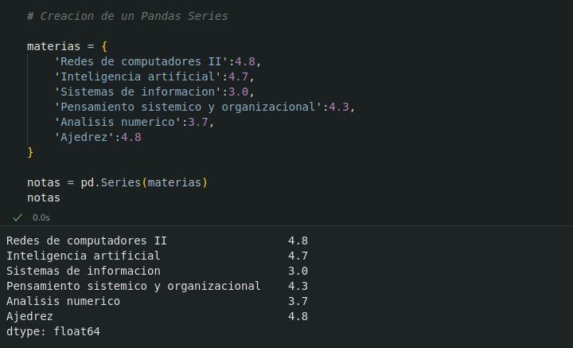

#### Atributos de una Serie

Existen varias propiedades o métodos para ver las características de una serie.

* s.`size`: Devuelve el numero de elementos de la serie s.
* s.`index`: Devuelve una lista con los nombre de las filas del DataFrame s.
* s.`dtype`: Devuelve el tipo de datos de los elementos de la serie s.

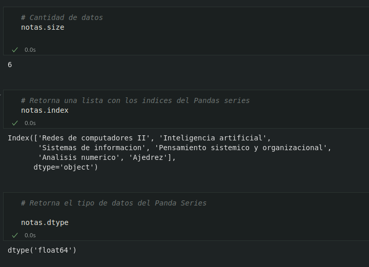

#### Acceso a los elementos de una Serie

El acceso a los elementos de una objeto del tipo Series puede ser a traves de posiciones o atraves de indices (nombre)

##### Acceso por posición

* `s`[i]: Devuelve el elemento que ocupa la posicion i+1 en la serie `s`.

##### Acceso por indice

* `s`[nombre] Devuelve el elemento con el nombre nombre en el indice.
* `s`[nombres] Devuelve otra serie con los elementos con los nombre de la lista `nombres` en el indice.

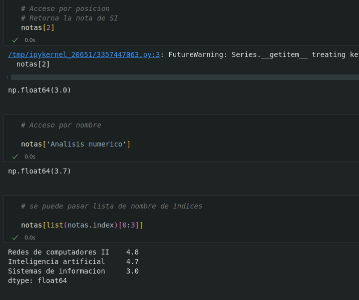

#### Resumen descriptivo de una Serie:

* Las siguientes funciones permiten resumir varios aspectos de una serie:

    * s.`count`() Devuelve el numero de elementos que no son nulos ni `NaN` en la serie s.

    * s.`sum`() Devuelve la suma de los datos de la serie s cuando los datos son de un tipo numérico, o la concatenación de ellos cuando son del tipo cadena `str`.

    * s.`cumsum`() Devuelve una serie con la suma acumulada de los datos de la serie s cuando son de tipo numérico.

    * s.`value_counts`() Devuelve una serie con la frecuencia (Numeros de repeticiones) de cada valor de la serie s.

    * s.`min`() Devuelve el menor de los datos de la serie s.

    * s.`max`() Devuelve el mayor de los datos de la serie s.

    * s. `mean`() Devuelve la media de los datos de la serie s cuando los datos son de un tipo numerico.

    * s.`std`() Devuelve la desviación típica de los datos de la serie s cuando los datos son de un tipo numerico.

    * s.`describe`() Devuelve una serie con un resumen descriptivo que incluye el numero  de datos,su suma, el maximo, la media, la desviasion tipica y los cuartiles.

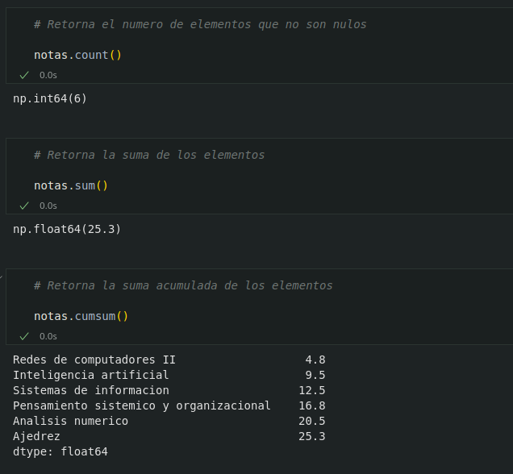

 

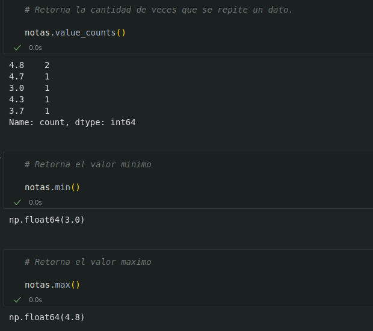

 

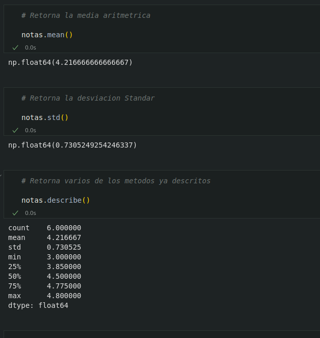

##### Aplicar operaciones a una Serie

Los operadores binarios  <i style="color:#CFDE74">(+,*,/,etc) </i>pueden utilizarse como una serie, y devuelven otra serie con el resultado de aplicar la operacion a cada elemento de la serie.

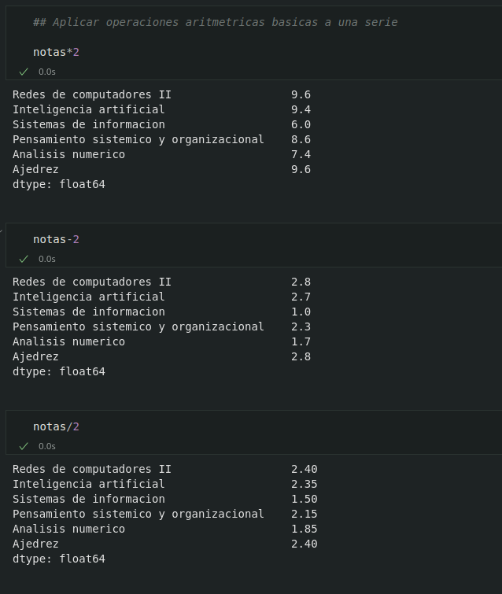

##### Aplicar funciones a una Serie

* También es posible aplicar una función a cada elemento de la serie mediante el siguiente método:

    * s.`apply`(f) Devuelve una serie con el resultado de aplicar la funcion f a cada uno de los elementos de la serie s.
    
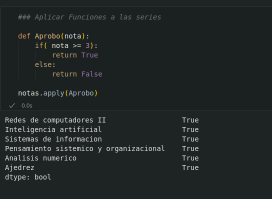

##### Filtrado de una Serie

* Para filtrar una serie y quedarse con los valores que cumplen una determinada condición se utiliza el siguiente método:

    * s.[condición] Devuelve una serie con los elementos de la serie s que se corresponde con el valor `True` de la lista booleana condición.condición debe ser una lista de valores booleanos de la misma longitud.

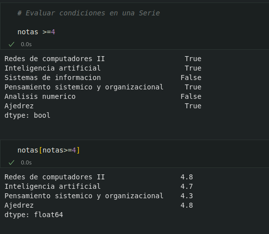

##### Ordenar una Serie

* Para ordenar una serie se utilizan los siguientes metodos:

    * s.`sort_values`(ascending=booleano) Devuelve la serie que resulta de ordenar los valores de la serie s. Si argumento del parámetro ascending es `True` el orden es creciente y si es `False` decreciente.

    * s.`sort_idex`(ascending=booleano) Devuelve la serie que resulta de ordenar el indice de la serie s. Si el argumento del parametro ascending es `True` el orden es creciente si es `False` decreciente.

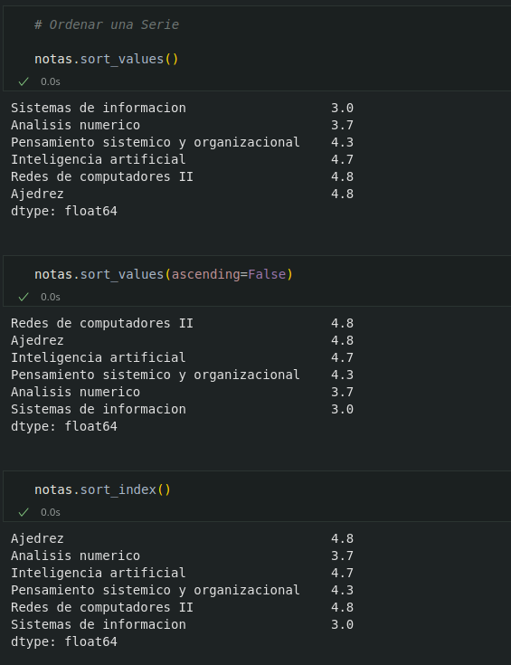

##### Eliminar los datos desconocidos en una Serie

Los datos desconocidos representa en Pandas por `NaN` y los nulos por `None`. Tanto unos como otros suelen ser un problema a la hora de realizar algunos analisis de datos, por lo que es habitual eliminarlos. Para eliminarlos de una serie se utiliza el siguiente metodo.

* s.`dropna`() Elimina los datos desconocidos o nulos de la serie s.

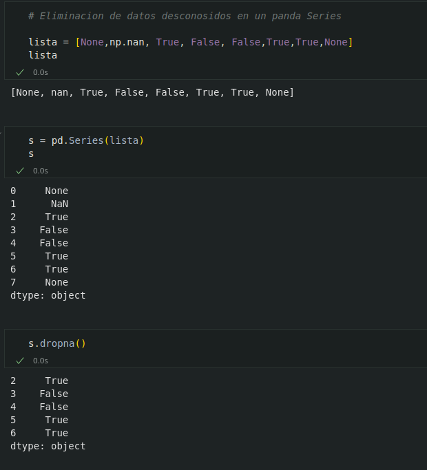

#### Eliminar datos en una Serie

Para eliminar datos de un pandas Serie vasta con pasar el indice que se desea eliminar al siguiente metodo

s.`drop`[nombre] Eliminar el elemento asociado al indice de nombre nombre de la serie s.

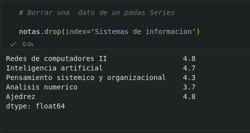
