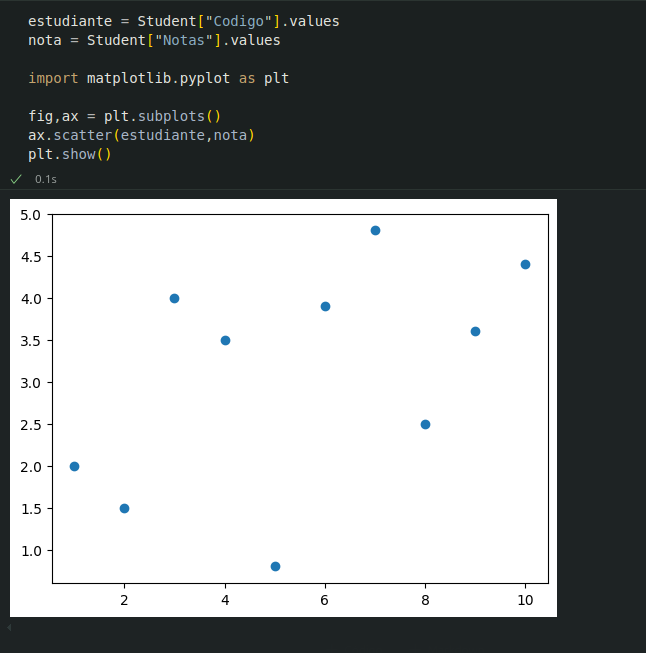
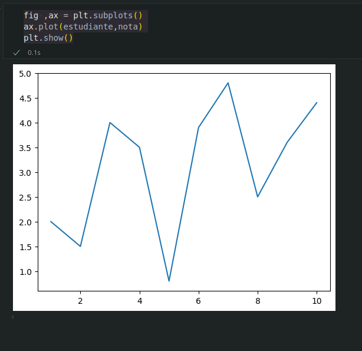
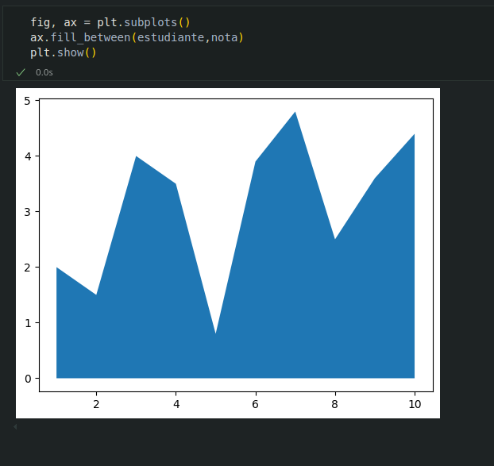
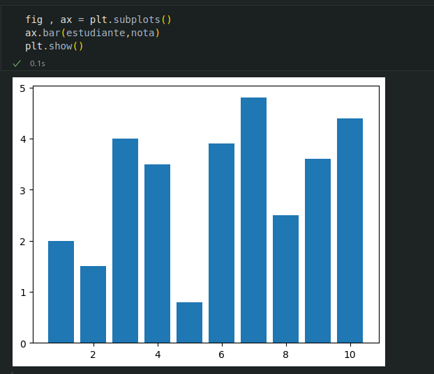
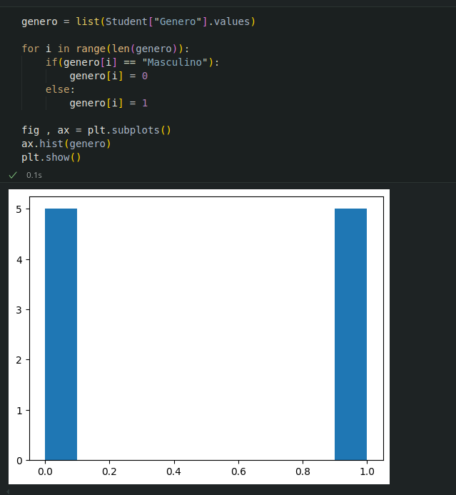
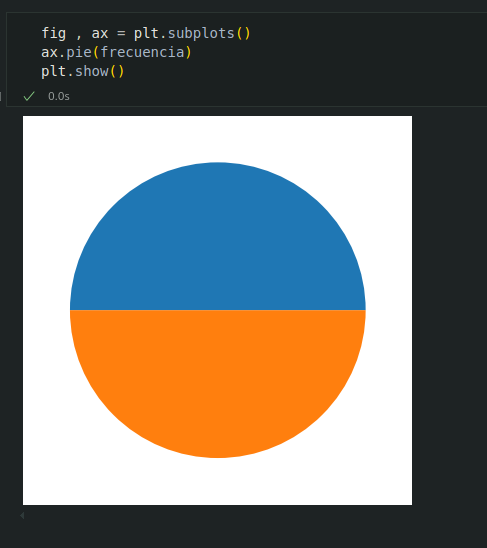

# 8. Matplotlib

## Que es ?

* `Matplotlib` es una librería de Python especializada en la creación de gráficos en dos dimensiones. Permite crear y personalizar los tipos de gráficos mas comunes, entre ellos:

    * Diagramas de barras
    * Histogramas
    * Diagramas de sectores
    * Diagrama de cajas y bigotes
    * Diagrama de violín 
    * Diagrama de dispersión o puntos 
    * Diagramas de lineas
    * Diagramas de áreas 
    * Diagrama de contorno
    * Mapas de color
    

### Creación de gráficos con Matplotlib

Para crear un grafico con matplotlib es habitual seguir los siguientes pasos:

1. Importar el modulo `pyplot`.

2. Definir la figura que contendra el grafico, que es la region (Ventana o Pagina) donde se dibujara y los ejes sobre los que se dibujaran los datos. Para ello se utiliza la funcion `subplots`().

3.  Dibujar los datos sobre los ejes. Para ello se utilizan distintas funciones dependiendo del tipo de grafico que se quiera.

4. Personalizar el grafico. Para ello existen multitud de funciones que permiten añadir un titulo, una leyenda, una rejilla, cambiar colores o personalizar los ejes.

5. Guardar el grafico. Para ello se utiliza la funcion `savefig`().

6. Mostrar el grafico. Para ello se utiliza la funcion `show`(). 

#### Diagramas de dispersion o puntos

* `scatter`(x,y) Dibuja un diagrama de puntos con las coordenadas de la lista x en el eje X y las coordenadas de la lista y en el eje Y.

#### Diagramas de lineas

* `plot`(x,y) Dibuja un poligono con los vectores dados por las coordenadas de la lista x en el eje X y las coordenadas de la lista y en el eje Y.

#### Diagrama de areas

* `fill_between`(x, y) Dibuja el area bajo el poligono con los vertices dados por las coordenadas de la lista x en el eje X y las coordenadas de la lista y en el eje Y.

### Diagrama de barras verticales

* `bar`(x,y) Dibuja un diagrama de barras verticales donde x es una lista con la posicion de las barras en eje X, e y es una lista con la altura de las barras en el eje Y.

### Diagrama de barras verticales

* `barh`(x,y) Dibuja un diagrama de barras horizontales donde x es una lista con la posicion de las barras en eje Y, e y es una lista con la altura de las barras en el eje X.

#### Histogramas

* `hist`(x, bins): Dibuja un histograma con las frecuencias resultantes de agrupar los datos de
la lista x en las clases definidas por la lista bins

#### Diagrama de sectores

* pie(x) Dibuja un diagrama de sectores con las frecuencias de la lista x.

