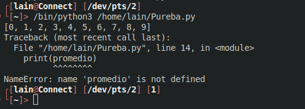
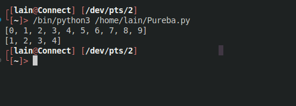

 4 Funciones
==============


# Funciones (def)

Una funcion es un bloque de codigo que tiene asociado un nombre, de manera que cada vez que se quiera ejecutar el bloque de codigo basta con invocar el nombre de la funcion.

Para declarar una funcion se utiliza la siguenti sintaxis:

```python

def Nombre(nombre)
    print(f"{nombre} bienvenido a python.")
    
Nombre("Miguel")

```

## Parametros de una funcion

Una funcion puede recibir valores cuando se invoca a través de unas variables conocidas cono `parametros` que se definen entre parentesis en la declaracion de la funcion. En el cuerpo de la funcion se puede usar estos parametros como si fueran varaibles.

```python

def Primo(numero):
    contador = 0
    for i in range(numero):
        if( numero % (i+1)  == 0):
            contador +=1
    if(contador == 2):
        return "El numero es primo"
    else:
        return "El numerro no es primo"
       
print(Primo(11))

```

## Argumentos de una funcion

Los valores que se pasa a la funcion en una llamada o invocacion concreta de ella se conocen como `argumentos` y se asocion a los parametros de la declaracion de la funcion.

Los argumentos se puede indicar de dos formas:

   * **Argumentos Posicionales** Se asocian a los parametros de la funcion en el mismo orden que aparece en la definicion de la funcion.
   * **Argumentos por nombre** Se indica explicitamente el nombre del parametro al que se asocia un argumento de la forma `parametro` = `argumento`
   

```python

def  Hipotenusa(a,b):
    return pow((a**2)+(b**2),2)

Hipotenusa(2,5)

Hipotenusa(b= 5 ,a= 2)

```

## Retorno de una Funcion

Una funcion puede devolver un objeto de cualquier tipo tras su invocacion. Para ello el objeto a devolver debe escribirse detras de la palabra reservada `return`. Si no se indeica ningun objeto, la funcion no devolvera nada.

```python

>>> def area_triangulo(base, altura):
...
return base * altura / 2
...
>>> area_triangulo(2, 3)
3
>>> area_triangulo(4, 5)
10

```

# Argumentos por defecto

En la definicion de una funcion se puede asignar a cada parametro un argumento por defecto, de manera que si se invoca la funcion sin proporcionar ningun argumento para ese parametro , se utiliza el argumento por defecto.

```python

>>> def bienvenida(nombre, lenguaje = 'Python'):
...
print('¡Bienvenido a', lenguaje, nombre + '!')
...
return
...
>>> bienvenida('Alf')
¡Bienvenido a Python Alf!
>>> bienvenida('Alf', 'Java')
¡Bienvenido a Java Alf!

```

# Pasar un numero indeterminado de Argumentos

Por ultimo, es posible pasar un numero variable de argumentos a un parametro. Esto se puede hacer de dos formas:

* `*parametro` Se antepone un asterisco al nombre del parametro y en la invocacion de la funcion se para el numero variable de argumentos separados por comas. Los argumentos se guardan en una lista que se asocia al parametro.

* `**parametro` Se anteponen dos asteriscos al nombre del parametro y en la invocacion de la funcion se pasa el numero variable de argumentos por pares `nombre` = `valor` , separados por comas. Los argumentos se guarda en un diccionario que se asicoa al nombre.

```python

>>> def menu(*platos):
...
print('Hoy tenemos: ', end='')
...
for plato in platos:
...
print(plato, end=', ')
...
return
...
>>> menu('pasta', 'pizza', 'ensalada')
Hoy tenemos: pasta, pizza, ensalada,

```

# Abito de los Parametros y Variables de una funcion

Los parametros y las variables declaradas dentro de una funcion son de **ambito local**, mientras que las definidas fuera de ella son de **ambito global**.

Tanto los parametros como las variables del ambito local de una funcion solo esta accesibles durante la ejecucion de la funcion, es decir, cuando termina la ejecucion de la funcion estas variables desaparecen y no son accesibles desde fuera de la funcion.

```python

def Lista(tamaño):
    lista = []
    
    for i in range(tamaño):
        lista.append(i)
    
    promedio = sum(lista)/len(lista) 
    return lista


print(Lista(10))

print(promedio)

```




Si en el **Ambito global** de una funcion existe una variable que tambien existe en el ambito global, durante la ejecucion de la funcion la variable global queda eclipsada por la variable local y no es accesible hasta que finalize la ejecucion de la funcion.

```python

def Lista(tamaño):
    lista = []
    
    for i in range(tamaño):
        lista.append(i)
    return lista

lista [1,2,3,4]

print(Lista(10))

print(lista)

```




# Paso de argumentos por referencia

En Python el paso de argumentos a una funcion es siempre por referencia, es decir, se pasa una referencia al objeto del argumento, de manera que cualquier cambio que se haga dentro de la funcion mediante el parametro asociado afectara al objeto original, siempre y cuando este se mutable

```python

>>> primer_curso = ['Matemáticas', 'Física']
>>> def añade_asignatura(curso, asignatura):
...
curso.append(asignatura)
...
return
...
>>> añade_asignatura(primer_curso, 'Química')
>>> print(primer_curso)
['Matemáticas', 'Física', 'Química']

```

# Funciones Recursivas

Una funcion recursiva es una funcion que en su cuerpo contiene una llamada a si misma.

La recursion es una practiva comun en la mayoria de los lenguajes de programacion ya que permite resolver las tareas recursivas de manera mas natural.

Para garantizar el final de una funcion recursiva, las sucesivas llamadas tiene que reducir el grado de complejidad del problema, hasta que esta pueda resolverse directamente si necesidad de volver a llamar a la funcion.

```python

>>> def factorial(n):
            if n == 0:
                return 1
            else:
                return n * factorial(n-1)
>>> f(5)
120

```

## Funciones recursivas multiples

Una funcion recursiva puede invocarse a si misma tantas veces como quiera en su cuerpo

```python

>>> def fibonacci(n):

         if n <= 1:
            return n
        else:
            return fibonacci(n - 1) + fibonacci(n - 2)

>>> fibonacci(6)
8

```

## Los riesgos de la recursion

Aunque la recursion permite resolver las tareas recursivas de forma mas natural, hay que tener cuidadado con ella porque suele consumir bastante memoria, ya que cada llamada a la funcion crea un nuevo ambito local con las variables y los parametos de la funcion.

En muchos casos es mas eficiente resolver la tarea recursiva de forma iterativa usando bucles.

```python

>>> def fibonacci(n):
            a, b = 0, 1
            for i in range(n):
                a, b = b, a + b

            return a
>>> fibonacci(6)
8

```

# Programacion Funcional

En Pyrhon las funciones son objetos de primer clase, es decir, que puede pasarse como argumentos de una funcion, al igual que el resto tipo de datos

```python

>>> def aplica(funcion, argumento):
            return funcion(argumento)

>>> def cuadrado(n):
            return n*n

>>> def cubo(n):
            return n**3

>>> aplica(cuadrado, 5)
25
>>> aplica(cubo, 5)
125

```

## Funciones anonimas (lambda)

Existen un tipo especial de funciones que no tiene nombre asociado y se conoce como **Funciones Anonimas** o **Funciones Lambda**

La sintaxis para definir una funcion anonima es

```python

lambda <parámetros> : <expresión>

```
Esta funciones se suelen asociar a una variable o parametro desde la cual hacer la llamada.

```python

>>> area = lambda base, altura : base * altura
>>> area(4, 5)
10

```

## Aplicar una funcion a todos los elementos de una coleccion iterable (map)

* `map`(`f`,`c`) Devuelve un objeto iterable con los resultados de aplicar la funcion `f` a los elementos de la coleccion `c`. Si la funcion `f` requiere `n` argumentos entonces debe pasarse `n` colecciones con los argumentos. Para convertir el objeto en una lista, tupla o diccionario hay que aplicar explicitamente las funciones `list`() `tuple`() `dict`() respectivamente.

```python

>>> def cuadrado(n):
...
return n * n
...
>>> list(map(cuadrado, [1, 2, 3])
[1, 4, 9]

>>> def rectangulo(a, b):
...
return a * b
...
>>> tuple(map(rectangulo, (1, 2, 3), (4, 5, 6)))
(4, 10, 18)

```

## Filtrar los elementos de una coleccion iterable (filter)

* `filter`(`f`,`c`) Devuelve un objeto iterable con los elementos de la coleccion `c` que devuelvan **True** al aplicarles la funcion `f`. Para convertir el objeto en una lista , tupla o diccionario hay que aplicarle explicitamente las funciones `list`() `tuple`() `dict`() respectivamente. `f` debe ser una funcion que reciba un argumento y devuelva un valor booleano.


```python

>>> def par(n):
          return n % 2 == 0
          
>>> list(filter(par, range(10))
[0, 2, 4, 6, 8]

```

## Combinar los elementos de varias colecciones iterables (zip)

* zip(c1,c2,...) Devuelve un objeto iterable cuyos elementos son tuplas formadas por los elementos que ocupan la misma posicion en la coleccion c1 c2 etc . El numero de elementos de las tuplas es el numero de colecciones que se pasen. Para convertir el objeto en una lista, tupla o diccionario hay que aplicar explícitamente las funciones `list`() `tuple`() `dict`() respectivamente.


```python

>>> asignaturas = ['Matemáticas', 'Física', 'Química', 'Economía']
>>> notas = [6.0, 3.5, 7.5, 8.0]
>>> list(zip(asignaturas, notas))
[('Matemáticas', 6.0), ('Física', 3.5), ('Química', 7.5), ('Economía',
8.0)]
>>> dict(zip(asignaturas, notas[:3]))
{'Matemáticas': 6.0, 'Física': 3.5, 'Química': 7.5}
```

## Operar todos los elementos de una coleccion iterable (reduce)

* `reduce`(`f`,`l`) Aplicar la funcion `f` a los dos primeros elementos de la secuencia `l`. Con el valor obtenido vuelve a aplicar la funcion `f` a ese valor y el siguiente de la secuencia, y asi hasta que no quede mas elementos en la lista. Devuelve el valor resultado de la ultima aplicacion de la funcion `f`.  La funcion `reduce` esta definida en el modulo `functools`.

```python
 
 >>> from functools import reduce
>>> def producto(n, m):
            return n * m

>>> reduce(producto, range(1, 5))
24
 
```
# Compresion de Colecciones

En muchas aplicaciones es habitual aplicar ina funcion o realizar una operacion con los elementos de una coleccion (lista,tupla o diccionario) y obtener una nueva coleccion de elementos transformados. Aunque esto se puede hacer recorriendo la secuencia con un blucle iterativo y en programacion funcional mediante `map` Python incorpora un mecanismo muy potente que permite esto mismo de manera mas simple.

## Compresion de lista

```python

[expresion for variable in lista if condicion]

```
Esta instruccion genera una lista cuyos elementos son el resultado de evaluar la expresion `expresion`, para cada valor que toma la variables `variable`, donde variable toma los valores de la lista `lista` que cumplen la condicion `condiccion`.

```python

>>> [x ** 2 for x in range(10)]
[0, 1, 4, 9, 16, 25, 36, 49, 64, 81]

>>> [x for x in range(10) if x % 2 == 0]
[0, 2, 4, 6, 8]

>>> [x ** 2 for x in range(10) if x % 2 == 0]
[0, 4, 16, 36, 64]

>>> notas = {'Carmen':5, 'Antonio':4, 'Juan':8, 'Mónica':9, 'María': 6,'Pablo':3}

>>> [nombre for (nombre, nota) in notas.items() if nota >= 5]
['Carmen', 'Juan', 'Mónica', 'María']

```

## Compresion de diccionarios

```python

{expresion‑clave:expresion‑valor for variables in lista if condicion}

```
Esta instruccion genra el diccionario formado por los pares cuyas claves son el resultado de evaluar la expresion `expresion-clave` y cuyos valores son el resultado de evaluar la expresion `expresion-valor`, para cada valor que toma la variable `variable`, donde variable toma todos los valores de la lista `lista` que cumplen la condicion `condicion`.

```python

>>> {palabra:len(palabra) for palabra in ['I', 'love', 'Python']}
{'I': 1, 'love': 4, 'Python': 6}

>>> notas = {'Carmen':5, 'Antonio':4, 'Juan':8, 'Mónica':9, 'María': 6,'Pablo':3}

>>> {nombre: nota +1 for (nombre, nota) in notas.items() if nota >= 5])
{'Carmen': 6, 'Juan': 9, 'Mónica': 10, 'María': 7}

```

