# 7. Pandas

Pandas es una librería de Python especializada en el manejo y analisis de estructuras de datos

Las principales características de esta libreria son:

* Define nuevas estructuras de datos basadas en los arrays de la librería NumPy pero con nuevas funcionalidades.
* Permite leer y escribir fácilmente ficheros en formato CSV, Excel y base de datos SQL.
* Permite acceder a los datos mediante indices o nombres para filas y columnas.
* Ofrece métodos para reordenar,dividir y combinar conjuntos de datos.
* Permite trabajar con series temporales.
* Realiza todas esta operaciones de manera muy eficiente.

## Tipos de datos en Pandas

Pandas dispone de tres estructuras de datos diferentes:

* **Series** Estructura de una dimensión.
* **DataFrame** Estructura de dos dimensiones (Tablas).
* **Panel** Estructura de tres dimensiones (Cubos).

Estas estructuras se construyen a partir de la librería NumPy ,añadiendo nuevas funcionalidades.

### La clase de objetos Series

Son estructuras similares a los arrays de una dimensión. Son homogeneas, es decir, sus elementos tienen que ser del mismo tipo, y su tamaño es inmutable, es decir, no se puede cambiar, aunque si su contenido.
 
Dispone de un indice que asocia un nombre a cada elemento de la seria, a través de la cual se accede a elementos.

#### Creación de una seria a partir de una lista

* `Series`(data=lista,index=indices,dtype=tipo) Devuelve un objeto de tipo `Series` con los datos de la lista lista, las filas especificadas en la lista indices y el tipo de datos indicado en tipo, si no se pasa la lista indices se utiliza como indices los enteros del 0 al `n-1`, donde `n` es el tamaño de la serie. Si no se pasa el tipo de dato se infiere.

#### Creación de una serie a partir de un diccionario

* `Series`(data=diccionario,index=indices) Devuelve un objeto de tipo `Series` con los valores del diccionario diccionario y las filas especificas en la lista indices. Si no se pasa la lista de indices se utilizan como indices la claves del diccionario.

#### Atributos de una Serie

Existen varias propiedades o métodos para ver las características de una serie.

* s.`size`: Devuelve el numero de elementos de la serie s.
* s.`index`: Devuelve una lista con los nombre de las filas del DataFrame s.
* s.`dtype`: Devuelve el tipo de datos de los elementos de la serie s.

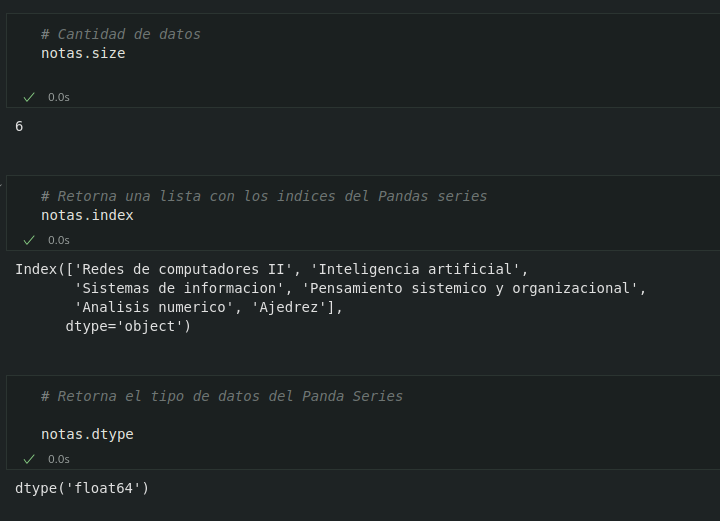

#### Acceso a los elementos de una Serie

El acceso a los elementos de una objeto del tipo Series puede ser a traves de posiciones o atraves de indices (nombre)

##### Acceso por posición

* `s`[i]: Devuelve el elemento que ocupa la posicion i+1 en la serie `s`.

##### Acceso por indice

* `s`[nombre] Devuelve el elemento con el nombre nombre en el indice.
* `s`[nombres] Devuelve otra serie con los elementos con los nombre de la lista `nombres` en el indice.

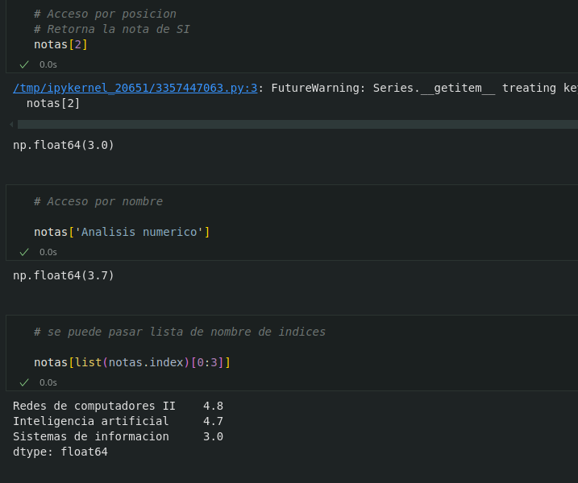

#### Resumen descriptivo de una Serie:

* Las siguientes funciones permiten resumir varios aspectos de una serie:

    * s.`count`() Devuelve el numero de elementos que no son nulos ni `NaN` en la serie s.

    * s.`sum`() Devuelve la suma de los datos de la serie s cuando los datos son de un tipo numérico, o la concatenación de ellos cuando son del tipo cadena `str`.

    * s.`cumsum`() Devuelve una serie con la suma acumulada de los datos de la serie s cuando son de tipo numérico.

    * s.`value_counts`() Devuelve una serie con la frecuencia (Numeros de repeticiones) de cada valor de la serie s.

    * s.`min`() Devuelve el menor de los datos de la serie s.

    * s.`max`() Devuelve el mayor de los datos de la serie s.

    * s. `mean`() Devuelve la media de los datos de la serie s cuando los datos son de un tipo numerico.

    * s.`std`() Devuelve la desviación típica de los datos de la serie s cuando los datos son de un tipo numerico.

    * s.`describe`() Devuelve una serie con un resumen descriptivo que incluye el numero  de datos,su suma, el maximo, la media, la desviasion tipica y los cuartiles.

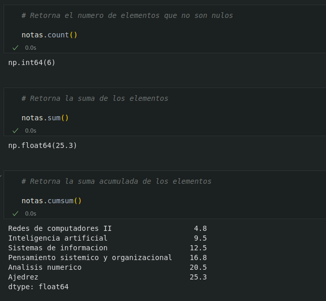

 

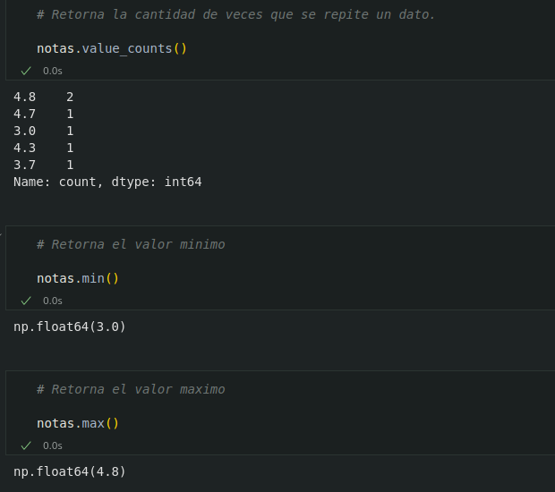

 

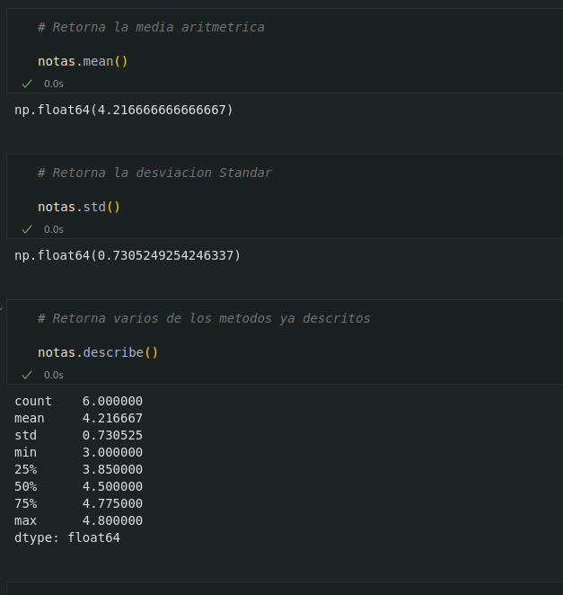

##### Aplicar operaciones a una Serie

Los operadores binarios  <i style="color:#CFDE74">(+,*,/,etc) </i>pueden utilizarse como una serie, y devuelven otra serie con el resultado de aplicar la operacion a cada elemento de la serie.

##### Aplicar funciones a una Serie

* También es posible aplicar una función a cada elemento de la serie mediante el siguiente método:

    * s.`apply`(f) Devuelve una serie con el resultado de aplicar la funcion f a cada uno de los elementos de la serie s.
    

##### Filtrado de una Serie

* Para filtrar una serie y quedarse con los valores que cumplen una determinada condición se utiliza el siguiente método:

    * s.[condición] Devuelve una serie con los elementos de la serie s que se corresponde con el valor `True` de la lista booleana condición.condición debe ser una lista de valores booleanos de la misma longitud.

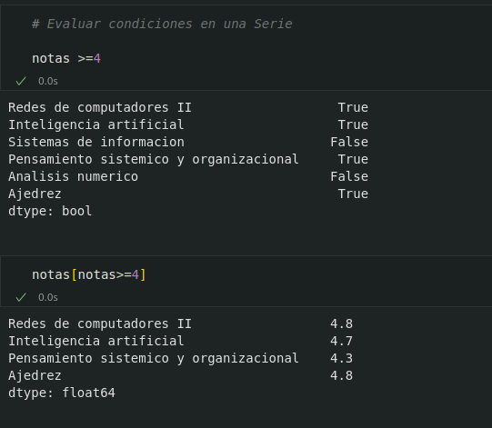

##### Ordenar una Serie

* Para ordenar una serie se utilizan los siguientes metodos:

    * s.`sort_values`(ascending=booleano) Devuelve la serie que resulta de ordenar los valores de la serie s. Si argumento del parámetro ascending es `True` el orden es creciente y si es `False` decreciente.

    * s.`sort_idex`(ascending=booleano) Devuelve la serie que resulta de ordenar el indice de la serie s. Si el argumento del parametro ascending es `True` el orden es creciente si es `False` decreciente.

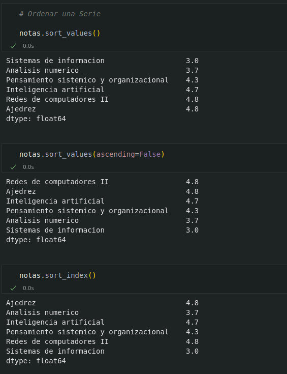

##### Eliminar los datos desconocidos en una Serie

Los datos desconocidos representa en Pandas por `NaN` y los nulos por `None`. Tanto unos como otros suelen ser un problema a la hora de realizar algunos analisis de datos, por lo que es habitual eliminarlos. Para eliminarlos de una serie se utiliza el siguiente metodo.

* s.`dropna`() Elimina los datos desconocidos o nulos de la serie s.

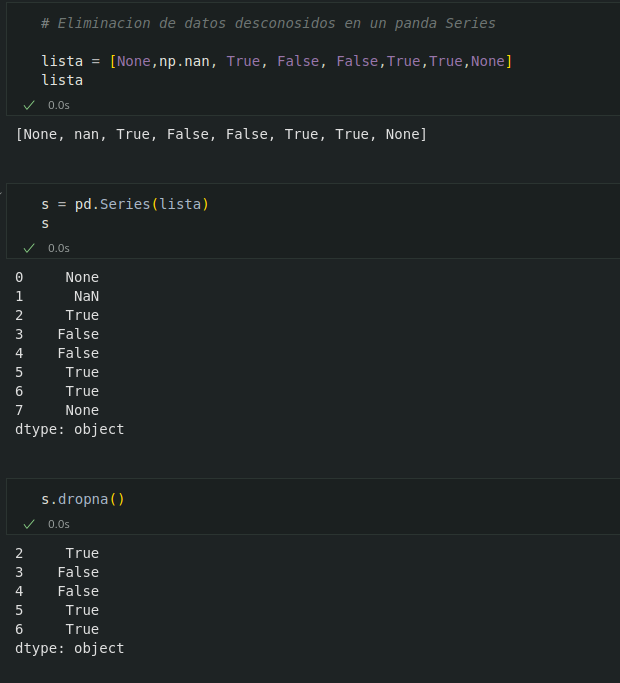

#### Eliminar datos en una Serie

Para eliminar datos de un pandas Serie vasta con pasar el indice que se desea eliminar al siguiente metodo

s.`drop`[nombre] Eliminar el elemento asociado al indice de nombre nombre de la serie s.

### La clase de objetos DataFrame

Un objeto de tipo DataFrame define un conjunto de datos estructurado en forma de tabla donde cada columna es un objeto de tipo Series, es decir, todos los datos de una misma columna son del mismo tipo y las filas son registros que puede contener datos de distintos tipos.
 
Un DataFrame contiene dos indices, uno para las filas y otro para las columnas, y se puede acceder a sus elementos mediante los nombre de las filas y las columnas.
 
<strong>Ejemplo:</strong> El siguiente DataFrame contiene informacion sobre los alumanso de un curso. Cada fila corresponde a un alumno y cada columna a una variable.

#### Creación de un DataFrame a partir de un diccionario de listas

* Para crear un DataFrame a partir de un diccionario cuyas claves son los nombres de las columnas y los valores son lista con los datos de las columnas se utiliza el metodo:

    * `DataFrame`(data=diccionario,index=filas,columns =columnas,dtype=tipo) : Devuelve un objeto del tipo `DataFrame` cuyas columnas son las lista contenidas en los valores del diccionario diccionario, los nombre de las filas indicados en la lista filas, los nombres de columnas indicados en la lista columnas y los tipos indicados en la lista tipos. La lista filas tiene que tener el mismo tamaño que las listas del diccionario, mientras que las lista columnas y tipo tiene que tener el mismo tamaño que el diccionario. Si no se pasa la lista de filas se utiliza como nombres los enteros empezando en 0, Si no se pasa la lista de columnas se utilizan como nombres las claves del diccionario.Si no se pasa la lista de tipos se infiere.

* Los valores asociados a las claves del diccionario deben ser lista del mismo tamaño.

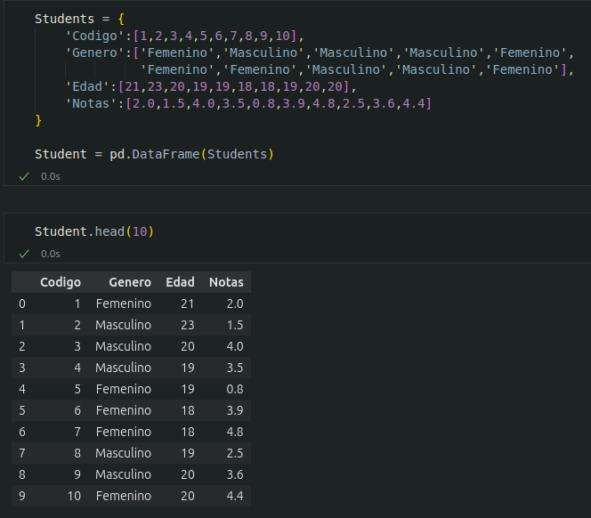

#### Creación de un DataFrame a partir de una lista de listas

* Para crear un DataFrame a partir de una lista de listas con los datos de las columnas se utiliza el siguiente metodo:

    * `DataFrame`(data=listas,index=filas,columns=columnas, dtype=tipos) Devuelve un objeto del tipo `DataFrame` cuyas columnas son los valores de las listas de la lista listas, los nombres de las filas indicados en la lista filas, los nombres de las columnas indicados en la lista columnas y los tipos indicados en la lista tipos. La lista filas, tiene que tener el mismo tamaño que la lista listas mientras que las lista columnas y tipos tiene que tener el mismo tamaño que la lista anidadas en listas. Si no se pasa de la lista de tipos, se infiere.

* Si las lista anidadas en listas no tiene el mismo tamaño, las listas menores se rellena con valores `NaN`.

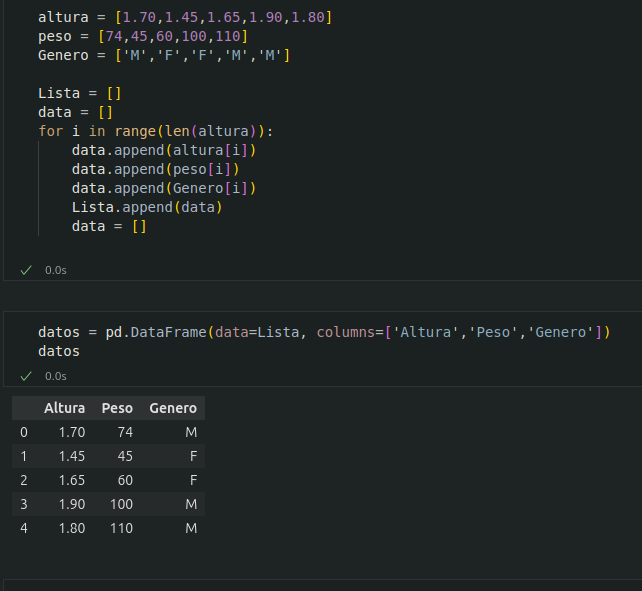

#### Creacion de un DataFrame a partir de un array

* Para crear un DataFrame a partir de un array de NumPy se utiliza el siguiente metodo

    * `DataFrame`(data = array , index= filas.columns=columnas, dtype=tipo) Devuelve un objeto del tipo `DataFrame` cuyas filas y columnas son las del `array`, los nombres de las filas indicados en la lista filas, los nombres de las columnas indicado en la lista columnas y el tipo indicado en la lista tipo. La lista filas tiene que tener el mismo tamaño que el numero de filas del `array` y la lista columnas el mismo tamaño que el numero de columnas del `array`. Si no se pasa la lista de filas se utiliza enteros empezando desde cero y para las columnas seria lo mismo.

#### Creación de un DataFrame a partir de un fichero CSV o Excel

* Dependiendo del tipo de fichero, existen distintas funciones para importar un DataFrame desde un fichero.
  
    * ` read_csv`(fichero.csv, sep=separador, header=n, index_col=m, na_values= no-validos, decimal=separador-decimal) : Devuelve un objeto del tipo `DataFrame` con los datos del fichero `CSV` fichero.csv usando como separador de los datos la cadena separador. Como nombres de columnas se utiliza los valores de la fila n y como nombres de filas los valores de la columna m. Si no se indica m se utilizan como nombres de filas los enteros empezando en 0. Los valores incluídos en la lista no-validos se convierten en `NaN.` Para los datos numéricos se utiliza como separador de decimales el carácter indicado en separador-decimal.

    * `read_exce`l(fichero.xlsx, sheet_name=hoja, header=n, index_col=m, na_values=no-validos, decimal=separador-decimal)  Devuelve un objeto del tipo `DataFrame` con los datos de la hoja de cálculo hoja del fichero `Excel` fichero.xlsx. Como nombres de columnas se utiliza los valores de la fila n y como nombres de filas los valores de la columna m. Si no se indica m se utilizan como nombres de filas los enteros empezando en 0. Los valores incluídos en la lista no-validos se convierten en `NaN`. Para los datos numéricos se utiliza como separador de decimales el carácter indicado en separador-decimal.
    

#### Atributos de un DataFrame

* Existen varias propiedades o metodos para ver las caracteristicas de un DataFrame

    * df.`info`( ) Devuelve informacion (numero de filas, numero de columnas, indices ,tipo de las columnas y memoria usado).

    * df.`shape` Devuelve una tupla con el numero de filas y columnas del DataFrame df.

    * df.`size` Devuelve el numero de elementos del DataFrame df.

    * df.`columns` Devuelve una lista con los nombres de las columnas del DataFrame df.

    * df.`index` Devuelve una lista con los nombre de las filas del DataFrame df.

    * df.`dtypes` Devuelve una serie con los tipos de datos de las columnas del DataFrame df.

    * df.`head`(n) Devuelve las n primeras filas del DataFrame df.

    * df.`tail`(n) Devuelve las n ultimas filas del DataFrame df.

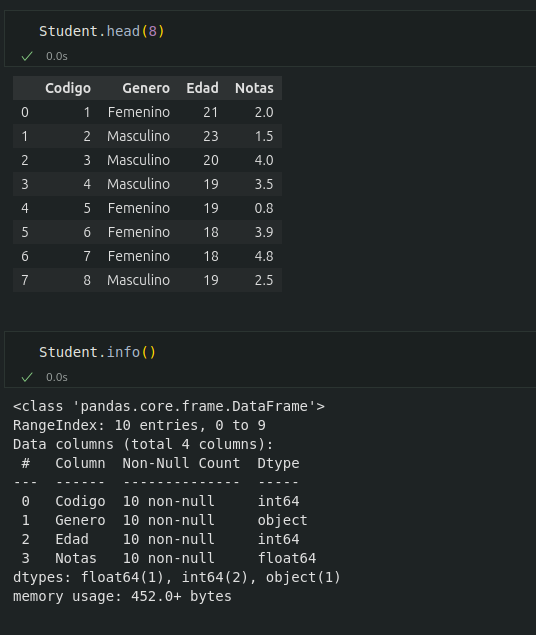

 

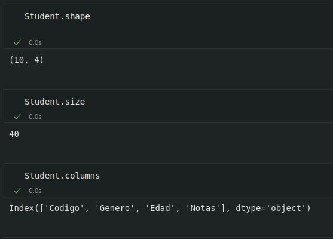

 

#### Renombrar los nombres de las filas y columnas

Para cambiar el nombre de las filas y las columnas de un DataFrame se utiliza el siguietne metodo

df.rename(columns=columnas, index=filas) Devuelve el `DataFrame` que resulta de renombrar las columnas indicadas en las claves del diccionario columnas con sus valores y las filas indicadas en las clave del diccionario filas con sus valores en el `DataFrame` df.

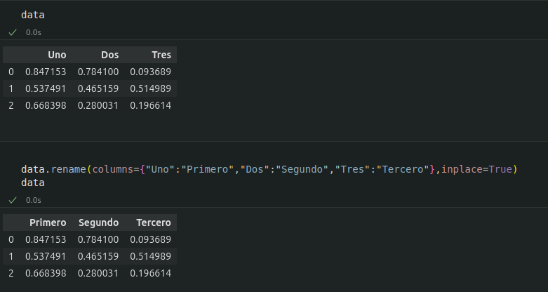

#### Reindexar un DataFrame

Para reordenar los indices de las filas y las columnas de un DataFrame, asi como añadir o eliminar indicies, se utiliza el siguiente metodo:

df.`reindex`(index=filas, columns = columnas ,fill_value = relleno) Devuelve el `DataFrame` que resulta de tomar del DataFrame df las filas con nombres en la lista filas y las columnas con nombres en la lista columnas. Si alguno de los nombres indicado en filas o columnas no existía en el DataFrame df , se crean fila o columnas nuevas con el valor de relleno. 

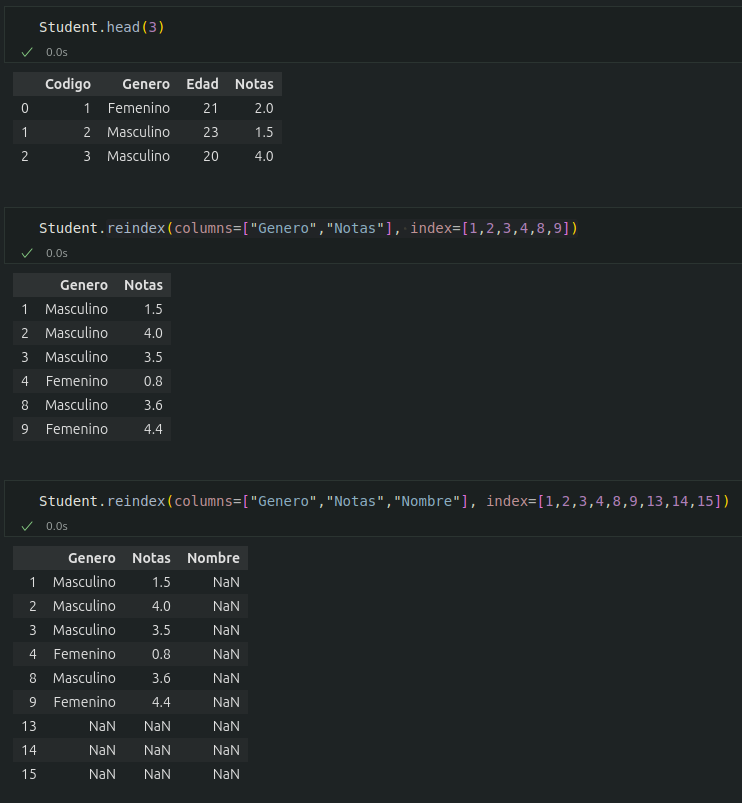

##### Acceso a los datos de un DataFrame 

El acceso a los datos de un DataFrame se puede hacer a traves de posiciones o  traves de los nombres de las filas y columnas.

##### Accesos mediante posiciones

* df.`iloc`[i,j] Devuelve el elemento que se encuentra en la fila i y la columna j del DataFrame  df. Pueden indicarse secuencias de indices para obtener partes del DataFrame.

* df.`iloc`[i] Devuelve una serie con los elementos de la fila i del DataFrame df.

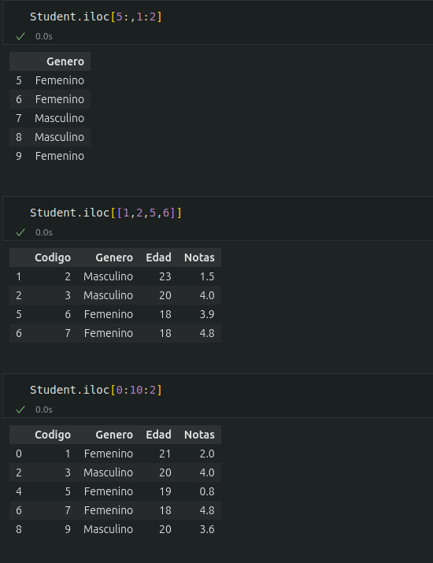

##### Acceso a los elemento mediante nombre 

* df.`iloc`[filas,columnas] Devuelve un DataFrame con los elementos de las filas de la lista filas y de las columnas de la lista columnas.

* df`[`columna`]` Devuelve una serie con los elementos de la columna de nombre columna del DataFrame df

* df.`columna` Devuelve una serie con los elementos de la columna de nombre columna del DataFrame df. Es similar al metodo anterior pero solo funciona cuando el nombre de la columna no contiene espacios en blanco.

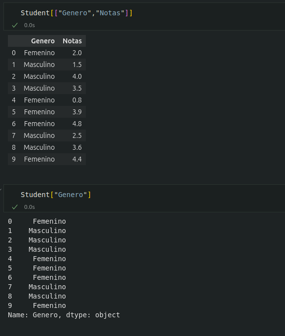

 

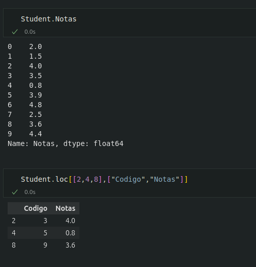

#### Operaciones con las columnas de un DataFrame

##### Añadir columnas a un DataFrame

* El procedimiento para añadir una nueva columna a un DataFrame es similar al de añadir un nuevo par a un diccionario, pero pasando los valores de la columna en una lista o serie

    * df[nombre] = lista Añade al DataFrame df una nueva columna con el nombre nombre y los valores de la lista. La lista debe tener el mismo tamaño que el numero de filas de df.

    * df[nombre] = serie Añade al DataFrame df una nueva columna con el nombre nombre y los valores de la serie serie. Si el tamaño de la serie es menor que el numero de filas de df se rellena con valores `NaN` mientras que si es mayor se recorta.

#### Operaciones sobre columnas

Puesto que los fatos de una misma columna de un DataFrame son del mismo Tipo, es facil aplicar la misma operacion a todos los elementos de la columna

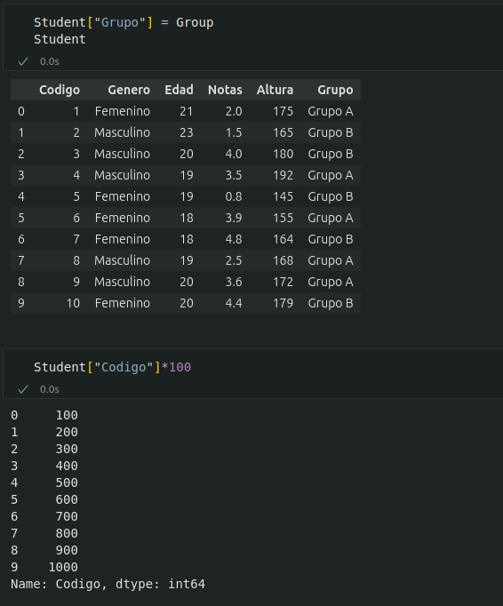

 

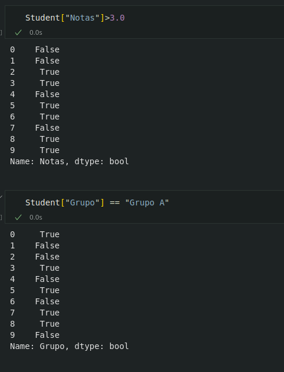

#### Aplicar funciones a columnas

Para aplicar funciones a todos los elementos de una columna se utiliza el siguiente metodo

df`[`columna`]`.`apply`(f) Devuelve una serie con los valores que resulta de aplicar la funcion f a los elementos de la columna con nombre columna del DataFrame df.

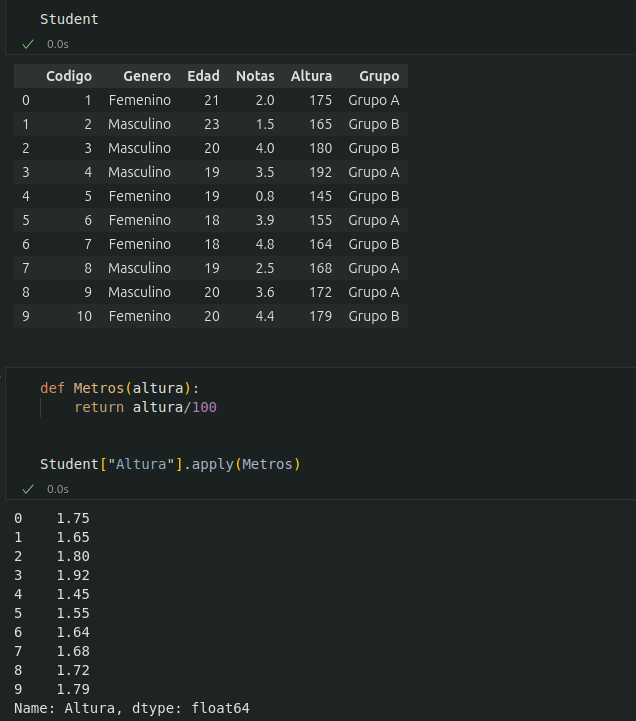

#### Convertir una columna al tipo datetime

* A menudo una columna contiene cadenas que representa fechas. Para convertir estas cadenas al tipo datatime se utiliza el siguiente metodo

    * `to_datatime`(columna, formato) Devuelve la serie que resulta de convertir las cadenas de la columna con el nombre columna en fechas del tipo datatime con el formato especificado en formato.

#### Resumen descriptivo de un DataFrame

* Al igual que las series, los siguientes metodos permiten resumir la informacion de un DataFrame por columnas:

    * df.`count`() : Devuelve una serie número de elementos que no son nulos ni `NaN` en cada columna del DataFrame df.

    * df. `sum`() : Devuelve una serie con la suma de los datos de las columnas del DataFrame df cuando los datos son de un tipo numérico, o la concatenación de ellos cuando son del tipo cadena `str`.

    * df.`cumsum`() : Devuelve un DataFrame con la suma acumulada de los datos de las columnas del DataFrame df cuando los datos son de un tipo numérico.

    * df.`min`() : Devuelve una serie con los menores de los datos de las columnas del DataFrame df.

    * df.`max`() : Devuelve una serie con los mayores de los datos de las columnas del DataFrame df.

    * df.`mean`() : Devuelve una serie con las media de los datos de las columnas del DataFrame df cuando los datos son de un tipo numérico.

    * df.`std`() : Devuelve una serie con las desviaciones típicas de los datos de las columnas del DataFrame df cuando los datos son de un tipo numérico.

    * df.`describe`(include = tipo) : Devuelve un DataFrame con un resumen estadístico de las columnas del DataFrame df del tipo tipo. Para los datos numéricos (number) se calcula la media, la desviación típica, el mínimo, el máximo y los cuartiles de las columnas numéricas. Para los datos no numéricos (object) se calcula el número de valores, el número de valores distintos, la moda y su frecuencia. Si no se indica el tipo solo se consideran las columnas numéricas

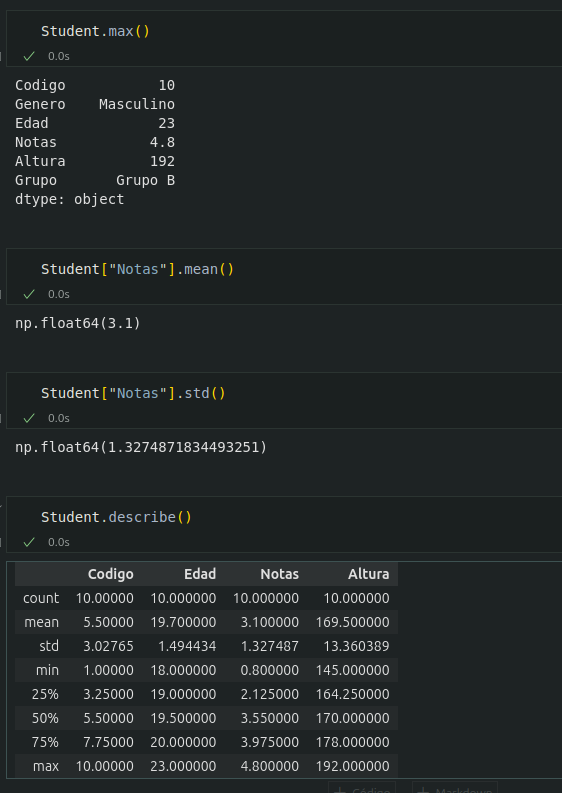

#### Eliminar columnas de un DataFrame 

* Para eliminar columnas de un DataFrame se utilizan los siguientes metodos

    * `del` df[nombre] Elimina la columna con nombre nombre del DataFrame df.

    * df.`pop`(nombre) Elimina la columna con nombre nombre del DataFrame df y la devuelve como una serie.

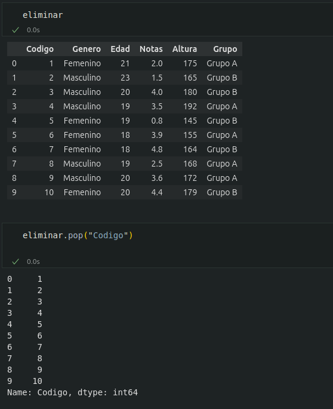

#### Operaciones con las filas de un DataFrame

##### Añadir una fila a un DataFrame

* Para añadir una fila a un DataFrame se utiliza el siguiente metodo

    * pd.`concat`([df,fila],ignore_index=True) Devuelve el DataFrame que resulta de añadir una fila al DataFrame df con los valores de la Dataframe . Los nombres del indice de la serie deben corresponderse con los nombres de las columnas de df. 

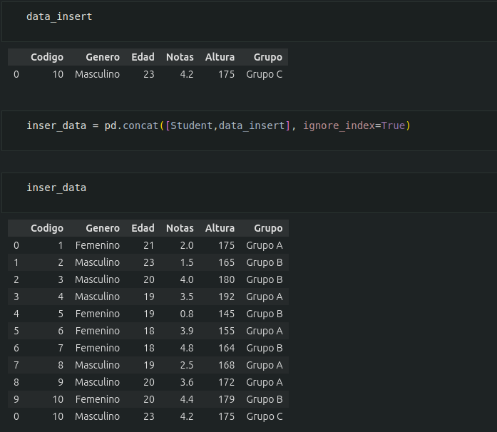

#### Eliminar fila de un DataFrame

* Para eliminar filas de un DataFrame se utilizan el siguiente metodo

    * df.`drop`(filas) Devuelve el DataFrame que resulta de eliminar las filas con los nombres indicados en la lista filas del DataFrame df.

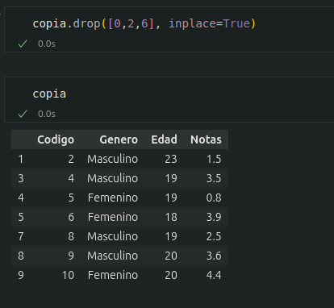

#### Filtrado de las filas de un DataFrame

* Una operacion comun con un DataFrame es obtener las filas que cumplen una determinada condicion.

    * df`[`condicion`]` Devuelve un DatFrame con las filas del DataFrame df que se corresponden con el valor True de la lista booleana condicion.condicion debe ser una lista de valores booleanos de las misma longitud que el numero de filas del DataFrame.

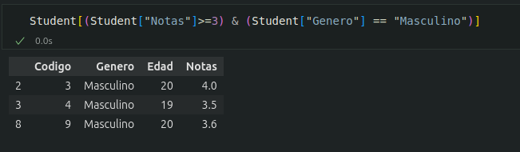

#### Ordenar un DataFrame 

* Para ordenar un DataFrame de acuerdo a los valores de una determinada columna se utiliza los siguientes metodos:

    * df.sort_values(columna, ascending = boolenano) Devuelve el DataFrame que resulte de ordenar las filas del DataFrame df segun los valores de la columna con el nombre columna. SI el argumento del parametro ascending es `True` el orden es creciente si es `False` decreciente.

    *  df.sort_index(ascending = booleano) Devuelve el DataFrame que resulta de ordenar las filas del DataFrame df segun los nombre de las filas, Si el argumento del parametro ascending es `True` el orden es creciente y si es `False` decreciente.

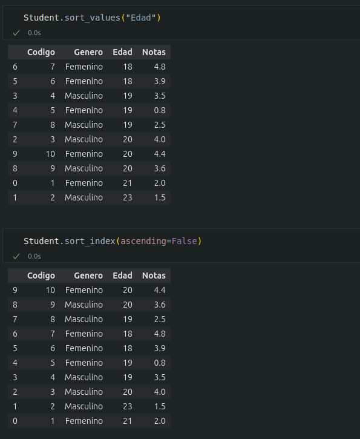

#### Eliminar las filas con datos desconocidos en un DataFrame

* Para eliminar las filas de un DataFrame que resulta de eliminar las filas que contienen algun dato desconocido o nulo se utiliza el siguiente metodo

    * df.`dropna`(subset = columnas) Devuelve el DataFrame que resulta de eliminar las filas que contienen algun dato desconocido o nulo en las columnas de la lista columna del DataFrame df. Si no se pasa un argumento al parametro subset se aplica a todas las columnas del DataFrame.

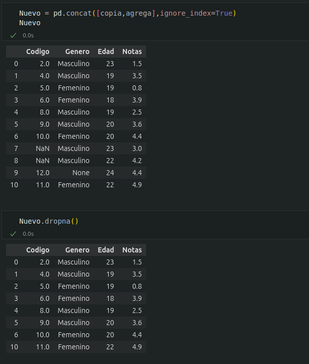

#### Agrupacion de un DataFrame

En muchas aplicaciones es util agrupar los datos de un DataFrame de acuerdo a los valores de una o varias columnas (Categorias), como por ejemplo el sexo o el pais

##### Dividir un DataFrame en grupos

* Para dividir un DataFrame en grupos se utiliza el siguiente metodo:

*   df.`groupby`(columnas).`groups` Devuelve un diccionario con cuyas claves son las tuplas que resulta de todas las combinaciones de los valores de las columnas con nombres en la lista columnas, y valores las lista de los nombres filas que contienen esos valores en las correspondientes columnas del DataFrame df.
    
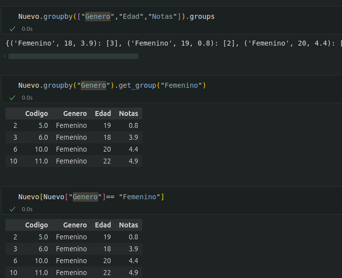

