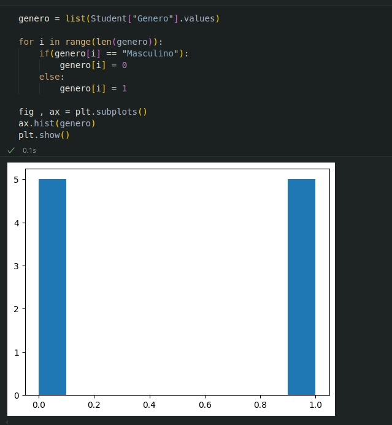
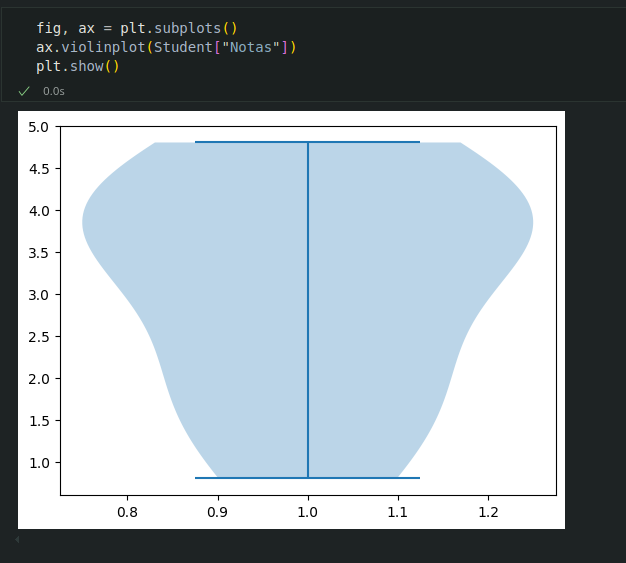
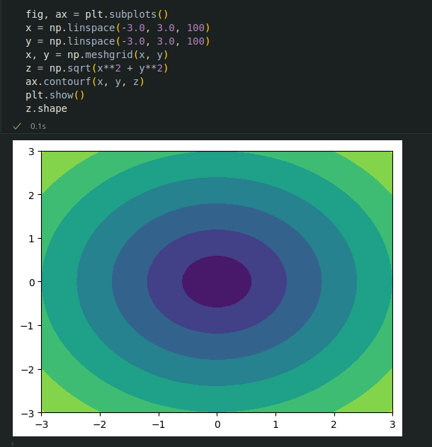
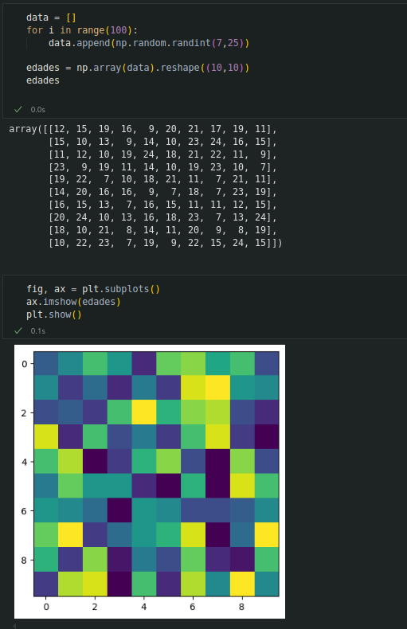
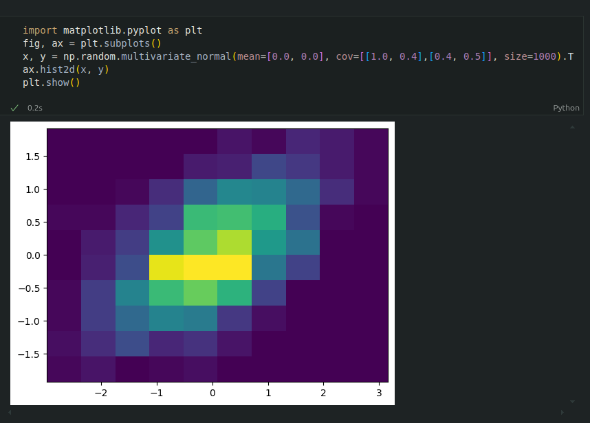
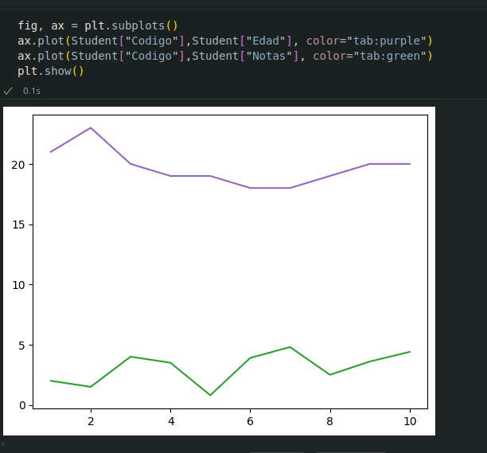
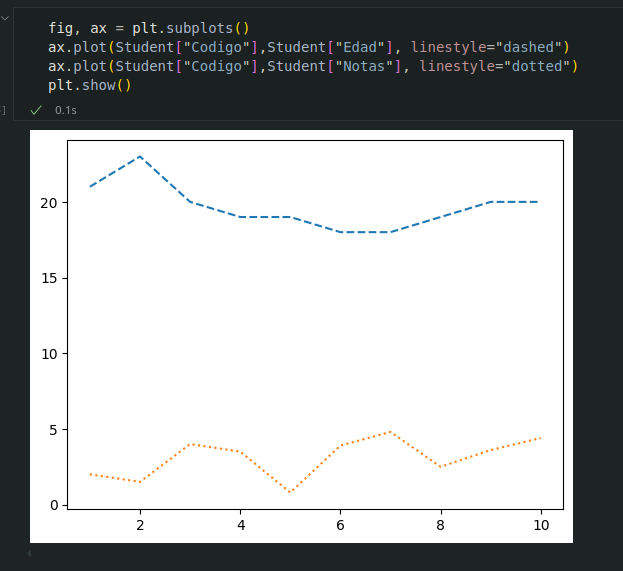
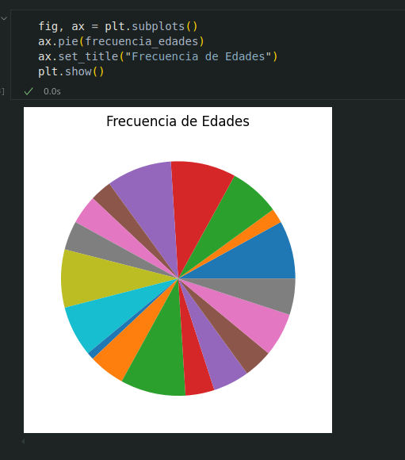
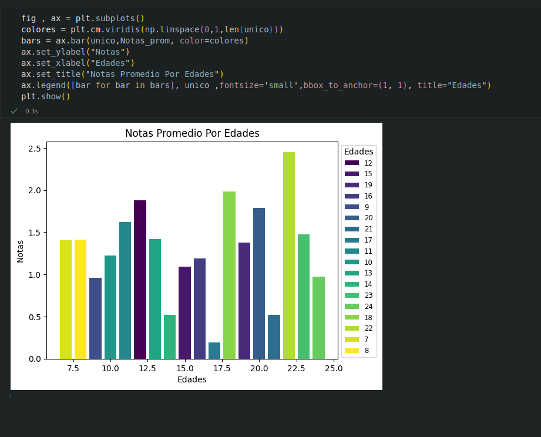
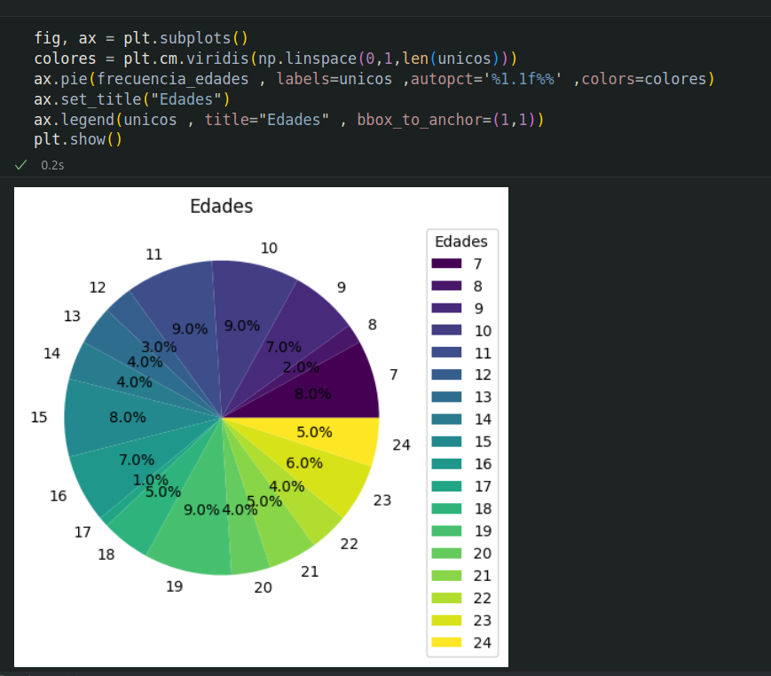

# 8. Matplotlib

## Que es ?

* `Matplotlib` es una librería de Python especializada en la creación de gráficos en dos dimensiones. Permite crear y personalizar los tipos de gráficos mas comunes, entre ellos:

    * Diagramas de barras
    * Histogramas
    * Diagramas de sectores
    * Diagrama de cajas y bigotes
    * Diagrama de violín 
    * Diagrama de dispersión o puntos 
    * Diagramas de lineas
    * Diagramas de áreas 
    * Diagrama de contorno
    * Mapas de color
    

### Creación de gráficos con Matplotlib

Para crear un grafico con matplotlib es habitual seguir los siguientes pasos:

1. Importar el modulo `pyplot`.

2. Definir la figura que contendra el grafico, que es la region (Ventana o Pagina) donde se dibujara y los ejes sobre los que se dibujaran los datos. Para ello se utiliza la funcion `subplots`().

3.  Dibujar los datos sobre los ejes. Para ello se utilizan distintas funciones dependiendo del tipo de grafico que se quiera.

4. Personalizar el grafico. Para ello existen multitud de funciones que permiten añadir un titulo, una leyenda, una rejilla, cambiar colores o personalizar los ejes.

5. Guardar el grafico. Para ello se utiliza la funcion `savefig`().

6. Mostrar el grafico. Para ello se utiliza la funcion `show`(). 

#### Diagramas de dispersion o puntos

* `scatter`(x,y) Dibuja un diagrama de puntos con las coordenadas de la lista x en el eje X y las coordenadas de la lista y en el eje Y.

#### Diagramas de lineas

* `plot`(x,y) Dibuja un poligono con los vectores dados por las coordenadas de la lista x en el eje X y las coordenadas de la lista y en el eje Y.

#### Diagrama de areas

* `fill_between`(x, y) Dibuja el area bajo el poligono con los vertices dados por las coordenadas de la lista x en el eje X y las coordenadas de la lista y en el eje Y.

### Diagrama de barras verticales

* `bar`(x,y) Dibuja un diagrama de barras verticales donde x es una lista con la posicion de las barras en eje X, e y es una lista con la altura de las barras en el eje Y.

### Diagrama de barras verticales

* `barh`(x,y) Dibuja un diagrama de barras horizontales donde x es una lista con la posicion de las barras en eje Y, e y es una lista con la altura de las barras en el eje X.

#### Histogramas

* `hist`(x, bins): Dibuja un histograma con las frecuencias resultantes de agrupar los datos de
la lista x en las clases definidas por la lista bins

#### Diagrama de sectores

* `pie`(x) Dibuja un diagrama de sectores con las frecuencias de la lista x.

#### Diagrama de caja y bifotes

* `boxplot`(x) Dibuja un diagrama de caja y bigotes con los datos de la lista x.

#### Diagramas de violin

* `violinplot`(x) Dibuja un diagrama de violin con los datos de la lista x.

#### Diagrama de contorno

* `contourf`(x,y,z) Dibuja un diagrama de contorno con las curvas de nivel de la superficie dada por los puntos con las coordenadas de la lista x,y  e z en los ejes X ,Y, Z respectivamente

#### Mapas de Color

* `imshow`(x) Dibuja un mapa de color a partir de una matriz (array bidimensional) x.

* `hist2d`(x,y) Dibuja un mapa de color que simula un histograma bidimensional, donde los colores de los cuadrados dependen de las frecuencias de las clases de la muestra dada por las listas x e y.

### Cambiar el aspecto de los graficos 

Los graficos creados con Matplotlib son personalizables y puede cambiarse el aspecto de casi todo sus elementos. Los elementos que suelen modificarse mas a menudo son:

* Colores
* Marcadores de puntos
* Estilos de lineas
* Titulos 
* Ejes
* Leyenda
* Rejilla

#### Colores

Para cambiar el color de los objetos se utiliza el parametro color = nombre-color, donde nombre-color es una cadena con el nombre del color de entre los disponibles.

#### Marcadores

Para cambiar la forma de los puntos marcadores se utiliza el parametro maker = nombre-marcador donde nombre-marcador es una cadena con el nombre del marcador de entre los marcadores disponibles

#### Líneas

Para cambiar el estilo de las líneas se utiliza el parámetro linestyle = nombre-estilo donde nombre-estilo es una cadena con el nombre del estilo de entre los estilos disponibles

#### Títulos

Para añadir un título principal al gráfico se utiliza el siguiente método:

* ax.`set_title`(titulo, loc=alineacion, fontdict=fuente) Añade un título con el contenido de la cadena titulo a los ejes ax. El parámetro loc indica la alineación del título, que puede ser 'left' (izquierda), 'center' (centro) o 'right' (derecha), y el parámetro fontdict indica mediante un diccionario las características de la fuente (la el tamaño fontisize, el grosor fontweight o el color color).

#### Ejes

Para cambiar el aspecto de los ejes se suelen utilizar los siguientes métodos:

* ax.`set_xlabel`(titulo) : Añade un título con el contenido de la cadena titulo al eje x de ax. Se puede personalizar la alineación y la fuente con los mismos parámetros que para el título principal.
* ax.`set_ylabel`(titulo) : Añade un título con el contenido de la cadena titulo al eje y de ax. Se puede personalizar la alineación y la fuente con los mismos parámetros que para el título principal.
* ax.`set_xlim`([limite-inferior, limite-superior]) : Establece los límites que se muestran en el eje x de ax.
* ax.`set_ylim`([limite-inferior, limite-superior]) : Establece los límites que se muestran en el eje y de ax.
* ax.`set_xticks`(marcas) : Dibuja marcas en el eje x de ax en las posiciones indicadas en la lista marcas.
* ax.`set_yticks`(marcas) : Dibuja marcas en el eje y de ax en las posiciones indicadas en la lista marcas.
* ax.`set_xscale`(escala) : Establece la escala del eje x de ax, donde el parámetro escala puede ser 'linear' (lineal) o 'log' (logarítmica).
* ax.`set_yscale`(escala) : Establece la escala del eje y de ax, donde el parámetro escala puede ser 'linear' (lineal) o 'log' (logarítmica).

 

