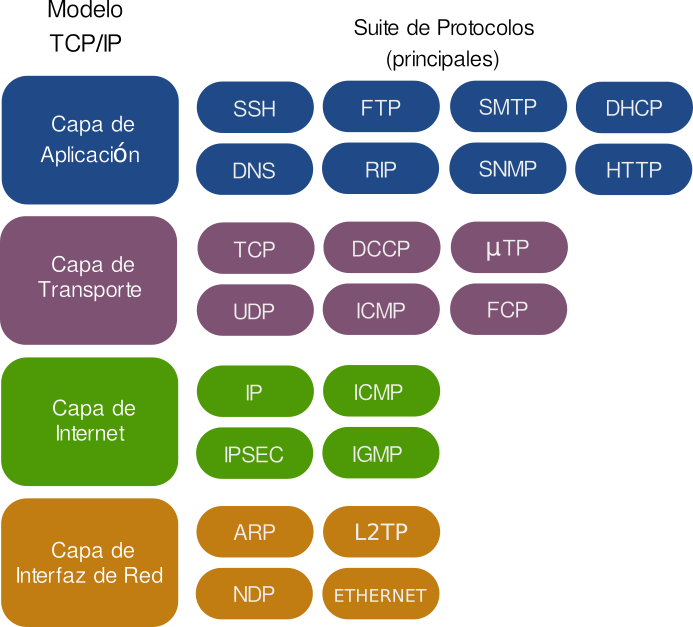

1 INTRODUCCION
==============

# Componentes de una Red de Computadores

## Dispositivos de Usuario Final (Host):

* **Computadores** Pueden ser servidores o estaciones de trabajo.
* **Dispositivos Moviles** Celulares, tablest, etc
* **Perifericos** Impresoras, escaneres,etc

## Dispositivos de Red:

* **Routers** Encaminan el trafico entre diferentes redes.
* **Switches** Conectan dispositivos dentro de una misma red.
* **Access Points** Permiten la conexion inalambrica de dispositivos.

## Medios de Transmision:

* **Cables** Ethernet, fibra optica, etc.
* **Medios Inalambricos** Wi-Fi, Bluetooth,etc.

# Protocolos 

## Que es ?

Los protocolos de red son un conjunto de reglas y estandares que permiten la comunicacion entre dispositivos en una red. Estos protocolos definen como se envian, reciben y procesan los datos, asegurando que los dispositivos pueden entenderse entre si. 

## Funciones de los Protocolos de Red

* **Encapsulacion** Los datos se dividen en paquetes y se encapsulan con la informacion necesaria para su transmision.

* **Direccionamiento** Los protocolos define como se asignan y utilizan las direcciones `IP`.

* **Control de Flujo** Gestionan la cantidad de datos que se envia para evitar la congestion de red.

* **Correccion de Errores** Detectan y corrigen errores en la transmision de datos.

* **Seguridad** Algunos protocolos, como `HTTPS`, cifran los datos para proteger la informacion.   

# Clasificación de un Red:

## Por Alcance Geografico

### Pan (Pesonal Area Network)

Redes de are personal, tipicamente usadas entre la comunicacion entre dispositivos cercanos, como telefonos moviles y computadores personales.

### LAN (Local Area Network)

Redes de area Local, que conecta dispositivos dentro de un area limitada, como una oficina o un edificio.

### MAN (Metropolitan Area Network)

Redes de area metropolitana que cubren un area mas grande que una LAN, como una ciudad o un campus universitario.

### WAN (Wide Area Network)

Redes de area amplia que abarcan grandes distancias geograficas como paises o continentes Internet es el ejemplo mas conocido de una WAN.

## Por Relacion Funcional

### Redes Cliente-Servidor

Un servidor central proporciona recursos y servicios a multiples clientes.

### Redes Peer To Peer (P2P)

Todos los dispositivos en la red tienen igual estatus y pueden actuar como clientes y servidores,

## Por Topologia

La Topologia de red se refiere a la disposicion fisica o logica de los dispositivos y conexiones en una red de computadores. 

### Topologias Fisicas

#### Topologias en estrella

Todos los dispositivos estan conectados a un nodo central (como un switch o un hub). Facil de instalar y gestionar; si un dispositivo falla, no afecta a los demas, Si el nodo central falla toda la red se cae.

#### Topologia en Bus.

Todos los dispositivos estan conectados a un unico cable central (bus). Facil de implementar y economica. Si el cable central falla, toda la red se cae; puede haber colisiones de datos.

#### Topologia de Anillo

Cada dispositivo esta conectado a dos dispositivos adyacentes, formando un anillo. El flujo de datos es unidirecional, lo que reduce las colisiones. Si  un dispositivo o conexion falla, puede afectar a toda la red.

#### Topologia de Malla

Cada dispositivo esta conectado a varias otros dispositivos, proporcionando multiples caminos para los datos. Alta redundancia y fiabilidad; si una conexion falla, los datos pueden tomar otra ruta. Compleja y costosa de implementar.

#### Topologia de Arbol

Es una combinacion de topologias en estrella y bus, con nodos jerarquicamente organizados. Escalable y facil de gestionar. Si el nodo centra de una rama falla, esa rama se ve afectada.

### Topologias Logicas

#### Topologia Logica en Bus

Los datos se transmiten a todos los dispositivos en la red, pero solo el destinatario los acepta. Ejemplo Ethernet.

#### Topologia Logica en Anillo

Los datos se transmiten en un bucle cerrado,pasando por cada dispositivo hasta llegar al destinatario. Ejemplo: Token Ring.

#### Topologias Hibridas

Combinan dos o mas topologias basicas para aprobechar sus ventajas y minimizar sus desventajas.
Ejemplo Una red que utiliza una topologia en estrella para conectar varios anillos,

# Metodos de Transmision

## Transmisión Unicast

Los datos se envia desde un dispositivo a otro dispositivo especifico.

## Transmisión Multicast

Los datos se envia desde un dispositivo a multiples dispositivos especificos.

## Transmisión Broadcast

Los datos se envia desde un dispositivo a todos los dispositivos en la red.

# Ancho de Banda 

* **Definicion** El ancho de banda se refiere a la cantidad maxima de datos que se pueden transferir a traves de una conexion de red en un periodo de tiempo determinado, generalmente medido en bits por segundo (bps).

* **Funcion** Un mayor ancho de banda permite transferir mas datos simultaneamente, lo que se traduce en una mayor velocidad de descarga y carga.

# Latencia

* **Definicion**  La latencia es el tiempo que tarda un paquete de datos en viajar desde el origen hasta el destino y regresar, medido en milisegundos (ms).

* **Funcion** Una latencia baja significa que los datos se transmiten rapidamente, lo cual es esencial para aplicaciones en tiempo real .

