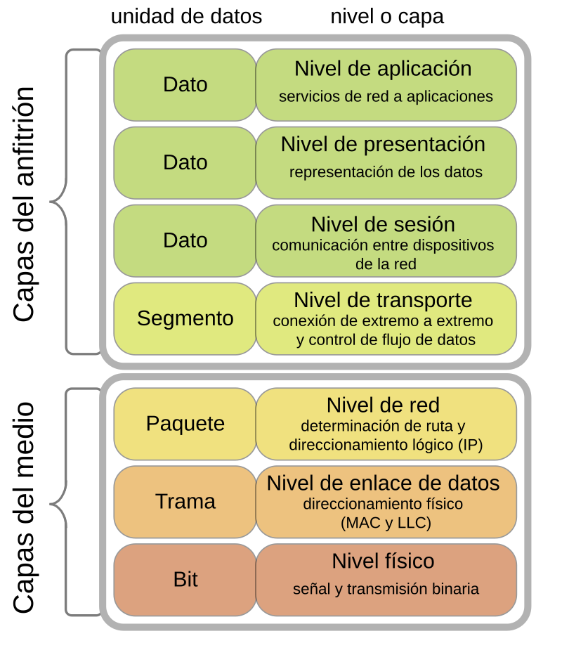
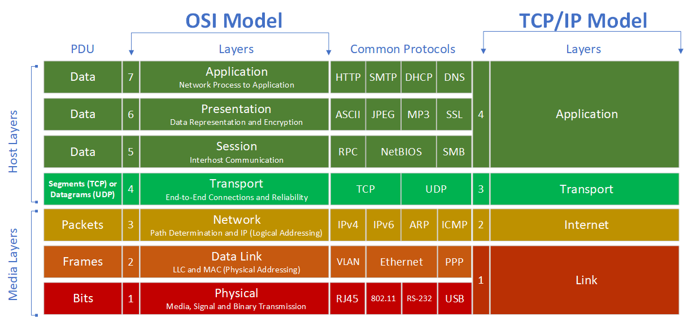
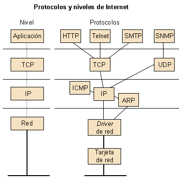

2 MODELOS DE REDES
========================

# Modelo OSI

El modelo <strong style="color:#84E4DD;">OSI</strong> <i style="color:#CFDE74">(Open Systems Interconnection)</i> es un marco conceptual que describe las funciones de un sistema de comunicacion en una red. Fue desarrollado por la Organizacion Internacional de normalizacion <i style="color:#CFDE74">(ISO)</i> y se divide en siete capas, cada una con funciones especificas.

## Capas del modelo OSI

1. **Capa fisica:** Se encarga de la transmision de bits a travez de un medio fisico. Incluye el hardware y las señales eléctricas, ópticas, o electromagneticas.

2. **Capa de enlace de datos:** Proporciona la transferencia de datos fiable entre dos nodos conectados directamente. Se encarga del direccionamiento fisico, deteccion y correcion de errores y control de flujo

3. **Cap de red:** Gestiona el direccionamiento lógico y la determinación de rutas para el trafico de datos. Es responsable de la entrega de paquetes de datos a travez de multiples redes.

4. **Capa de trasporte:**  Garantiza la transferencia fiable de datos de extremo a extremo, controlando el flujo y asegurando la integridad de los datos.

5. **Capa de sesion:** Gestiona y controla el diálogo entre dos dispositivos de red. Establece, gestiona y finaliza conexiones entre aplicaciones.

6. **Capa de presentacion:** Se encarga de la traduccion, cifrado y compresion de datos. Actua como un traductor entre el formato de la red y el formato de la aplicación .

7. **Capa de aplicacion:** Proporciona servicios de red a las aplicaciones del usuario. Incluye protocolos para correo electroníco, transferencia de archivos y navegacion web

# Modelo TCP/IP

El modelo <strong style="color:#84E4DD;">TCP/IP</strong> <i style="color:#CFDE74">(Transmission Control Protocol/Internet Protocol)</i> es un conjunto de protocolos de comunicacion utilizados en internet y redes similares. Esta basado en cuatro capas que simplifican el intercambio de datos entre dispositivos.

## Capas del Modelo TCP/IP 

1. **Capa de acceso a la red:** Equivalente a las capas Fisica y de Enlace de Datos del modelo `OSI`. Se encarga de la transmision de datos entre el hardware de la red y gestiona los aspectos fisicos y logicos del enlace de datos.

2. **Capa de internet:** Equivale a la Capa de Red del modelo `OSI`. Es responsable del direccionamiento y enrutamiento de paquetes a travez de multiples redes. El protocolo principal es el `IP` <i style="color:#CFDE74">(Internet Protocol)</i>.

3. **Capa de transporte:** Equivalente a la capa de trasporte del modelo `OSI`. Proporciona la transferencia de datos fiable y no fiable. Los principales protocolos son `TCP` <i style="color:#CFDE74">(Transmission Control Protocol)</i> y `UDP` <i style="color:#CFDE74"> (User Datagram Protocol)</i>.

4. **Capa de aplicacion:** Combina las funciones de las capas de Sesion, Presentacion y Aplicacion del modelo `OSI`, Proporciona servicios de red a las aplicaciones del usuario, como `HTTP`, `FTP` y `SMTP`.

# Comparacion entre OSI y TCP/IP

* **Capas:** El modelo `OSI` tiene siete capas, mientras que el modelo `TCP/IP` tiene cuatro, La estructura del modelo `TCP/IP` es mas simplificada,combinando varias funciones de las capas del modelo `OSI`.

* **Desarrollo:** El modelo `OSI` fue desarrollado como un marco teorico antes que los protocolos fueran estandarizados, mientras que el modelo `TCP/IP` fue desarrollado a partir de la practica y la implementacion real de redes.

* **Uso:** El modelo `OSI` fue mas utilizado como una herramienta de enseñanza y como referencia conceptual. El modelo `TCP/IP` es el estandar de facto para la comunicacion en redes, especialmente Internet.

* **Interoperabilidad:**  El modelo `OSI` esta diseñado para ser un estandar universal, promoviendo la interoperabilidad entre diferentes sistemas y fabricantes, El modelo `TCP/IP` se centra mas en la practicidad y la eficiencia en la trasmision de datos.

# Resumen de Protocolos en el Modelo TCP/IP

## Protocolos de la Capa de Acceso a la Red

* **Ethernet:** Define como se debe formater los paquetes de datos para ser enviados y recibidos en una red de area local <i style="color:#CFDE74">(LAN)</i>.

* **ARP (Address Resolution Protocol):** Traduce direcciones `IP` a direcciones `MAC` en una red local.

* **PPP (Point to Point Protocol):** Proporciona una conexion directa entre dos nodos de red.

## Protocolos de Capa de Internet

* **IP (Internet Protocol):** Protocolo principal que proporciona direccionamiento y enrutamiento de paquetes. Hay dos versiones principales: `IPv4` e `IPv6`.

* **ICMP (Internet Control Menssaje Protocol):** Utilizado para enviar mensajes de control y error entre dispositivos de red.

* **IGMP (Internet Group Management Protocol):** Gestiona la membresia de grupos multicast en redes `IPv4`.

## Protocolos de la Capa de Transporte

* **TCP (Transmission Control Protocol):** Proporciona una conexión fiable, ordenada y libre de errores entre aplicaciones. Controla el flujo de datos y retrasmite paquetes perdidos.

* **UDP (User Datagram Protocol):** Ofrece un servicio de transmision de datos no fiable y sin conexion, adecuado para aplicaciones que requieren velocidad sobre fiabilidad, como la transmision de video en tiempo real.

## Protocolos de la Capa de Aplicacion

* **HTTP (Hypertext Transfer Protocol):** Utilizado para la transferencia de paginas web y datos en la World Wide Web.

* **FTP (File Transfer Protocol):** Protocolo para la transferencia de archivos entre sistemas.

* **SMTP (Simple Mail Transfer Protocol):** Protocolo para el envio de correo electronico.

* **DNS (Domain Name System):** Traduce nombres de dominio legibles por humanos a direcciones `IP`.

* **TELNET:** Proporciona un acceso remoto a servidores y dispositivos de red a traves de una interfaz de linea de comandos.

* **SSH (Secure Shell):** Protocolo seguro para el acceso remoto a servidores y dispositivos de red.
   
   
# Protocolos A fondo

## Protocolos de la Capa de Acceso a la Red del Modelo TCP/IP

La capa de Acceso a la Red en el modelo <strong style="color:#84E4DD;">TCP/IP</strong> combina las Funciones de la capa Fisica y de Enlace de Datos del modelo <strong style="color:#84E4DD;">OSI</strong>. Esta capa es responsable de la Transmision de datos entre el dispositivo emisor y el receptor en una red Fisica.

### Ethernet

#### Que es ?

<strong style="color:#84E4DD;">Ethernet</strong> es una tecnologia de red que define como los dispositivos de una red local <i style="color:#CFDE74">(LAN)</i> pueden comunicarse entre si. Es el estandar mas utilizado para LANs y se especifica en la norma IEEE 802.3

#### Funcionamiento

<strong style="color:#84E4DD;">Ethernet</strong> utiliza un esquema de comunicacion llamado <strong style="color:#84E4DD;">CSMA/CD</strong> <i style="color:#CFDE74">(Carrier Sense Multiple Access with Collision Detection)</i> para gestionar el acceso al medio compartido:

* **Carrier Sense:** Los dispositivos monitoriean el medio antes de trasmitir para verificar que no haya trafico.

* **Mutliple Access:** Todos los dispositivos en la red tiene igual acceso al medio.
   
* **Collision Detection:** Si dos dispositivos transmiten al mismo tiempo, detecta la colision y detiene la trasmision esperando un tiempo aleatorio antes de intentarlo de nuevo.
 
#### Estructura del Trama Internet

Una trama <strong style="color:#84E4DD;">Ethernet</strong> tipica incluye los siguientes campos:

* **Preambulo:** Siete bytes utilizandos para sincronizar la transmision.

* **SFD (Start Frame Delimiter):** Indica el inicio del Trama.

* **Direccion Mac Destino:** Direccion del dispositivo de destino.

* **Direccion Mac Origen:** Direccion del dispositivo de origen.

* **Tipo/Etiqueta de Longitud:** Indica el tipo de protocolo en la carga util o la longitud de los datos.

* **Datos/Payload:** Datos que se esta trasmitiendo<i style="color:#CFDE74"> (46 a 1500 bytes).</i>

* **FCS (Frame Check Sequence):** Codigo de verificacion para detectar errores.

#### Implementacion

<strong style="color:#84E4DD;">Ethernet</strong> se implementa en el hardware de la tarjeta de red de cada dispositivo y en los switches que conecta estos dispositivos en una red LAN. Los switches <strong style="color:#84E4DD;">Ethernet</strong> gestionan el trafico de red al reenviar tramas solo a los dispositivos destino correctos.

### ARP (Address Resolution Protocol)

#### Que es ?

El <strong style="color:#84E4DD;">protocolo de Resolucion de Direcciones </strong><i style="color:#CFDE74">(ARP)</i> se utiliza para mapear direcciones <strong style="color:#84E4DD;">IP</strong> a direcciones <strong style="color:#84E4DD;">MAC</strong>  en una red local. Esto es esencial Para la comunicacion entre dispositivos en una LAN que utiliza <strong style="color:#84E4DD;">Ethernet</strong>.

#### Funcionamiento

Cuando un dispositivo necesita comunicarse con otro en la mismo red, utiliza <strong style="color:#84E4DD;">ARP</strong> para encontrar la direcion <strong style="color:#84E4DD;">MAC</strong> correspondiente a una direccion <strong style="color:#84E4DD;">IP</strong>.

* **Solicitud ARP:** El dispositivo emite una solicitud `ARP` a todos los dispositivos de la red <i style="color:#CFDE74">(Broadcast)</i>, preguntando quien tiene la direcion `IP` de destino.

* **Respuesta ARP:** El dispositivo que posee la direccion `IP` responde con su direccion `MAC`.

#### Estructura del Paquete ARP:  
  

 Un paquete <strong style="color:#84E4DD;">ARP</strong> incluye los siguientes campos:

 

 * **Tipo de Hardware:** Indica el tipo de red <i style="color:#CFDE74">(Por ejemplo: Ethernet)</i>

* **Tipo de Protocolo:** Especifica el protocolo de red<i style="color:#CFDE74"> (Por ejemplo, IPv4).</i>

* **Longitud de la Direccion de Hardware:** Longitud de la direccion `MAC` (<i style="color:#CFDE74">Generalmente 6 bytes).</i>

* **Longitud de la Direccion de Protocolo:** Longitud de la direccion `IP` <i style="color:#CFDE74">(Generalmente 4 bytes).</i>

*   **Operacion:** Indica si el paquete es una solictud (1) o una respuesta (2).

* **Direccion MAC de Origen:** Direccion `MAC` del dispositivo que envia la solicitud.

* **Direcion IP de Origen:** Direccion `IP` del dispositivo que envia la solicitud.

* **Direccion MAC de destino:** Direccion `MAC` del dispositivo que responde.

* **Direccion IP de Destino:** Direccion `IP` del destino que responde.

#### Implementacion

<strong style="color:#84E4DD;">ARP</strong> es una parte integral de las pilas de red en los sistemas operativos y es gestionado automaticamente por la mayoria de los dispositivos. Las tablas <strong style="color:#84E4DD;">ARP</strong> almacenan las asignaciones de direcciones <strong style="color:#84E4DD;">MAC</strong> e direcciones <strong style="color:#84E4DD;">IP</strong> para reducir la cantidad de solicitudes necesarias.

 
### PPP (Point-To-Point Protocol)

#### Que es ?

El <strong style="color:#84E4DD;">protocolo Punto a Punto</strong> <i style="color:#CFDE74">(PPP) </i>se utiliza para establecer una conexion directa entre dos nodos de red. Es comun en conexiones de acceso telefonico y conexiones directas de Internet.

#### Funcionamiento

<strong style="color:#84E4DD;">PPP</strong> proporciona autenticacion,cifrado y compresion de datos, y se utiliza para encapsular paquetes de protocolos de capa de red, como <strong style="color:#84E4DD;">IP</strong>, para su transmision sobre enlaces punto a punto.

* **Establecimiento de Conexion:** `PPP` utiliza el Protocolo de Control de Enlace <i style="color:#CFDE74">(LCP)</i> para establecer, configurar, y probar la conexion de enlaces de datos.

* **Autenticacion:** `PPP` puede utilizar `PAP` <i style="color:#CFDE74">(Password Authentication Protocol)</i> o `CHAP` <i style="color:#CFDE74"> (Challenge Handshake Authetication Protocol)</i> para autenticar ususarios.

* **Encapsulamiento:** `PPP` encapsula los paquetes de red para su trasmision. Cada trama `PPP` tiene un encabezado y un trailer.

#### Estructura del Trama PPP

Una trama <strong style="color:#84E4DD;">PPP</strong> incluye los siguientes campos:

* **Flag:** Indica el inicio o el fin del trama.

* **Direccion:**  Vlor fijo <i style="color:#CFDE74">(0xFF) </i>para indicar una direccion de transmision.

* **Control:** Valor fijo <i style="color:#CFDE74">(0x03)</i> para establecer el tipo de control.

* **Protocolo:** Indica el protocolo encapsulado <i style="color:#CFDE74">(Por ejemplo, IP)</i>

* **Informacion:** Datos que se esta transmitiendo.

* **FCS (Frame Check Sequence):** Codigo de verificacion para detectar errores.

#### Implementacion

<strong style="color:#84E4DD;">PPP</strong> se implementa en routers y modems que requieren conexiones punto a punto Es ampliamente utilizado en conexiones de acceso remoto y <strong style="color:#84E4DD;">VPNs</strong>.

## Protocolos de la Capa de Internet del modelo TCP/IP

### IP (Internet Protocol)

#### Que es ?

El <strong style="color:#84E4DD;">Protocolo de Internet</strong> <i style="color:#CFDE74">(IP) </i>es el protocolo fundamental que permite el direccionamiento y enrutamiento de paquetes de datos a travez de redes interconectadas, como internet. Es responsable de entregar paquetes dese el origen hasta el destino segun sus direcciones <strong style="color:#84E4DD;">IP</strong>.

#### Funcionamiento

<strong style="color:#84E4DD;">IP</strong> proporciona un mecanismo para enviar datos de una red a otra a travez de routers , Los datos se envian en forma de paquetes y cada paquete contien datos de usuario como información de encabezado necesaria para el enrutamiento.

* **Encapsulacion:** Los datos de las capas superiores se encapsula en paquetes `IP`. Cada paquete tiene un encabezado que incluye informacion crucial para el enrutamiento.

* **Encabezado IP:** El encabezado `IP` contien informacion esencial, como:
    * **Version:**  Indica si esta utilizando `IPv4` o `IPv6`.
    
    * **Longitud del encabezado:** Tamaño del encabezado `IP`.
    
    * **TTL (Time To Live):** Numero maximo de saltos que un paquete puede realizar antes de ser descartado.
    
    * **Protocolo:** Indica que protocolo de la capa superior esta encapsulado <i style="color:#CFDE74">(Por ejemplo, TCP o UDP).</i>
    
   * **Direccion IP origen y destino:** Identifica las ubicaciones de envio y recepcion.
   
#### Estructura del Encabezado IP

* **IPv4:** Tiene una logitud de 20 a 60 bytes. Incluyen campos como:
    
   * Direccion de origen <i style="color:#CFDE74">(32 bits)</i>
   * Direccion de destino<i style="color:#CFDE74"> (32 bits)</i>
   * Tiempo de vida <i style="color:#CFDE74">(TTL)</i>
   * Suma de verificacion
   * Protocolo

* **IPv6:** Diseñado para reemplazar a `IPv4` y manejar el agotamiento de direciones, Incluye:
    
  * Direccion de origen <i style="color:#CFDE74">(128 bits)</i>
  * Direccion de destino <i style="color:#CFDE74">(128 bits)</i>
  * Flujo de trafico
  * payload length
  
#### Implementacion

<strong style="color:#84E4DD;">IP</strong> se implementa en dispostivos de red y sistemas operativos. Los routers utilizan <strong style="color:#84E4DD;">IP</strong> para decidir como enviar paquetes a travez de redes basadas en tablas de enrutamiento que consideran la direccion <strong style="color:#84E4DD;">IP</strong> de destino.

### ICMP (Internet Control Menssaje Protocol)

#### Que es ?

El<strong style="color:#84E4DD;"> Protocolo de Mensajes de Control de Internet</strong><i style="color:#CFDE74"> (ICMP)</i> se utiliza para enviar mensajes de diagnostico y error entre dispositivos de red. Ayuda a gestionar el trafico y a informar sobre problemas en la trasmision de paquetes.

#### Funcionamiento

<strong style="color:#84E4DD;">ICMP</strong> no transporta datos de aplicaciones sino mensajes de control. Los mensajes <strong style="color:#84E4DD;">ICMP</strong> se encapsulan dentro de paquetes <strong style="color:#84E4DD;">IP</strong>.

* **Mensajes de Error:** `ICMP` informa problemas como destino inalcanzable, red inaccesible, tiempo de espera agotado, etc.

* **Mensaje de Consulta:** Incluyen peticiones de eco y respuesta de eco, utilizadas por herramientas como `ping` para comprobar la conectividad de red.

#### Estructura del Mensaje ICMP

Cada Mensaje <strong style="color:#84E4DD;">ICMP</strong> contiene:

* **Tipo:** Define el proposito del mensaje <i style="color:#CFDE74">(Por ejemplo, 0 para respuesta de eco, 8 para solicitud de eco).</i>

* **Codigo:** Proporciona mas informacion sobre el tipo de mensaje.

* **Checksum:** Verifica la integridad del mensaje.

* **Datos:** Informacion adicional dependiendo del tipo de mensaje.

#### Implementacion

<strong style="color:#84E4DD;">ICMP</strong> se implementa en todos los dispositivos de red que utilizan <strong style="color:#84E4DD;">IP</strong> y es una gran parte integral del protocolo <strong style="color:#84E4DD;">IP</strong>. Herramientas  de diagnostico de red como <i style="color:#CFDE74">ping</i> y <i style="color:#CFDE74">traceroute</i> depende de <strong style="color:#84E4DD;">ICMP</strong> para su funcionamiento.

### IGMP (Internet Group Management Protocol)

#### Que es ? 

El<strong style="color:#84E4DD;"> Protocolo de Gestion de Grupos de Internet</strong> <strong style="color:#84E4DD;">(IGMP)</strong> se utiliza para gestional la membresia de grupos multicast en redes <strong style="color:#84E4DD;">IP</strong>. Permite a los routers conocer que dispositivos en una red desean recibir trafico multicast.

#### Funcionamiento 

<strong style="color:#84E4DD;">IGMP</strong> facilita la comunicacion de dispositivos en redes <i style="color:#CFDE74">multicast</i> al permitir que los dispositivos se unan o abandonen grupos <i style="color:#CFDE74">multicast</i> especificos.

* **Grupos Multicast:** Un grupo multicast esta identificado por una direccion `IP` especial. Los dispositivos que desean recibir trafico multicast se subcriben a estas direcciones.

* **Mensajes IGMP:** Permiten a un dispositvo unirse o abandor un grupo `multicast`, informar periodicamente su membresia.

#### Estructura del Mensaje IGMP

* **Tipo:** Indica el tipo de mensaje <i style="color:#CFDE74">(Por ejemplo, reporte de membresia o solicitud).</i>

* **Maximo Tiempo de Respuesta:** Tiempo que el router debe esperar para recibir respuesta.

* **Checksum:** Asegura la Integridad del mensaje.

* **Direccion de Grupo:** La direccion del grupo `multicast` relevante.

#### Implementacion

<strong style="color:#84E4DD;">IGMP</strong> es implementado en routers y dispositivos de red para gestionar la distribucion de datos multicast eficientemente. Es esencial para aplicaciones que trasmiten datos a multiples destinatarios simultamenamete, como las trasmisiones de video en vivo.

## Protocolo de la Capa de Transporte del Modelo TCP/IP

### TCP (Transmission Control Protocol)

#### Que es ?

El <strong style="color:#84E4DD;">Protocolo de Control de Transmision</strong><i style="color:#CFDE74"> (TCP)</i> es un protocolo de la capa de transporte que proporciona una comunicacíon fiable, ordenada y libre de errores entre aplicaciones que se ejecutan en hosts de red. Es ampliamente utilizado para aplicaciones donde la fiabilidad y el orden son críticos, como la navegacion web, correo electronico y la transferencia de archivos.

#### Funcionamiento 

* **Conexion Orientada:** `TCP` es un protocolo orientado a la conexion, lo que significa que se establece una conexion entre el cliente y el servidor antes de que los datos se transmitan,

* **Establecimiento de Conexion (Three-Way-Handshake):** La conexion `TCP` se establece mediante un proceso de tres pasos conocidos como <i style="color:#CFDE74">"Three-Way-Handshake":</i>
    1. **SYN** El cliente envia un paquete `SYN` al servidor para iniciar la conexion.
    2. **SYN-ACK** El servidor responde con un paquete <i style="color:#CFDE74">"SYN-ACK".</i>
    3. **ACK** El cliente envia un paquete `ACK` para confirmar la conexion.

* **Control de Flujo y Congestion:** `TCP` utiliza un mecanismo de control de flujo basado en ventanas y algoritmos de control de congestion para ajustar la velocidad de transmision de datos.

* **Fiabilidad:**  `TCP` garantiza la entrega de datos mediante el uso de numeros de secuencia y acuses de recibo <i style="color:#CFDE74">(ACK).</i> Si un paquete se pierde, `TCP` retransmite el paquete.

* **Control de Errores:** Utiliza un mecanismo de suma de verificacion para detectar errores en los segmentos de datos.

#### Estructura del Segmento TCP

Un segmento <strong style="color:#84E4DD;">TCP</strong> tipico incluye los siguientes campos:

* **Puerto de Origen:** Puerto desde el que se envia los datos.

* **Puerto de Destino:** Puerto al que se envia los datos.

* **Numero de Secuencia:** Identifica la posicion del primer byte de datos en el segmento,

* **Numero de Acuse de Recibo (ACK):** Indica el siguiente byte que se espera recibir.

* **Longitud del Encabezado:** Tamaño del encabezado `TCP`.

* **Flags:** Bits de control que incluyen `SYN`, `ACK`, `FIN`, etc.

* **Tamaño de Ventana:** Cantidad de datos que el receptor esta dispuesto a aceptar.

* **Checksum:** Verifica la integridad del segmento.

* **Datos:** La carga util que se esta transmitiendo.

#### Implementacion

<strong style="color:#84E4DD;">TCP</strong> esta implementado en el sistema operativo y se utiliza ampliamente en aplicaciones como navegadores web,servidores de correo electronico y sistemas de transferencia de archivos<i style="color:#CFDE74"> (FTP)</i>, Las aplicaciones que requieren transmision de datos fiable y ordenada suelen elegir <strong style="color:#84E4DD;">TCP</strong>.

### UDP (User Datagram Protocol)

#### Que es ?

El <strong style="color:#84E4DD;">protocolo de Datagramas de Usuario</strong> <i style="color:#CFDE74">(UDP)</i> es un protocolo de la capa de transporte que proporciona una comunicacion rapida y sencilla entre aplicaciones. Es adecuada para aplicaciones que requieren baja latencia y puede tolerar cierta perdida de datos , como transmision de video en tiempo real, juegos en linea y <strong style="color:#84E4DD;">VoIP.</strong>

#### Funcionamiento

*  **Sin Conexion:** `UDP` es un protocolo sin conexion, lo que significa que no establece una conexion antes de transmitir los datos. Los datagramas `UDP` se envia directamente desde el origen al destino sin negociacion previa.

* **Rapido y Ligero:** `UDP` tiene menos sobrecarga que `TCP` porque no requiere establecimiento de conexion, control de flujo o acuse de recibo.

* **Fiabilidad:** `UDP` no garanriza la entrega, orden o integridad de los datos. Los paquetes pueden perderse, duplicarse, o llegar desordenados.

#### Estructura del Datagram UDP

Un datagrama <strong style="color:#84E4DD;">UDP</strong> tipico incluye los siguientes campos:

* **Puerto de Origen:** Puerto desde el que se envian los datos.

* **Puerto de Destino:** Puerto al que se envian los datos.

* **Longitud:**  Tamaño total del datagrama `UDP`, incluidos encabezado y datos.

* **Checksum:** Verifica la integridad del datagrama <i style="color:#CFDE74">(opcional en IPv4).</i>

* **Datos:** La carga util que se esta transmitiendo.

#### Implementacion

<strong style="color:#84E4DD;">UDP</strong> se utiliza en aplicaciones que priorizan la velocidad sobre la fiabilidad, como las transmisiones de video y audio en tiempo real, juegos en linea y servicios de consulta de <strong style="color:#84E4DD;">DNS</strong>. La simplicidad de <strong style="color:#84E4DD;">UDP</strong> lo hace ideal para situaciones donde la perdida ocasional de paquetes es aceptable.

### Comparacion entre TCP Y UDP

* **Fiabilidad:** `TCP` es fiable y garantiza la entrega de datos, mientras que `UDP` es no fiable y no garantiza la entrega de datos.

* **Orden de Entrega:** `TCP` asegura que los datos lleguen en orden, mientras que `UDP` no lo hace.

* **Control de Flujo y Congestion:** `TCP` utiliza control de flujo y congestion, `UDP` no.

* **Velocidad:** `UDP` es mas rapido y tiene menor sobrecarga debido a su simplicidad 

## Protocolos de la Capa de Aplicación del Modelo TCP/IP

### HTTP (Hypertext Transfer Protocol)

#### Que es ?

El <strong style="color:#84E4DD;">Protocolo de Transferencia de Hipertexto</strong><i style="color:#CFDE74"> (HTTP)</i> es el protocolo utilizado para la transferencia de paginas web en la World Wide Web. Facilita la comunicacion entre clientes web <i style="color:#CFDE74">(Navegadores)</i> y servidores web.

#### Funcionamiento

* **Modelo Cliente-Servidor:** Los clientes envian solicitudes `HTTP` a los servidores, que responden con recursos, como paginas `HTML`, imagenes y otros contenidos.

* **Metodos HTTP:** `HTTP` define varias metodos para indicar la accion deseada:
    
    * **GET** Solicita un recurso.
    * **POST** Envia datos al servidor.
    * **PUT** Actualiza o crea un recurso. 
    * **DELETE** Elimina un recurso.
    * **HEAD** Recupera los encabezados de respuesta sin el cuerpo del recurso.

* **Mensajes HTTP:** Hay dos tipos principales de mensajes `HTTP`:
    
    * **Solicitud HTTP** Incluye un metodo, un `URI` y una version del protocolo, seguidos de encabezados y un cuerpo opcional.
    * **Respuesta HTTP** Incluye un codigo de estado, una version de protocolo, encabezados y un cuerpo opcional.

#### Implementacion

<strong style="color:#84E4DD;">HTTP</strong> se utiliza en navegadores web y servidores web para la trasmision de datos. Es la base de la comunicacion en la web y se ejecuta tipicamente sobre <strong style="color:#84E4DD;">TCP</strong> en el puerto 80. <strong style="color:#84E4DD;">HTTPS</strong> es la version segura de <strong style="color:#84E4DD;">HTTP</strong>, utilizando <strong style="color:#84E4DD;">SSL/TLS </strong>para cifrar la comunicacion.

### FTP (File Transfer Protocol)

#### Que es ? 

El <strong style="color:#84E4DD;">protocolo de Transferencia de Archivos</strong> <i style="color:#CFDE74">(FTP)</i> es un protocolo estandar para la transferencia de archivos entre sistemas en una red.

#### Funcionamiento

* **Conexion Dual:** `FTP` utiliza dos conexiones `TCP` separadas entre el cliente y el servidor:
    
    * **Conexion de Control** Se utiliza para enviar comandos y recibir respuestas <i style="color:#CFDE74">(Puerto 21).</i>
    * **Conexion de Datos** Se utiliza para la transferencia real de archivos.
 
* **Comandos FTP:** `FTP` define una serie de comandos que permiten al cliente realizar acciones como listar directorios, descargar o subir archivos y cambiar directorios.

#### Implementacion

<strong style="color:#84E4DD;">FTP</strong> se implementa en servidores <strong style="color:#84E4DD;">FTP</strong> que permiten a los usuarios conectarse y trasferir archivos, Los clientes <strong style="color:#84E4DD;">FTP</strong> pueden ser aplicaciones de linea de comandos o software con interfaces graficas. <strong style="color:#84E4DD;">FTP</strong> tiene una version segura llamada <strong style="color:#84E4DD;">FTPS</strong> que utiliza<strong style="color:#84E4DD;"> SSL/TLS </strong>para cifrar la conexion

### SMTP (Simple Mail Transfer Protocol) 

#### Que es ?

El <strong style="color:#84E4DD;">protocolo Simple de Transferencia de Correo</strong><i style="color:#CFDE74"> (SMTP) </i>es el protocolo estandar para enviar correos electronicos entre servidores de correo.

#### Funcionamiento

* **Modelo de Enrutamiento:** `SMTP` transfiere mensajes de correo electronico desde el cliente emisor al servidor de correo del destinatario a travez de una serie de <i style="color:#CFDE74">"Saltos"</i> de servidores de correo intermedios

* **Conexion:** `SMTP` utiliza una conexion `TCP` para enviar mensajes de correo electronico desde el cliente al servidor <i style="color:#CFDE74">(puerto 25)</i> y entre servidores.

* **Comandos SMTP:** Los clientes `SMTP` envian comandos como `HELO`, `MAIL FROM`,`RCPT TO` y `DATA` para gestionar el flujo de correo electronico.

#### Implementacion

<strong style="color:#84E4DD;">SMTP</strong> se implementa en servidores de correo y clientes de correo electronico que utilizan el protocolo para enviar mesajes. Es una parte fundamental de la infraestructura de correo electronico y trabaja junto con protocolos como <strong style="color:#84E4DD;">IMAP</strong> y <strong style="color:#84E4DD;">POP3</strong> para la recepcion de correos.

### DNS (Domain Name System)

#### Que es ?

El <strong style="color:#84E4DD;">Sistema de Nombres de Dominio</strong> <i style="color:#CFDE74">(DNS)</i> es el sistema de direccionamiento que traduce nombres de dominio legibles por humanos como <i style="color:#CFDE74">(www.google.com)</i> en direcciones <strong style="color:#84E4DD;">IP</strong> numericas necesarias para localizar servidores y dispositivos en la red.

#### Funcionamiento

* **Consulta DNS:** Los clientes envian una solicitud `DNS` a un servidor `DNS` para resolver un nombre de dominio en una direccion `IP`.

* **Jerarquia de Servidores DNS:** Incluyen servidores raiz, Servidores de dominio de nivel superior <i style="color:#CFDE74">(TLD)</i>. y servidores autorizados que responden consultas `DNS`.

* **Tipos de Registros DNS:** `DNS` maneja varios tipos de registro, como:
    
    * **A (Address)** Asocia un nombre de dominio con una direccion `IPv4`.
    * **AAAA** Asocia un nombre de dominio con una direccion `IPv6`.
    * **CNAME (Canonical Name)** Alias para otro nombre de dominio.
    * **MX (Mail Exchange)** Especifica servidores de correo para un dominio.
 
#### Implementacion

<strong style="color:#84E4DD;">DNS</strong> es una infraestructura critica en Internet, operando mediante servidores <strong style="color:#84E4DD;">DNS</strong> que responde a consulta de clientes. Herramientas que responde a consultas de clientes. Herrameintas de softwaree como <i style="color:#CFDE74">dig</i> y <i style="color:#CFDE74">nslookup</i> permiten realizar consultas <strong style="color:#84E4DD;">DNS</strong>.

### DHCP (Dynamic Host Configuration Protocol)

#### Que es ? 

El <strong style="color:#84E4DD;">protocolo de Configuracion Dinamica de Host</strong> <i style="color:#CFDE74">(DHCP)</i> se utiliza para asignar automaticamente direcciones <strong style="color:#84E4DD;">IP</strong> y otros parametros de configuracion de red a dispositivos en una red.

#### Funcionamiento

* **Asignacion Automatica:** `DHCP` permite a los dispositivos obtener una direccion `IP` y otra configuracion de red de un servidor `DHCP` al conectarse a la red.

* **Proceso de Asignacion:** Incluye una serie de mensajes `DHCP`:
    
    *  **DHCP Discover** El cliente busca un servidor `DHCP`.
    * **DHCP Offer** El servidor responde con una oferta de configuracion.
    * **DHCP Request** El cliente solicita los parametros ofrecidos.
    * **DHCP Acknowledgement** El servidor confiram la asignacion
    
#### Implementacion

<strong style="color:#84E4DD;">DHCP</strong> se implementa en routers y servidores de red que proporcionan asignacion dinamica de direcciones <strong style="color:#84E4DD;">IP</strong> a dispositivos conectados. Simplifica la administracion de redes al eliminar la necesidad de configurar manualmente las direcciones <strong style="color:#84E4DD;">IP</strong>.

### TELNET

#### Que es ?

<strong style="color:#84E4DD;">TELNET</strong> es un protocolo que permite a los usuarios acceder y administrar dispositivos de red de manera remota a traves de una conexion de domandos 

#### Funcionamiento

* **Sesion Remota** `TELNET` establece una conexion `TCP` para permitir que el usuario ejecute comandos en un dispositvo remoto como si estuviera presente fisicamente.

* **No seguro**  `TELNET` tramite datos, includas contraseñas, en texto plano, lo que lo hace vulnerable a intercepciones.

#### Implementacion

<strong style="color:#84E4DD;">TELNET</strong> se utiliza en dispositivos de red y sistemas operativos que requieren acceso remoto. Sin embargo debido a sus problemas de seguridad ha sido reemplazado engra medida pos <strong style="color:#84E4DD;">SSH</strong> que proporciona cifrado.

### SSH (Secure Shell)

#### Que es ?

El <strong style="color:#84E4DD;">secure Shell</strong> <i style="color:#CFDE74">(SSH)</i> es un protocolo seguro para acceso remoto y la administracion de dispositivos de red, proporciona autenticacion y cifrado robusto.

#### Funcionamiento

* **Cifrado** `SSH` utiliza algoritmos de cifrado para proteger la trasmision de datos entre el cliente y el servidor.

* **Autenticacion** `SSH` admite la autenticacion mediante contraseñas, claves publicas y otros metodos seguros.

* **Tunel Seguro** `SSH` puede crear tuneles cifrados para enviar datos a otras aplicaciones a traves de una conexion segura

#### Implementacion

<strong style="color:#84E4DD;">SSH</strong> se utiliza ampliamente en la administracon remota de servidores y dispositivos de red. Proporciona una interfaz de linea de comandos segura y es esencial para tareas de administracion remota segura.

### POP3 (Post Office Protocol version 3) y IMAP (Internet Messaje Access Protocol)

#### Que es ?

<strong style="color:#84E4DD;">POP3</strong> y <strong style="color:#84E4DD;">IMAP</strong> son protocols para recuperacion de correos electroniscos desde un servidor

#### Funcionamiento

* **POP3** Permite a los clientes de correo descargar mensajes desde el servidor a su dispositivo local y por defecto los elimina del servidor. Funciona bien para usuaris que deasean acceder a su correo desde un solo dispositivo.

* **IMAP** Permite a los clientes de correo acceder a los mensajes directamente en el servidor manteniendo los mensajes en el servidor para acceso desde multiples dispositivos, Ofrece capacidades mas avanzadas para gestionar el correo electronico.

#### Implementacion

<strong style="color:#84E4DD;">POP3</strong> e <strong style="color:#84E4DD;">IMAP</strong> se utilizan en clientes de correo electronico para acceder a cuentas de correo y gestionar mensajes. Los servidores de correo proporcionan soporte para ambos protocolos, permitiendo a los usuarios elejir el mas adecuado para sus necesidades.

