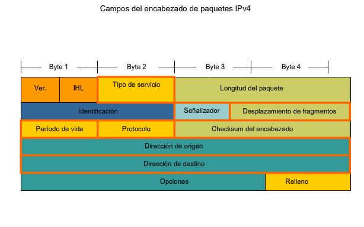

# 1. Protocolo IP

El protocolo <strong style="color:#84E4DD;">IP</strong> (Internet Protocol)</i> es uno de los pilares fundamentales del conjunto de protocolos <strong style="color:#84E4DD;">TCP/IP</strong>, que permite la comunicacion entre dispositivos en una red.

## Que es ?

El protocolo <strong style="color:#84E4DD;">IP</strong> es responsable de direccionar y encaminar los paquetes de datos desde el origen hasta el destino a traves de una red. Cada dispositivo en una red tiene una direccion <strong style="color:#84E4DD;">IP</strong> unica que lo identifica.

### Funcionamiento

1. **Encapsulamiento de Datos** Los datos de las capas superiores <i style="color:#CFDE74">(como TCP o UDP) </i>se encapsulan en un paquete `IP`. Este paquete incluye un encabezado `IP`  que contiene informacion crucial para el enrutamiento.

2. **Encabezado IP**

    * **Version** Indica la version del protocolo`IP` <i style="color:#CFDE74">(IPv4 o IPv6).</i>
    
    * **Longitud del Encabezado** Especifica el tamaño del encabezado<i style="color:#CFDE74"> (IHL).</i>
    
    * **Tipo de Servicio** Define la prioridad y calidad del servicio.
    
    * **Longitud Total** Indica el tamaño total del paquete.
    
    * **Indetificacion, Banderas y Desplazamiento de Fragmento** Utilizados para la fragmentacion y reensamblaje de paquetes. 
    
    * **TTL (Time To Live)** Limita la vida util del paquete para envitar bucles infinitos.
    
    * **Protocolo** Indica el protocolo de la capa superior <i style="color:#CFDE74">(Por ejemplo: TCP o UDP).</i>
    
    * **Suma de Verificacion del Encabezado** Verifica la integridad del encabezado.
    
    * **Direccion IP de Origen** La direccion `IP` del destino que envia.
    
    * **Direccion IP de Destino** La direccion `IP` del dispositivo receptor.
  
3. **Enrutamiento**  Los routers en la red utilizan la direccion `IP` de destino para determinar la mejor ruta para enviar el paquete. Cada router decremeta el valor `TTL` y, si llega a cero, descarta el paquete y envia un mensaje `ICMP` de <i style="color:#CFDE74">"Time EXceded"</i> al remitente.

4. **Fragmentacion y Reensamblaje** Si un paquete es demasiado grande para ser transmitido en una sola unidad, se fragmenta en partes mas pequeñas. Cada fragmento tiene su propio encabezado `IP` y se reensambla en el destino.

### Importancia del Protocolo IP

* **Direccionamiento** Permite identificar de manera unica cada dispositivo en una red.
* **Enrutamiento** Facilita el envio de datos a travez de multiples redes interconectadas.
* **Interoperabilidad** Permite la comunicacion entre diferentes tipos de dispositivos y redes.

### Versiones del Protocolo

1. **IPv4** 
    
    * Utiliza direcciones de 34 bits, permitiendo aproximadamente 4.3 mil millones de direcciones unicas.
    * Ejemplo de direccion `IPv4:` 192.168.0.1
   
2. **IPv6**
    
    * Utiliza direcciones de 128 bits, proporcionando un espacio de direccionamiento mucho mayor.
    * Ejemplo de direccion `IPv6:` 2001:0db8:85a3:0000:8a2e:0370:7334
   