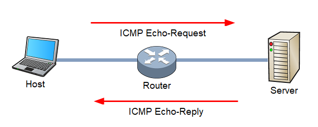

# 2. Protocolo ICMP

# Protocolo ICMP

## Que es ?

<strong style="color:#84E4DD;">ICMP</strong> es un protocolo auxiliar en el conjunto de protocolos de Internet <i style="color:#CFDE74">(TCP/IP) </i>que se utiliza principalmente para diagnosticar problemas de comunicacion en la red. No se utiliza para intercambiar datos entre sistemas, sino para enviar mensajes de error y de informacion operativa.

### Funcionamiento 

1. **Mensaje ICMP**

    * **Echo Request y Echo Reply** Utilizados por la herramienta `ping` para verificar la conectividad entre dos dispositivos.
    
    * **Destination Unreachable** Indica que un paquete no pudo ser entregado a su destino.
    
    * **Time Exceeded** Indica que el tiempo de vida<i style="color:#CFDE74"> (TTL) </i>de un paquete ha expirado, utilizando por la herramienta `traceroute`.
    
    * **Redirect** Informa a un dispositivo que utilice una ruta diferente para alcanzar un destino
 
2. **Proceso de Envio y Recepcion**

    * Cuando un dispositivo de red detecta un problema <i style="color:#CFDE74">(por ejemplo, un paquete no puede ser entregado)</i>, genera un mensaje `ICMP` y lo envia de vuelta al origen del paquete.
    * El mensaje `ICMP` incluye informacion sobre el tipo de error y, a menudo, una parte del paquete original para ayudar a identificar el problema.

#### Ejemplo: Uso de Ping

* **Ping** Una herramienta de diagnostico que utiliza mensajes `ICMP` Echo Request y Echo Reply para verificar la conectividad entre dos dispositivos.
    
    * **Echo Request** El dispositivo A envia un mensaje `ICMP` Echo Request al dispositivo B.
    
    * **Echo Reply** El dispositivo B respinde ocn un mensaje `ICMP` Echo Reply, confirmando la recepcion.
   
### Importancia de ICMP

* **Diagnostico de Red** Herramientas como `ping` y `traceroute` dependen de `ICMP` para identificar problemas de conectividad y rutas en la red.

* **Gestion de Errores** `ICMP` permite a los dispositivos de red informar sobre problemas, como paquetes no entregables o tiempos de vida expirados, mejorando la gestion y el mantenimiento de la red.

# TTL

El <strong style="color:#84E4DD;">TTL</strong> <i style="color:#CFDE74">(Time to Live)</i>  es un valor que se utiliza en redes de computadores para limitar la vida util de un paquetes de datos.

## Que es ?

<strong style="color:#84E4DD;">TTL</strong> es un campo en el encabezado de un paquete <strong style="color:#84E4DD;">IP</strong> que indica el tiempo o numero de saltos <i style="color:#CFDE74">(hops)</i> que un paquete puede existir en la red antes de ser descartado. Evita que los paquetes de datos circulen indefinidamente en la red, lo que podria causar congestion y otros problemas.

### Funcionamiento

1. **Inicializacion** Cuando un paquete se envia, se le asigna un valor `TTL` incial, que es un numero entero, Este valor puede variar, pero comunmente se establece en `64,`128`,`255`.

2. **Decremento** Cada vez que el paquete pasa por un router (un salto), el valor `TTL` se decrementa en `1`.

3. **Descartado** Si el valor `TTL` llega a `0` antes de que el paquete alcance su destino, el paquete es descartado. El router que descarta el paquete puede enviar un mensaje `ICMP` de <i style="color:#CFDE74">"Time Exceeded"</i> al remitente original para informarle del problema.
