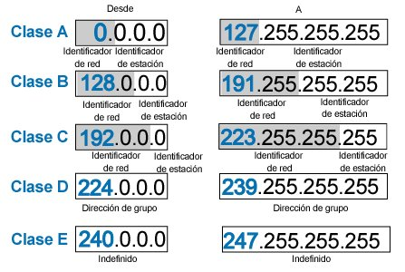

# 3. IPv4

## Que es ?

IPv4 es un protocolo de la capa de red que proporciona un sistema de direccionamiento unico para identificar dispositivos en una red. Utiliza direcciones de 32 bits, lo que permite aproximadamente 4.3 mil millones de direcciones unicas.

### Funcionamiento

1. **Direccionamiento** Cada dispositivos en red tiene una direccion IPv4 unica, compuesta por cuatro octetos (8 bits cada uno), se parados por puntos (Por ejemplo: 192.168.0.1).

2. **Encapsulacion y Enrutamiento** 
    
    * Los datos de las capas superiores (Como TCP o UDP) se encapsulan en un paquete IPV4.
    * Los routers utilizan la direccion IP de destino para determinar la mejor ruta para enviar paquete a traves de la red.
    * Cada router decrementa el valor TTL (Time to Live) del paquete para evitar bucles infinitos 
    

# Mascara de Red

Una mascara de red es un numero de 32 bits que, combinado con una direccion IP, define que porcion de la direccion se refiere a la red y que parte se refiere al host. Se representa en notacion decimal con puntos similar a una direccion IP (Por ejemplo 255.255.255.0)

## Para que sirve una Mascara de Red ?

1. **Identificacion de la Red y del Host**

    * La mascara de red divide una direccion IP en dos partes: la parte de red y la parte de host. Los bits con valor 1 en la mascara indican la porcion de red, mientras que los bits con valore 0 indican la porcion de host.
    * Por ejemplo, la mascara 255.255.255.0 ( /24 en notacion CIDR) significa que los primero 24 bits de la direccion IP representa la red, y los ultimos 8 bits representan los hosts dentro de esa red.
  
2. **Segmentacion de Redes (Subredes)**
    
    * Permite dividir una red grande en subredes mas pequeñas, lo que facilita la organizacion, seguridad y la genstion de trafico de red.
    * Por ejemplo, una empresa puede usar la mascara /24 para crear subredes separadas para diferentes departamentso, como contabilidad, ventas y recursos humanos.
   
3. **Enrutamiento**

    * Los routers utilizan mascaras de red para determinar que paquetes deben enviarse a que interfaces de red basandose en la direccion IP destino.
    * Cuando un paquete llega a un router, este compara la porcion de red de la direccion IP de destino con las entradas de su tabla de enrutamiento. La mascara asociada a cada entrada permite al router determinar si el paquete coincida y, por tanto, aque interfaz debe enviarse.
   
### Ejemplo de Mascara de Red

* **Mascara de Red 255.255.255.0 /24**
    
    * **Direccion IP** 192.168.1.0
    * **Rango de Hosts** 192.168.1.1 a 192.168.1.254
    *  **Direccion de Broadcast** 192.168.1.255
 
| CIDR | Máscara de Subred | Máscara Comodín | # de Direcciones IP | # de Direcciones IP Utilizables |
| ------- | -------------------------- | ------------------------- | -------------------------- | ----------------------------------------- |
| /32     | 255.255.255.255      | 0.0.0.0                    | 1                              | 1                                                |
| /31     | 255.255.255.254      | 0.0.0.1                    | 2                              | 2*                                              |
| /30     | 255.255.255.252      | 0.0.0.3                    | 4                              | 2                                                |
| /29     | 255.255.255.248      | 0.0.0.7                    | 8                              | 6                                                |
| /28     | 255.255.255.240      | 0.0.0.15                  | 16                            | 14                                              |
| /27     | 255.255.255.224      | 0.0.0.31                  | 32                            | 30                                              |
| /26     | 255.255.255.192      | 0.0.0.63                  | 64                            | 62                                              |
| /25     | 255.255.255.128      | 0.0.0.127                | 128                          | 126                                            |
| /24     | 255.255.255.0          | 0.0.0.255                | 256                          | 254                                            |
| /23     | 255.255.254.0          | 0.0.1.255                | 512                          | 510                                            |
| /22     | 255.255.252.0          | 0.0.3.255                | 1,024                       | 1,022                                         |
| /21     | 255.255.248.0          | 0.0.7.255                | 2,048                       | 2,046                                         |
| /20     | 255.255.240.0          | 0.0.15.255              | 4,096                       | 4,094                                         |

# Tipos de Direccion IPv4

Las direcciones IP en IPv4 se dividen en direcciones publicas y direcciones privadas y cada una tiene un proposito especifico en la red.

## Direcciones IP Publicas

* **Definicion** Son direcciones unicas asignadas a dispositivos que se conectan directamente a internet

* **Funcion** Permite que los dispositivos sean accesibles desde cualque lugar en internet. Por ejemplo, los servidores web y los routers que conectan redes locales a intenet tiene direcciones IP publicas.

* **Asignacion** La asignan los proveedores de servicios de Internet (ISP).

* **Visibilidad** Son visibles y accesibles desde cualquet parte de Internet.

* **Ejemplo** 203.0.1113.1

## Direcciones IP Privadas

* **Definicion** Son direcciones utilizadas dentro de redes privadas, como redes domesticas o corporativas.

* **Funcion** Permiten la comunicacion entre dispositivos dentro de la misma red local sin ser accesibles desde Internet, Por ejemplo, Computadoreas, Impresoras y otros dispositivos en una red domestica usan direcciones IP privadas.

* **Visibilidad** No son accesibles desde Internet, lo que proporciona una capa adicional de seguridad.

* **Rangos de Direcciones Privadas**
  
    * **Clase A** 10.0.0.0 a 10.255.255.255
    * **Clase B** 127.16.0.0 a 172.31.255.255
    * **Clase C** 192.168.0.0 a 192.168.255.255
   
## Diferencia Clave

* **Ambito**
    * **IP publica** Externa se conecta a Internet.
    * **IP privada** Interna se conecta al router,
   
* **Comunicacion**
    * **IP publica** Con Internet fuera de la red Privada.
    * **IP privada** Entre dispositivos conectados al router.
   
* **Asignacion**
    * **IP publica** Asignada por el ISP.
    * **IP privada** Asignada por el router o servidor DHCP.
    

# NAT (Network Address Traslatation) 

## Que es ?

NAT (Network Address Traslatation) es una tecnica utilizada en redes informaticas para permitir que varios dispositivos en una red local (con direcciones IP privadas) Compartan una unica direccion IP publica para acceder a Internet. Esto es especialmente util para ahorrar direcciones IPv4, que son limitadas 

### Funcionamiento

1. **Traduccion de Direcciones** Cuando un dispositivo en una red local envia datos a Internet, el router con NAT traduce la direccion IP privada del dispositivo a una direccion IP publica. Al recibir una respuesta, el router traduce la direccion IP publica de vuelta a la direccion IP privada correspondiente y envia los datos al dispositivo adecuado.

2. **Tipos de NAT**

    * **NAT Estatica** Asigna una direccion IP publica fija a una direccion IP privada especifica.
    
    * **NAT Dinamica** Asigna una direccion IP publica de un gur po de direcciones disponibles a una direccion IP privada de manera temporal.
    
    * **PAT (Port Address Traslation)** Tambien conocida como NAT con sobrecarga, permite que multiples dispositivos compartan una unica direccion IP publica utilizando diferentes puertos.
    
3. **Vemtaks de NAT**

    * **Ahorrro de Direcciones IP** Permite que multiples dispositivos usen una sola direccion IP publica.
    
    * **Seguridad** Oculta las direcciones IP privadas de la red local dificultando el acceso no autorizado desde el exterior. 

# Subneteo (Subnetting)

## Que es ?

El subneteo implica dividir una red IP en multiples subredes mas pequeñas. Cada subred tiene su propio rango de direcciones IP y se puede operar de manera independiente dentro de la red mas grande. Esto se logra ajustando la mascara de subred,

### Funcionamiento

1. **Mascara de Subred**
    
    * La mascara de subred determina que parte de una direccion IP se utiliza para identifica la red y que parte se utiliza para identificar los hots dentro de esa red.
    * Por ejemplo, una mascara de subred de 255.255.255.0 /24 significa que los primeros 24 bits se utilizan para la red y los ultimos 8 bits para los hosts
    
2. **Division de Subredes** Al ajustar la mascara de subred, puedes dividir una red grande en subredes mas pequeñas. Por ejemplo cambiar una mascara de subred /24 a una mascara /26 divide la red en cuatro subredes mas pequeñas.

3. **Calculo de Subredes**

    * Para calcular las subredes, necesitas determinar el numero de bits que se tomaran prestados de la parte del host para la parte de red. Esto se hace ajustando la mascara de subred.
    * Por ejemplo si tienes una red 192.168.1.0 /24 y queres crear subredes con 64 host cada una, ajustarias la mascara a /26.
    

### Ejemplo

Supongamos que tiene la red 192.168.1.0/24 y quieres dividirla en subredes con 64 hosts cada una:

1. **Mascara de Subred Original** 255.255.255.0 /24

2. **Nueva Mascara de Subred** 255.255.255.192 /26
3. **Numero de Subredes** 4 subredes (cada una con 64 direcciones IP, incluyendo la direccion de red y la direccion de broadcast)

#### Subredes Resultantes:

1. **Subred 1**

    * **Rangos de IPs** 192.168.1.0 - 192.168.1.63
    * **Direccion de Red** 192,168.1.0
    * **Direccion de Broadcast** 192.168.1.63
    

1. **Subred 2**

    * **Rangos de IPs** 192.168.1.64 - 192.168.1.127
    * **Direccion de Red** 192,168.1.64
    * **Direccion de Broadcast** 192.168.1.127
    

1. **Subred 3**

    * **Rangos de IPs** 192.168.1.128 - 192.168.1.191
    * **Direccion de Red** 192,168.1.128
    * **Direccion de Broadcast** 192.168.1.191
    

1. **Subred 4**

    * **Rangos de IPs** 192.168.1.192 - 192.168.1.255
    * **Direccion de Red** 192,168.1.192
    * **Direccion de Broadcast** 192.168.1.255
    