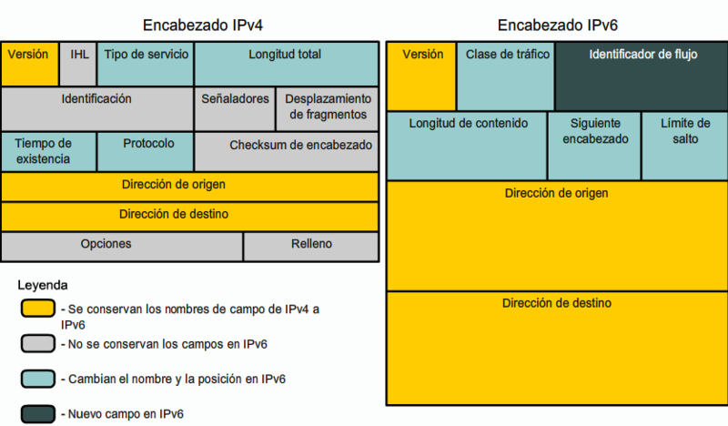

# 4. IPv6

## Que es ?

IPv6 es un protocolo de comunicacion de redes que proporciona una gran cantidad de direcciones IP unicas (aproximadamente 3.4 x 10^38 direcciones), lo que permite la conectividad de una vasta cantidad de dispositivos en la Internet de las cosas (loT), redes moviles, y mas, Ademas, IPv6 esta diseñado para solucionar varias limitaciones de IPv4, incluyendo el agoramiento de direcciones y la necesidad de draduccion de direciones de red (NAT).

### Funcionamiento

IPv6 opera de maenra similar a IPv4, pero con varias mejoras y diferencias clave:

* **Espacio de Direcciones** IPv6 utiliza direcciones de 128 bits, lo que permite un espacio de direcciones mucho mas grande en comparacion con los 32 bits de IPv4.

* **Autoconfiguracion** IPv6 permite la autoconfiguracion sin estados (SLAAC), lo que facilita la configuracion automatica de dispositivos en una red sin necesidad de un servidor DHCP.

* **Sin NAT** Debido al gran espacio de direcciones, IPv6 elimina la necesidad de NAT, permitiendo conexiones directas entre dispositivos.

* **Encabezado Simplificado** IPv6 tiene un encabezado de paquete simplificado en comparacion de IPv4, lo que mejora la eficiencia del procesamiento de paquetes.

### Composicion de la Cabezera IPv6

La cabecera de un paquete IPv6 tiene una estructura fija y consta de los siguientes campos:

1. **Version (4 Bits)** Indica la version del protocolo (IPv6).

2. **Traffic Class (8 bits)** Utilizado para clasificar y priorizar el trafico.

3. **Flow Label (20 bits)** Identifica flujos de datos especificos para proporcionar calidad de servicio (Qos).

4.  **Payload Length (16 bits)** Identifica la longitud del contenido del paquete, exclutendo la cabecera.  

5. **Next Header (8 bits)** Especifica el destino de cabecera siguiente o el protocolo de la capa superior (Como TCP o UDP).

6. **Hop Limit (8 bits)** Define el numero maximo de saltos que puede realizar el paquete antes de ser descarado (Equivlente al TTL en IPv4).

7. **Source Address (128 bits)** Direccion IP origen.

8. **Destination Address (128 bits)** Direccion IP destino.

# Compresion de Direcciones IPv6 

La compresion de direcciones IPv6 es una tecnica que permite representar las direcciones IPv6 de una manera mas coreta y manejable. Las direcciones IPv6 son bastantes largas debido a su longitud de 128 bits, por lo que se utilizan cietras reglas para comprimirlas sin perter infromación.

## Reglas

1. **Omision de ceros a la izquierda** Se puede omitir los ceros a la izquierda en cada grupo de 16 bits (hexteto). 
    * Ejemplo: `2001:0db8:0000:0042:0000:8a2e:0370:7334` se convierte en `2001:db8:0:42:0:8a2e:370:7334`.
   
2. **Uso de :: para secuencias de ceros** Se pueden reemplazar una o mas secuencias consecutivas de hextetos de ceros con `::` , Esta sustitucion solo se puede hacer una vez en una direccion.
    * Ejemplo `2001:0db8:0000:0000:0000:0000:1428:57ab` se convierte en `2001:db8::1428:57ab`.

# Subneteo en IPv6

EL subneteo en IPv6 se realiza de manera similar a IPv4, pero con algunas diferencias importantes debido al tamaño de las direcciones.

1. **Formato de Direcciones IPv6** Una direccion IPv6 se representa tipicamente en notacion hexadecimal, dividida en ocho bloques de 16 bits (hextetos) separdps por dos puntos. Ejemplo: `2001:0bd8:85a3:0000:0000:8a2e:0370:7334`.

2. **Prefijos y Subredes** Las direcciones IPv6 utilizan prefijos para identificar subredes. Un prefijo IPv6 incluye la porcion de la red y una logitud de prefijo que indica cuantos bits iniciales son parte de la red, Ejemplo: `2001:0db8:85:a3::/48`.

3. **Subneteo** Para subnetear una red IPv6 simplemente se exiende la longitud del prefijo. Por ejemplo, si tienes un prefijo `2001:0db8:85a3:0001::/64`, `2001:0db8:85a3:0002::/64`,etc.

4. **Autoconfiguracion de Direcciones** IPv6  permite la autoconfiguración sin estado (SLAAC), donde un dispositivo puede configurar su propia dirección IP utilizando el prefijo de red anunciado por un router y un identificador de interfaz derivado de su dirección MAC.

#### Ejemplo

Supongamos que tiene el prefijo `2001:0db8:1234::/48` y desea dividirlo en subredes mas pequeñas con el prefijo `/64`.

* **Prefijo Original** `2001:0db8:1234::/48`

* **Subred /64**
    * `2001:0db8:1234:0000::/64` 
    * `2001:0db8:1234:0001::/64` 
    * `2001:0db8:1234:0002::/64` 
    * `2001:0db8:1234:0003::/64` 
    * `.....`
    
En este ejemplo, cada subred `/64` puede albergar una cantidad extremandamente grande de dispositivos debido al tamaño de la parte de host de 64 bits.