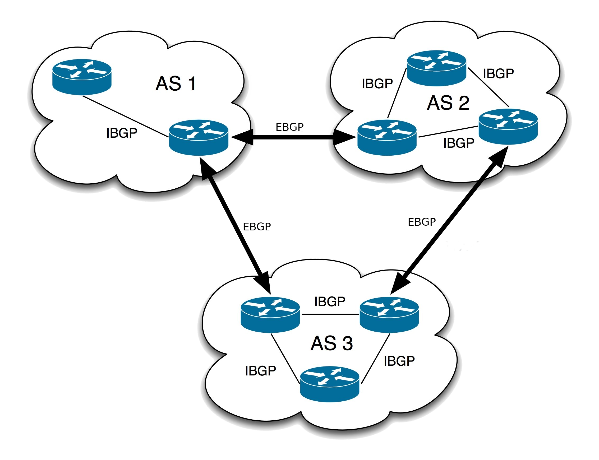

# 5. Sistemas Autonomos

Los sistemas Autonomos (AS, por su siglas en Ingles) son redes grandes ques se administra y enrutan bajo una politica comun. Cada AS es una coleccion de prefijos de IP que pertenecen a una solo organizacion y comparten una politica de enrutamiento comun. En la arquitectura de Internet, los Sistemas Autonomos juegan un papel fundamental en el enrutamiento y la administracion de redes.

## Que es ?

Un Sistema Autonomo es una red o un conjunto de redes IP bajo una unica entidad administrativa que define politicas de enrutamiento comunes para esa redes. Cada AS esta identificado de forma unica por un numero de Sistema Automono (ASN), asignado por una autoridad de registro de numeros de Internet, como IANA o una de las cinco organizaciones reginoales de registro de Internet (RIR).

### Funcionamiento

1. **Enrutamiento Interno (IGP)** Dentro de un AS, se utiliza un Protocolo de Enrutamiento Interno (IGP, por sus siglas en ingles), para intercambiar informacion de enrutamiento entre los routers internos. Ejemplos de IGP incluyen OSPF (OPen Shortest Path Frist) y RIP (Routing Information Protocol).

2. **Enrutamiento Externo (EGP)** Para comunicar diferentes AS entre si, se utiliza un Protocolo de Enrutamiento Exterior (EGP). EL mas comuni es BGP (Border Gateway Protocol).

3. **Politicas de Enrutamiento** Los administradores de AS definen politicas de enrutamiento que determinan como se maneja y se distribuyen las rutas dentro y fuera del AS. Esta politicas puede basarse en varios factores.

### Tipos de Sistemas Autonomos

1. **Sistemas Autonomos de Transito (Transit AS)**  Estos AS permiten el paso de trafico a traves de ellos hacia otros AS. Actuan como intermediarios, proporcionando conectividad entre diferentes AS. Las ISPs (Proveedores de Servicios de Internet)  son un ejemplo comun de AS de transito.

2. **Sistemas Autonomos de CLiente (Stub AS)** Estos AS no permiten el paso de trafico hacia otros AS. Solo tiene una conexion hacia un AS de transito. Normalmente, se trata de redes de empresa o organizaciones que dependen de un ISP para acceder a internet.

3. **Sitemas Autonomos de Multihoming (Multihomed AS)** Estos AS estan conectados a mas de un AS de transito, pero no permite el paso de trafico entre ellos. Tiene multiples conexiones para redundancia y mejor rendimiento, pero no acuta como intermediarios para otros AS.

### Ejemplos y Descripcion de Protocolos de Enrutamiento

1. **BGP (Border Gateway Protocol)** 

    * **Funcion** Utilizado para el enrutamiento entre AS (EGP).

    * **Caracteristicas** Mantiene tablas de rutas IP y toma decisiones de enrutamiento basadas en politicas definidad. BGP es fundamental para la estabilidad y la operacion de internet global.
    * **Tipos**

        * **EBGP (External BGP)** Utilizado entre routers en diferentes AS.
        * **IBGP (Internal BGP)** Utilizado entre router dentro del mismo AS para propagar rutas aprendidas via EBGP.
        
2. **OSPF (Open Shortest Path Frist)**

    * **Funcion** Protocolo de Enrutamiento Interior (IGP) utilizado dentro de un AS.

    * **Caracteristicas** Utiliza el algoritmo de Dijkstra para calcular la ruta mas corta. Soporta areas jerarquicas y es adecuado para redes grandes. 
    
3. **RIP (Routing Information Protocol)**

    * **Funcion** Protocolo de Enrutamiento Interior (IGP) utilizado dento de un AS.

    * **Caracteristicas** Utiliza el conteo de salto como metrica para determinar la ruta. Es simple pero limitado a redes mas pequeñas debido a su metrica y actualizacion lenta. 

4. **IS-IS (Intermediate System to Intermediate System)**

    * **Funcion** Otro protocolo de enrutamiento interior (IGP) similar a OSPF.

    * **Caracteristicas** Utiliza el algoritmo de estado de enlase, similar a OSPF. Soporta redes grandes y es ampliamente utilizado en rede de proveedores de servicios.

