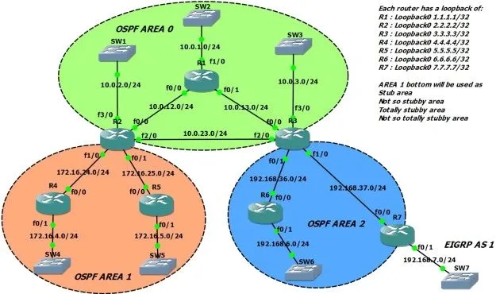

# 7 OSPF

OSPF (OPen Shortest Path Frist) es un protocolo de enrutamienteo interior que se usa en redes IP. Es un protocolo de enrutamiento de estados de enlace que se adapta bien a grandes redes empresariales. OSPF opera dentro de un sistema autonomo (AS) y tiene varias caracteristicas que lo hacen popular, como su capacidad para detectar cambios en la topologia de la red  recalcular rutas rapidamente.

## Funcionamiento OSPF

1. **Estado de Enlace** OSPF utiliza el algoritmo de estado de enlace para determinar la mejor ruta. Cada router en la red OSPF mantiene una base de datos de estado de enlace que contien un mapa completo de la topologia de la red.

2. **Areas** Para manejar grande redes, OSPF divide la red en areas. Cada area es un conjunto de subredes que esta agrupadas para simplificar la gestion de enrutamiento y reducir el trafico de actualizacion de enrutamiento.

3. **LSA (Link-State Advertisements)** Los routers OSPF envia paquetes LSA para compartir informacion sobre la topologia de al red con otros routers. Los LSAs se propangan a todos los routers dentro de una area.

4. **SPF (Shortest Path Frist)** Los routers OSPF utilizan el algoritmo SPF, tambien conocido como algoritmo de Dijkstra, para calcular la ruta mas corta a cada destino en la red.

5. **Actualizacion Rapida** OSPF puede detectar y adapatarse rapidamente a cambios en la topologia de la red, recalculando rutas cuando hay cambios.

### Areas
 
En OSPF, un area es una  subdivision logica dentro de un red OSPF que ayuda a  organizar y gestionar el enrutamiento de manera mas eficiente. Las areas tiene varias funciones y beneficios, incluyendo la reduccion de la cantidad de trafico de actualizacion de enrutamiento y la simplificacion de la gestion de la red.

#### Funciones y Beneficios

1. **Escalabilidad** Al dividir una red grande en areas mas pequeñas, OSPF puede escalar mejor y manejar redes mas grandes de manera mas eficiente.

2. **Reduccion del Trafico de Actualizacion** Dentro de un area, los routers solo intercambian informacion de enrutamiento relevante para esa area. Esto reduce el trafico de actualizacion en toda la red.

3. **Simplificacion de la Gestion** Dividir la red en areas hace que la gestion y la solucion de problemas sean mas manejables al limitar el alcance de los cambios y problemas a areas especificas.

4. **Optimizacion del Algoritmo SPF** Al limitar el tamaño de la base de datos de estado de enlace y el numero de rutas que cada router debe calcular, OSPF puede recalcular rutas mas rapidamente cuando hay cambios.

#### Tipos de Areas en OSPF

1. **Area Backbone (Area 0)** Es la columna vertebral de la red OSPF y todos las demas areas deben conectarse a esta. Todo el trafico entre diferentes areas debe pasar por el area backbone.

2. **Area Estandar** Son las areas normales que no tiene ninguna caracteristica especial de filtrado o agregacion de rutas.

3. **Areas Stub** No reciben rutas externas de otras areas, reduciendo la cantidad de informacion de enrutamiento que los router dentro del area deben manejar.

4. **Areas Totally Stubby** Similar a las areas stub, pero tambien bloquean las rutas inter-areas, proporcionando solo una ruta por defecto hacia el area backbone.

5. **Area NSSA (Not-So-Stubby Areas)** Permiten rutas externas de tipo 7 que se convierten en rutas de tipo 5 cuando se ingresan en el area backbone.
   

### Rutas 

En OSPF (Open Shortest Path First), las rutas se clasifican en varios tipos para diferenciar su origen, cómo se propagan y cómo se manejan en el enrutamiento. 

#### Tipos de Rutas en OSPF

1. **Rutas Tipo 1 (Intra-area)**

    * **Descripción** Estas rutas son rutas internas que existen dentro de la misma área OSPF.

    * **Propagación** Se propagan solo dentro de la misma área y no se anuncian fuera de esta.

    * **Uso** Facilitan el enrutamiento dentro de una área específica.

    * **Ejemplo** Una ruta 192.168.1.0/24 en el área 0 será una ruta tipo 1 si todas sus subredes están dentro de esta área.

2. **Rutas Tipo 2 (Externa E2)**

    * **Descripción** Rutas externas introducidas en OSPF por un Autonomous System Boundary Router (ASBR) con un costo fijo.

    * **Propagación** Se propagan a todas las áreas OSPF, excepto en las áreas stub y totally stubby.

    * **Cálculo de Coste** Solo se considera el costo externo, ignorando el costo interno dentro de la red OSPF.

    * **Uso** Utilizadas cuando el costo de la ruta externa debe ser constante y no influenciado por el costo interno de la red OSPF.

    * **Ejemplo** Una ruta importada desde BGP con un costo fijo de 10, sin importar la ubicación interna de los routers.

3. **Rutas Tipo 3 (Inter-area Summary)**

    * **Descripción** Resúmenes de rutas entre diferentes áreas OSPF generados por los Area Border Routers (ABR).

    * **Propagación** Anunciadas a otras áreas para comunicar la existencia de redes en una área diferente.

    * **Uso** Reducen la cantidad de información de enrutamiento que debe ser mantenida y procesada en cada router.

    * **Ejemplo** El resumen de rutas para todas las subredes en el rango 10.0.0.0/24 anunciado desde el área 1 al área 0.

4. **Rutas Tipo 4 (ASBR Summary)**

    * **Descripción** Anuncios que indican la ubicación de un ASBR en el dominio OSPF.
    
    * **Propagación** Generadas por ABR para informar a otros routers sobre cómo alcanzar al ASBR.

    * **Uso** Facilitan el enrutamiento hacia las rutas externas introducidas por el ASBR.

    * **Ejemplo** Un ABR en el área 0 informa a otros routers que el ASBR está en el área 2, para que puedan enrutar correctamente las rutas externas tipo 5.

5. **Rutas Tipo 5 (Externa E1)**

    * **Descripción** Rutas externas introducidas en OSPF por un ASBR con un costo total (interno + externo).

    * **Propagación** Se propagan a todas las áreas OSPF, excepto en las áreas stub y totally stubby.

    * **Cálculo de Coste** Incluye tanto el costo externo como el costo interno dentro de la red OSPF.

    * **Uso** Utilizadas cuando se desea que el costo interno de la red OSPF influya en la selección de rutas externas.

    * **Ejemplo** Una ruta importada desde RIP con un costo total que incluye el costo interno de los enlaces OSPF más el costo de la ruta RIP.

6. **Rutas Tipo 7 (NSSA Externa)**

    * **Descripción** Rutas externas introducidas en un área Not-So-Stubby Area (NSSA).

    * **Propagación** Inicialmente se propagan dentro del NSSA como rutas de tipo 7 y se convierten en rutas de tipo 5 cuando son propagadas al área backbone.

    * **Uso** Permiten la inclusión de rutas externas en áreas que son básicamente stub pero que necesitan conocer ciertas rutas externas.

    * **Ejemplo** Una ruta externa importada desde EIGRP dentro de un NSSA, propagada dentro del NSSA como tipo 7 y convertida en tipo 5 cuando se anuncia al área 0.
    
##### Resumen de los Tipos de Rutas en OSPF

| Tipo de Ruta |                                                     	Descripción                                                      |                               	Uso Principal                                |
| ----------------- | -------------------------------------------------------------------------------------------------------- | --------------------------------------------------------------------- |
| Tipo 1            | 	Rutas dentro de la misma área OSPF                                                                 | 	Enrutamiento intra-área                                           |
| Tipo 2            | (E2)	Rutas externas con un costo fijo                                                                 | 	Enrutamiento hacia rutas externas con costo fijo   |
| Tipo 3            | 	Resúmenes de rutas entre áreas                                                                         | 	Reducir la tabla de enrutamiento inter-áreas           |
| Tipo 4            | 	Anuncios de ubicación de ASBR	Facilitar el enrutamiento hacia rutas externas |                                                                                     |
| Tipo 5 (E1)    | 	Rutas externas con un costo total (interno + externo)                                         | 	Enrutamiento hacia rutas externas con costo total |
| Tipo 7            | 	Rutas externas en áreas NSSA, convertidas a tipo 5 en el área backbone        | 	Permitir rutas externas en áreas stub                     |