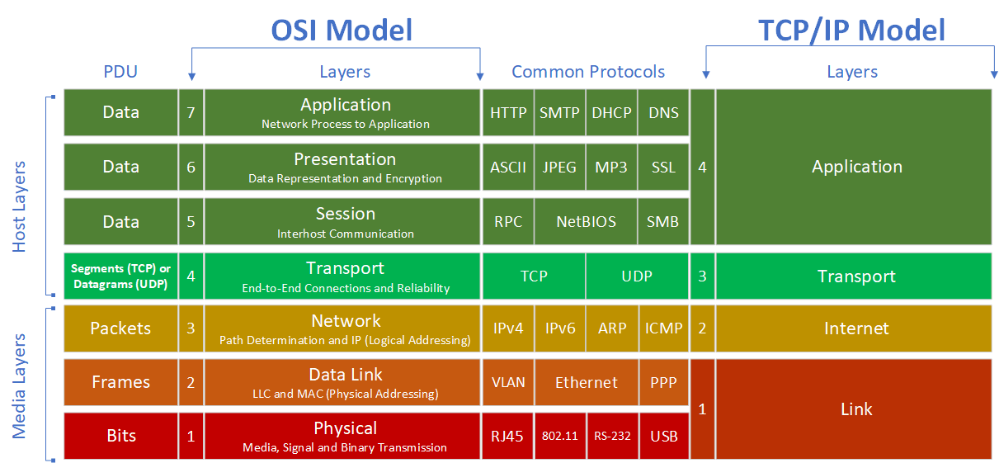

INTRODUCCION A LAS REDES
========================

# Modelo OSI

El modelo OSI (Open Systems Interconnection) es un marco conceptual que describe las funciones de un sistema de comunicacion en una red. Fue desarrollado por la Organizacion Internacional de normalizacion (ISO) y se divide en siete capas, cada una con funciones especificas.

## Capas del modelo OSI

1. **Capa fisica:** Se encarga de la transmision de bits a travez de un medio fisico. Incluye el hardware y las señales eléctricas, ópticas, o electromagneticas.

2. **Capa de enlace de datos:** Proporciona la transferencia de datos fiable entre dos nodos conectados directamente. Se encarga del direccionamiento fisico, deteccion y correcion de errores y control de flujo

3. **Cap de red:** Gestiona el direccionamiento lógico y la determinación de rutas para el trafico de datos. Es responsable de la entrega de paquetes de datos a travez de multiples redes.

4. **Capa de trasporte:**  Garantiza la transferencia fiable de datos de extremo a extremo, controlando el flujo y asegurando la integridad de los datos.

5. **Capa de sesion:** Gestiona y controla el diálogo entre dos dispositivos de red. Establece, gestiona y finaliza conexiones entre aplicaciones.

6. **Capa de presentacion:** Se encarga de la traduccion, cifrado y compresion de datos. Actua como un traductir entre el formato de la red y el formato de la aplicación .

7. **Capa de aplicacion:** Proporciona servicios de red a las aplicaciones del usuario. Inclute protocolos para correo electroníco, transferencia de archivos y navegacion web

# Modelo TCP/IP

El modelo TCP/IP (Transmission Control Protocol/Internet Protocol) es un conjunto de protocolos de comunicacion utilizados en internet y redes similares. Esta basado en cuatro capas que simplifican el intercambio de datos entre dispositivos.

## Capas del Modelo TCP/IP 

1. **Capa de acceso a la red:** Equivalente a las capas Fisica y de Enlace de Datos del modelo OSI. Se encarga de la transmision de datos entre el hardware de la red y gestiona los aspectos fisicos y logicos del enlace de datos.

2. **Capa de internet:** Equivale a la Capa de Rede del modelo OSI. Es responsable del direccionamiento y enrutamiento de paquetes a travez de multiples redes. El protocolo principal es el IP (Internet Protocol).

3. **Capa de transporte:** Equivalente a la capa de trasporte del modelo OSI. Proporciona la transferencia de datos fiable y no fiable. Los principales protocolos son TCP (Transmission Control Protocol) y UDP (User Datagram Protocol).

4. **Capa de aplicacion:** Combina las funciones de las capas de Sesion,Presentacion y Aplicacion del modelo OSI, Proporciona servicios de red a las aplicaciones del usuario, como HTTP,FTP y SMTP.

# Comparacion entre OSI y TCP/IP

* **Capas:** El modelo OSi tien siete capas, mientras que el modelo TCP/IP tiene cuatro, La estructura del modelo TCP/IP es mas simplificada,combinando varias funciones de las capas del modelo OSI

* **Desarrollo:** El modelo OSI fue desarrollado como un marco teorico antes que los protocolos fueran estandarizados, mientras que el modelo TCP/IP fue desarrollado a partir de la practica y la implementacion real de redes.

* **Uso:** EL modelo OSI fue mas utilizado como una herramienta de enseñanza y como referencia conceptual. El modelo TCP/IP es el estandar de facto para la comunicacion en redes, especialmente Internet.

* **Interoperabilidad:**  El modelo OSI esta diseñado para ser un estandar universal, promoviendo la interoperabilidad enre diferentes sistemas y fabricantes, El modelo TCP/IP se centra mas en la practicidad y len la eficiencia en la trasmision de datos.

# Resumen de Protocolos en el Modelo TCP/IP

## Protocolos de la Capa de Acceso a la Red

* **Ethernet:** Define como se debe formater los paquetes de datos para ser enviados y recibidos en una red de area local (LAN).

* **ARP (Address Resolution Protocol):** Traduce direcciones IP a direcciones MAC en una red local.

* **PPP (Point to Point Protocol):** Proporciona una conexion directa entre dos nodos de red.

## Protocolos de Capa de Internet

* **IP (Internet Protocol):** Protocolo principal que proporciona direccionamiento y enrutamiento de paquetes. Hay dos versiones principales: IPv4 e IPv6.

* **ICMP (Internet Control Menssaje Protocol):** Utilizado para enviar mensajes de control y error entre dispositivos de red.

* **IGMP (Internet Gruop Management Protocol):** Gestiona la menbresia de grupos multicas en redes IPv4.

## Protocolos de la Capa de Transporte

* **TCP (Transmission Control Protocol):** Proporciona una conexión fiable, ordenada y libre de errores entre aplicaciones. Controla el flujo de datos y retrasmite paquetes perdidos.

* **UDP (User Datagram Protocol):** Ofrece un servicio de transmision de datos no fiable y sin conexion, adecuado para aplicaciones que requieren velocidad sobre fiabilidad, como la transmision de video en tiempo real.

## Protocolos de la Capa de Aplicacion

* **HTTP (Hypertext Transfer Protocol):** Utilizado para la transferencia de paginas web y datos en la World Wide Red.

* **FTP (File Transfer Protocol):** Protocolo para la transferencia de archivos entre sistemas.

* **SMTP (Simple Mail Transfer Protocol):** Protocolo para el envio de correo electronico.

* **DNS (Domain Name System):** Traduce nombres de dominio legibles por humanso a direcciones IP.

* **TELNET:** Proporciona un acceso remoto a servidores y dispositibos de reed a traves de una interfaz de linea de comandos.

* **SSH (Secure Shell):** Protocolo seguro para el acceso remoto a servidores y dispositivos de red.
   
   
# Protocolos A fondo

## Protocolos de la Capa de Acceso a la Red del Modelo TCP/IP

La capa de Acceso a la Red en el modelo TCP/IP combina las Funciones de las caparas FIsica y de Enlace de Datos del modelo OSI. Esta capa es responsable de la Transmision de datos entre el dispositivo emisor y el receptor en una red Fisica.

### Ethernet

#### Que es ?

Ethernet es una tecnologia de red que define como los dispositivos de una red local (LAN) pueden comunicarse entre si. Es el estandar mas utilizado para LANs y se especifica en la norma IEEE 802.3

#### Funcionamiento

Ethernet utiliza un esquema de comunicacion llamado CSMA/CD (Carrier Sense Multiple Access with Collision Detection) para gestionar el acceso al medio compartido:

* **Carrier Sense:** Los dispositivos monitoriean el medio antes de trasmitir para verificar que no haya trafico.

* **Mutliple Access:** Todos los dispositivos en la red tiene igual acceso al medio
   
* **Collision Detection:** Si dos dispositivos transmiten al mismo tiempo, detecta la colision y detiene la trasmision esperando un tiempo aleatorio antes de intentarlo de nuevo.
 
#### Estructura del Trama Internet

Una trama Ethernet tipica incluye los siguientes campos:

* **Preambulo:** Siete bytes utilizandos para sincronizar la transmision.

* **SFD (Start Frame Delimiter):** Indica el inicio del Trama.

* **Direccion Mac Destino:** Direccion del dispositivo de destino.

* **Direccion Mac Origen:** Direccion del dispositivo de origen.

* **Tipo/Etiqueta de Longitud:** Indica el tipo de protocolo en la carga util o la longitud de los datos.

* **Datos/Payload:** Datos que se esta trasmitiendo (46 a 1500 bytes).

* **FCS(Frame Check Sequence):** Codigo de verificacion para detectar errores.

#### Implementacion

Ethernet se implementa en el hardware de la tarjeta de red de cada dispositivo y en los swiches que conecta estos dispositivos en una red LAN. Los switches Ethernet gestionan el trafico de red al reenviar tramas solo a los dispositivos destino correctos.

### ARP (Address Resolution Protocol)

#### Que es ?

El protocolo de Resolucion de Direcciones (ARP) se utiliza para mapear direcciones IP a direcciones MAC  en una red local. Esto es esencial Para la comunicacion entre dispositivos en una LAN que utiliza Ethernet.

#### Funcionamiento

Cuando un dispositivo necesita comunicarse con otro en la mismo red, utiliza ARP para encontrar la direcion MAC correspondiente a una direccion IP.

* **Solicitud ARP:** EL dispositivo emite una solicitud ARP a todos los dispositivos de la red (Broadcast), preguntando quien tiene la direcion IP de destino.

* **Respuesta ARP:** El dispositivo que posee la direccion IP responde con su direccion MAC.

#### Estructura del Paquete ARP:  
  
 Un paquete ARP incluye los siguientes campos:
 
 * **Tipo de Hardware:** Indica el tipo de red (Por ejemplo: Ethernet)

* **Tipo de Protocolo:** Especifica el protocolo de red (Por ejemplo, IPv4).

* **Longitud de la Direccion de Hardware:** Longitud de la direccion MAC (Generalmente 6 bytes).

* **Longitud de la Direccion de Protocolo:** Longitud de la direccion IP (Generalmente 4 bytes).

*   **Operacion:** India si el pawute es una solictud (1) o una respuesta (2).

* **Direccion MAC de Origen:** Direccion MAC del dispositivo que envia la solicitud.

* **Direcion IP de Origen:** Direccion IP del dispositivo que envia la solicitud.

* **Direccion MAC de destino:** Direccion MAC del dispositivo que responde.

* **Direccion IP de Destino:** Direccion IP del destino que responde.

#### Implementacion

ARP es una parte integral de las pilas de red en los sistemas operativos y es gestionado automaticamente por la mayoria de los dispositivos. Las tablas ARP almacenan las asignaciones de direcciones MAC e direcciones IP para reducior la cantidad de solicitudes necesarias.

 
### PPP (Point-To-Point Protocol)

#### Que es ?

El protocolo Punto a Punto (PPP) se utiliza para establecer una conexion directa entre dos nodos de red. Es comun en conexiones de acceso telefonico y conexiones directas de Internet.

#### Funcionamiento

PPP proporciona autenticacion,cifrado y compresion de datos, y se utiliza para encapsular paquetes de protocolos de capa de red, como IP, para su transmision sobre enlaces punto a punto.

* **Establecimiento de Conexion:** PPP utiliza el Protocolo de Control de Enlace (LCP) para establecer, configurar, y probar la conexion de enlaces de datos.

* **Autenticacion:** PPP puede utilizar PAP (Password Authentication Protocol) o CHAP (Challenge Handshake Authetication Protocol) para autenticar ususarios.

* **Encapsulamiento:** PPP encapsula los paquetes de red para su trasmision. Cada trama PPP tiene un encabezado y un trailer.

#### Estructura del Trama PPP

Una trama PPP incluye los siguientes campos:

* **Flag:** Indica el inicio o el fin del trama.

* **Direccion:**  Vlor fijo (0xFF) para indicar una direccion de transmision.

* **Control:** Valor fijo (0x03) para establecer el tipo de control.

* **Protocolo:** Indica el protocolo encapsulado (Por ejemplo, IP)

* **Informacion:** Datos que se esta transmitiendo.

* **FCS (Frame Check Sequence):** Codigo de verificacion para detectar errores.

#### Implementacion

PPP se implementa en routers y modems que requieren conexiones punto a punto Es ampliamente utilizado en conexiones de acceso remoto y VPNs.

## Protocolos de la Capa de Internet del modelo TCP/IP

### IP (Internet Protocol)

#### Que es ?

El Protocolo de Internet (IP) es el protocolo fundamenta que permite el direccionamiento y enrutamiento de paquetes de datos a travez de redes interconectadas, como internet. Es responsable de entregar paquetes dese el origen hasta el destino segun sus direcciones IP.

#### Funcionamiento

IP proporciona un mecanismo para enviar datos de una red a otra a travez de routers , Los datso se envian en forma de paquetes y cada paquete contien datos de usuario como infromacion de encabezado necesaria para el enrutamiento.

* **Encapsulacion:** Los datos de las capas superiores se encapsula en paquetes IP. Cada paquete tiene un encabezado que incluye informacion crucial para el enrutamiento.

* **Encabezado IP:** El encabezado IP contien informacion esencial, como:
    * **Version:**  Indica si esta utilizando IPv4 o IPv6.
    
    * **Longitud del encabezado:** Tamaño del encabezado IP.
    
    * **TTL (Time To Live):** Numero maximo de saltos que un oaquete puede realizar antes de ser descartado.
    
    * **Protocolo:** Indica que protocolo de la capa superio esta encapsulado (Por ejemplo, TCP o UDP).
    
   * **Direccion IP origen y destino:** Identifaica las ubicaciones de envio y recepcion.
   
#### Estructura del Encabezado IP

* **IPv4:** Tiene una logitud de 20 a 60 bytes. Incluyen campos como:
    
   * Direccion de origen (32 bits)
   * Direccion de destino (32 bits)
   * Tiempo de vida (TTL)
   * Suma de verificacion
   * Protocolo

* **IPv6:** Diseñado para reemplazar a IPv4 y manejar el agotamiento de direciones, Incluye:
    
  * Direccion de origen (128 bits)
  * Direccion de destino (128 bits)
  * Flujo de trafico
  * payload length
  
#### Implementacion

IP se implementa en dispostivos de red y sistemas operatibos. Los routesr utilizand IP para decidir como enviar paquetes a travez de redes basadas en tablas de enrutamiento que cosidara la direcion IP de destino.

### ICMP (Internte Control Menssaje Protocol)

#### Que es ?

El Protocolo de Mensajes de Control de Internet (ICMP) se utiliza para enviar mensajes de diagnostico y error entre dispositivos de red. Ayuda a gestionar el trafico y a informar sobre problemas en la trasmision de paquetes.

#### Funcionamiento

ICMP no transporta datos de aplicaciones sino mensajes de control. Los mensajes ICMP se encapsulan dentro de paquetes IP.

* **Mensajes de Error:** ICMP informa problemas como destino inalcanzable, red inaccesible, tiempo de espera agotado, etc.

* **Mensaje de Consulta:** Incluyen peticones de eco y respuesta de eco, utilizadas por herramientas como ping para comprobar la conectividad de red.

#### Estructura del Mensaje ICMP

Cada Mensaje ICMP contiene:

* **Tipo:** Define el proposito del mensaje (Por ejemplo, 0 para respuesta de eco, 8 para solicitud de eco).

* **Codigo:** Proporciona mas informacion sobre el tipo de mensaje.

* **Checksum:** Verifica la integridad del mensaje.

* **Datos:** Informacion adicional dependiendo del tipo de mensaje.

#### Implementacion

ICMP se implementa en todos los dispositivos de red que utilizan IP y es una gran parte integral del protocolo IP. Herramientas  de diagnostico de red como ping y traceroute depende de ICMP para su funcionamiento.

### IGMP (Internet Group Management Protocol)

#### Que es ? 

El Protocolo de Gestion de Grupos de Internet (IGMP) se utiliza para gestional la membresia de grupos multicast en redes IP. Permite a los routers conocer que dispositivos en una red desean recibir trafico multicast.

#### Funcionamiento 

IGMP facilita la comunicacion de dispositivos en redes multicast al permitir que los dispositivos se unan o abandonen grupos multicast especificos.

* **Grupos Multicast:** Un grupo multicast esta identificado por una direccion IP especial. Los dispositivos que desean recibir trafico multicast se subcriben a estas direcciones.

* **Mensajes IGMP:** Permiten a un dispositvo unirse o abandor un grupo multicast, informar periodicamente su membresia.

#### Estructura del Mensaje IGMP

* **Tipo:** Indica el tipo de mensaje (Por ejemplo, reporte de membresia o solicitud).

* **Maximo Tiempo de Respuesta:** Tiempo que el router debe esperar para recibir respuesta.

* **Checksum:** Asegura la Integridad del mensaje.

* **Direccion de Grupo:** La direccion del grupo multicas relevante.

#### Implementacion

IGMP es implementado en routers y dispositivos de red para gestionar la distribucion de datos multicast eficientemente. Es esencial para aplicaciones que trasmiten datos a multiples destinatarios simultamenamete, como las trasmisiones de video en vivo.