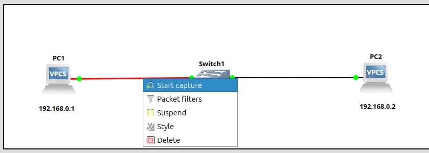

# Taller 1

## Practica de ARP y ICMP

* Visualizar el uso de los protocolos:

    * ARP 
    * ICMP
   

### CREAR LA SIGUIENTE TOPOLOGIA 


### Asignar IP a los PCs

* PC1

```bash

ip 192.168.0.1
save

```

* PC2

```bash

ip 192.168.0.2
save

```

### Capurar paquetes con wireshark




### Realizar un ping de PC1 a PC2


```bash

ping 192.168.0.2

```


### Analizar la captura


