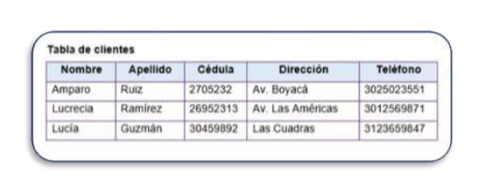
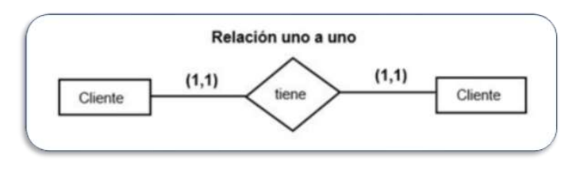
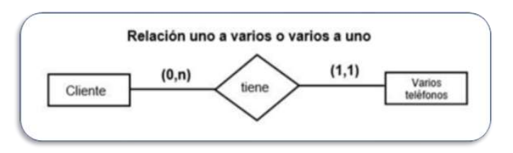
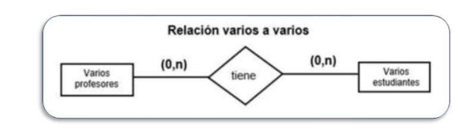

# 2. Bases de datos Relacionales

## Introduccion

La Base de datos Relacional (**BDR**) y el modelo Entidad-Relacion (**E-R**) son las herramientas mas utilizadas en la actualidad, a traves de este modelo, se puede organizar la informacion sobre personas u objetos, clientes y productos, con el  fin de mantener y actualizar la informacion, a medida que va creciendo el volumen de los datos.

#### Bases de Datos BDR

Una base de datos relacional es un conjunto de tablas que se encuentra relacionado entre si a traves de los atributos, cada tabla esta compuesta por columnas y filas.

* **Caracteristicas**

    * Esta compuesta de varias tablas que se relaciona a traves de una llavae primaria (`PK`).
    * Existe una llave primaria (`PK`) para cada tabla.
    * Las tablas tienen un nombre el cual no se puede repetir, es unico para cada tabla.
   
* **Columnas**

    * Van de arriba hacia abajo, se conoce como campo o atributo y describe el tipo de dato que va a contener, que puede ser: Texto, Numeros o Fechas.
    
* **Filas**

    * Van de izquierda a derecha, se conoce como tupla. Los valores que almacena una tupla se determinan de acuerdo a los atributos.
    

#### Analisis de la tabla clientes

Las columnas estan identificando a los atributos del cliente como son: Nombre, Apellido, Cedula, Dirrecion y Telefono.
En las filas estan almacenados los registros o tupla que tienen relacion con los atributos de la tabla.

**Dominio** Son las reglas de valores de los atributos, esto con el fin de determinar un numero de caracteres o los posibles registros que se puede almacenar en un campo. 

**Relacion** Vinculo o conexion que hay entre los datos de una tupla.

### Modelo Entidad - Relacion (E-R)

Es un modelo de base de datos, que permite diseñar esquemas o diagramas a un sistema de informacion formado por un grupo de objetos llamados entidades, este diagrama toma el nombre de Diagrama Entidad-Relacion, el cual ayudara a entender la relacion que existe entre los objetos que componen las tablas.

#### Elementos de un modelo Entidad - Relacion (E-R)

* **Entidad**
    
    * Es uno de los elementos mas importantes, ya que representa los objetos que pueden ser realies o abstractos y que permiten diferenciarse unos de otros. Una entidad se representa mediante un rectangulo.
   
* **Atrivutos**

    * Definen las caracteristicas o propiedades y aportan informacion a cada identidad, son de diferentes tipos. De acuerdo a la identidad, por ejemplo: Tipo fecha, Tipo numerico, o Tipo texto. Un atributo se representa mediante un ovalo.
    
* **Relacion**
    
    * Son los vinculos que existen entre entidade, para esto es necesario que varias entidades compartan ciertos atributos para establecer vinculos entre ellas. Una relacion se representa mediante un rombo. La cantidad de relaciones que puede tener una entidad se conoce como cardinalidad.
   
##### Tipos de Relaciones

* **Relacion uno a uno** Relacion existente entre dos entidades, es unicamente con una entidad y viceversa.

* **Relacion uno a varios o varios a uno** Este tipo de relacion existe cuando un registro de una entidad **A** se encuentrea relacionado con varios registros de otra entidad **B**, pero con la condiccion de que la entidad **B** solo se relaciona con la entidad **A**.

* **Relacion varios a varios** Esta relacion existe entre entidades cuando varios registros de la entidad **A** estan relacionados con varios registros de la entidad **B**.

### Llaves o claves

Es un tipo especial dentro de una entidad que posee unico valor, sirve para vincular una relacion entre registros de varias tablas.

#### Tipos de llavas o claves

**Clave Primaria** Es un atributo unico en una entidad que identifica un registro. 

**Clave Foranea** Son los atributos que permiten relacionar las entidades.

**Clave Indice** Son atrivutos especiales que permiten tener accesos rapidos a los datos, ya que facilitan hacer filtros para las consultas.

