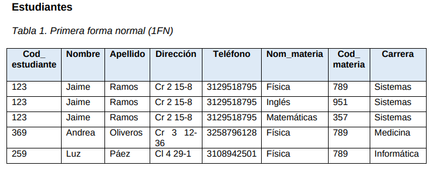
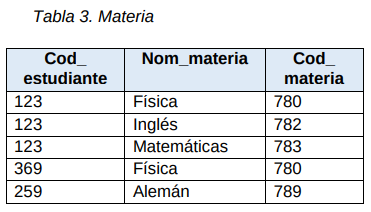
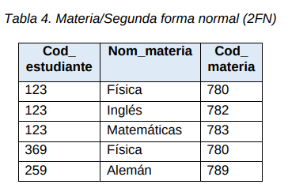
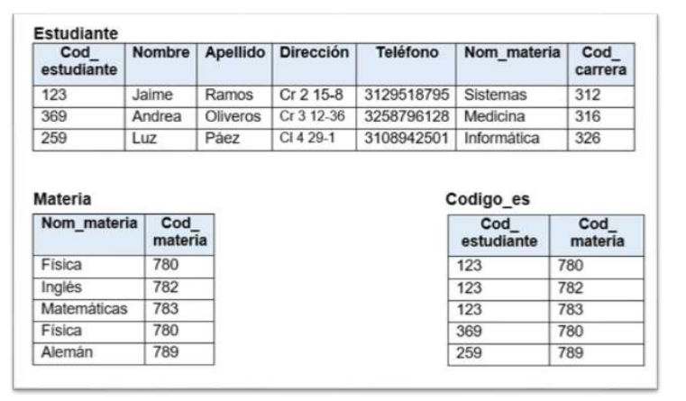
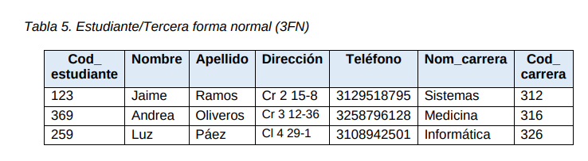
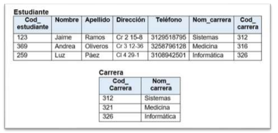
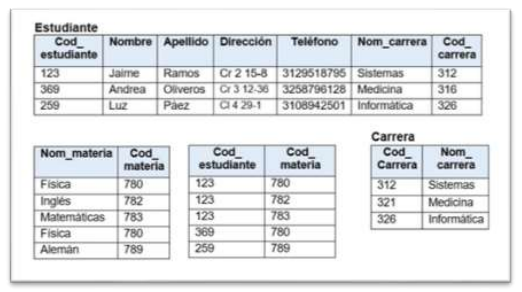

# Normalizacion

* Las bases de datos estan compuestas por infromaacion que se relaciona entre si, esto lleva  a que, al momento de crear bases de datos relacionales, se debe establecer una serie de reglas que garantice que los datos no se repitan, que esten siempre actualizadas las tablas que la componen y asegure la integridad de la infromacion, en otroas palabras,es necesario normalizar la base de datos.

* La normalizacion de bases de datos consiste en aplicar reglas con el fin de cumplir tres objetivos:

    * Evitar que la informacion en la base de datos sea duplicada.
    * Evitar problemas al momento de alimentar y actualizar la informacion de la base de datos.
    * Cumplir con las politicas de seguridad como es la integridad de los datos.
    
## Reglas de Normalizacion

* Para garantixar que las bases de datos se encuentre normalizada se debe cumplir con tres reglas basicas:

### Primera forma normal 1FN

* Hay que garantizar que los campos sean unicos, lo que en normalizacion se llama atomico, que permite crear tablas individuales. La tabla primera debe contener la llave primaria con la que se va a relacionar con los otros campos y por ultimo se debe eliminar todos los datos repetidos.

* **Ejemplo 1:**

* 

    * Para entender mejor como aplicar **1FN**  se utiliza una base de datos de estudiantes:
    
    * Como se puede observar que el atributo Cod_estudiante, nombre, apellido, direccion y telefono se encuentra registros repetidos, por lo tanto, existe redundancia. Lo cual conlleva ocupar mucho espacio.
    * Se aplica la primera forma normal:
    * Se definira una clave primaria (PK) que es un atributo que puede relacionar uno o mas tablas, por ejemplo seria Cod_Estudiante con el cual se van a relacionar dos tablas Estudantes y Materias asi:
    
    * 
    * 
    * Despuede de haber aplicado **1FN** en la tabla Estudiante, se puede verificar que los registros son atomicos y que no se han modificado ni eliminado, en conclusion, se cumple con los objetivos de 1FN.
    
### Segunda forma normal 2FN

* Para continuar con la aplicacion de la **2FN**, la base de datos, necesariamente, debe haber pasado por **1FN**.
* Para empezar a entender **2FN**, se debe tratar los terminos de dependencia funcional y la dependecia transitiva.
* **Dependencia Funcional** Dependencia que existe entre atributos a traves de una llave primaria (PK), sin esta los otros atributos no pueden existir.
* **Dependencia Transitiva** Dependencia entre atributos con la llave primaria (PK), se mantiene a traves de otros atributos de forma transitoria.
* Los objetivos de la segunda forma normal consiste en:
    
    * Determinar las dependecia de la tablas obtenidas en **1FN**
    * Crear tablas con claves primaria (PK) de las cuales dependen.
    * 
    
* La tabla Materia esta compuesta por los atributos Cod_Estudiante, Nom_materia y Cod_Materia, por lo tanto, se puede concluir que el atributo Nom_materia no puede existir sin el atributo Cod_Materia, existe una dependencia funciona y el Cod_estudiante no afecta en nada el atributo materia, en consecuencia, se podria crear dos tablas de la siguiente manera:
* 
* De las tablas Materias, se generaron dos tablas (Materia y Codigo_es) que se encuentra relacionadas con Cod_materia
* Hasta aqui se lleva la tabla Estudiante normalizada en **2FN**

### Tercerra forma normal 3FN 

* Los objetivos de esta forma **3FN** son:

    * Determinar las dependecia que existen en los atributos con las claves no primarias.
    * Crear nuevas tablas de acuerdo  a las dependencia encontradas.
    * 
    
* La tabla Estudiante tiene el atributo carrera que tiene una dependencia transitoria con el Cod_estudiante, por lo tanto carrera puede generar una tabla nueva.
* 
* Se han generado dos tablas nuevas que se encuentra relacionadas con el atributo Cod_carrera
* En conclusion, la tabla quedo normalizada asi:
* 
* Se puede analizar que cada tabla tiene llaves primarias que aseguran que los registros alli almacenados sera unicos, con esto se evita la redundancia y perdida de informacion, los datos se encuentran relacionados.

