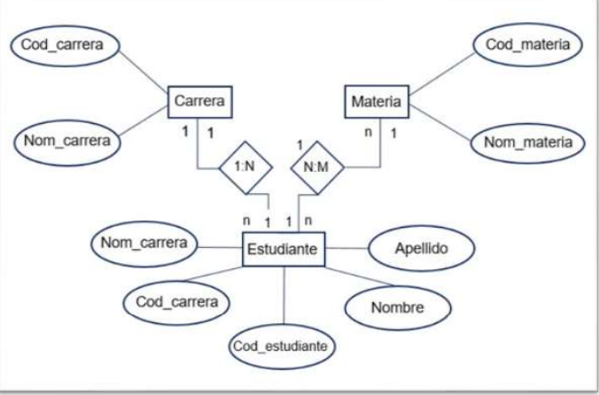

# 4. Modelo E-R
 
Peter Chen crea en 1976 una herramient que le permite representa, graficamente y de manera logica, informacion involucrada en una base de datos, al mismo tiempo, describe las relaciones y restricciones existentes en las entidades que la componen.

## Componente de diagrama Entidad Relacion

* **Entidad** Se define como un objeto, persona o concepto, que va a ser gestionado en la base de datos. Se representa graficamente por un rectangulo.

* **Atributo** Describe algunas propiedades de la entidad. Se representa graficamente por un ovalo.

* **Relacion** Es el conector que existe entre una o mas entidades, se representa por un rombo.

* **Conector** Defini un vinculo entre las identidades. Se representa mediante una linea.

### Cardinalidad

* Hace referencia al tipo de relacion que existe entre entidades Estas son:

    1. **Uno a uno** A cada elemento de una entidad le corresponde un solo elemento de la otra entidad.
    2. **Uno a muchos** Un elemento de una entidad esta relacionado con varias elementos de otra entidad.
    3. **Muchos a muchos** Varios elementos de una entidad estan relacionados con varios elementos de otra entidad.
    

  