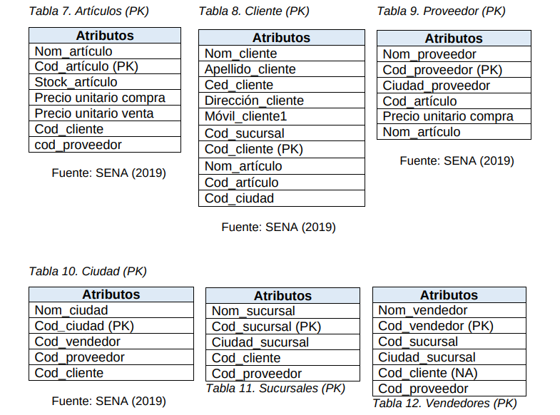
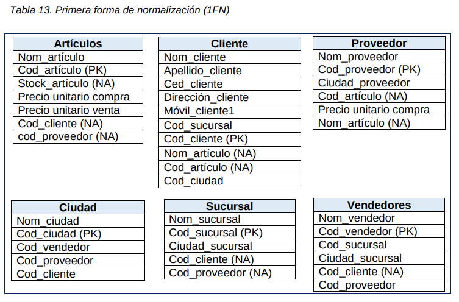
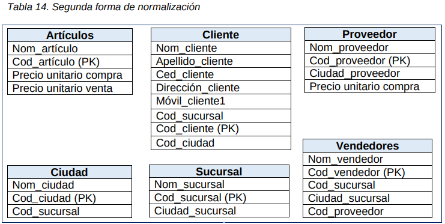
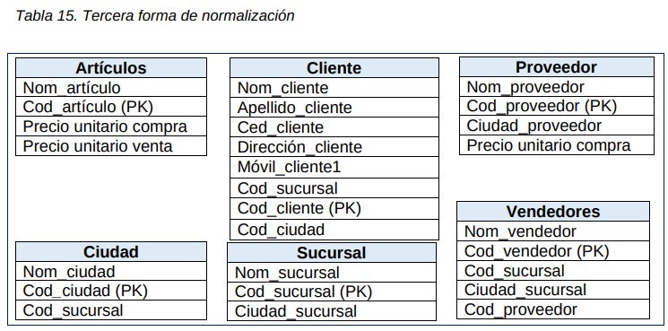
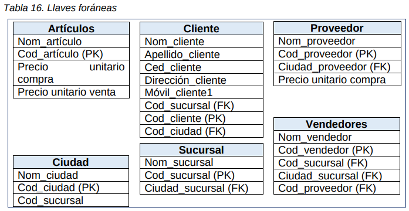

# DiseñoDB

## Pasos para desarrollar y diseñar una base de datos relacional

1. Definir el requerimiento para el cual va a crear la base de datos.
2. Identificacion de entidades con los atributos y tipos de datos correspondientes.
3. Definir, para cada entidad, una llave primaria (PK).
4. Aplicacion de la normalizacion de la base de datos.
5. Definir para cada entidad, una llave foranea (FK).
6. Definir la cardinalidad que existe entre entidades para generar el diagrama Entidad-Relacion (E-R).

## Ejercicio

* Se desea crear una base de datos para llevar el control de inventaria de un almacen de articulos de aseo, los datos que hay que tener en cuenta son:
    
    * Los articulos de venta, para lo cual hay que identificarlos con: nombres, codigo, precio, cantidad, y codigo del proveedor.
    * Los clientes se deben identificar con: Nombre, apellidos, identificacion, direccion y numero celular.
    * Los proveedores se identifican con: nombre, ciudad, codigo, y codigo de articulo que distribuyen,
    * Vendendores: nombre, apellido y codigo.
    
* Los clientes pueden comprar varios articulos, a su vez, los articulos pueden ser comprados por varios clientes, los proveedores pueden suministrar un solo articulo, los vendedores pueden vender muchos articulos a muchos clientes, el almacen LQ S.A tiene algunas sucursales en algunas ciudades del pais.

## Solucion

### Definir el requerimiento de la base de datos

* El almacen de articulos de aseo LQ S.A. requiere diseñar una base de datos para controlar el stock de inventario de bodega con el objetivo de conocer los productos que tiene mayor y menor movimiento en el almacen,
* Ademas, la empresa LQ S.A requiere llevar un registro completo de sus clientes, inventario de sus productos en cada surcusal y un listado de los proveedores.
* Para el anterio caso planteado se tiene el siguiente analisis:

    * La empresa LQ S.A. cuenta con sucursales en cinco ciudades del pais, las cuales se identifican con: codigo, ciudad, direccion, vendedores y clientes, entre otros.
    * Los clientes seran identificados con: codigo, nombre, apellido, ciudad, numero de cedula, entre otros, Los cliente pueden adquirir varios productos en diferentes sucursales.
    * Los productos se identifican con codigo, nombre, proveedor, entre otros. SOn de varios proveedores.
    * Los proveedores distibuyen varios productos a todas las sucursales.
    * Los vendedores se identifican por: nombre, codigo y ubicacion de la sucursal.
  
### Identificacion de entidades con los atirbutos y tipos de datos correspondientes.

1. **Tabla Articulos**

|            Atributos            | Tipo de dato | Longitud |
| ------------------------------ | ----------------- | ------------ |
| Nom_artículo                | String            | 20           |
| Cod_artículo                 | Numérico      | 10           |
| Stock_artículo              | Numérico      | 4             |
| Precio unitario compra | Moneda        | 4             |
| Precio unitario venta    | Moneda        | 4             |
| Cod_cliente                  | Numérico      | 10           |
| Cod_proveedor            | Numérico      | 4             |

2. **Tabla Cliente**

|       Atributos        | Tipo de dato | Longitud |
| ----------------------- | ----------------- | ------------ |
| Nom_cliente         | String            | 20           |
| Apellido_cliente   | String            | 20           |
| Ced_cliente          | Numérico      | 10           |
| Dirección_cliente | String            | 20           |
| Móvil_cliente1      | Numérico      | 10           |
| Cod_sucursal       | Numérico      | 10           |
| Cod_cliente          | Numérico      | 10           |
| Nom_artículo       | String            | 20           |
| Cod_artículo        | Numérico      | 10           |
| Cod_ciudad         | Numérico      | 4             |

3. **Tabla Proveedor**

|            Atributos            | Tipo de dato | Longitud |
| ------------------------------ | ----------------- | ------------ |
| Nom_proveedor           | Carácter       | 20           |
| Cod_proveedor            | Numérico      | 10           |
| Ciudad_proveedor        | String            | 10           |
| Cod_artículo                 | Numérico      | 4             |
| Precio unitario compra | Moneda      |    4            |
| Nom_artículo                | String        | 20               |

4. **Tabla Ciudad**

|      Atributos       | Tipo de dato | Longitud |
| --------------------- | ----------------- | ------------ |
| Nom_ciudad      | String            | 20           |
| Cod_ciudad       | Numérico      | 20           |
| Cod_vendedor  | Numérico      | 20           |
| Cod_proveedor | Numérico      | 10           |
| Cod_cliente       | Numérico      | 10           |

5. **Tabla Sucursales**

|       Atributos        | Tipo de dato | Longitud |
| ----------------------- | ----------------- | ------------ |
| Nom_sucursal     | Carácter       | 20           |
| Cod_sucursal      | Numérico      | 10           |
| Ciudad_sucursal | String            | 10           |
| Cod_cliente         | Numérico      | 4             |
| Cod_proveedor   | Numérico      | 4             |

6. **Tabla Vendedores**

|       Atributos        | Tipo de dato | Longitud |
| ----------------------- | ----------------- | ------------ |
| Nom_vendedor   | Carácter       | 20           |
| Cod_vendedor    | Numérico      | 10           |
| Cod_sucursal      | Numérico      | 10           |
| Ciudad_sucursal | String            | 10           |
| Cod_cliente         | Numérico      | 4             |
| Cod_proveedor   | Numérico      | 4             |

### Definir para cada entidad una llave primaria (PK) con la cual se establecera las relaciones entre entidad.

* Se debe tener en cuenta que una llave primaria (PK) es el atributo unico en cada tabla,

### Aplicacion de la normalizacion de la base de datos

* Para la aplicacion de la normalizacion de la base de datos se tendra en cuenta las tres reglas basicas de normalizacion de forma ordenada:

    * **Primera regla de normalizacion 1FN**
        
        * En esta regla se identificaran, en cada tabla, los atributos no atomicos (NA.) 
        * 
        
    * **Segunda regla de normalizacion 2FN**
    
        * Una vez identificados los atributos repetidos, se procede a generar tablas nuevas, teniendo en cuenta los valores atomicos para evitar la redundancia de datos.
        * 

    * **Tercera regla de normaliacion 3FN**
    
        * Determinar las dependencias que existen en los articulos con las claves no primarias y crear nuevas tablas de acuerdo a las dependencias encontradas.
        * 
        * Las tablas ya estan en la tercera forma de normalizacion **3FN**, no hubo mas modificaciones ni creacion de nuevas tablas, ya que las entidades estan identificadas de manera unica a traves de la llave primaria (PK), esto garantixa que no habra mas registros repetidos y la base de datos tendra un facil manejo para actualizacion, modificar y consultar.
        
### Definir para cada entidad una llave foranea (FK)

### Definir la cardinalidad que existe entre entidades para generar el diagrama  Entidad-Relacional (E-R)

* **Los articulos** Son distribuidos por un proveedor en cada sucursal de cada ciudada y son adquiridos por varios cliente en cada surcusal.
* **Los clientes** Adquieren varios articulos en diferentes sucursales.
* **Las sucursales** Hay una en cada ciudad.
* **Los vendedores** Tiene muchos clientes y muchos articulos en una sucursal.
* **Los proveedores** Distribuyen varias articulos.

Una ves generado el diagrama  Entidad-Relacion se puede garantizar el buen manejo de la informacion de la empresa, es hora de seleccionar el mejor sistema de gestion donde se aplicara el diseño que se construyo, en el cual se podra esbozar el ambiente interactivo que facilitara la interaccion del usuario con la informacion.

